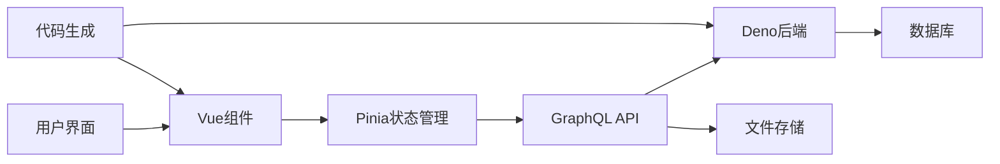
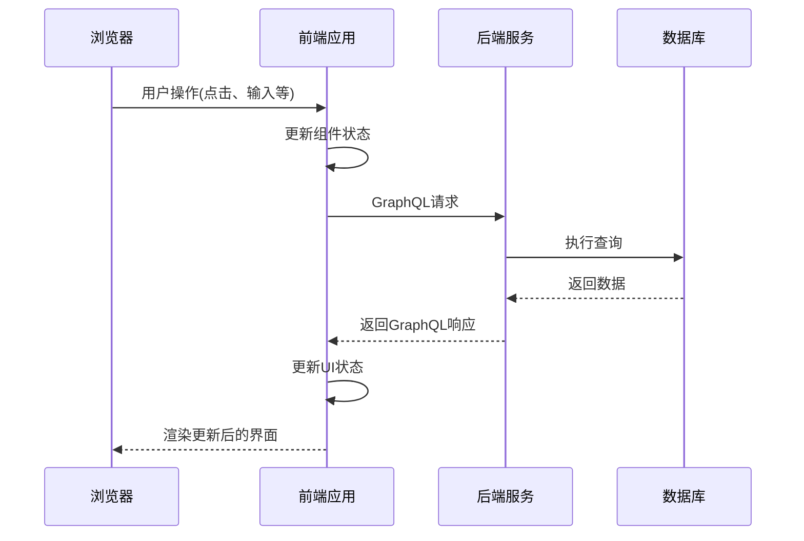
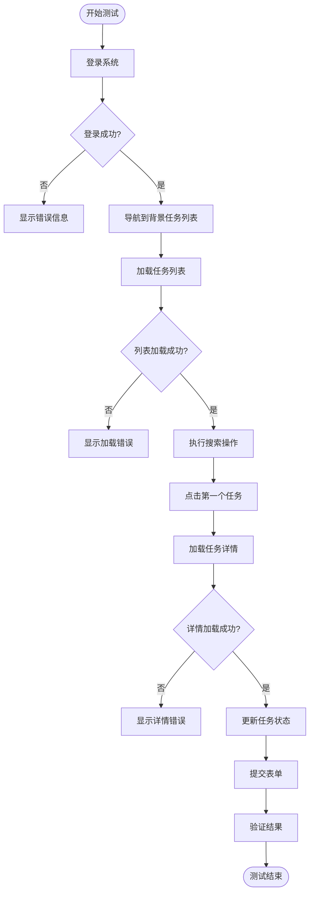
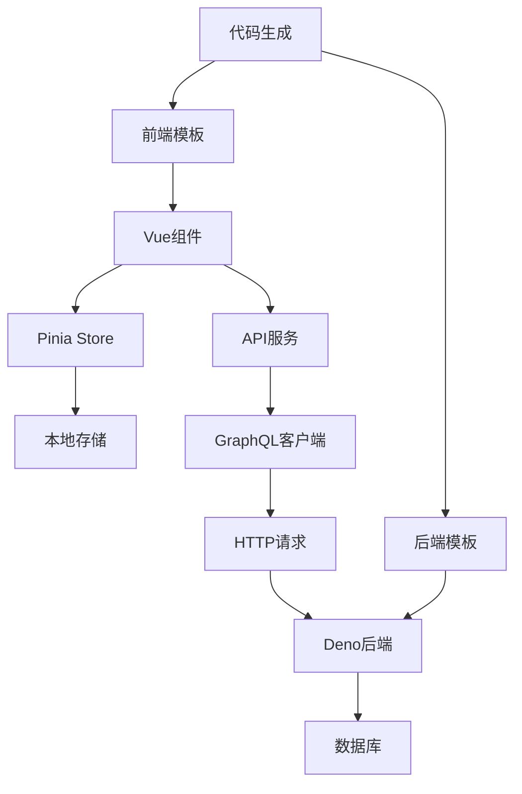

# 端到端测试


**本文档引用的文件**   
- [Test.test.ts](https://github.com/sail-sail/nest/blob/main/pc/src/test/Test.test.ts)
- [request.ts](https://github.com/sail-sail/nest/blob/main/pc/src/utils/request.ts)
- [index.vue](https://github.com/sail-sail/nest/blob/main/pc/src/layout/layout1/index.vue)
- [List.vue](https://github.com/sail-sail/nest/blob/main/pc/src/views/base/background_task/List.vue)
- [background_task.dao.ts](https://github.com/sail-sail/nest/blob/main/deno/gen/base/background_task/background_task.dao.ts)


## 目录
1. [简介](#简介)
2. [项目结构](#项目结构)
3. [核心组件](#核心组件)
4. [架构概述](#架构概述)
5. [详细组件分析](#详细组件分析)
6. [依赖分析](#依赖分析)
7. [性能考虑](#性能考虑)
8. [故障排除指南](#故障排除指南)
9. [结论](#结论)

## 简介
本文档旨在阐述如何在当前项目中实施端到端测试，以验证系统的整体功能。重点是模拟用户在PC端界面的操作流程，包括登录、浏览数据列表、填写和提交表单等。通过用户管理模块为例，展示从列表页到详情页的完整操作流程测试。文档将介绍如何测试前端组件的交互行为、状态管理和路由跳转，并提供测试异步操作、加载状态和错误提示的策略。

## 项目结构
本项目采用模块化结构，主要分为codegen、deno、pc和uni四个部分。codegen用于代码生成，deno包含后端逻辑，pc为PC端前端应用，uni为跨平台移动应用。前端部分使用Vue 3框架，结合TypeScript和Element Plus组件库构建用户界面。

```mermaid
graph TB
subgraph "前端 (pc)"
PC[pc/src]
Components[组件]
Views[视图]
Store[状态管理]
Router[路由]
end
subgraph "后端 (deno)"
Deno[deno/gen]
DAO[数据访问对象]
Resolver[GraphQL解析器]
Service[业务服务]
end
subgraph "代码生成 (codegen)"
Codegen[codegen/src]
Tables[数据表定义]
Template[模板]
end
PC --> Deno : API调用
Codegen --> Deno : 生成代码
Codegen --> PC : 生成前端代码
```

**图示来源**
- [pc/src](https://github.com/sail-sail/nest/blob/main/pc/src)
- [deno/gen](https://github.com/sail-sail/nest/blob/main/deno/gen)
- [codegen/src](https://github.com/sail-sail/nest/blob/main/codegen/src)

## 核心组件
项目的核心组件包括前端的Vue组件、状态管理(store)、路由系统，以及后端的GraphQL服务和数据访问层。前端通过GraphQL与后端通信，实现数据的查询和变更。状态管理使用Pinia(store)来维护用户会话、权限和UI状态。

**组件来源**
- [store/usr.ts](https://github.com/sail-sail/nest/blob/main/pc/src/store/usr.ts)
- [router/index.ts](https://github.com/sail-sail/nest/blob/main/pc/src/router/index.ts)
- [utils/request.ts](https://github.com/sail-sail/nest/blob/main/pc/src/utils/request.ts)

## 架构概述
系统采用前后端分离架构，前端使用Vue 3构建单页应用，后端使用Deno运行时提供GraphQL API。前端通过GraphQL请求获取数据，并使用Pinia进行状态管理。代码生成工具(codegen)根据数据模型自动生成前后端代码，提高开发效率。



**图示来源**
- [main.ts](https://github.com/sail-sail/nest/blob/main/pc/src/main.ts)
- [mod.ts](https://github.com/sail-sail/nest/blob/main/deno/mod.ts)
- [codegen/src](https://github.com/sail-sail/nest/blob/main/codegen/src)

## 详细组件分析

### 测试组件分析
项目中已包含基本的测试框架，使用Vitest进行单元测试和端到端测试。测试文件位于`pc/src/test/`目录下，可以在此基础上扩展更复杂的测试场景。



**图示来源**
- [Test.test.ts](https://github.com/sail-sail/nest/blob/main/pc/src/test/Test.test.ts)
- [request.ts](https://github.com/sail-sail/nest/blob/main/pc/src/utils/request.ts)
- [background_task.dao.ts](https://github.com/sail-sail/nest/blob/main/deno/gen/base/background_task/background_task.dao.ts)

#### 用户操作流程测试
以背景任务模块为例，测试从列表页到详情页的完整操作流程：

1. **登录验证**：测试用户登录流程，验证认证令牌的生成和存储
2. **列表浏览**：测试数据列表的加载和显示，验证分页、排序和搜索功能
3. **详情查看**：测试从列表点击进入详情页的路由跳转和数据加载
4. **表单提交**：测试表单填写和提交，验证数据验证和错误提示
5. **状态更新**：测试异步操作的状态管理，如加载中、成功、失败状态



**图示来源**
- [List.vue](https://github.com/sail-sail/nest/blob/main/pc/src/views/base/background_task/List.vue)
- [index.vue](https://github.com/sail-sail/nest/blob/main/pc/src/layout/layout1/index.vue)
- [request.ts](https://github.com/sail-sail/nest/blob/main/pc/src/utils/request.ts)

**组件来源**
- [List.vue](https://github.com/sail-sail/nest/blob/main/pc/src/views/base/background_task/List.vue)
- [Detail.vue](https://github.com/sail-sail/nest/blob/main/pc/src/views/base/background_task/Detail.vue)
- [Api.ts](https://github.com/sail-sail/nest/blob/main/pc/src/views/base/background_task/Api.ts)

## 依赖分析
项目依赖关系清晰，前端组件依赖状态管理和API服务，API服务依赖后端GraphQL接口。代码生成工具降低了手动编码的工作量，但也引入了对模板和配置文件的依赖。



**图示来源**
- [package.json](https://github.com/sail-sail/nest/blob/main/package.json)
- [codegen/src](https://github.com/sail-sail/nest/blob/main/codegen/src)
- [deno/mod.ts](https://github.com/sail-sail/nest/blob/main/deno/mod.ts)

## 性能考虑
端到端测试需要考虑性能因素，包括测试执行速度、资源消耗和稳定性。建议采用以下策略：
- 使用mock数据减少对真实API的依赖
- 并行执行独立的测试用例
- 合理设置超时时间，避免测试挂起
- 定期清理测试数据，避免数据累积影响性能

## 故障排除指南
常见问题及解决方案：
- **测试超时**：检查网络连接，增加超时时间，确保后端服务正常运行
- **元素未找到**：验证选择器是否正确，检查页面加载状态，添加适当的等待机制
- **认证失败**：确保测试环境的认证配置正确，检查令牌有效期
- **数据不一致**：在测试前后清理测试数据，使用独立的测试数据库

**问题来源**
- [request.ts](https://github.com/sail-sail/nest/blob/main/pc/src/utils/request.ts)
- [usr.ts](https://github.com/sail-sail/nest/blob/main/pc/src/store/usr.ts)
- [Test.test.ts](https://github.com/sail-sail/nest/blob/main/pc/src/test/Test.test.ts)

## 结论
通过建立完善的端到端测试体系，可以有效验证系统的整体功能和用户体验。建议从核心业务流程开始，逐步覆盖更多场景，包括正常流程、异常流程和边界条件。结合代码生成工具，可以快速构建和维护测试用例，提高测试效率和覆盖率。