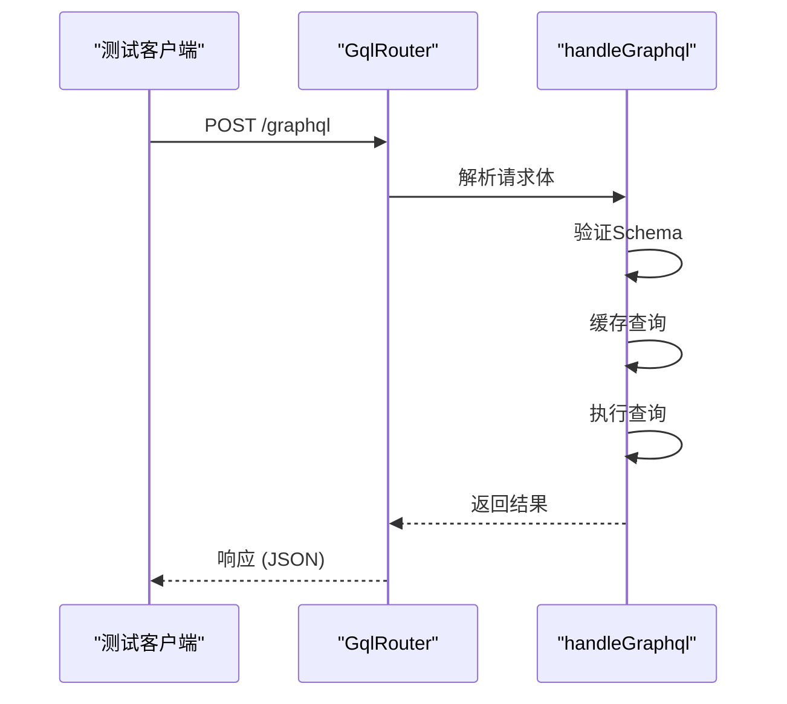
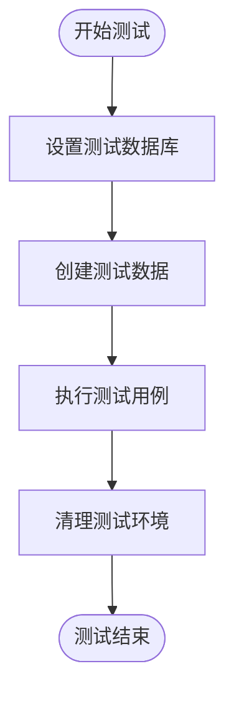
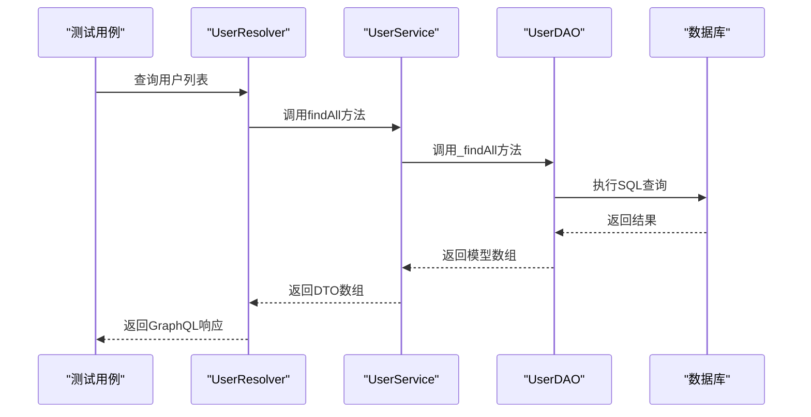
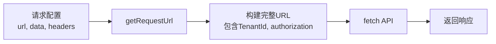
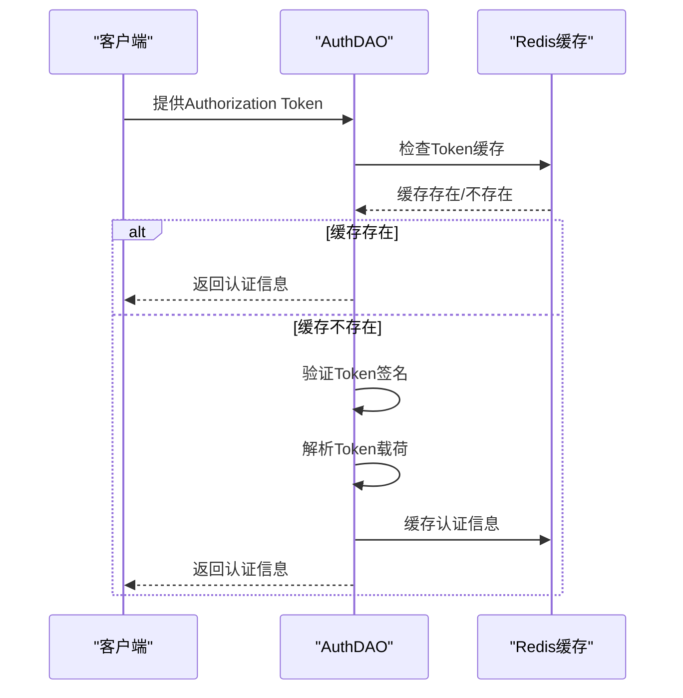

# 集成测试


**本文档引用的文件**  
- [encrypt.test.ts](https://github.com/sail-sail/nest/blob/main/deno/lib/script/encrypt.test.ts)
- [Test.test.ts](https://github.com/sail-sail/nest/blob/main/pc/src/test/Test.test.ts)
- [gql.ts](https://github.com/sail-sail/nest/blob/main/deno/lib/oak/gql.ts)
- [request_id.ts](https://github.com/sail-sail/nest/blob/main/deno/lib/oak/request_id.ts)
- [context.ts](https://github.com/sail-sail/nest/blob/main/deno/lib/context.ts)
- [auth.dao.ts](https://github.com/sail-sail/nest/blob/main/deno/lib/auth/auth.dao.ts)
- [org.dao.ts](https://github.com/sail-sail/nest/blob/main/deno/gen/base/org/org.dao.ts)
- [domain.dao.ts](https://github.com/sail-sail/nest/blob/main/deno/gen/base/domain/domain.dao.ts)
- [dept.dao.ts](https://github.com/sail-sail/nest/blob/main/deno/gen/base/dept/dept.dao.ts)
- [graphql.config.js](https://github.com/sail-sail/nest/blob/main/pc/graphql.config.js)
- [request.ts](https://github.com/sail-sail/nest/blob/main/pc/src/utils/request.ts)
- [request.ts](https://github.com/sail-sail/nest/blob/main/uni/src/utils/request.ts)
- [graphql.ts](https://github.com/sail-sail/nest/blob/main/pc/src/utils/graphql.ts)
- [usr.ts](https://github.com/sail-sail/nest/blob/main/uni/src/store/usr.ts)
- [axios.ts](https://github.com/sail-sail/nest/blob/main/uni/src/uni_modules/tm-ui/libs/axios.ts)


## 目录
1. [集成测试](#集成测试)
2. [项目结构分析](#项目结构分析)
3. [GraphQL API 测试基础](#graphql-api-测试基础)
4. [测试数据库与数据管理](#测试数据库与数据管理)
5. [用户管理模块测试示例](#用户管理模块测试示例)
6. [服务层与DAO层集成测试](#服务层与dao层集成测试)
7. [HTTP请求测试与request.ts使用](#http请求测试与requestts使用)
8. [认证授权测试](#认证授权测试)
9. [事务与并发测试](#事务与并发测试)
10. [错误处理与响应验证](#错误处理与响应验证)

## 项目结构分析

本项目采用多模块架构，主要包含以下核心目录：

- **codegen**：代码生成工具模块，用于自动生成数据库表结构、GraphQL Schema等。
- **deno**：后端服务核心，基于Deno运行时，包含GraphQL API、数据库访问层（DAO）、服务层（Service）等。
- **pc**：PC端前端应用，基于Vue框架，包含GraphQL客户端、路由、状态管理等。
- **uni**：跨平台移动端应用，基于uni-app框架，支持多端部署。

后端采用分层架构设计，每个业务模块（如`usr`、`org`、`dept`）均包含`.dao.ts`（数据访问对象）、`.service.ts`（业务逻辑）、`.resolver.ts`（GraphQL解析器）等文件，实现了清晰的关注点分离。

**Section sources**
- [org.dao.ts](https://github.com/sail-sail/nest/blob/main/deno/gen/base/org/org.dao.ts)
- [domain.dao.ts](https://github.com/sail-sail/nest/blob/main/deno/gen/base/domain/domain.dao.ts)
- [dept.dao.ts](https://github.com/sail-sail/nest/blob/main/deno/gen/base/dept/dept.dao.ts)

## GraphQL API 测试基础

GraphQL API的测试主要通过向`/graphql`端点发送POST请求来完成。后端通过`oak/gql.ts`中的路由处理器处理请求。



**Diagram sources**
- [gql.ts](https://github.com/sail-sail/nest/blob/main/deno/lib/oak/gql.ts#L349-L380)

**Section sources**
- [gql.ts](https://github.com/sail-sail/nest/blob/main/deno/lib/oak/gql.ts)

## 测试数据库与数据管理

测试数据库的设置依赖于`context.ts`中定义的MySQL连接池管理。测试数据的创建和清理通过DAO层的`_creates`和`_deletes`等方法实现。

```typescript
// 示例：创建组织数据
async function createTestOrg(inputs: OrgInput[]): Promise<OrgId[]> {
  return await _creates(inputs, { is_silent_mode: true });
}
```

测试环境清理通常在测试用例的`afterEach`或`afterAll`钩子中执行，调用相应的删除方法清除测试数据。



**Diagram sources**
- [context.ts](https://github.com/sail-sail/nest/blob/main/deno/lib/context.ts#L105-L152)
- [org.dao.ts](https://github.com/sail-sail/nest/blob/main/deno/gen/base/org/org.dao.ts#L1317-L1356)

**Section sources**
- [context.ts](https://github.com/sail-sail/nest/blob/main/deno/lib/context.ts)
- [org.dao.ts](https://github.com/sail-sail/nest/blob/main/deno/gen/base/org/org.dao.ts)

## 用户管理模块测试示例

以用户管理模块为例，测试GraphQL查询和变更操作的完整流程如下：

1. **设置测试环境**：连接测试数据库，清空用户表。
2. **创建测试数据**：使用`usr.dao.ts`中的`_creates`方法插入测试用户。
3. **执行查询测试**：发送GraphQL查询，验证返回的用户信息是否正确。
4. **执行变更测试**：发送GraphQL变更（mutation），如更新用户信息，验证变更结果。
5. **清理环境**：删除创建的测试用户。



**Diagram sources**
- [usr.dao.ts](https://github.com/sail-sail/nest/blob/main/deno/gen/base/usr/usr.dao.ts)
- [usr.resolver.ts](https://github.com/sail-sail/nest/blob/main/deno/gen/base/usr/usr.resolver.ts)

## 服务层与DAO层集成测试

服务层与DAO层的集成测试主要验证业务逻辑是否正确调用DAO方法，并处理返回结果。

```typescript
// 示例：测试用户服务的创建方法
describe('UserService', () => {
  it('should create a new user', async () => {
    const input = { lbl: 'Test User', email: 'test@example.com' };
    const userId = await userService.create(input);
    
    // 验证DAO是否被正确调用
    const user = await userDao.findById(userId);
    expect(user.lbl).toBe(input.lbl);
  });
});
```

此类测试通常在`encrypt.test.ts`或`Test.test.ts`等测试文件中编写，使用Deno的测试框架。

**Section sources**
- [encrypt.test.ts](https://github.com/sail-sail/nest/blob/main/deno/lib/script/encrypt.test.ts)
- [Test.test.ts](https://github.com/sail-sail/nest/blob/main/pc/src/test/Test.test.ts)

## HTTP请求测试与request.ts使用

前端通过`request.ts`文件封装HTTP请求，支持GraphQL和RESTful API调用。

```typescript
// pc端 request.ts 示例
export async function request(config: any): Promise<any> {
  const url = getRequestUrl(config);
  const response = await fetch(url, {
    method: config.method || 'GET',
    headers: config.header,
    body: config.data ? JSON.stringify(config.data) : undefined,
  });
  return response.json();
}
```

测试时，可以模拟`request`函数的行为，验证其是否生成正确的URL和请求头。



**Diagram sources**
- [request.ts](https://github.com/sail-sail/nest/blob/main/pc/src/utils/request.ts#L400-L459)
- [request.ts](https://github.com/sail-sail/nest/blob/main/uni/src/utils/request.ts#L389-L445)

**Section sources**
- [request.ts](https://github.com/sail-sail/nest/blob/main/pc/src/utils/request.ts)
- [request.ts](https://github.com/sail-sail/nest/blob/main/uni/src/utils/request.ts)

## 认证授权测试

认证授权测试主要验证`auth.dao.ts`中的`verifyToken`和`refreshToken`方法。



测试时需验证：
- 有效Token能成功认证
- 过期Token能触发刷新
- 无效Token返回401错误

**Diagram sources**
- [auth.dao.ts](https://github.com/sail-sail/nest/blob/main/deno/lib/auth/auth.dao.ts#L68-L84)
- [request_id.ts](https://github.com/sail-sail/nest/blob/main/deno/lib/oak/request_id.ts)

**Section sources**
- [auth.dao.ts](https://github.com/sail-sail/nest/blob/main/deno/lib/auth/auth.dao.ts)

## 事务与并发测试

事务处理在DAO层通过数据库事务实现。并发测试需关注：
- **事务隔离性**：确保并发操作不会破坏数据一致性。
- **锁机制**：防止同一资源被同时修改。
- **x-request-id**：通过`request_id.ts`实现请求去重，防止重复提交。

```typescript
// 示例：使用x-request-id防止重复请求
export async function handleRequestId(response: Response, requestId?: string) {
  if (requestIdMap.has(requestId)) {
    throw new ServiceException('x-request-id is duplicated');
  }
  requestIdMap.set(requestId, setTimeout(() => {
    requestIdMap.delete(requestId);
  }, 60000));
}
```

**Section sources**
- [request_id.ts](https://github.com/sail-sail/nest/blob/main/deno/lib/oak/request_id.ts)

## 错误处理与响应验证

API响应格式需符合GraphQL规范，包含`data`和`errors`字段。

```json
{
  "data": { "user": { "lbl": "John" } },
  "errors": []
}
```

测试时需验证：
- 成功响应：`errors`为空，`data`包含预期数据。
- 错误响应：`data`可能为空，`errors`包含详细的错误信息。
- 状态码：通常为200，即使GraphQL内部出错。

前端`request.ts`中的错误处理逻辑会捕获异常并显示错误消息。

**Section sources**
- [gql.ts](https://github.com/sail-sail/nest/blob/main/deno/lib/oak/gql.ts#L349-L380)
- [request.ts](https://github.com/sail-sail/nest/blob/main/pc/src/utils/request.ts#L314-L365)