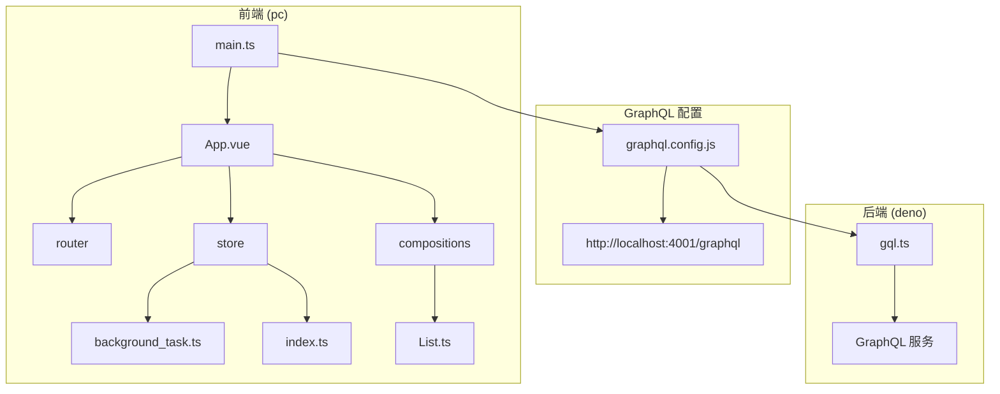
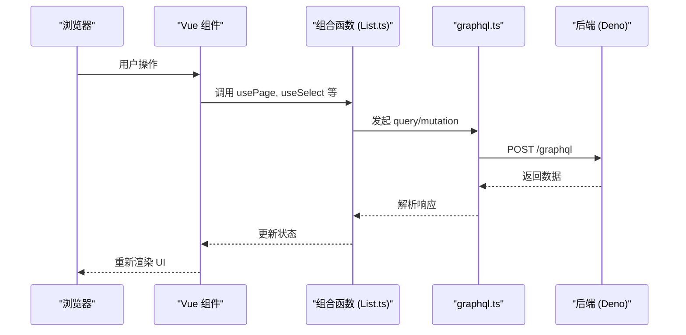
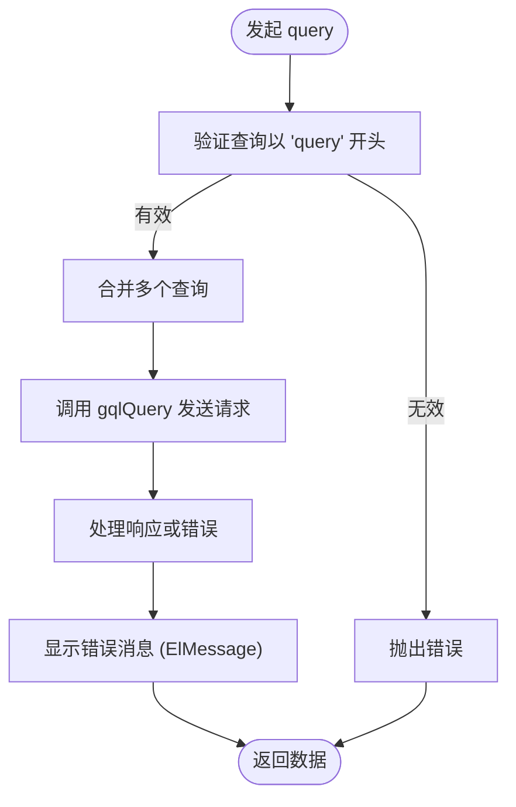
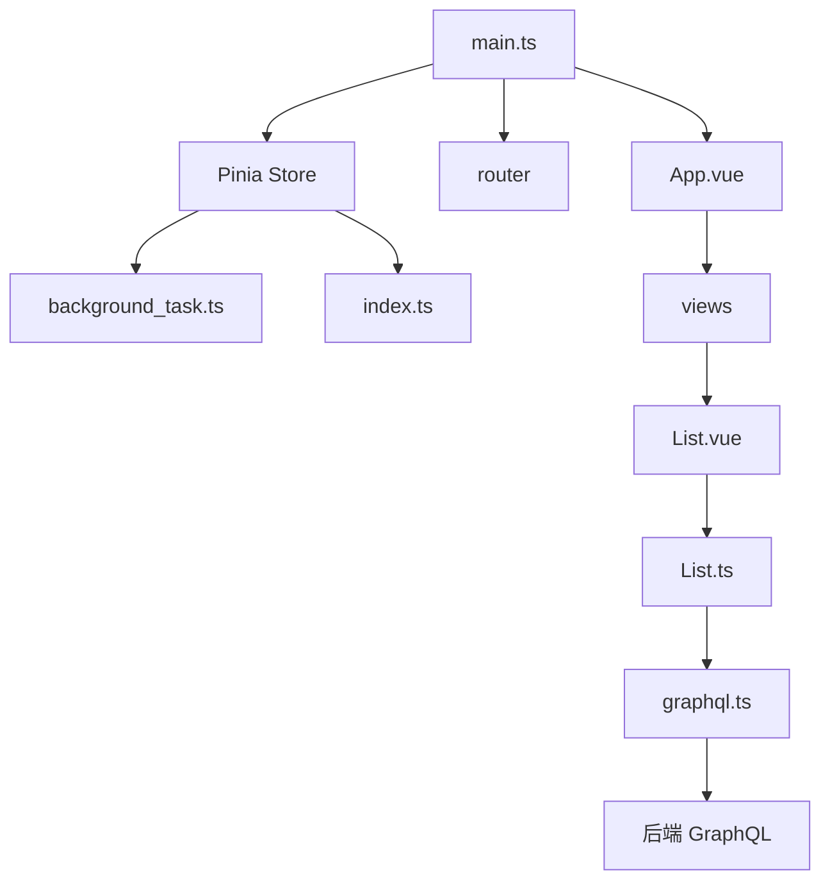

# 前端调试


**本文档引用的文件**  
- [main.ts](https://github.com/sail-sail/nest/blob/main/pc/src/main.ts)
- [List.ts](https://github.com/sail-sail/nest/blob/main/pc/src/compositions/List.ts)
- [graphql.ts](https://github.com/sail-sail/nest/blob/main/pc/src/utils/graphql.ts)
- [background_task.ts](https://github.com/sail-sail/nest/blob/main/pc/src/store/background_task.ts)
- [index.ts](https://github.com/sail-sail/nest/blob/main/pc/src/store/index.ts)
- [graphql.config.js](https://github.com/sail-sail/nest/blob/main/pc/graphql.config.js)
- [gql.ts](https://github.com/sail-sail/nest/blob/main/deno/lib/oak/gql.ts)


## 目录
1. [简介](#简介)
2. [项目结构](#项目结构)
3. [核心组件](#核心组件)
4. [架构概览](#架构概览)
5. [详细组件分析](#详细组件分析)
6. [依赖分析](#依赖分析)
7. [性能考量](#性能考量)
8. [故障排除指南](#故障排除指南)
9. [结论](#结论)

## 简介
本文档旨在为基于 Vue 3 组合式 API 和 GraphQL 客户端的前端应用提供全面的调试指导。文档将深入探讨如何使用浏览器开发者工具调试 Vue 组件的状态、props 和事件，如何监控 GraphQL 请求与响应，以及如何调试 Pinia 状态管理中的数据流。此外，还将介绍组合式函数（如 List.ts）中的状态管理与副作用处理技巧，并提供常见问题的排查方案。

## 项目结构
本项目采用模块化结构，主要分为 `pc`（PC端前端）、`uni`（跨平台前端）、`deno`（后端服务）和 `codegen`（代码生成）四个核心模块。前端部分基于 Vue 3 和 TypeScript 构建，使用 Pinia 进行状态管理，通过 GraphQL 与后端交互。



**图示来源**  
- [main.ts](https://github.com/sail-sail/nest/blob/main/pc/src/main.ts)
- [graphql.config.js](https://github.com/sail-sail/nest/blob/main/pc/graphql.config.js)
- [gql.ts](https://github.com/sail-sail/nest/blob/main/deno/lib/oak/gql.ts)

**本节来源**  
- [main.ts](https://github.com/sail-sail/nest/blob/main/pc/src/main.ts#L1-L37)
- [graphql.config.js](https://github.com/sail-sail/nest/blob/main/pc/graphql.config.js#L1-L13)

## 核心组件
项目的核心前端组件包括：
- **main.ts**：应用入口，初始化 Vue 实例、路由和 Pinia。
- **List.ts**：提供列表页面的通用逻辑，如分页、选择、键盘导航等。
- **graphql.ts**：封装 GraphQL 查询与变更请求，处理请求拦截、错误提示和加载状态。
- **Pinia stores**：管理全局状态，如用户信息、菜单、标签页等。

**本节来源**  
- [main.ts](https://github.com/sail-sail/nest/blob/main/pc/src/main.ts#L1-L37)
- [List.ts](https://github.com/sail-sail/nest/blob/main/pc/src/compositions/List.ts#L1-L1446)
- [graphql.ts](https://github.com/sail-sail/nest/blob/main/pc/src/utils/graphql.ts#L89-L365)
- [index.ts](https://github.com/sail-sail/nest/blob/main/pc/src/store/index.ts#L72-L126)

## 架构概览
系统采用前后端分离架构，前端通过 GraphQL 协议与后端通信。Vue 3 的组合式 API 将逻辑封装在 `compositions` 中，Pinia 管理全局状态，所有数据请求通过统一的 `graphql.ts` 工具函数发出。



**图示来源**  
- [List.ts](https://github.com/sail-sail/nest/blob/main/pc/src/compositions/List.ts#L1-L1446)
- [graphql.ts](https://github.com/sail-sail/nest/blob/main/pc/src/utils/graphql.ts#L89-L365)

## 详细组件分析

### Vue 组件状态调试
使用浏览器开发者工具的 **Vue DevTools** 可以实时查看组件的 props、状态（ref、reactive）、计算属性和侦听器。在 `List.ts` 中定义的 `selectedIds`、`page` 等响应式数据均可在 DevTools 中直接观察。

#### 组合式函数调试（List.ts）
`List.ts` 提供了多个可复用的组合函数，如 `usePage`、`useSelect`、`useTableColumns`。

```mermaid
classDiagram
class usePage {
+page : { size, current, total }
+pgSizeChg(size)
+pgCurrentChg(current)
+onPageDown()
+onPageUp()
}
class useSelect {
+selectedIds : Id[]
+onSelect(list, row)
+onRow(row, column, e)
+onRowUp(e)
+onRowDown(e)
+rowClassName()
}
class useTableColumns {
+tableColumns : ColumnType[]
+initColumns()
+headerDragend()
+resetColumns()
+storeColumns()
}
usePage --> useSelect : "可组合"
useSelect --> useTableColumns : "可组合"
```

**图示来源**  
- [List.ts](https://github.com/sail-sail/nest/blob/main/pc/src/compositions/List.ts#L1-L1446)

**本节来源**  
- [List.ts](https://github.com/sail-sail/nest/blob/main/pc/src/compositions/List.ts#L1-L1446)

### GraphQL 请求监控
所有 GraphQL 请求均通过 `pc/src/utils/graphql.ts` 中的 `query` 和 `mutation` 函数发出。可通过以下方式监控：

1. **浏览器网络面板**：筛选 `graphql` 请求，查看查询语句、变量和响应数据。
2. **请求拦截**：`graphql.ts` 中的 `gqlQuery` 函数是实际发送请求的入口，可在此处设置断点。
3. **URL 构造**：`getQueryUrl` 函数将查询和变量编码为 URL 参数，便于调试。



**图示来源**  
- [graphql.ts](https://github.com/sail-sail/nest/blob/main/pc/src/utils/graphql.ts#L89-L129)

**本节来源**  
- [graphql.ts](https://github.com/sail-sail/nest/blob/main/pc/src/utils/graphql.ts#L89-L365)

### Pinia 状态管理调试
Pinia store 的状态变化可通过 Vue DevTools 实时追踪。例如，`background_task.ts` 中的 `listDialogVisible` 和 `index.ts` 中的 `loading` 状态。

- **查看状态**：在 DevTools 的 "State" 标签页中展开对应的 store。
- **跟踪变更**：在 "Timeline" 标签页中观察状态变化的时间点。
- **手动修改**：可临时修改状态值以测试 UI 反应。

**本节来源**  
- [background_task.ts](https://github.com/sail-sail/nest/blob/main/pc/src/store/background_task.ts#L1-L14)
- [index.ts](https://github.com/sail-sail/nest/blob/main/pc/src/store/index.ts#L72-L126)

## 依赖分析
项目前端依赖关系清晰，`main.ts` 作为入口依赖路由、store 和 App 组件。`compositions` 模块被多个视图组件复用，`utils/graphql.ts` 是所有数据请求的统一出口。



**图示来源**  
- [main.ts](https://github.com/sail-sail/nest/blob/main/pc/src/main.ts#L1-L37)
- [List.ts](https://github.com/sail-sail/nest/blob/main/pc/src/compositions/List.ts#L1-L1446)
- [graphql.ts](https://github.com/sail-sail/nest/blob/main/pc/src/utils/graphql.ts#L89-L365)

**本节来源**  
- [main.ts](https://github.com/sail-sail/nest/blob/main/pc/src/main.ts#L1-L37)
- [List.ts](https://github.com/sail-sail/nest/blob/main/pc/src/compositions/List.ts#L1-L1446)

## 性能考量
- **GraphQL 查询合并**：`query` 函数会尝试合并多个并发查询，减少网络请求数量。
- **缓存机制**：后端 `gql.ts` 中使用 `LRUCache` 缓存解析后的查询文档，提升性能。
- **防抖与节流**：在状态更新和事件处理中合理使用 `nextTick` 避免不必要的重复渲染。

## 故障排除指南

### 数据未更新
1. 检查响应数据是否正确返回（网络面板）。
2. 确认 `ref` 或 `reactive` 变量被正确赋值。
3. 检查 `watch` 是否正确监听了依赖项。

### 重复请求
- 检查 `query` 函数的合并逻辑，确保 `queryInfos` 被正确清空。
- 避免在 `setup` 或 `onMounted` 中重复调用数据加载函数。

### GraphQL 错误
- 确保查询以 `query` 或 `mutation` 开头。
- 检查 `Authorization` 头是否正确携带。
- 查看后端返回的 `errors` 字段获取具体错误信息。

**本节来源**  
- [graphql.ts](https://github.com/sail-sail/nest/blob/main/pc/src/utils/graphql.ts#L314-L365)
- [gql.ts](https://github.com/sail-sail/nest/blob/main/deno/lib/oak/gql.ts#L124-L184)

## 结论
通过熟练掌握 Vue DevTools、浏览器网络面板以及对 `List.ts` 和 `graphql.ts` 等核心模块的理解，开发者可以高效地调试前端应用。建议在开发过程中充分利用组合式 API 的可复用性，并通过 Pinia 集中管理状态，以构建可维护、易调试的前端系统。