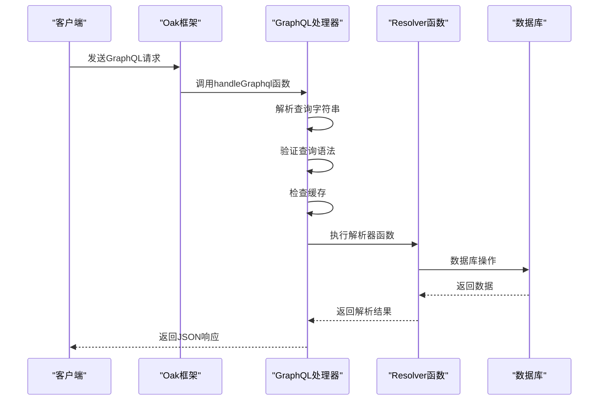
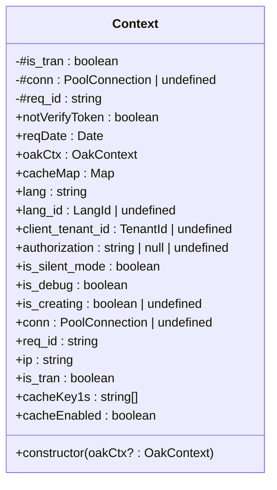
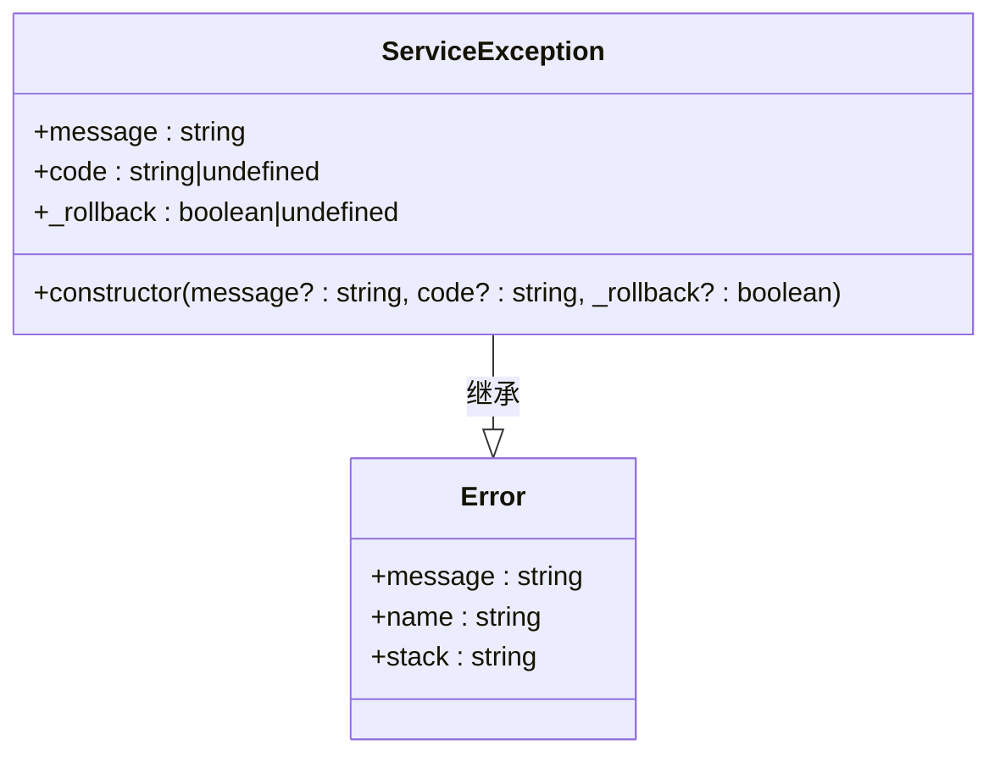
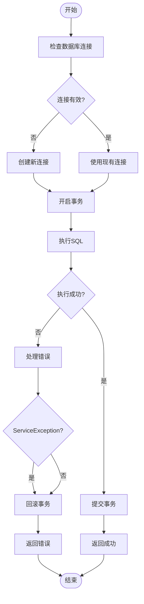

# 后端调试


**本文档引用的文件**  
- [gql.ts](https://github.com/sail-sail/nest/blob/main/deno\lib\oak\gql.ts)
- [context.ts](https://github.com/sail-sail/nest/blob/main/deno\lib\context.ts)
- [service.exception.ts](https://github.com/sail-sail/nest/blob/main/deno\lib\exceptions\service.exception.ts)
- [mod.ts](https://github.com/sail-sail/nest/blob/main/deno\lib\oak\mod.ts)
- [mod.ts](https://github.com/sail-sail/nest/blob/main/deno\mod.ts)


## 目录

1. [后端调试](#后端调试)
2. [Deno调试模式启动与VS Code连接](#deno调试模式启动与vs-code连接)
3. [GraphQL请求处理流程分析](#graphql请求处理流程分析)
4. [上下文对象（Context）信息查看](#上下文对象context信息查看)
5. [错误处理机制调试技巧](#错误处理机制调试技巧)
6. [Deno内置检查器性能分析](#deno内置检查器性能分析)
7. [常见问题排查步骤](#常见问题排查步骤)

## Deno调试模式启动与VS Code连接

要调试基于Deno的后端服务，首先需要以调试模式启动Deno服务。在项目根目录下执行以下命令：

```bash
deno run --inspect=0.0.0.0:9229 --allow-all mod.ts
```

该命令的参数说明如下：
- `--inspect=0.0.0.0:9229`：启用Deno的调试检查器，并监听所有网络接口的9229端口。
- `--allow-all`：授予Deno运行所需的所有权限（文件、网络、环境变量等）。

启动成功后，控制台会输出类似信息：
```
Debugger listening on ws://0.0.0.0:9229/ws/...
app started: 8000
```

接下来，在VS Code中配置调试器。在`.vscode/launch.json`中添加以下配置：

```json
{
  "version": "0.2.0",
  "configurations": [
    {
      "name": "Attach to Deno",
      "type": "pwa-node",
      "request": "attach",
      "port": 9229,
      "address": "localhost",
      "localRoot": "${workspaceFolder}",
      "remoteRoot": "/",
      "protocol": "inspector",
      "skipFiles": [
        "<node_internals>/**"
      ]
    }
  ]
}
```

配置完成后，启动VS Code调试器并选择"Attach to Deno"配置，即可成功连接到正在运行的Deno进程，实现断点调试、变量查看等调试功能。

**节来源**
- [mod.ts](https://github.com/sail-sail/nest/blob/main/deno\mod.ts)

## GraphQL请求处理流程分析

GraphQL请求的处理核心位于`deno\lib\oak\gql.ts`文件中。该文件定义了GraphQL路由处理器和请求解析逻辑。

### 请求处理流程



**图来源**
- [gql.ts](https://github.com/sail-sail/nest/blob/main/deno\lib\oak\gql.ts#L150-L400)

### 断点设置与请求监控

在`gql.ts`文件中，可以在以下关键位置设置断点进行请求监控：

1. **请求入口断点**：在`handleGraphql`函数开始处设置断点，可以监控所有进入的GraphQL请求。
```typescript
async function handleGraphql(
  oakCtx: OakContext,
  gqlObj: {
    query: string,
    variables?: { [key: string]: unknown; },
  },
) {
  // 在此处设置断点
  if (gqlSchema === undefined) {
```

2. **查询解析断点**：在查询解析和验证逻辑处设置断点。
```typescript
const document = parse(query);
const validationErrors = validate(gqlSchema!, document);
```

3. **解析器执行断点**：在解析器函数的代理调用处设置断点。
```typescript
return runInAsyncHooks(context, async function() {
  log("");
  log(`resolver: ${ prop }: ${ JSON.stringify(cbArgs) }`);
  // 在此处设置断点可监控每个解析器的执行
```

通过这些断点，可以详细观察GraphQL查询的解析过程、变量传递、错误验证等关键环节。

**节来源**
- [gql.ts](https://github.com/sail-sail/nest/blob/main/deno\lib\oak\gql.ts)

## 上下文对象（Context）信息查看

上下文对象（Context）是贯穿整个请求生命周期的核心对象，包含了用户信息、请求头、数据库连接等重要数据。

### Context类结构



**图来源**
- [context.ts](https://github.com/sail-sail/nest/blob/main/deno\lib\context.ts#L100-L200)

### 关键属性说明

- **用户认证信息**：
  - `authorization`：存储从请求头或查询参数中获取的Bearer Token
  - `getAuthorization()`：获取授权信息的辅助函数

- **请求标识信息**：
  - `req_id`：唯一请求ID，用于日志追踪
  - `reqDate`：请求开始时间
  - `ip`：客户端IP地址

- **多租户信息**：
  - `client_tenant_id`：租户ID，从请求头"TenantId"或查询参数中获取

- **数据库事务**：
  - `is_tran`：标识当前请求是否处于事务中
  - `conn`：数据库连接对象

- **国际化信息**：
  - `lang`：当前请求的语言，默认为"zh-CN"
  - `lang_id`：语言ID

在调试过程中，可以通过查看Context对象的这些属性来了解请求的完整上下文信息。

**节来源**
- [context.ts](https://github.com/sail-sail/nest/blob/main/deno\lib\context.ts)

## 错误处理机制调试技巧

系统的错误处理机制主要通过`ServiceException`类实现，提供了统一的错误处理和事务回滚机制。

### ServiceException类分析



**图来源**
- [service.exception.ts](https://github.com/sail-sail/nest/blob/main/deno\lib\exceptions\service.exception.ts#L1-L15)

### 错误捕获与堆栈跟踪

在`gql.ts`文件的`handleGraphql`函数中，实现了完整的错误处理流程：

```typescript
try {
  res = await callback.apply(null, cbArgs);
} catch (err) {
  if (err instanceof ServiceException) {
    if (err._rollback !== false) {
      isRollback = true;
    }
  } else {
    isRollback = true;
  }
  throw err;
} finally {
  if (isRollback) {
    await rollback();
  } else {
    await commit();
  }
}
```

调试技巧：
1. **设置异常断点**：在VS Code调试器中启用"Caught Exceptions"断点，当抛出`ServiceException`时自动暂停。
2. **检查错误堆栈**：在异常被捕获时，查看完整的堆栈跟踪，定位错误源头。
3. **分析错误代码**：`ServiceException`的`code`属性提供了错误类型的标识，便于分类处理。
4. **事务回滚监控**：通过`_rollback`属性控制事务行为，`true`表示回滚，`false`表示提交。

### 错误响应格式化

系统对不同类型的错误进行了统一的响应格式化处理：

```typescript
if (err.originalError instanceof ServiceException) {
  result.errors.push({
    code: err.originalError.code,
    message: err.originalError.message,
  });
} else if (isValidationError) {
  result.errors.push({
    message: errors[0].message,
  });
} else if (err.originalError?.name === "NonErrorThrown") {
  result.errors.push({
    message: (err.originalError as any).thrownValue,
  });
} else {
  // 记录详细错误日志
  error(err);
}
```

**节来源**
- [gql.ts](https://github.com/sail-sail/nest/blob/main/deno\lib\oak\gql.ts#L300-L350)
- [service.exception.ts](https://github.com/sail-sail/nest/blob/main/deno\lib\exceptions\service.exception.ts)

## Deno内置检查器性能分析

Deno提供了强大的内置检查器，可用于性能分析和内存泄漏检测。

### 性能分析命令

```bash
# 启用CPU性能分析
deno run --inspect --v8-flags=--prof mod.ts

# 生成性能分析报告
deno run --inspect --v8-flags=--prof --v8-flags=--prof-process isolate-0x104800000-v8.log

# 启用内存分析
deno run --inspect --v8-flags=--heap-prof mod.ts
```

### 内存泄漏检测

1. **定期内存快照**：在关键位置调用`Deno.memoryUsage()`获取内存使用情况。
```typescript
console.log('Memory usage:', Deno.memoryUsage());
```

2. **使用Chrome DevTools**：通过`chrome://inspect`连接到Deno进程，使用内存分析工具进行堆快照对比。

3. **监控对象引用**：特别注意Context对象、数据库连接、缓存对象的生命周期，避免意外的长生命周期引用。

### 性能优化建议

- **查询缓存**：系统已使用LRUCache对GraphQL查询进行缓存，减少重复解析开销。
```typescript
const queryCacheMap = new LRUCache<string, {
  document: DocumentNode,
  validationErrors: readonly GraphQLError[],
}>({
  max: 10000,
});
```

- **数据库连接池**：使用mysql2的连接池管理数据库连接，避免频繁创建销毁连接的开销。

- **异步钩子优化**：使用AsyncHooksContextManager管理上下文，确保异步操作中的上下文一致性。

**节来源**
- [gql.ts](https://github.com/sail-sail/nest/blob/main/deno\lib\oak\gql.ts#L100-L120)
- [context.ts](https://github.com/sail-sail/nest/blob/main/deno\lib\context.ts)

## 常见问题排查步骤

### 解析错误排查

**症状**：GraphQL查询语法错误，返回"GraphQL Query Error"。

**排查步骤**：
1. 检查查询字符串的语法是否正确。
2. 在`gql.ts`的`parse(query)`处设置断点，查看具体的解析错误。
3. 确认查询中使用的字段和类型是否在Schema中定义。

```typescript
try {
  const document = parse(query);
} catch (syntaxError) {
  result = {
    errors: [ syntaxError ],
  };
}
```

### 认证失败排查

**症状**：返回"token不存在"或"token无效"错误。

**排查步骤**：
1. 检查请求头是否包含`Authorization: Bearer <token>`。
2. 检查查询参数中是否包含`authorization`参数。
3. 在`getAuthorization()`函数处设置断点，查看授权信息的获取过程。
4. 确认Context对象的`authorization`属性是否正确设置。

### 数据库查询异常排查

**症状**：数据库操作失败，返回内部错误。

**排查步骤**：
1. 检查数据库连接配置是否正确（host、port、username、password等）。
2. 在`beginTran()`、`commit()`、`rollback()`函数处设置断点，监控事务状态。
3. 查看`context.conn`是否成功获取数据库连接。
4. 检查SQL语句是否正确，参数是否匹配。



**图来源**
- [context.ts](https://github.com/sail-sail/nest/blob/main/deno\lib\context.ts#L500-L600)

**节来源**
- [gql.ts](https://github.com/sail-sail/nest/blob/main/deno\lib\oak\gql.ts)
- [context.ts](https://github.com/sail-sail/nest/blob/main/deno\lib\context.ts)