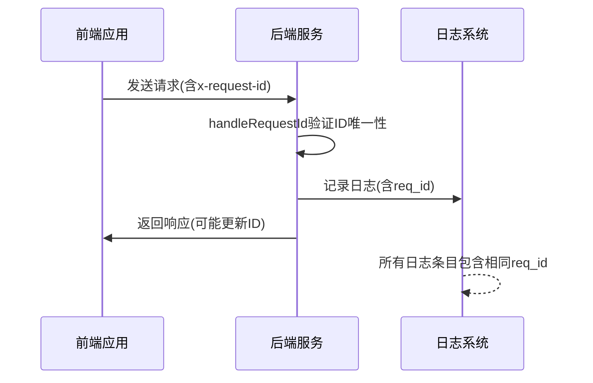
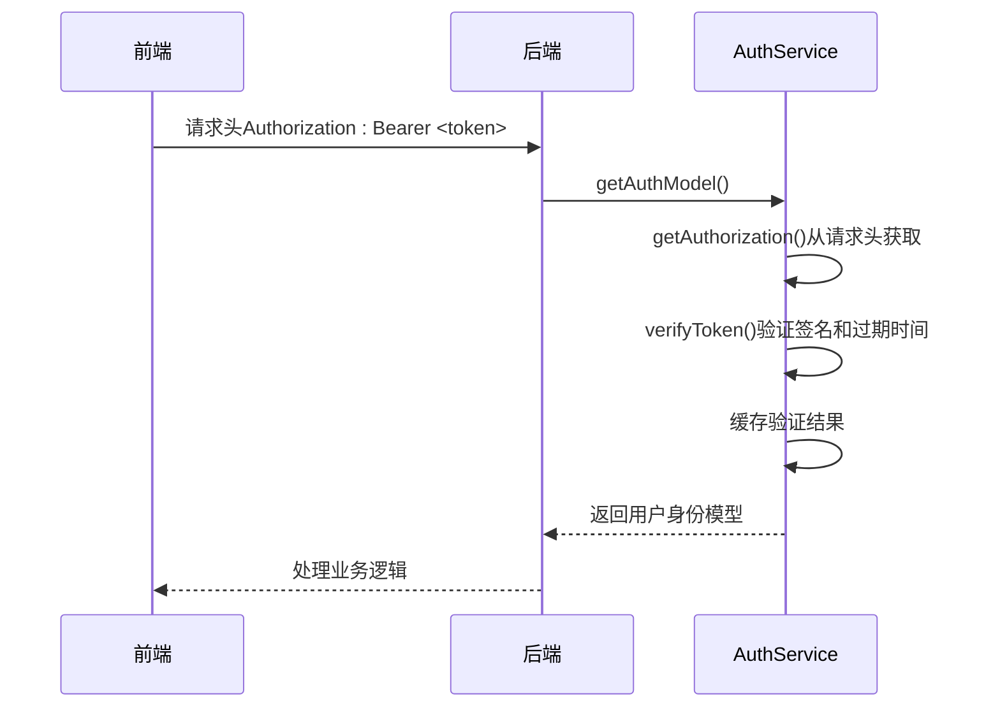
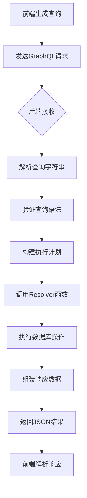
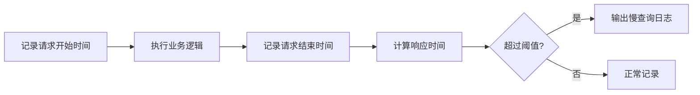

# 联调技巧


**本文档中引用的文件**  
- [auth.dao.ts](https://github.com/sail-sail/nest/blob/main/deno/lib/auth/auth.dao.ts#L0-L220)
- [auth.service.ts](https://github.com/sail-sail/nest/blob/main/deno/lib/auth/auth.service.ts#L0-L54)
- [auth.constants.ts](https://github.com/sail-sail/nest/blob/main/deno/lib/auth/auth.constants.ts#L0-L32)
- [gql.ts](https://github.com/sail-sail/nest/blob/main/deno/lib/oak/gql.ts#L0-L448)
- [request_id.ts](https://github.com/sail-sail/nest/blob/main/deno/lib/oak/request_id.ts#L0-L74)
- [context.ts](https://github.com/sail-sail/nest/blob/main/deno/lib/context.ts#L491-L561)
- [graphql.ts](https://github.com/sail-sail/nest/blob/main/pc/src/utils/graphql.ts#L54-L195)
- [graphql.ts](https://github.com/sail-sail/nest/blob/main/uni/src/utils/graphql.ts#L54-L189)


## 目录
1. [引言](#引言)
2. [请求ID关联日志](#请求id关联日志)
3. [认证令牌传递与验证](#认证令牌传递与验证)
4. [GraphQL查询生命周期](#graphql查询生命周期)
5. [数据不一致问题排查](#数据不一致问题排查)
6. [性能瓶颈分析](#性能瓶颈分析)
7. [时间线协同分析](#时间线协同分析)

## 引言
本文档旨在为前后端联调提供全面的端到端调试指导。通过深入分析项目架构与核心组件，重点阐述跨端调试的关键技术，包括日志关联、认证流程、GraphQL执行链路、数据一致性及性能优化等方面。文档结合实际代码实现，为开发人员提供可操作的调试方法和最佳实践。

## 请求ID关联日志

### 日志关联机制
系统通过 `x-request-id` 请求头实现跨服务日志追踪。每个请求在进入后端时生成唯一请求ID，并贯穿整个处理链路，确保前后端日志可精确关联。



**图示来源**  
- [request_id.ts](https://github.com/sail-sail/nest/blob/main/deno/lib/oak/request_id.ts#L0-L74)
- [context.ts](https://github.com/sail-sail/nest/blob/main/deno/lib/context.ts#L491-L561)

**本节来源**  
- [request_id.ts](https://github.com/sail-sail/nest/blob/main/deno/lib/oak/request_id.ts#L0-L74)
- [context.ts](https://github.com/sail-sail/nest/blob/main/deno/lib/context.ts#L491-L561)

### 实现细节
1. **请求ID验证**：`handleRequestId` 函数检查请求ID是否重复，防止重放攻击
2. **Redis缓存**：在启用缓存时，将请求ID存入Redis并设置过期时间
3. **日志注入**：`log` 和 `error` 函数自动注入请求ID到日志输出中

## 认证令牌传递与验证

### JWT认证流程
系统采用JWT（JSON Web Token）进行用户认证，从前端请求到后端验证形成完整链路。



**图示来源**  
- [auth.dao.ts](https://github.com/sail-sail/nest/blob/main/deno/lib/auth/auth.dao.ts#L0-L220)
- [auth.service.ts](https://github.com/sail-sail/nest/blob/main/deno/lib/auth/auth.service.ts#L0-L54)

**本节来源**  
- [auth.dao.ts](https://github.com/sail-sail/nest/blob/main/deno/lib/auth/auth.dao.ts#L0-L220)
- [auth.service.ts](https://github.com/sail-sail/nest/blob/main/deno/lib/auth/auth.service.ts#L0-L54)
- [auth.constants.ts](https://github.com/sail-sail/nest/blob/main/deno/lib/auth/auth.constants.ts#L0-L32)

### 核心组件分析
#### 认证模型定义
```typescript
export interface AuthModel extends JWTPayload {
  id: UsrId;
  wx_usr_id?: string;
  tenant_id: TenantId;
  org_id?: OrgId;
  lang: string;
}
```

#### 令牌验证逻辑
1. 从请求头获取 `Authorization` 值
2. 检查缓存中是否存在已验证的认证模型
3. 使用HS256算法验证JWT签名
4. 处理过期和签名验证失败异常
5. 支持通过刷新令牌获取新令牌

## GraphQL查询生命周期

### 查询处理全流程
GraphQL查询从前端生成到后端执行的完整生命周期。



**图示来源**  
- [gql.ts](https://github.com/sail-sail/nest/blob/main/deno/lib/oak/gql.ts#L0-L448)
- [graphql.ts](https://github.com/sail-sail/nest/blob/main/pc/src/utils/graphql.ts#L54-L195)

**本节来源**  
- [gql.ts](https://github.com/sail-sail/nest/blob/main/deno/lib/oak/gql.ts#L0-L448)
- [graphql.ts](https://github.com/sail-sail/nest/blob/main/pc/src/utils/graphql.ts#L54-L195)
- [graphql.ts](https://github.com/sail-sail/nest/blob/main/uni/src/utils/graphql.ts#L54-L189)

### 前端查询优化
前端实现查询合并机制，提升网络效率：

1. **查询收集**：`query` 函数收集待发送的查询
2. **去重判断**：`findQueryInfosIdx` 检查相同查询和变量
3. **批量处理**：将多个查询合并为单个请求
4. **别名重写**：为每个查询字段添加唯一哈希前缀
5. **变量重命名**：为查询变量添加索引后缀避免冲突

## 数据不一致问题排查

### 常见问题类型
| 问题类型 | 表现形式 | 排查方法 |
|---------|--------|--------|
| 时间戳格式 | 前后端时间显示不一致 | 统一使用ISO 8601格式 |
| 枚举值映射 | 前端显示代码而非名称 | 检查字典表映射关系 |
| 空值处理 | null/undefined显示异常 | 统一空值转换规则 |
| 数值精度 | 小数计算结果不一致 | 使用Decimal类型处理 |

### 排查步骤
1. **确认数据源**：检查数据库存储的实际值
2. **跟踪传输过程**：查看网络请求中的数据格式
3. **验证转换逻辑**：检查前后端数据转换代码
4. **比对显示结果**：确认最终呈现是否符合预期

## 性能瓶颈分析

### 慢查询识别
通过日志监控识别慢查询：



**本节来源**  
- [gql.ts](https://github.com/sail-sail/nest/blob/main/deno/lib/oak/gql.ts#L265-L306)
- [context.ts](https://github.com/sail-sail/nest/blob/main/deno/lib/context.ts#L491-L561)

### 性能监控点
1. **网络延迟**：测量请求往返时间
2. **解析开销**：GraphQL查询解析耗时
3. **数据库查询**：SQL执行时间
4. **渲染性能**：前端组件渲染耗时
5. **序列化成本**：对象转JSON时间

## 时间线协同分析

### 协同调试方法
使用时间线工具进行跨端问题定位：

1. **统一时间基准**：确保前后端系统时间同步
2. **关键事件标记**：在代码中添加时间戳日志
3. **请求ID追踪**：通过唯一ID关联所有相关日志
4. **可视化时间线**：将日志按时间排序展示

### 实际应用场景
当用户报告操作无响应时：
1. 获取用户操作时间点
2. 搜索该时间段内的请求ID
3. 追踪完整请求处理链路
4. 定位耗时最长的环节
5. 分析具体原因并优化