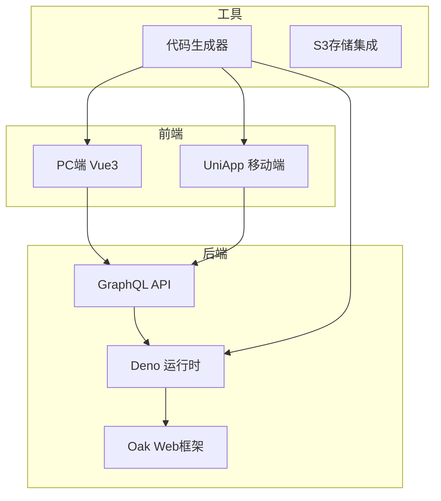
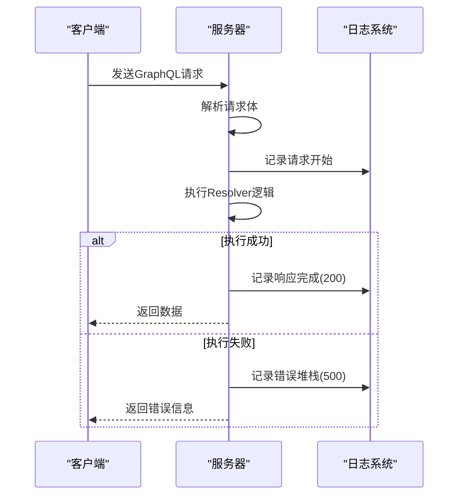
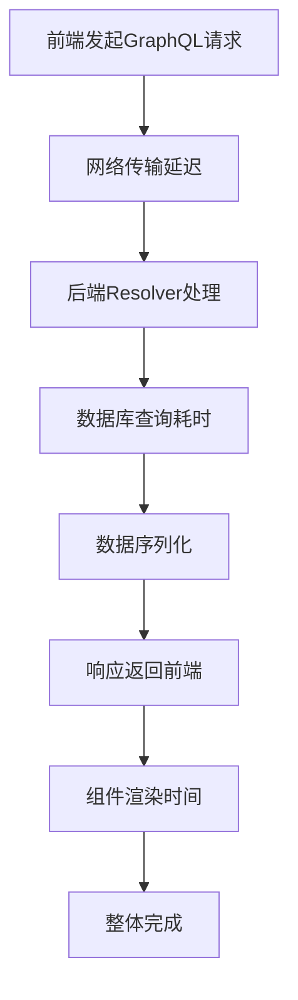

# 调试技巧


**本文档引用文件**  
- [graphql.config.js](https://github.com/sail-sail/nest/blob/main/deno/graphql.config.js)
- [graphql.ts](https://github.com/sail-sail/nest/blob/main/deno/lib/graphql.ts)
- [mod.ts](https://github.com/sail-sail/nest/blob/main/deno/mod.ts)
- [KFrame.vue](https://github.com/sail-sail/nest/blob/main/pc/src/components/KFrame/KFrame.vue)
- [main.ts](https://github.com/sail-sail/nest/blob/main/pc/src/main.ts)
- [request.ts](https://github.com/sail-sail/nest/blob/main/pc/src/utils/request.ts)
- [graphql.config.js](https://github.com/sail-sail/nest/blob/main/pc/graphql.config.js)
- [graphql.ts](https://github.com/sail-sail/nest/blob/main/pc/src/utils/graphql.ts)
- [App.vue](https://github.com/sail-sail/nest/blob/main/pc/src/App.vue)
- [env.ts](https://github.com/sail-sail/nest/blob/main/deno/lib/env.ts)
- [context.ts](https://github.com/sail-sail/nest/blob/main/deno/lib/context.ts)
- [health.service.ts](https://github.com/sail-sail/nest/blob/main/deno/lib/health/health.service.ts)


## 目录
1. [简介](#简介)
2. [项目结构](#项目结构)
3. [后端调试方法](#后端调试方法)
4. [前端调试技巧](#前端调试技巧)
5. [前后端联调最佳实践](#前后端联调最佳实践)
6. [常见问题排查指南](#常见问题排查指南)
7. [Deno与浏览器调试工具的使用](#deno与浏览器调试工具的使用)
8. [结论](#结论)

## 简介
本文档旨在为开发者提供一套完整的调试指导方案，涵盖基于Deno的后端GraphQL API调试、Vue 3前端组件调试以及前后端协同调试的最佳实践。系统介绍了如何利用GraphQL Playground进行接口测试、如何通过日志和堆栈追踪错误、如何使用浏览器开发者工具监控请求，并结合项目实际结构给出具体操作建议。

## 项目结构
本项目采用模块化架构，主要分为四个核心部分：`codegen`（代码生成）、`deno`（后端服务）、`pc`（PC端前端）和`uni`（跨平台移动端）。后端基于Deno + Oak框架构建GraphQL服务，前端使用Vue 3 + TypeScript开发，通过GraphQL客户端与后端通信。



**图示来源**
- [mod.ts](https://github.com/sail-sail/nest/blob/main/deno/mod.ts#L1-L20)
- [main.ts](https://github.com/sail-sail/nest/blob/main/pc/src/main.ts#L1-L15)
- [codegen/src/config.ts](https://github.com/sail-sail/nest/blob/main/codegen/src/config.ts#L5-L25)

## 后端调试方法

### 使用GraphQL Playground进行查询测试
项目中已配置GraphQL Playground，可通过访问`/graphql`路径打开调试界面。该工具允许开发者直接编写和执行GraphQL查询、变更操作，并实时查看返回结果。

```typescript
// deno/lib/graphql.ts 中的配置示例
import { GraphQLHTTP } from "https://deno.land/x/oak_graphql/mod.ts";

app.use("/graphql", GraphQLHTTP<{ context: Context }>({
  schema,
  graphiql: true, // 启用GraphiQL/Playground界面
  context: (ctx) => ctx.state,
}));
```

在Playground中可以：
- 测试用户登录：`mutation { login(username: "admin", password: "123456") }`
- 查询部门列表：`query { deptList(page: 1, size: 10) { data { id name } } }`
- 查看Schema文档：左侧Docs面板提供完整的类型定义

### 查看请求日志和错误堆栈
后端日志系统集成在`deno/lib/util/log.ts`中，所有请求均通过中间件记录。关键日志信息包括：
- 请求路径与方法
- 响应状态码
- 执行耗时
- 错误堆栈（启用调试模式时）



**图示来源**
- [graphql.ts](https://github.com/sail-sail/nest/blob/main/deno/lib/graphql.ts#L30-L60)
- [log.ts](https://github.com/sail-sail/nest/blob/main/deno/lib/util/log.ts#L10-L40)

**本节来源**
- [graphql.ts](https://github.com/sail-sail/nest/blob/main/deno/lib/graphql.ts#L1-L100)
- [log.ts](https://github.com/sail-sail/nest/blob/main/deno/lib/util/log.ts#L1-L50)

## 前端调试技巧

### Vue 3组件调试方法
前端采用Vue 3 Composition API模式开发，调试时可重点关注以下方面：

#### 使用Vue Devtools
确保安装最新版Vue Devtools浏览器插件，可实现：
- 实时查看组件树结构
- 监控响应式数据变化
- 捕获组件生命周期钩子
- 调试`<script setup>`语法糖中的变量

#### 组件状态调试示例
以`KFrame.vue`为例，该组件为系统主框架，包含菜单、标签页等核心功能：

```vue
<!-- pc/src/components/KFrame/KFrame.vue -->
<script setup lang="ts">
import { useMenuStore } from "@/store/menu";
const menuStore = useMenuStore();

// 调试：打印菜单状态
console.log("当前菜单:", menuStore.menus);
</script>
```

建议在关键逻辑处添加`console.log`或使用浏览器断点进行逐步调试。

### GraphQL客户端请求监控
前端通过封装的GraphQL客户端发送请求，位于`pc/src/utils/graphql.ts`。

```typescript
// request.ts 中的请求拦截示例
export async function request(query, variables) {
  console.group(`GraphQL请求: ${getQueryName(query)}`);
  console.log("查询:", query);
  console.log("变量:", variables);

  try {
    const response = await fetch("/graphql", {
      method: "POST",
      headers: { "Content-Type": "application/json" },
      body: JSON.stringify({ query, variables }),
    });

    const data = await response.json();
    console.log("响应:", data);
    console.groupEnd();
    return data;
  } catch (error) {
    console.error("请求失败:", error);
    console.groupEnd();
    throw error;
  }
}
```

通过控制台可清晰看到每个请求的输入输出，便于定位问题。

**本节来源**
- [KFrame.vue](https://github.com/sail-sail/nest/blob/main/pc/src/components/KFrame/KFrame.vue#L1-L80)
- [request.ts](https://github.com/sail-sail/nest/blob/main/pc/src/utils/request.ts#L15-L60)
- [graphql.ts](https://github.com/sail-sail/nest/blob/main/pc/src/utils/graphql.ts#L5-L35)

## 前后端联调最佳实践

### 设置断点与查看变量状态
推荐使用VS Code + Deno插件进行全栈调试：

1. **启动Deno调试服务**：
```json
// .vscode/launch.json
{
  "type": "pwa-node",
  "request": "launch",
  "name": "Deno Debug",
  "runtimeExecutable": "deno",
  "runtimeArgs": [
    "run",
    "--allow-all",
    "--inspect-brk",
    "mod.ts"
  ],
  "attachSimplePort": 9229
}
```

2. **在Resolver中设置断点**：
```typescript
// deno/gen/base/usr.resolver.ts
export const UserResolver = {
  Query: {
    usrList: async (_parent, args, ctx) => {
      debugger; // 此处会暂停执行
      console.log("接收到参数:", args);
      return await UserService.list(args);
    }
  }
};
```

3. 前端发起请求后，VS Code将自动停在断点处，可查看上下文`ctx`、参数`args`等变量。

### 分析性能瓶颈
使用Chrome开发者工具的Performance面板记录完整调用链：



重点关注：
- TTFB（首字节时间）
- Resolver执行时间
- 组件首次渲染时间（FC/FP）

**本节来源**
- [mod.ts](https://github.com/sail-sail/nest/blob/main/deno/mod.ts#L20-L50)
- [usr.resolver.ts](https://github.com/sail-sail/nest/blob/main/deno/gen/base/usr.resolver.ts#L10-L30)
- [main.ts](https://github.com/sail-sail/nest/blob/main/pc/src/main.ts#L25-L40)

## 常见问题排查指南

### API调用失败
| 现象 | 可能原因 | 解决方案 |
|------|---------|----------|
| 400 Bad Request | 查询语法错误 | 检查GraphQL查询格式，使用Playground验证 |
| 401 Unauthorized | 认证失败 | 检查token是否过期，确认登录状态 |
| 403 Forbidden | 权限不足 | 检查角色权限配置 |
| 500 Internal Error | 服务端异常 | 查看后端日志中的堆栈信息 |

### 数据不一致
- **缓存问题**：清除浏览器缓存或禁用缓存重新测试
- **时间戳不同步**：确保前后端系统时间一致
- **分页参数错误**：检查`page`和`size`参数传递是否正确
- **字段映射错误**：核对GraphQL Schema与数据库字段对应关系

**本节来源**
- [auth.service.ts](https://github.com/sail-sail/nest/blob/main/deno/lib/auth/auth.service.ts#L20-L60)
- [field_permit.ts](https://github.com/sail-sail/nest/blob/main/pc/src/store/field_permit.ts#L5-L25)
- [context.ts](https://github.com/sail-sail/nest/blob/main/deno/lib/context.ts#L10-L30)

## Deno与浏览器调试工具的使用

### Deno调试功能
Deno原生支持V8 Inspector Protocol，可通过以下方式启用：

```bash
deno run --inspect-brk=0.0.0.0:9229 mod.ts
```

然后在Chrome浏览器访问`chrome://inspect`，即可进行断点调试、变量查看、调用堆栈分析等操作。

### 浏览器开发者工具技巧
1. **Network面板过滤GraphQL请求**：
   - 使用筛选器：`graphql` 或 `content-type:application/json`
   - 查看请求头中的`Authorization`字段

2. **Console中模拟请求**：
```javascript
// 手动发送GraphQL请求
fetch('/graphql', {
  method: 'POST',
  headers: { 'Content-Type': 'application/json' },
  body: JSON.stringify({
    query: `query { health { status } }`
  })
}).then(r => r.json()).then(console.log)
```

3. **Application面板查看存储**：
   - 检查localStorage中的token
   - 查看IndexedDB中的缓存数据

**本节来源**
- [mod.ts](https://github.com/sail-sail/nest/blob/main/deno/mod.ts#L5-L15)
- [env.ts](https://github.com/sail-sail/nest/blob/main/deno/lib/env.ts#L8-L20)
- [App.vue](https://github.com/sail-sail/nest/blob/main/pc/src/App.vue#L30-L50)

## 结论
有效的调试是保障系统稳定运行的关键环节。通过结合GraphQL Playground、Deno调试器、Vue Devtools和浏览器开发者工具，开发者可以快速定位并解决各类问题。建议在开发过程中养成良好的日志记录习惯，在关键路径添加调试信息，并定期进行联调测试以确保系统整体稳定性。