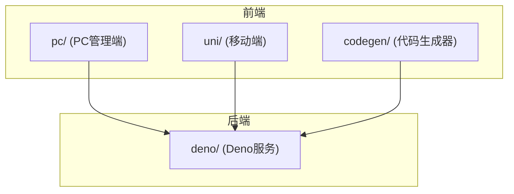
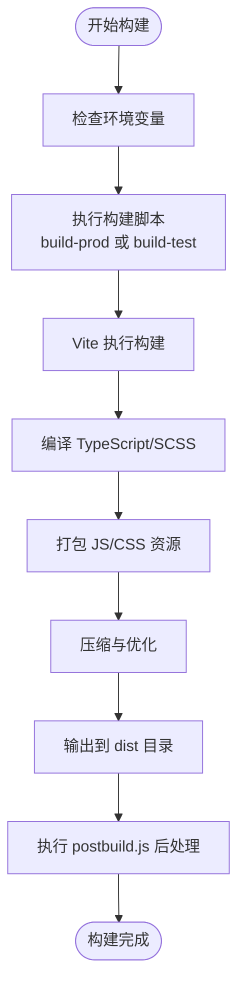
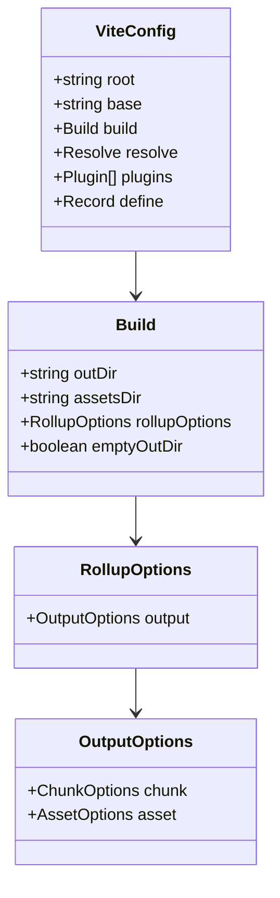
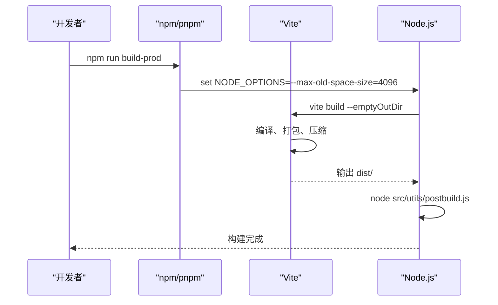
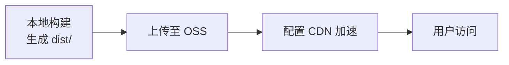
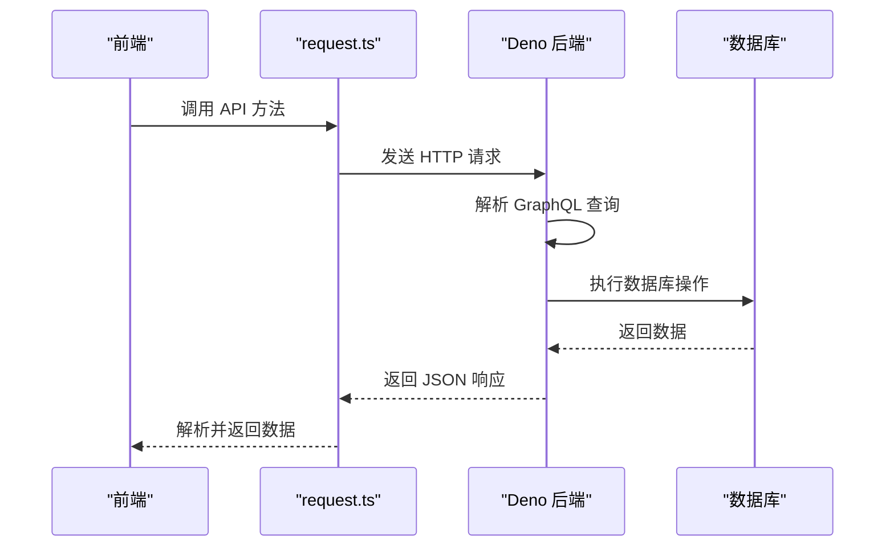

# 前端部署

**本文档引用文件**  
- [vite.config.ts](https://github.com/sail-sail/nest/blob/main/pc/vite.config.ts)
- [package.json](https://github.com/sail-sail/nest/blob/main/pc/package.json)
- [deno/mod.ts](https://github.com/sail-sail/nest/blob/main/deno/mod.ts)
- [main.ts](https://github.com/sail-sail/nest/blob/main/pc/src/main.ts)
- [router/index.ts](https://github.com/sail-sail/nest/blob/main/pc/src/router/index.ts)
- [utils/request.ts](https://github.com/sail-sail/nest/blob/main/pc/src/utils/request.ts)
- [utils/postbuild.js](https://github.com/sail-sail/nest/blob/main/pc/src/utils/postbuild.js)
- [config.ts](https://github.com/sail-sail/nest/blob/main/pc/src/utils/config.ts)

## 目录
1. [简介](#简介)
2. [项目结构](#项目结构)
3. [构建流程](#构建流程)
4. [Vite 配置详解](#vite-配置详解)
5. [构建脚本分析](#构建脚本分析)
6. [静态资源部署](#静态资源部署)
7. [前后端接口对接](#前后端接口对接)
8. [构建优化与缓存策略](#构建优化与缓存策略)
9. [版本控制与发布管理](#版本控制与发布管理)
10. [故障排查指南](#故障排查指南)

## 简介

本文档详细说明了基于 Vite 构建的前端项目在 PC 端和移动端的完整部署流程。涵盖从构建配置、脚本执行、资源优化到与后端 Deno 服务对接的全过程，确保前端部署高效、稳定且可维护。

## 项目结构

项目采用模块化设计，主要分为三个前端应用：PC 管理端（`pc/`）、移动端（`uni/`）和代码生成器（`codegen/`）。后端服务由 Deno 驱动，位于 `deno/` 目录。

**Diagram sources**
- [package.json](https://github.com/sail-sail/nest/blob/main/pc/package.json#L1-L103)

**Section sources**
- [package.json](https://github.com/sail-sail/nest/blob/main/pc/package.json#L1-L103)

## 构建流程

前端构建流程以 Vite 为核心，通过 `package.json` 中的脚本命令驱动。构建过程包括代码编译、资源压缩、依赖打包和后处理。

### 构建流程图

**Diagram sources**
- [package.json](https://github.com/sail-sail/nest/blob/main/pc/package.json#L5-L15)
- [postbuild.js](https://github.com/sail-sail/nest/blob/main/pc/src/utils/postbuild.js)

## Vite 配置详解

`vite.config.ts` 是构建的核心配置文件，定义了输出路径、资源处理、代码分割和 CDN 支持等关键参数。

### 关键配置项

- **build.outDir**: 构建输出目录，默认为 `dist`
- **build.assetsDir**: 静态资源子目录，如 `assets`
- **build.rollupOptions.output**: 自定义 Rollup 打包选项，支持代码分割
- **define**: 注入全局常量，用于环境区分
- **resolve.alias**: 路径别名，提升模块导入效率
- **plugins**: 集成 UnoCSS、Element Plus 等插件

### 示例配置结构

**Diagram sources**
- [vite.config.ts](https://github.com/sail-sail/nest/blob/main/pc/vite.config.ts)

**Section sources**
- [vite.config.ts](https://github.com/sail-sail/nest/blob/main/pc/vite.config.ts)

## 构建脚本分析

`package.json` 中的 `scripts` 字段定义了多种构建命令，适应不同环境需求。

### 主要构建脚本

- **start**: 开发服务器启动
- **build-prod**: 生产环境构建，启用最大内存限制
- **build-test**: 测试环境构建，使用 `--mode test`
- **typecheck**: 类型检查与 ESLint 验证
- **postinstall**: 安装后自动执行脚本

### 构建脚本调用流程

**Diagram sources**
- [package.json](https://github.com/sail-sail/nest/blob/main/pc/package.json#L5-L15)
- [postbuild.js](https://github.com/sail-sail/nest/blob/main/pc/src/utils/postbuild.js)

**Section sources**
- [package.json](https://github.com/sail-sail/nest/blob/main/pc/package.json#L1-L103)

## 静态资源部署

构建生成的 `dist/` 目录包含所有静态资源，可部署至 Web 服务器（如 Nginx）或对象存储（OSS）。

### 部署流程

1. 执行 `npm run build-prod` 生成生产包
2. 将 `dist/` 目录上传至目标服务器或 OSS
3. 配置 Web 服务器路由，支持 History 模式
4. （可选）配置 CDN 加速

### OSS 部署示例

**Diagram sources**
- [postbuild.js](https://github.com/sail-sail/nest/blob/main/pc/src/utils/postbuild.js)

## 前后端接口对接

前端通过 `src/utils/request.ts` 封装的 HTTP 客户端与后端 Deno 服务通信。

### 接口配置

- **API 基础路径**: 通过 `import.meta.env.VITE_API_BASE` 配置
- **GraphQL 端点**: `/graphql`
- **认证机制**: Bearer Token

### 接口调用流程

**Diagram sources**
- [request.ts](https://github.com/sail-sail/nest/blob/main/pc/src/utils/request.ts)
- [deno/mod.ts](https://github.com/sail-sail/nest/blob/main/deno/mod.ts)

**Section sources**
- [request.ts](https://github.com/sail-sail/nest/blob/main/pc/src/utils/request.ts)
- [deno/mod.ts](https://github.com/sail-sail/nest/blob/main/deno/mod.ts)

## 构建优化与缓存策略

### 优化措施

- **代码分割**: 利用 Rollup 动态导入实现按需加载
- **资源压缩**: Vite 默认启用 Gzip/Brotli
- **Tree Shaking**: 移除未使用代码
- **预加载/预连接**: 优化关键资源加载

### 缓存策略

- **文件名哈希**: `chunk-vendors.[hash].js` 确保强缓存
- **CDN 缓存**: 配置长期缓存策略
- **Service Worker**: 通过 `vite-plugin-pwa` 实现离线访问

## 版本控制与发布管理

### 版本号管理

- 版本号定义在 `package.json` 的 `version` 字段
- 构建时可通过 `postbuild.js` 注入版本信息

### 发布流程

1. 提交代码至 Git 仓库
2. 触发 CI/CD 流程
3. 执行构建脚本
4. 上传至生产环境
5. 验证部署结果

## 故障排查指南

### 常见问题

- **构建内存溢出**: 已通过 `NODE_OPTIONS=--max-old-space-size=4096` 解决
- **API 路径错误**: 检查 `VITE_API_BASE` 环境变量
- **资源 404**: 确认 `base` 配置与部署路径匹配
- **样式丢失**: 检查 UnoCSS 和 SCSS 编译是否正常

### 调试工具

- **Vite DevTools**: 提供构建性能分析
- **Linting**: ESLint 和 Vue-TSC 确保代码质量
- **日志输出**: `postbuild.js` 可添加详细日志

**Section sources**
- [postbuild.js](https://github.com/sail-sail/nest/blob/main/pc/src/utils/postbuild.js)
- [package.json](https://github.com/sail-sail/nest/blob/main/pc/package.json#L5-L15)