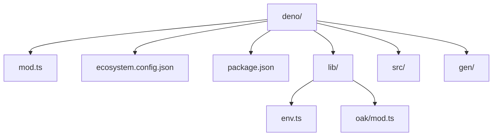
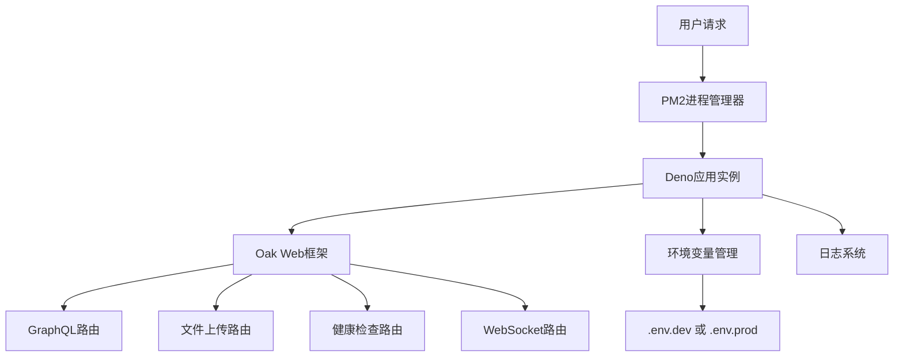
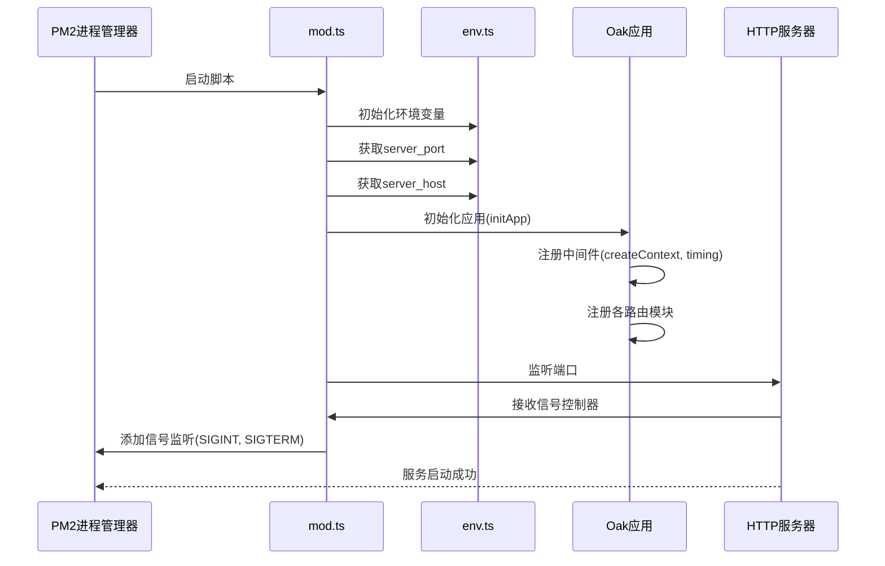
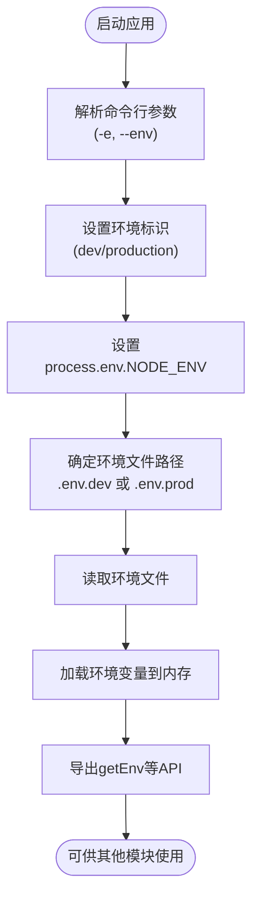
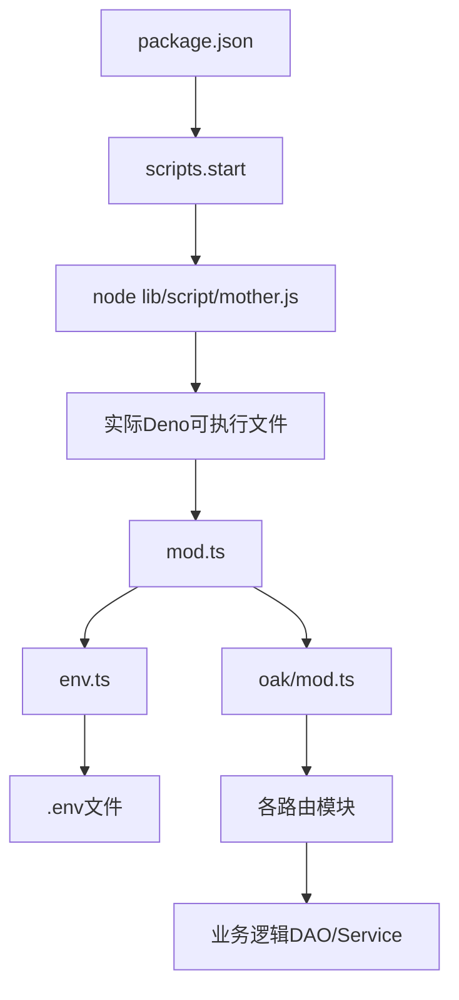

# 后端部署


**本文档引用文件**  
- [ecosystem.config.json](https://github.com/sail-sail/nest/blob/main/deno/ecosystem.config.json)
- [mod.ts](https://github.com/sail-sail/nest/blob/main/deno/mod.ts)
- [package.json](https://github.com/sail-sail/nest/blob/main/deno/package.json)
- [env.ts](https://github.com/sail-sail/nest/blob/main/deno/lib/env.ts)
- [oak/mod.ts](https://github.com/sail-sail/nest/blob/main/deno/lib/oak/mod.ts)


## 目录
1. [简介](#简介)
2. [项目结构](#项目结构)
3. [核心组件](#核心组件)
4. [架构概览](#架构概览)
5. [详细组件分析](#详细组件分析)
6. [依赖分析](#依赖分析)
7. [性能考虑](#性能考虑)
8. [故障排除指南](#故障排除指南)
9. [结论](#结论)

## 简介
本文档详细介绍了如何使用PM2和`ecosystem.config.json`配置文件部署基于Deno的后端服务。重点涵盖PM2进程管理、Deno服务启动机制、环境变量管理以及完整的部署流程。文档还提供性能调优建议和常见问题解决方案，确保服务稳定运行。

## 项目结构
后端服务位于`deno/`目录下，主要包含以下结构：
- `mod.ts`：服务主入口文件
- `ecosystem.config.json`：PM2进程管理配置
- `lib/`：核心功能模块（环境、日志、路由等）
- `src/` 和 `gen/`：业务逻辑与自动生成代码
- `package.json`：脚本命令定义



**Diagram sources**
- [ecosystem.config.json](https://github.com/sail-sail/nest/blob/main/deno/ecosystem.config.json)
- [mod.ts](https://github.com/sail-sail/nest/blob/main/deno/mod.ts)

## 核心组件

`ecosystem.config.json` 是PM2的核心配置文件，定义了应用的运行参数。`mod.ts` 是Deno服务的启动入口，负责初始化应用和监听端口。`env.ts` 提供环境变量管理功能，支持多环境配置。

**Section sources**
- [ecosystem.config.json](https://github.com/sail-sail/nest/blob/main/deno/ecosystem.config.json)
- [mod.ts](https://github.com/sail-sail/nest/blob/main/deno/mod.ts)
- [env.ts](https://github.com/sail-sail/nest/blob/main/deno/lib/env.ts)

## 架构概览



**Diagram sources**
- [mod.ts](https://github.com/sail-sail/nest/blob/main/deno/mod.ts)
- [oak/mod.ts](https://github.com/sail-sail/nest/blob/main/deno/lib/oak/mod.ts)
- [env.ts](https://github.com/sail-sail/nest/blob/main/deno/lib/env.ts)

## 详细组件分析

### PM2配置分析

`ecosystem.config.json` 文件定义了应用的运行配置：

```json
{
  "apps": [{
    "name": "nest4{env}",
    "script": "./nest4{env}",
    "instances": 1,
    "autorestart": true,
    "watch": false,
    "env": {},
    "env_production": {}
  }]
}
```

**配置项说明：**

- **name**: 应用名称，使用 `{env}` 占位符可动态替换环境标识
- **script**: 启动脚本路径，指向可执行文件而非TS源码
- **instances**: 实例数量，设为1表示单实例运行
- **autorestart**: 启用自动重启，进程崩溃时自动恢复
- **watch**: 关闭文件监听，避免开发模式下的自动重启
- **env**: 默认环境变量配置
- **env_production**: 生产环境专用配置

**Section sources**
- [ecosystem.config.json](https://github.com/sail-sail/nest/blob/main/deno/ecosystem.config.json)

### 服务启动机制分析

`mod.ts` 是服务的主入口文件，其工作机制如下：



**Diagram sources**
- [mod.ts](https://github.com/sail-sail/nest/blob/main/deno/mod.ts)
- [oak/mod.ts](https://github.com/sail-sail/nest/blob/main/deno/lib/oak/mod.ts)
- [env.ts](https://github.com/sail-sail/nest/blob/main/deno/lib/env.ts)

**Section sources**
- [mod.ts](https://github.com/sail-sail/nest/blob/main/deno/mod.ts#L1-L47)
- [env.ts](https://github.com/sail-sail/nest/blob/main/deno/lib/env.ts#L1-L114)

### 环境变量管理

`lib/env.ts` 模块提供完整的环境变量管理功能：

- 支持命令行参数 `-e` 或 `--env` 指定环境
- 自动映射 `dev` 到 `development`，`prod` 到 `production`
- 支持 `.env.dev`、`.env.prod` 等环境特定文件
- 提供 `getEnv()` 异步方法和 `getParsedEnv()` 同步方法



**Diagram sources**
- [env.ts](https://github.com/sail-sail/nest/blob/main/deno/lib/env.ts#L1-L114)

### 应用初始化流程

`lib/oak/mod.ts` 负责应用的初始化和路由注册：

```typescript
export function initApp() {
  const app = new Application();
  
  app.use(createContext());  // 请求上下文中间件
  app.use(timing());         // 请求耗时统计
  
  // 注册各业务路由
  app.use(gqlRouter.routes());
  app.use(tmpfileRouter.routes());
  app.use(ossRouter.routes());
  app.use(websocketRouter.routes());
  app.use(healthRouter.routes());
  
  return app;
}
```

**Section sources**
- [oak/mod.ts](https://github.com/sail-sail/nest/blob/main/deno/lib/oak/mod.ts#L1-L25)

## 依赖分析



**Diagram sources**
- [package.json](https://github.com/sail-sail/nest/blob/main/deno/package.json)
- [mod.ts](https://github.com/sail-sail/nest/blob/main/deno/mod.ts)

**Section sources**
- [package.json](https://github.com/sail-sail/nest/blob/main/deno/package.json#L1-L52)

## 性能考虑

### 部署流程
通过 `package.json` 中的脚本实现完整的部署流程：

```json
"scripts": {
  "start": "node lib/script/mother.js",
  "build-prod": "deno run -A ./lib/script/build.ts --target linux --env prod",
  "build-test": "deno run -A ./lib/script/build.ts --target linux --env test"
}
```

部署命令流程：
1. `npm run build-prod`：构建生产环境可执行文件
2. `npm start`：通过PM2启动服务

### 内存监控
- 使用PM2内置监控：`pm2 monit`
- 查看内存使用：`pm2 list` 或 `pm2 info <app-name>`
- 设置内存限制：在 `ecosystem.config.json` 中添加 `max_memory_restart` 配置

### 性能调优建议
1. **日志优化**：生产环境启用日志文件，避免控制台输出过多
2. **连接池**：数据库连接使用连接池管理
3. **缓存**：高频数据使用LRU缓存
4. **静态资源**：前端资源由Nginx等反向代理服务器处理
5. **集群模式**：根据服务器CPU核心数调整PM2实例数

## 故障排除指南

### 常见问题及解决方案

| 问题现象 | 可能原因 | 解决方案 |
|--------|--------|--------|
| 服务无法启动 | 端口被占用 | 检查 `server_port` 配置，更换端口 |
|  | 环境变量未配置 | 确保 `.env.prod` 文件存在且配置完整 |
|  | 权限不足 | 使用 `-A` 参数授予Deno所有权限 |
| PM2启动失败 | 可执行文件不存在 | 先运行 `build-prod` 生成可执行文件 |
|  | 路径错误 | 检查 `ecosystem.config.json` 中的 `script` 路径 |
| 内存泄漏 | 未释放资源 | 检查数据库连接、文件句柄等是否正确关闭 |
|  | 缓存过大 | 设置合理的缓存大小和过期时间 |

### 信号处理
Deno应用正确处理了系统信号：
- `SIGINT` (Ctrl+C)：正常关闭应用
- `SIGTERM` (kill命令)：正常关闭应用（非Windows系统）

确保在容器环境中正确传递这些信号以实现优雅关闭。

**Section sources**
- [mod.ts](https://github.com/sail-sail/nest/blob/main/deno/mod.ts#L35-L45)
- [ecosystem.config.json](https://github.com/sail-sail/nest/blob/main/deno/ecosystem.config.json)

## 结论
本文档详细介绍了基于PM2和Deno的后端部署方案。通过 `ecosystem.config.json` 实现进程管理，`mod.ts` 作为服务入口，配合完善的环境变量管理和错误处理机制，确保了服务的稳定运行。建议在生产环境中结合监控系统，定期检查服务状态和性能指标，及时发现并解决问题。