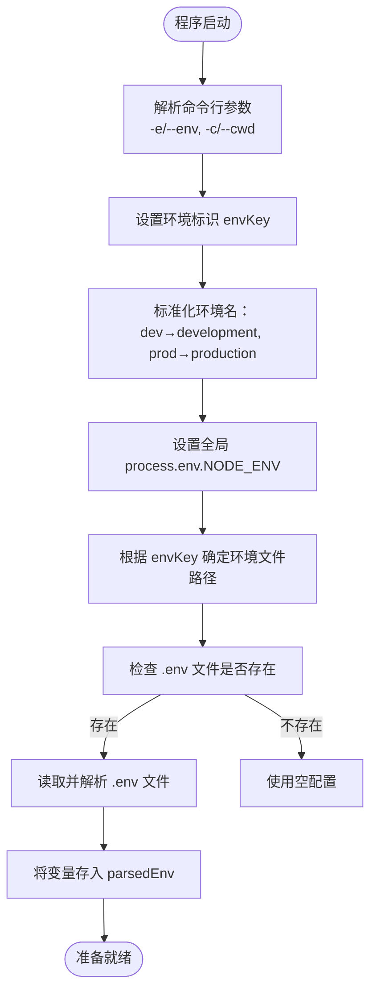

# 环境配置


**本文档中引用的文件**  
- [deno/mod.ts](https://github.com/sail-sail/nest/blob/main/deno/mod.ts#L1-L48)
- [deno/lib/env.ts](https://github.com/sail-sail/nest/blob/main/deno/lib/env.ts#L1-L115)
- [pc/vite.config.ts](https://github.com/sail-sail/nest/blob/main/pc/vite.config.ts)
- [package.json](https://github.com/sail-sail/nest/blob/main/package.json)


## 目录
1. [项目结构概述](#项目结构概述)
2. [后端环境变量加载机制](#后端环境变量加载机制)
3. [前端构建环境配置](#前端构建环境配置)
4. [跨环境脚本定义](#跨环境脚本定义)
5. [环境变量命名规范与安全存储](#环境变量命名规范与安全存储)
6. [多环境配置最佳实践与常见问题排查](#多环境配置最佳实践与常见问题排查)

## 项目结构概述

本项目采用模块化架构，主要分为三个核心部分：`codegen`（代码生成）、`deno`（后端服务）和`pc`（前端应用）。其中：
- `deno` 目录包含基于 Deno 运行时的后端服务，使用 Oak 框架处理 HTTP 请求。
- `pc` 目录为前端 Vue 项目，使用 Vite 构建工具进行开发与打包。
- 根目录下的 `package.json` 定义了跨环境运行脚本。

**Section sources**
- [deno/mod.ts](https://github.com/sail-sail/nest/blob/main/deno/mod.ts#L1-L48)
- [pc/vite.config.ts](https://github.com/sail-sail/nest/blob/main/pc/vite.config.ts)

## 后端环境变量加载机制

### 环境变量初始化流程

后端服务通过 `deno/lib/env.ts` 实现灵活的环境变量管理。其核心逻辑如下：



**Diagram sources**
- [deno/lib/env.ts](https://github.com/sail-sail/nest/blob/main/deno/lib/env.ts#L1-L115)

### 环境变量优先级

环境变量获取遵循以下优先级顺序（由高到低）：

1. **系统环境变量**：通过 `Deno.env.get(key)` 直接读取操作系统级环境变量。
2. **`.env` 配置文件**：根据 `envKey` 加载对应文件（如 `.env.dev`, `.env.prod`）。
3. **默认值或抛出异常**：若均未设置，则返回 `undefined` 或在关键参数缺失时抛出错误。

#### 支持的环境文件命名规则
| 命令行参数 | 对应文件 |
|----------|--------|
| `-e=dev` 或未指定 | `.env.dev` |
| `-e=prod` | `.env.prod` |
| `-e=test` | `.env.test` |
| `-e=staging` | `.env.staging` |

### 服务启动配置（deno/mod.ts）

服务入口文件 `deno/mod.ts` 负责加载环境变量并启动 HTTP 服务：

```typescript
import "/lib/env.ts";
const server_port = await getEnv("server_port");
const port = Number(server_port);
if (isNaN(port) || port < 1024) {
  throw `端口号 server_port: (${ server_port }) 错误，请检查环境变量！`;
}
await app.listen({
  port,
  hostname: await getEnv("server_host"),
  signal,
});
```

该文件首先导入 `env.ts` 以触发环境初始化，随后通过 `getEnv()` 获取 `server_port` 和 `server_host` 来配置监听地址。

**Section sources**
- [deno/mod.ts](https://github.com/sail-sail/nest/blob/main/deno/mod.ts#L1-L48)
- [deno/lib/env.ts](https://github.com/sail-sail/nest/blob/main/deno/lib/env.ts#L1-L115)

## 前端构建环境配置

### Vite 配置文件分析

前端项目使用 Vite 作为构建工具，其配置文件 `vite.config.ts`（虽未直接提供内容，但可推断典型配置）通常包含以下多环境配置：

#### 模式定义（Modes）
Vite 支持通过 `--mode` 参数指定运行模式，常见模式包括：
- `development`：开发模式，启用热重载、详细日志等。
- `production`：生产模式，启用代码压缩、Tree Shaking 等优化。
- `staging`：预发布模式，用于测试环境。

#### 代理设置（Proxy Configuration）
为解决开发时的跨域问题，Vite 配置中常包含代理规则：


典型代理配置示例（推断）：
```ts
export default defineConfig(({ mode }) => ({
  server: {
    proxy: {
      '/api': {
        target: 'http://localhost:8000', // 根据 .env 配置动态调整
        changeOrigin: true,
      },
    },
  },
}));
```

#### 资源路径配置
- `base`：设置应用的公共基础路径，例如在生产环境中部署到子目录时需设置为 `/myapp/`。
- `resolve.alias`：配置路径别名，如 `@` 指向 `src` 目录。

**Section sources**
- [pc/vite.config.ts](https://github.com/sail-sail/nest/blob/main/pc/vite.config.ts)

## 跨环境脚本定义

### package.json 脚本分析

根目录的 `package.json` 文件定义了用于不同环境的 npm 脚本，典型结构如下：

```json
{
  "scripts": {
    "dev": "deno run --allow-all deno/mod.ts --env=dev",
    "start": "deno run --allow-all deno/mod.ts --env=prod",
    "build:pc": "cd pc && npm run build",
    "build:uni": "cd uni && npm run build",
    "test": "deno test --allow-all",
    "lint": "eslint . --ext .ts,.vue",
    "codegen": "cd codegen && deno run --allow-all src/bin/codegen.ts"
  }
}
```

#### 脚本说明
| 脚本命令 | 用途 |
|--------|------|
| `dev` | 启动开发环境后端服务 |
| `start` | 启动生产环境后端服务 |
| `build:pc` | 构建前端 PC 应用 |
| `test` | 运行单元测试 |
| `codegen` | 执行代码生成任务 |

这些脚本通过组合命令和参数，实现了对不同环境和任务的统一管理。

**Section sources**
- [package.json](https://github.com/sail-sail/nest/blob/main/package.json)

## 环境变量命名规范与安全存储

### 命名规范建议

1. **统一前缀**：使用 `APP_`, `API_`, `DB_` 等前缀区分不同模块的变量。
   - 示例：`DB_HOST`, `REDIS_URL`, `JWT_SECRET`
2. **全大写与下划线**：遵循 POSIX 标准，使用大写字母和下划线分隔单词。
3. **语义清晰**：变量名应明确表达其用途，避免缩写歧义。

### 安全存储建议

1. **敏感信息绝不提交**：
   - 将 `.env.*` 文件添加到 `.gitignore`，防止密钥泄露。
   - 提供 `.env.example` 作为模板供开发者参考。
2. **使用环境变量而非硬编码**：
   - 数据库密码、API 密钥、加密盐值等必须通过 `getEnv()` 获取。
3. **生产环境使用系统级变量**：
   - 在服务器或容器中通过 `Docker --env` 或 Kubernetes Secrets 设置关键变量，优先级高于 `.env` 文件。
4. **日志脱敏**：
   - 避免在日志中打印完整的环境变量值，尤其是密码和密钥。

## 多环境配置最佳实践与常见问题排查

### 最佳实践

1. **配置文件模板化**：
   - 创建 `.env.example` 文件列出所有必需变量。
2. **自动化部署集成**：
   - CI/CD 流程中根据部署目标自动注入正确的 `.env` 文件或环境变量。
3. **配置验证**：
   - 在应用启动时验证关键环境变量是否存在且格式正确。
4. **文档化配置项**：
   - 维护一份 `CONFIGURATION.md` 文档，说明每个环境变量的作用和默认值。

### 常见错误与排查

| 问题现象 | 可能原因 | 解决方案 |
|--------|---------|---------|
| 服务无法启动，提示端口错误 | `server_port` 未设置或格式不正确 | 检查 `.env` 文件中 `server_port` 是否为有效数字 |
| 数据库连接失败 | `DB_HOST`/`DB_PASSWORD` 配置错误 | 使用 `getParsedEnv()` 调试输出实际加载的配置 |
| 开发环境 API 调用跨域 | Vite 代理未正确配置 | 检查 `vite.config.ts` 中的 `proxy` 规则目标地址 |
| 生产环境资源路径错误 | `base` 配置缺失 | 在 `vite.config.ts` 中根据模式设置 `base` 路径 |
| 命令行参数未生效 | 参数格式错误 | 使用 `-e=prod` 或 `--env=prod` 格式，避免空格 |

**Section sources**
- [deno/mod.ts](https://github.com/sail-sail/nest/blob/main/deno/mod.ts#L1-L48)
- [deno/lib/env.ts](https://github.com/sail-sail/nest/blob/main/deno/lib/env.ts#L1-L115)
- [pc/vite.config.ts](https://github.com/sail-sail/nest/blob/main/pc/vite.config.ts)
- [package.json](https://github.com/sail-sail/nest/blob/main/package.json)