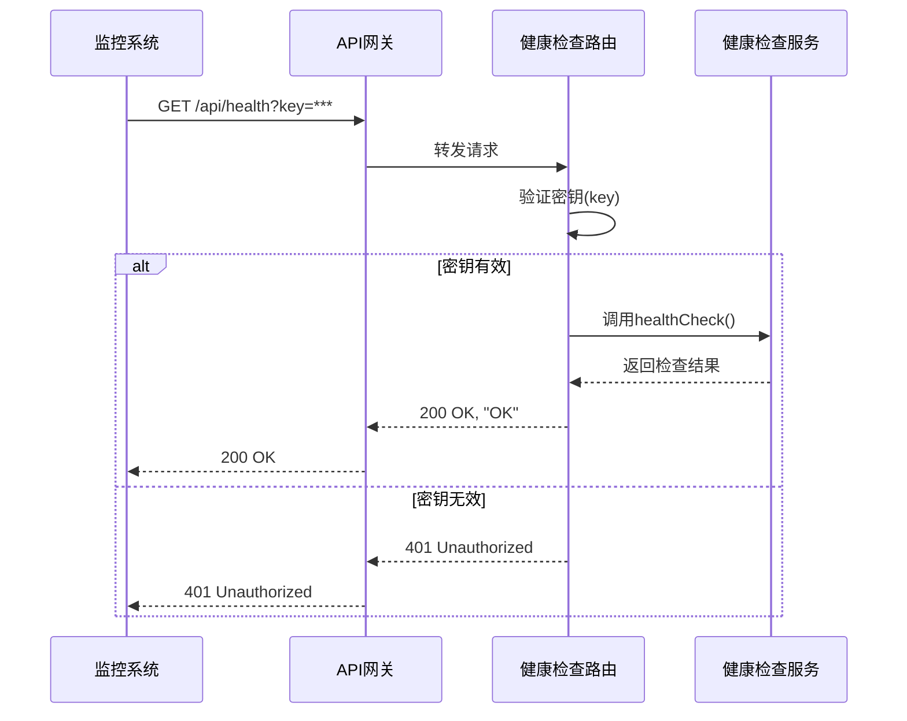

# 监控与维护


**本文档引用的文件**   
- [ecosystem.config.json](https://github.com/sail-sail/nest/blob/main/deno/ecosystem.config.json)
- [mod.ts](https://github.com/sail-sail/nest/blob/main/deno/mod.ts)
- [health.router.ts](https://github.com/sail-sail/nest/blob/main/deno/lib/health/health.router.ts)


## 目录
1. [简介](#简介)
2. [后端服务监控](#后端服务监控)
3. [健康检查机制](#健康检查机制)
4. [前端异常监控](#前端异常监控)
5. [日志管理与故障诊断](#日志管理与故障诊断)
6. [性能分析与回滚策略](#性能分析与回滚策略)

## 简介
本文档系统介绍基于当前项目架构的部署后服务监控与日常维护策略。重点围绕后端使用PM2进行进程管理、通过健康检查路由实现服务可用性检测，以及前端利用Vite构建配置建立异常监控体系。文档涵盖日志管理、性能分析、故障诊断和回滚操作的标准化流程，确保系统长期稳定运行。

## 后端服务监控

### PM2 进程管理与监控
项目后端服务通过PM2进行进程管理，其配置文件位于 `deno/ecosystem.config.json`。该配置定义了服务的启动脚本、实例数量、自动重启策略等关键参数。

```json
{
  "apps": [{
    "name": "nest4{env}",
    "script": "./nest4{env}",
    "instances": 1,
    "autorestart": true,
    "watch": false,
    "env": {
    },
    "env_production": {
    }
  }]
}
```

**关键配置说明**：
- **name**: 服务在PM2中的显示名称，支持环境变量 `{env}`。
- **script**: 启动脚本路径，指向编译后的可执行文件。
- **instances**: 实例数量，当前配置为1，表示单实例运行。
- **autorestart**: 自动重启开关，设置为 `true` 可在服务崩溃后自动恢复。
- **watch**: 文件监听重启，设置为 `false` 表示不启用热重载。

**监控操作**：
1. **查看服务状态**：执行 `pm2 status` 可查看所有PM2管理的服务，包括CPU和内存使用率。
2. **实时监控**：执行 `pm2 monit` 可进入实时监控界面，观察服务的资源消耗趋势。
3. **日志查看**：执行 `pm2 logs nest4{env}` 可实时查看服务输出日志，便于问题排查。
4. **性能告警**：可通过PM2的 `pm2 plus` 或集成第三方监控工具（如Grafana + Prometheus）设置CPU、内存使用率阈值告警。

**Section sources**
- [ecosystem.config.json](https://github.com/sail-sail/nest/blob/main/deno/ecosystem.config.json#L1-L14)

## 健康检查机制

### 健康检查路由实现
后端服务通过 `/api/health` 路由提供健康检查功能，其核心逻辑位于 `deno/lib/health/health.router.ts`。该路由用于检测服务的可用性，是负载均衡器和容器编排平台（如Kubernetes）进行存活探针（Liveness Probe）和就绪探针（Readiness Probe）检查的基础。

```typescript
import {
  Router,
} from "@oak/oak";

import {
  error,
} from "/lib/context.ts";

const KEY = "lLpR1EKETWSb5x7TR4R32Q"; // 访问密钥，防止未授权访问

const router = new Router({
  prefix: "/api/",
});

router.get("health", async function(ctx) {
  const request = ctx.request;
  const response = ctx.response;
  try {
    const {
      healthCheck,
    } = await import("./health.service.ts");
    
    const searchParams = request.url.searchParams;
    const key = searchParams.get("key");
    if (key !== KEY) {
      response.status = 401;
      response.body = "Unauthorized";
      return;
    }
    
    await healthCheck(); // 执行具体的健康检查逻辑
    
    response.status = 200;
    response.body = "OK";
  } catch (err0) {
    const err = err0 as Error;
    error(err);
    const errMsg = err?.message || err?.toString() || err || "";
    response.status = 500;
    response.body = errMsg;
    return;
  }
});

export default router;
```

**工作流程分析**：
1. **请求验证**：客户端访问 `/api/health?key=lLpR1EKETWSb5x7TR4R32Q` 时，服务端会校验 `key` 参数是否匹配预设密钥。
2. **执行检查**：若密钥正确，则调用 `health.service.ts` 中的 `healthCheck` 函数。该函数通常会检查数据库连接、缓存服务等关键依赖的连通性。
3. **返回状态**：
   - **200 OK**：服务健康，所有依赖正常。
   - **500 Internal Server Error**：服务异常，返回具体的错误信息。
   - **401 Unauthorized**：密钥错误，拒绝访问。

**监控集成**：
- **自动化监控**：可使用 `curl` 命令或编写脚本定时调用健康检查接口，结合 `cron` 实现定时检测。
- **告警机制**：当接口返回非200状态码时，可通过邮件、短信或即时通讯工具发送告警通知。



**Diagram sources**
- [health.router.ts](https://github.com/sail-sail/nest/blob/main/deno/lib/health/health.router.ts#L1-L46)

**Section sources**
- [health.router.ts](https://github.com/sail-sail/nest/blob/main/deno/lib/health/health.router.ts#L1-L46)

## 前端异常监控

### 构建日志与错误追踪
前端项目位于 `pc` 目录，使用Vite作为构建工具。虽然 `vite.config.ts` 文件未在上下文中提供，但根据标准实践，可通过以下方式建立前端异常监控体系：

1. **构建日志分析**：
   - **构建成功/失败日志**：Vite构建过程会输出详细的日志，包括编译时间、资源大小、警告和错误信息。这些日志应被收集并存储，用于分析构建性能和稳定性。
   - **错误追踪**：在 `vite.config.ts` 中配置 `build.rollupOptions.onwarn` 和 `onerror` 回调，可以捕获并上报构建过程中的警告和错误。

2. **运行时错误监控**：
   - **全局错误捕获**：在 `main.ts` 中使用 `window.onerror` 和 `window.addEventListener('unhandledrejection', ...)` 捕获JavaScript运行时错误和未处理的Promise拒绝。
   - **Vue错误处理**：利用Vue 3的 `app.config.errorHandler` 全局配置，捕获组件渲染和事件处理中的错误。
   - **集成Sentry或自建上报**：将捕获的错误信息（包括堆栈跟踪、用户行为、设备信息）上报到Sentry等第三方服务或自建的日志服务器。

3. **Source Map上传**：
   - 在 `vite.config.ts` 的构建配置中生成Source Map文件，并在部署后将其上传到错误监控平台，以便将压缩后的代码错误映射回原始源码，方便定位问题。

**Section sources**
- [main.ts](https://github.com/sail-sail/nest/blob/main/pc/src/main.ts)

## 日志管理与故障诊断

### 日志初始化与管理
后端服务的日志管理在 `deno/mod.ts` 中进行初始化，根据环境变量配置日志文件的存储路径和过期时间。

```typescript
import { logInit } from "/lib/util/log.ts";

// deno-lint-ignore no-explicit-any
if ((globalThis as any).process.env.NODE_ENV === "production") {
  logInit({
    path: await getEnv("log_path"),
    expire_day: parseInt(await getEnv("log_expire_day")),
  });
}
```

**日志管理策略**：
- **日志分级**：使用 `console.log`, `console.warn`, `console.error` 等不同级别记录信息。
- **日志轮转**：通过 `logInit` 配置，实现日志文件按天轮转，并自动清理过期日志（由 `expire_day` 控制）。
- **集中化**：生产环境的日志应集中收集到ELK（Elasticsearch, Logstash, Kibana）或类似平台，便于搜索、分析和可视化。

### 故障诊断流程
1. **现象确认**：通过监控告警或用户反馈确认故障现象。
2. **日志排查**：首先查看PM2日志和应用日志，定位错误堆栈和关键错误信息。
3. **健康检查**：调用 `/api/health` 接口，确认服务整体状态。
4. **依赖检查**：检查数据库、缓存、文件存储等外部依赖服务是否正常。
5. **代码回溯**：根据错误堆栈和日志时间戳，回溯最近的代码变更。

**Section sources**
- [mod.ts](https://github.com/sail-sail/nest/blob/main/deno/mod.ts#L1-L15)

## 性能分析与回滚策略

### 性能分析
- **后端**：利用Deno内置的性能分析工具 `deno run --prof` 生成性能剖析文件，并使用 `deno --prof` 和 `deno --prof-process` 进行分析，找出性能瓶颈。
- **前端**：使用浏览器开发者工具的Performance面板进行页面加载和交互性能分析，优化关键渲染路径。

### 回滚操作
1. **代码回滚**：使用Git将代码库回退到上一个稳定版本。
2. **服务重启**：执行 `pm2 delete nest4{env}` 删除当前服务，然后重新执行构建和部署脚本，最后用 `pm2 start ecosystem.config.json` 启动服务。
3. **数据库回滚**：如果涉及数据库变更，需提前准备回滚脚本（Rollback Script），并在回滚时执行。

**标准化流程**：
- **建立发布清单**：每次发布前，检查健康检查接口、备份数据库、记录当前版本号。
- **自动化脚本**：编写一键回滚脚本，减少人为操作失误。