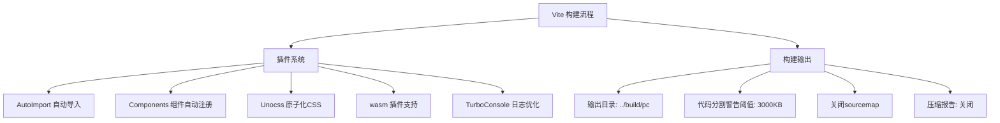
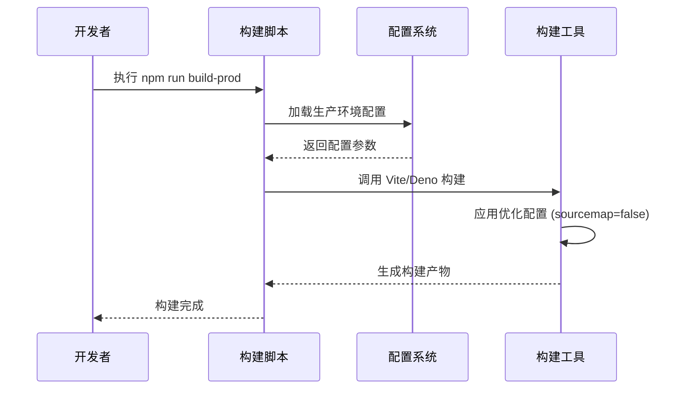

# 部署流程


**本文档引用文件**  
- [ecosystem.config.json](https://github.com/sail-sail/nest/blob/main/deno/ecosystem.config.json)
- [vite.config.mts](https://github.com/sail-sail/nest/blob/main/pc/vite.config.mts)
- [vite.config.mts](https://github.com/sail-sail/nest/blob/main/uni/vite.config.mts)
- [package.json](https://github.com/sail-sail/nest/blob/main/deno/package.json)
- [package.json](https://github.com/sail-sail/nest/blob/main/pc/package.json)


## 目录
1. [项目结构概述](#项目结构概述)
2. [后端服务部署与PM2管理](#后端服务部署与pm2管理)
3. [前端构建与Vite配置优化](#前端构建与vite配置优化)
4. [多环境配置管理](#多环境配置管理)
5. [部署检查清单](#部署检查清单)
6. [回滚机制与故障应急处理](#回滚机制与故障应急处理)
7. [自动化部署脚本使用](#自动化部署脚本使用)

## 项目结构概述

本项目采用模块化架构，主要包含以下核心模块：

- **codegen**：代码生成工具模块，用于自动生成数据库表结构、GraphQL接口等。
- **deno**：后端服务主模块，基于Deno运行时构建，提供REST和GraphQL API服务。
- **pc**：PC端前端应用，基于Vue 3 + Vite构建，使用Element Plus组件库。
- **uni**：移动端前端应用，基于Uni-app框架开发，支持多端发布。

后端服务通过Deno实现，前端分别构建为PC和移动端两个独立应用，整体架构清晰，职责分离明确。

## 后端服务部署与PM2管理

### PM2配置文件分析

后端服务使用PM2进行进程管理，其核心配置文件位于 `deno/ecosystem.config.json`。

```json
{
  "apps": [{
    "name": "nest4{env}",
    "script": "./nest4{env}",
    "instances": 1,
    "autorestart": true,
    "watch": false,
    "env": {},
    "env_production": {}
  }]
}
```

**配置说明：**
- **name**: 应用名称，支持环境变量 `{env}` 占位符，如 `nest4prod`。
- **script**: 启动脚本路径，指向编译后的可执行文件。
- **instances**: 实例数量，当前设置为1（单实例）。
- **autorestart**: 启用自动重启，服务崩溃后自动恢复。
- **watch**: 关闭文件监听，避免开发模式下的热重载影响生产环境。
- **env / env_production**: 环境变量配置，可根据不同环境（开发、测试、生产）定义变量。

### 部署流程

1. **构建后端服务**
   ```bash
   cd deno
   npm run build-prod  # 构建生产环境版本
   ```

2. **启动服务**
   ```bash
   pm2 start ecosystem.config.json --env production
   ```

3. **进程监控**
   - 查看进程状态：`pm2 list`
   - 查看日志：`pm2 logs nest4prod`
   - 监控资源：`pm2 monit`

4. **服务管理**
   - 重启服务：`pm2 restart nest4prod`
   - 停止服务：`pm2 stop nest4prod`
   - 删除服务：`pm2 delete nest4prod`

**Section sources**
- [ecosystem.config.json](https://github.com/sail-sail/nest/blob/main/deno/ecosystem.config.json#L1-L14)
- [package.json](https://github.com/sail-sail/nest/blob/main/deno/package.json#L10-L15)

## 前端构建与Vite配置优化

### PC端Vite配置分析

PC端前端位于 `pc` 目录，其构建配置在 `vite.config.mts` 中。

#### 核心构建配置



**关键配置项：**
- **plugins**: 集成多个优化插件：
  - `AutoImport`: 自动导入常用API（Vue、Element Plus、utils等），减少手动引入。
  - `Components`: 自动注册组件，提升开发效率。
  - `Unocss`: 使用原子化CSS框架，减少CSS体积。
  - `wasm`: 支持WASM模块加载。
  - `TurboConsole`: 优化控制台日志输出。
- **resolve.alias**: 配置路径别名 `@` 指向 `src` 目录，提高代码可读性。
- **build.outDir**: 构建输出目录为 `../build/pc`，集中管理构建产物。
- **build.sourcemap**: 生产环境关闭sourcemap，提升安全性并减小包体积。
- **server.proxy**: 开发环境代理配置，将 `/api` 和 `/graphql` 请求代理到后端服务（`http://localhost:4001`）。

### 移动端Vite配置分析

移动端位于 `uni` 目录，其配置在 `uni/vite.config.mts` 中。

#### 核心差异点

- **base**: 基础路径为 `/uni/`，确保资源正确加载。
- **plugins**: 使用 `@dcloudio/vite-plugin-uni` 作为主插件，支持Uni-app框架。
- **css.preprocessorOptions**: 配置SCSS全局样式引入。
- **proxy**: 除API代理外，还代理 `/img` 路径到PC前端服务（`http://localhost:4000`），实现资源复用。

### 前端构建流程

1. **PC端构建**
   ```bash
   cd pc
   npm run build-prod  # 执行生产构建
   ```
   构建完成后，产物位于 `../build/pc` 目录。

2. **移动端构建**
   ```bash
   cd uni
   npm run build  # 根据Uni-app命令构建H5、App等
   ```

**Section sources**
- [vite.config.mts](https://github.com/sail-sail/nest/blob/main/pc/vite.config.mts#L1-L332)
- [vite.config.mts](https://github.com/sail-sail/nest/blob/main/uni/vite.config.mts#L1-L149)

## 多环境配置管理

项目通过环境变量和脚本命令实现多环境部署。

### 环境区分

- **开发环境 (dev)**: 本地开发，使用热重载和详细日志。
- **测试环境 (test)**: 内部测试，接近生产配置。
- **生产环境 (prod)**: 正式上线，最高性能和安全性。

### 配置实现方式

1. **后端环境**
   - 通过PM2的 `--env` 参数指定环境。
   - `ecosystem.config.json` 中的 `env_production` 对象可定义生产环境变量。
   - 启动脚本 `nest4{env}` 根据 `{env}` 参数加载对应配置。

2. **前端环境**
   - PC端：通过 `--mode test` 参数区分测试环境构建。
   - 移动端：通过 `process.env.UNI_PLATFORM` 区分H5、App等平台。

3. **构建脚本**
   - `deno/package.json` 中定义了 `build-prod` 和 `build-test` 脚本。
   - `pc/package.json` 中同样定义了 `build-prod` 和 `build-test` 脚本。



**Diagram sources**
- [ecosystem.config.json](https://github.com/sail-sail/nest/blob/main/deno/ecosystem.config.json)
- [vite.config.mts](https://github.com/sail-sail/nest/blob/main/pc/vite.config.mts)
- [package.json](https://github.com/sail-sail/nest/blob/main/deno/package.json)
- [package.json](https://github.com/sail-sail/nest/blob/main/pc/package.json)

**Section sources**
- [ecosystem.config.json](https://github.com/sail-sail/nest/blob/main/deno/ecosystem.config.json)
- [vite.config.mts](https://github.com/sail-sail/nest/blob/main/pc/vite.config.mts)
- [package.json](https://github.com/sail-sail/nest/blob/main/deno/package.json#L15-L20)
- [package.json](https://github.com/sail-sail/nest/blob/main/pc/package.json#L10-L15)

## 部署检查清单

为确保每次发布质量，执行以下检查：

| 检查项 | 检查内容 | 负责人 |
|--------|---------|--------|
| **代码检查** | 是否通过 `npm run typecheck` 和 `npm run lint` | 开发 |
| **构建检查** | 构建是否成功，无警告或错误 | 开发 |
| **后端检查** | PM2进程是否正常运行，日志无异常 | 运维 |
| **前端检查** | 静态资源是否正确部署，页面可访问 | 测试 |
| **接口检查** | GraphQL和REST API是否正常响应 | 测试 |
| **功能检查** | 核心业务流程是否正常 | 测试 |
| **性能检查** | 页面加载速度、接口响应时间是否达标 | 运维 |
| **安全检查** | 无敏感信息泄露，权限控制正常 | 安全 |

## 回滚机制与故障应急处理

### 回滚策略

1. **后端服务回滚**
   - 保留上一个版本的 `nest4{env}` 可执行文件。
   - 执行 `pm2 delete nest4prod` 删除当前服务。
   - 将备份的旧版本文件复制到运行目录。
   - 执行 `pm2 start ecosystem.config.json --env production` 重启旧版本。

2. **前端资源回滚**
   - 构建产物集中存放在 `../build` 目录。
   - 通过文件系统快照或备份，快速恢复到上一个版本的静态文件。

### 故障应急处理

- **服务崩溃**: PM2会自动重启。若持续崩溃，立即回滚并排查日志。
- **数据库异常**: 检查数据库连接，确认后端配置正确。
- **前端白屏**: 检查Nginx/Apache等Web服务器配置，确认静态资源路径正确。
- **接口500错误**: 查看后端日志，定位具体错误代码。

## 自动化部署脚本使用

项目提供了一系列自动化脚本，位于各模块的 `package.json` 的 `scripts` 字段中。

### 核心脚本命令

**后端 (deno/package.json):**
- `npm run build-prod`: 构建生产环境后端。
- `npm run build-test`: 构建测试环境后端。
- `npm run publish`: 发布构建产物（需配置）。

**前端 (pc/package.json):**
- `npm run build-prod`: 构建生产环境PC前端。
- `npm run build-test`: 构建测试环境PC前端。
- `npm run permit`: 执行权限扫描脚本。
- `npm run postinstall`: 安装后自动执行脚本。

### 使用方法

1. **一键部署生产环境**
   ```bash
   # 构建后端
   cd deno && npm run build-prod
   # 构建前端
   cd ../pc && npm run build-prod
   # 启动服务
   pm2 start ecosystem.config.json --env production
   ```

2. **结合CI/CD**
   可将上述脚本集成到Jenkins、GitLab CI等持续集成系统中，实现自动化部署。

**Section sources**
- [package.json](https://github.com/sail-sail/nest/blob/main/deno/package.json#L10-L25)
- [package.json](https://github.com/sail-sail/nest/blob/main/pc/package.json#L10-L25)