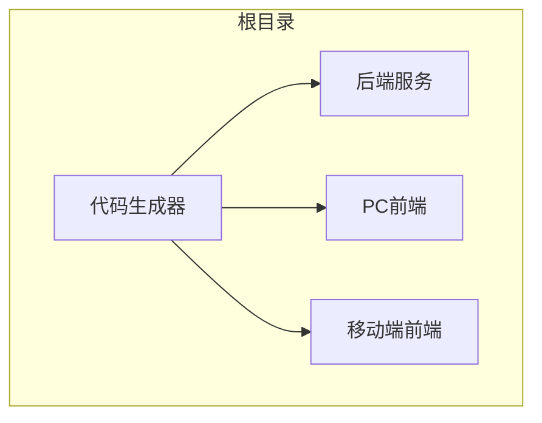
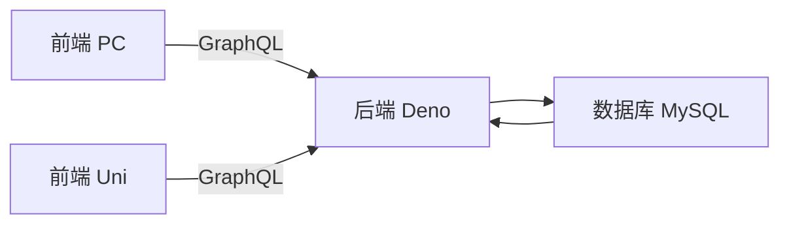
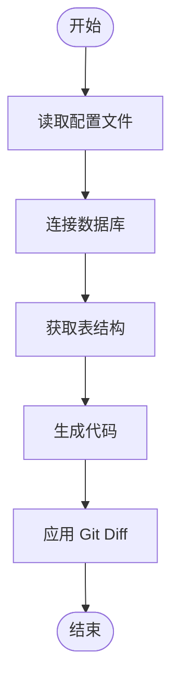
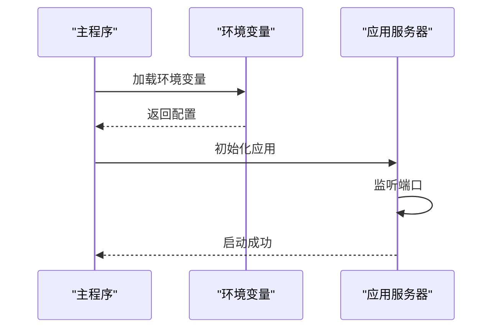
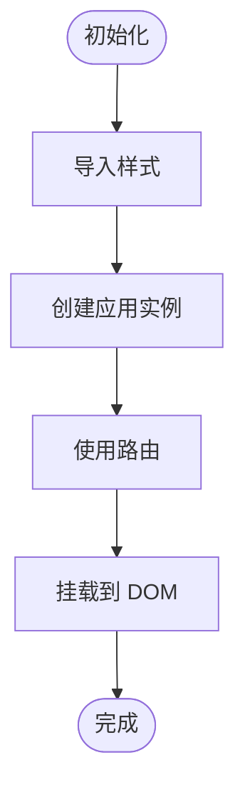
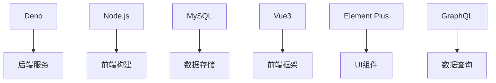

# 快速入门

**本文档中引用的文件**   
- [README.md](https://github.com/sail-sail/nest/blob/main/README.md)
- [codegen.ts](https://github.com/sail-sail/nest/blob/main/codegen/src/bin/codegen.ts)
- [config.ts](https://github.com/sail-sail/nest/blob/main/codegen/src/config.ts)
- [tables.ts](https://github.com/sail-sail/nest/blob/main/codegen/src/tables/tables.ts)
- [base.sql](https://github.com/sail-sail/nest/blob/main/codegen/src/tables/base/base.sql)
- [mod.ts](https://github.com/sail-sail/nest/blob/main/deno/mod.ts)
- [env.ts](https://github.com/sail-sail/nest/blob/main/deno/lib/env.ts)
- [main.ts](https://github.com/sail-sail/nest/blob/main/pc/src/main.ts)

## 目录
1. [简介](#简介)
2. [项目结构](#项目结构)
3. [核心组件](#核心组件)
4. [架构概述](#架构概述)
5. [详细组件分析](#详细组件分析)
6. [依赖分析](#依赖分析)
7. [性能考虑](#性能考虑)
8. [故障排除指南](#故障排除指南)
9. [结论](#结论)

## 简介
本指南旨在为新用户提供一个从零开始使用基于 Nest 架构的项目的完整路径。该项目采用 Deno 和 Node.js 技术栈，结合代码生成器（codegen）实现高效开发。通过本指南，用户将学习如何准备开发环境、配置数据库、运行代码生成命令，并启动前后端服务。此外，还将演示如何定义表结构、生成全栈代码以及在前端进行数据的增删改查操作。

## 项目结构
项目包含多个主要目录：`codegen` 用于代码生成，`deno` 是后端服务，`pc` 和 `uni` 分别是 PC 端和移动端的前端应用。每个目录都有其特定的功能和配置文件。

**图表来源**
- [README.md](https://github.com/sail-sail/nest/blob/main/README.md#L1-L31)

## 核心组件
核心组件包括代码生成器、后端服务和前端应用。代码生成器根据数据库表结构自动生成前后端代码，确保一致性并提高开发效率。

**章节来源**
- [codegen.ts](https://github.com/sail-sail/nest/blob/main/codegen/src/bin/codegen.ts#L1-L124)
- [config.ts](https://github.com/sail-sail/nest/blob/main/codegen/src/config.ts#L1-L799)

## 架构概述
系统采用前后端分离架构，前端使用 Vue3 和 Element Plus，后端基于 Deno 和 MySQL，通过 GraphQL 进行数据交互。代码生成器负责生成大部分 CRUD 代码，减少手动编码工作量。

**图表来源**
- [README.md](https://github.com/sail-sail/nest/blob/main/README.md#L1-L31)
- [mod.ts](https://github.com/sail-sail/nest/blob/main/deno/mod.ts#L1-L47)

## 详细组件分析

### 代码生成器分析
代码生成器通过读取数据库表结构，结合配置文件生成相应的前后端代码。它支持增量更新，避免覆盖手动修改的代码。

#### 代码生成流程

**图表来源**
- [codegen.ts](https://github.com/sail-sail/nest/blob/main/codegen/src/bin/codegen.ts#L1-L124)

### 后端服务分析
后端服务基于 Deno 实现，使用 Oak 框架处理 HTTP 请求，通过 GraphQL 提供 API 接口。

#### 服务启动流程

**图表来源**
- [mod.ts](https://github.com/sail-sail/nest/blob/main/deno/mod.ts#L1-L47)
- [env.ts](https://github.com/sail-sail/nest/blob/main/deno/lib/env.ts#L1-L114)

### 前端应用分析
前端应用使用 Vue3 和 Vite 构建，集成 Element Plus 组件库，提供现代化的用户界面。

#### 应用初始化

**图表来源**
- [main.ts](https://github.com/sail-sail/nest/blob/main/pc/src/main.ts#L1-L37)

## 依赖分析
项目依赖主要包括 Deno、Node.js、MySQL、Vue3、Element Plus 和 GraphQL。这些技术共同构成了项目的开发和运行环境。

**图表来源**
- [README.md](https://github.com/sail-sail/nest/blob/main/README.md#L1-L31)

## 性能考虑
为了优化性能，建议使用缓存机制、合理设计数据库索引，并对 GraphQL 查询进行优化。同时，前端应启用代码分割和懒加载以提升加载速度。

## 故障排除指南
常见问题包括端口冲突、数据库连接失败等。解决方法如下：
- **端口冲突**：检查 `server_port` 环境变量，确保端口号未被占用。
- **数据库连接失败**：确认 `.env` 文件中的数据库连接信息正确无误。

**章节来源**
- [env.ts](https://github.com/sail-sail/nest/blob/main/deno/lib/env.ts#L1-L114)

## 结论
本指南提供了从环境准备到项目启动的完整流程，帮助开发者快速上手。通过代码生成器的辅助，可以显著提升开发效率，实现快速迭代。后续可深入学习各模块的具体实现细节，进一步优化项目性能。