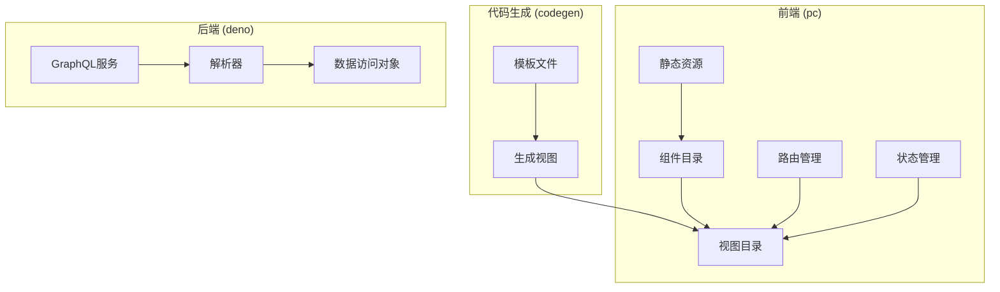
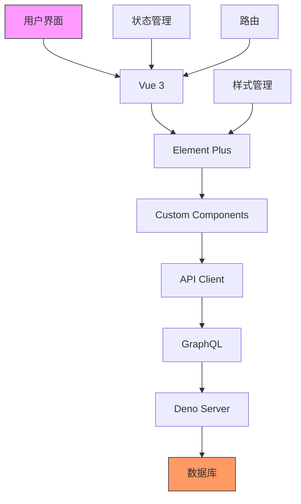
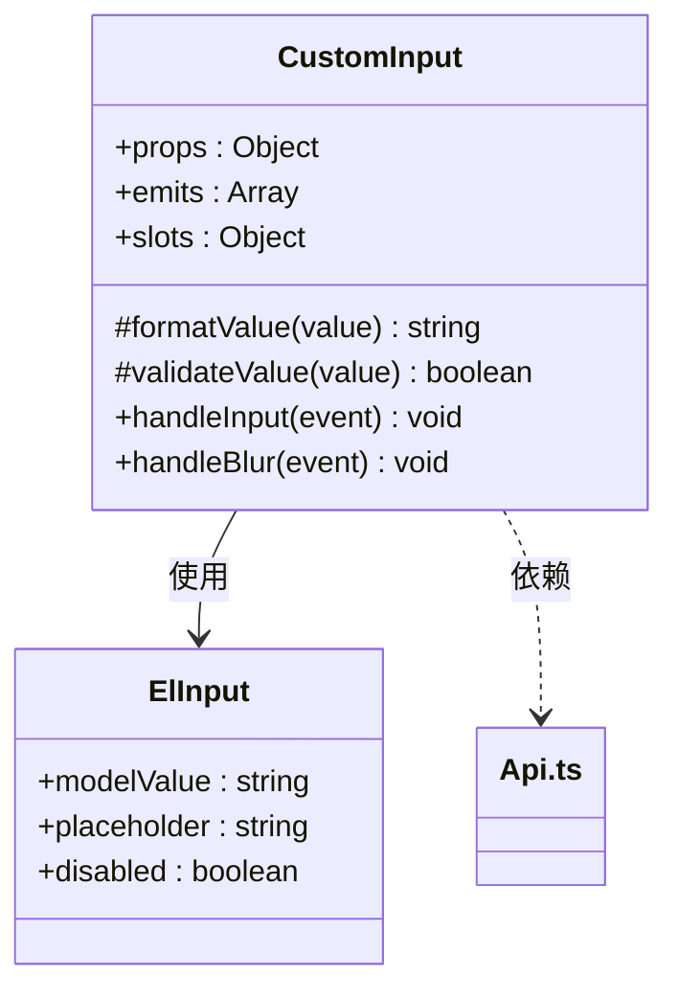
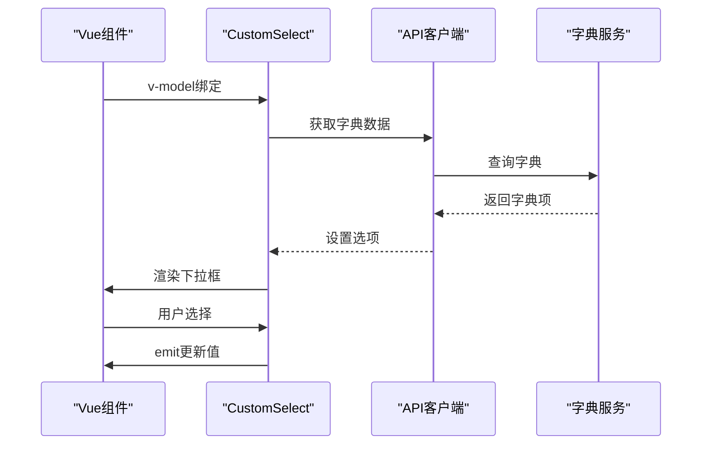
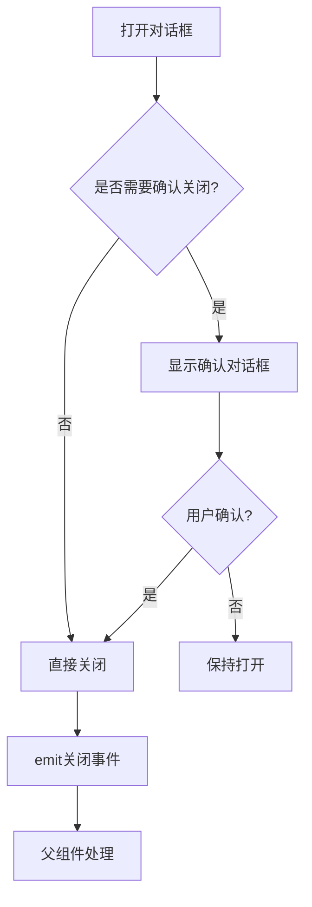
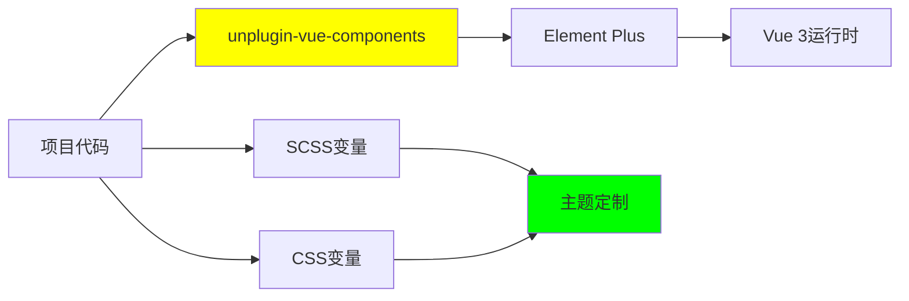

# Element Plus组件库

**本文档引用文件**  
- [CustomInput.vue](https://github.com/sail-sail/nest/blob/main/pc/src/components/CustomInput.vue)
- [CustomSelect.vue](https://github.com/sail-sail/nest/blob/main/pc/src/components/CustomSelect.vue)
- [CustomDialog.vue](https://github.com/sail-sail/nest/blob/main/pc/src/components/CustomDialog.vue)
- [common.scss](https://github.com/sail-sail/nest/blob/main/pc/src/assets/style/common.scss)
- [Api.ts](https://github.com/sail-sail/nest/blob/main/pc/src/components/Api.ts)
- [List.vue](https://github.com/sail-sail/nest/blob/main/codegen/__out__/pc/src/views/base/dept/List.vue)
- [Detail.vue](https://github.com/sail-sail/nest/blob/main/codegen/__out__/pc/src/views/base/dept/Detail.vue)
- [TableShowColumns.vue](https://github.com/sail-sail/nest/blob/main/pc/src/components/TableShowColumns.vue)
- [TableSearchStaging.vue](https://github.com/sail-sail/nest/blob/main/pc/src/components/TableSearchStaging.vue)
- [MessageBox.ts](https://github.com/sail-sail/nest/blob/main/pc/src/components/MessageBox.ts)
- [unplugin-vue-components](https://github.com/antfu/unplugin-vue-components)（外部依赖）

## 目录
1. [简介](#简介)
2. [项目结构](#项目结构)
3. [核心组件](#核心组件)
4. [架构概览](#架构概览)
5. [详细组件分析](#详细组件分析)
6. [依赖分析](#依赖分析)
7. [性能优化建议](#性能优化建议)
8. [故障排除指南](#故障排除指南)
9. [结论](#结论)

## 简介
本文档旨在全面介绍在Nest.js项目中集成和扩展Element Plus组件库的实践方法。文档详细阐述了按需加载机制、主题定制方案、基础组件封装模式、表单验证机制以及复杂组件的高级用法。通过具体示例展示CustomInput、CustomSelect、CustomDialog等自定义组件的实现原理，并说明如何与项目API客户端集成，为开发者提供完整的组件库使用指南。

## 项目结构
项目采用模块化分层结构，前端代码主要位于`pc`目录下，包含组件、视图、路由和状态管理等模块。`codegen`目录用于代码生成，`deno`目录包含后端服务逻辑。组件库的自定义封装集中在`pc/src/components`目录，样式统一管理在`pc/src/assets/style`目录。

**图示来源**
- [CustomInput.vue](https://github.com/sail-sail/nest/blob/main/pc/src/components/CustomInput.vue)
- [List.vue](https://github.com/sail-sail/nest/blob/main/codegen/__out__/pc/src/views/base/dept/List.vue)

**本节来源**
- [CustomInput.vue](https://github.com/sail-sail/nest/blob/main/pc/src/components/CustomInput.vue)
- [List.vue](https://github.com/sail-sail/nest/blob/main/codegen/__out__/pc/src/views/base/dept/List.vue)

## 核心组件
项目中的核心组件包括CustomInput、CustomSelect、CustomDialog等，这些组件基于Element Plus进行二次封装，增加了项目特定的功能和样式。组件通过props接收配置，通过事件与父组件通信，并利用插槽实现内容定制。

**本节来源**
- [CustomInput.vue](https://github.com/sail-sail/nest/blob/main/pc/src/components/CustomInput.vue)
- [CustomSelect.vue](https://github.com/sail-sail/nest/blob/main/pc/src/components/CustomSelect.vue)
- [CustomDialog.vue](https://github.com/sail-sail/nest/blob/main/pc/src/components/CustomDialog.vue)

## 架构概览
系统采用前后端分离架构，前端使用Vue 3和Element Plus构建用户界面，后端使用Deno和GraphQL提供数据服务。组件库通过unplugin-vue-components实现按需自动导入，减少打包体积。状态管理使用Pinia，路由由Vue Router处理。

**图示来源**
- [main.ts](https://github.com/sail-sail/nest/blob/main/pc/src/main.ts)
- [graphql.config.js](https://github.com/sail-sail/nest/blob/main/pc/graphql.config.js)

## 详细组件分析

### CustomInput组件分析
CustomInput组件是对Element Plus的el-input组件的封装，增加了数据类型验证、格式化和项目特定的样式。

**图示来源**
- [CustomInput.vue](https://github.com/sail-sail/nest/blob/main/pc/src/components/CustomInput.vue)
- [Api.ts](https://github.com/sail-sail/nest/blob/main/pc/src/components/Api.ts)

**本节来源**
- [CustomInput.vue](https://github.com/sail-sail/nest/blob/main/pc/src/components/CustomInput.vue)

### CustomSelect组件分析
CustomSelect组件封装了el-select，支持字典数据绑定、异步加载和多级选择。

**图示来源**
- [CustomSelect.vue](https://github.com/sail-sail/nest/blob/main/pc/src/components/CustomSelect.vue)
- [DictSelect.vue](https://github.com/sail-sail/nest/blob/main/pc/src/components/DictSelect.vue)

**本节来源**
- [CustomSelect.vue](https://github.com/sail-sail/nest/blob/main/pc/src/components/CustomSelect.vue)

### CustomDialog组件分析
CustomDialog组件提供了统一的对话框样式和交互模式，支持标题定制、按钮配置和关闭确认。

**图示来源**
- [CustomDialog.vue](https://github.com/sail-sail/nest/blob/main/pc/src/components/CustomDialog.vue)
- [MessageBox.ts](https://github.com/sail-sail/nest/blob/main/pc/src/components/MessageBox.ts)

**本节来源**
- [CustomDialog.vue](https://github.com/sail-sail/nest/blob/main/pc/src/components/CustomDialog.vue)

## 依赖分析
项目通过unplugin-vue-components插件实现Element Plus组件的按需自动导入，避免了手动引入的繁琐。样式通过SCSS变量覆盖和CSS变量实现主题定制。

**图示来源**
- [vite.config.ts](https://github.com/sail-sail/nest/blob/main/pc/vite.config.ts)
- [common.scss](https://github.com/sail-sail/nest/blob/main/pc/src/assets/style/common.scss)

**本节来源**
- [common.scss](https://github.com/sail-sail/nest/blob/main/pc/src/assets/style/common.scss)

## 性能优化建议
1. 使用v-if/v-show合理控制组件渲染
2. 对大型列表使用虚拟滚动
3. 避免在循环中使用复杂计算
4. 合理使用keep-alive缓存组件
5. 懒加载非关键组件

## 故障排除指南
- **组件未自动导入**：检查unplugin-vue-components配置
- **样式覆盖失效**：确保SCSS变量在正确位置定义
- **数据绑定异常**：检查v-model的使用和prop传递
- **事件未触发**：确认事件名称拼写和emit调用

**本节来源**
- [CustomInput.vue](https://github.com/sail-sail/nest/blob/main/pc/src/components/CustomInput.vue)
- [CustomSelect.vue](https://github.com/sail-sail/nest/blob/main/pc/src/components/CustomSelect.vue)

## 结论
Element Plus组件库在本项目中得到了有效集成和扩展，通过合理的封装模式和自动化工具，提高了开发效率和代码质量。建议持续优化组件性能，完善文档和示例，为团队开发提供更好的支持。