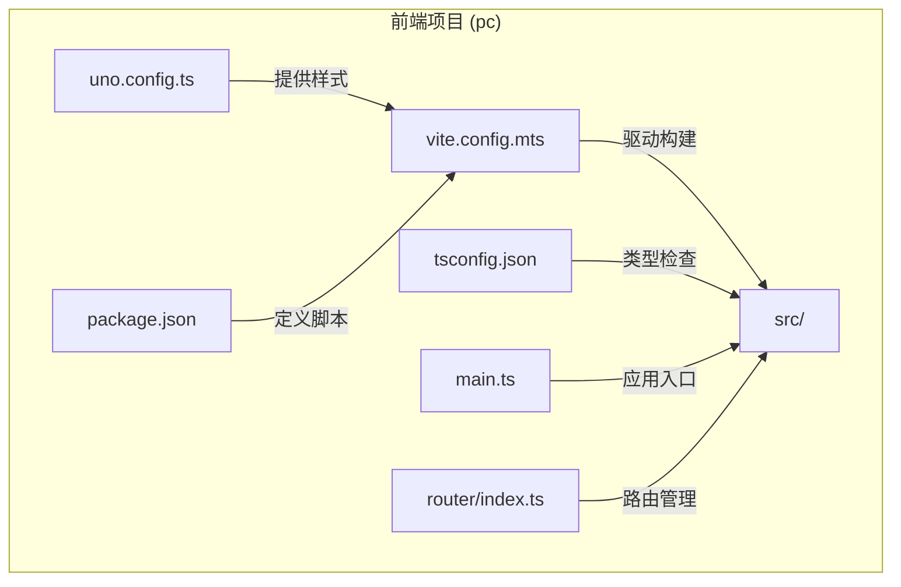
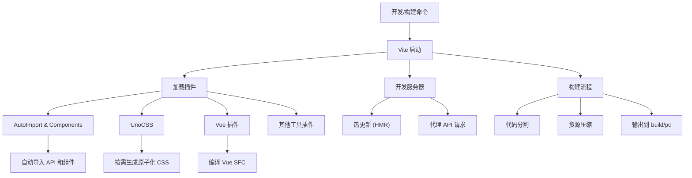
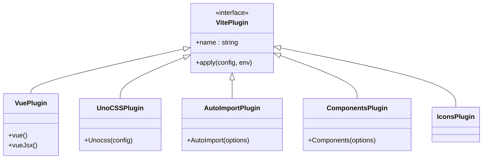
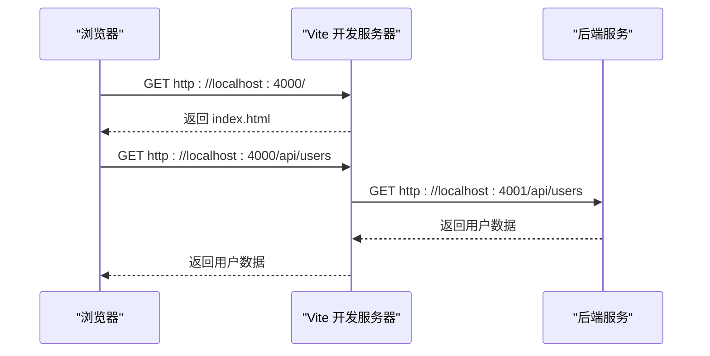
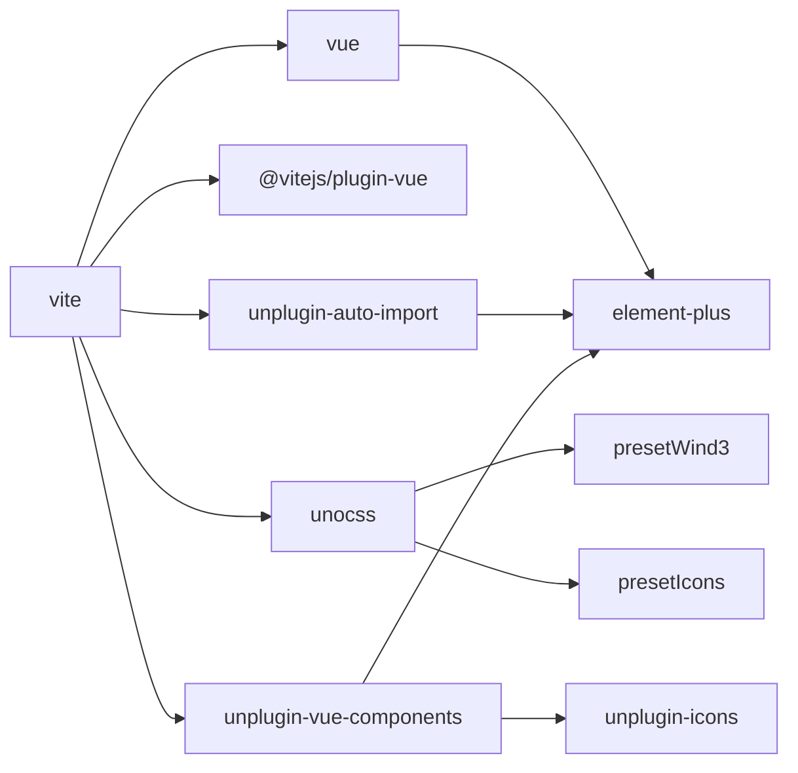

# Vite构建工具


**本文档引用文件**   
- [vite.config.mts](https://github.com/sail-sail/nest/blob/main/pc/vite.config.mts#L1-L332)
- [uno.config.ts](https://github.com/sail-sail/nest/blob/main/pc/uno.config.ts#L1-L38)
- [tsconfig.json](https://github.com/sail-sail/nest/blob/main/pc/tsconfig.json#L1-L48)
- [package.json](https://github.com/sail-sail/nest/blob/main/pc/package.json#L1-L103)
- [main.ts](https://github.com/sail-sail/nest/blob/main/pc/src/main.ts#L1-L38)
- [index.ts](https://github.com/sail-sail/nest/blob/main/pc/src/router/index.ts#L1-L61)
- [.npmrc](https://github.com/sail-sail/nest/blob/main/pc/.npmrc#L1-L4)


## 目录
1. [简介](#简介)
2. [项目结构](#项目结构)
3. [核心组件](#核心组件)
4. [架构概览](#架构概览)
5. [详细组件分析](#详细组件分析)
6. [依赖分析](#依赖分析)
7. [性能考量](#性能考量)
8. [故障排除指南](#故障排除指南)
9. [结论](#结论)

## 简介
本文档全面解析基于 Nest 架构的 `pc` 子项目中 Vite 构建工具的配置与使用。重点涵盖 `vite.config.mts` 中的核心配置项，包括路径别名、插件系统集成、开发服务器代理、构建输出等。同时阐述 Vite 与 TypeScript、UnoCSS、ESLint 的协同工作机制，并提供实际代码示例和优化建议。

## 项目结构
`pc` 目录是前端应用的核心，采用 Vue 3 + Vite 技术栈。其主要结构如下：
- `src/`: 源代码目录，包含组件、路由、状态管理等。
- `vite.config.mts`: Vite 主配置文件。
- `uno.config.ts`: UnoCSS 原子化 CSS 框架的配置文件。
- `tsconfig.json`: TypeScript 编译配置。
- `package.json`: 项目依赖和脚本定义。



**Diagram sources**
- [vite.config.mts](https://github.com/sail-sail/nest/blob/main/pc/vite.config.mts#L1-L332)
- [uno.config.ts](https://github.com/sail-sail/nest/blob/main/pc/uno.config.ts#L1-L38)
- [tsconfig.json](https://github.com/sail-sail/nest/blob/main/pc/tsconfig.json#L1-L48)
- [package.json](https://github.com/sail-sail/nest/blob/main/pc/package.json#L1-L103)
- [main.ts](https://github.com/sail-sail/nest/blob/main/pc/src/main.ts#L1-L38)
- [index.ts](https://github.com/sail-sail/nest/blob/main/pc/src/router/index.ts#L1-L61)

**Section sources**
- [vite.config.mts](https://github.com/sail-sail/nest/blob/main/pc/vite.config.mts#L1-L332)
- [package.json](https://github.com/sail-sail/nest/blob/main/pc/package.json#L1-L103)

## 核心组件
Vite 构建的核心在于其配置文件 `vite.config.mts`，它集成了多个关键插件来提升开发效率和构建质量。

**Section sources**
- [vite.config.mts](https://github.com/sail-sail/nest/blob/main/pc/vite.config.mts#L1-L332)

## 架构概览
整个前端构建流程由 Vite 驱动，通过插件链实现自动化。开发时，Vite 提供高速的热更新服务器；构建时，通过 UnoCSS 生成原子化 CSS，并由 Vite 输出优化后的静态资源。



**Diagram sources**
- [vite.config.mts](https://github.com/sail-sail/nest/blob/main/pc/vite.config.mts#L1-L332)
- [uno.config.ts](https://github.com/sail-sail/nest/blob/main/pc/uno.config.ts#L1-L38)

## 详细组件分析

### Vite 配置分析
`vite.config.mts` 文件定义了 Vite 的所有行为。

#### resolve.alias 路径别名
通过 `resolve.alias` 设置了 `@` 和 `#` 别名，分别指向 `src` 和 `src/typings` 目录，简化了模块导入路径。
```typescript
resolve: {
  alias: {
    "@": fileURLToPath(new URL("./src", import.meta.url)),
    "#": fileURLToPath(new URL("./src/typings", import.meta.url)),
  },
}
```
这使得在代码中可以使用 `import App from "@/App.vue"` 而非冗长的相对路径。

**Section sources**
- [vite.config.mts](https://github.com/sail-sail/nest/blob/main/pc/vite.config.mts#L200-L210)

#### 插件系统集成
Vite 通过插件系统扩展功能，`pc` 项目集成了多个关键插件：

- **Vue 插件**: `vue()` 和 `vueJsx()` 用于处理 `.vue` 单文件组件和 JSX 语法。
- **UnoCSS**: `Unocss({ configFile: "./uno.config.ts" })` 集成原子化 CSS 框架，实现样式按需生成。
- **AutoImport**: `unplugin-auto-import/vite` 自动导入常用的 Vue、Element Plus 等 API，无需手动 `import`。
- **Components**: `unplugin-vue-components/vite` 自动注册 Vue 组件，支持 Element Plus 和图标组件。
- **Icons**: `unplugin-icons/vite` 支持从本地文件夹（如 `iconfont/`）加载自定义图标。
- **开发工具**: `vite-plugin-vue-inspector` 提供运行时组件检查，`vite-plugin-devtools-json` 增强开发工具体验。



**Diagram sources**
- [vite.config.mts](https://github.com/sail-sail/nest/blob/main/pc/vite.config.mts#L10-L100)

**Section sources**
- [vite.config.mts](https://github.com/sail-sail/nest/blob/main/pc/vite.config.mts#L10-L100)

#### 开发服务器配置
`server` 配置项定义了开发服务器的行为：
- `port: 4000`: 指定服务端口。
- `host: "0.0.0.0"`: 允许外部网络访问。
- `proxy`: 配置了 `/api` 和 `/graphql` 的代理，将请求转发到后端服务 `http://localhost:4001`，解决了开发时的跨域问题。



**Diagram sources**
- [vite.config.mts](https://github.com/sail-sail/nest/blob/main/pc/vite.config.mts#L290-L320)

**Section sources**
- [vite.config.mts](https://github.com/sail-sail/nest/blob/main/pc/vite.config.mts#L290-L320)

#### 构建配置
`build` 配置项控制生产环境的构建输出：
- `outDir: "../build/pc"`: 指定构建产物的输出目录。
- `chunkSizeWarningLimit: 3000`: 将代码分割警告阈值提高到 3MB，避免大型包的警告。
- `sourcemap: false`: 关闭 sourcemap 以减小生产包体积。

**Section sources**
- [vite.config.mts](https://github.com/sail-sail/nest/blob/main/pc/vite.config.mts#L270-L280)

### UnoCSS 配置分析
`uno.config.ts` 是 UnoCSS 的配置文件，定义了样式生成规则。

#### 预设 (Presets)
- `presetWind3()`: 使用类似 Tailwind CSS 的实用优先类名。
- `presetRemToPx()`: 将 `rem` 单位转换为 `px`。
- `presetIcons()`: 支持图标类名，从 `src/assets/iconfont/` 目录异步加载 SVG 图标。
- `presetAttributify()`: 支持属性化语法，如 `bg="blue-500"`。

#### 转换器 (Transformers)
- `transformerCompileClass()`: 编译 `class="..."` 中的 UnoCSS 类。
- `transformerVariantGroup()`: 支持变体分组，如 `hover:(bg-blue-500 text-white)`。
- `transformerAttributifyJsx()`: 在 JSX/TSX 中支持属性化语法。

此配置实现了高度灵活和按需的 CSS 生成，极大提升了样式开发效率。

**Section sources**
- [uno.config.ts](https://github.com/sail-sail/nest/blob/main/pc/uno.config.ts#L1-L38)

### TypeScript 集成
`tsconfig.json` 文件确保了 Vite 与 TypeScript 的无缝集成。

#### 关键配置
- `allowImportingTsExtensions`: 允许导入 `.ts` 文件扩展名。
- `jsx: "preserve"` 和 `jsxImportSource: "vue"`: 配置 JSX 支持 Vue 3。
- `types`: 包含 `vite/client` 以支持 Vite 的全局类型（如 `import.meta.env`）。
- `paths`: 定义了与 Vite `alias` 一致的路径映射 `@/*` 和 `#/*`。

这种配置保证了类型检查的准确性，并与 Vite 的路径别名保持同步。

**Section sources**
- [tsconfig.json](https://github.com/sail-sail/nest/blob/main/pc/tsconfig.json#L1-L48)

## 依赖分析
项目的依赖关系清晰，分为生产依赖和开发依赖。



**Diagram sources**
- [package.json](https://github.com/sail-sail/nest/blob/main/pc/package.json#L1-L103)
- [vite.config.mts](https://github.com/sail-sail/nest/blob/main/pc/vite.config.mts#L1-L332)

**Section sources**
- [package.json](https://github.com/sail-sail/nest/blob/main/pc/package.json#L1-L103)

## 性能考量
- **依赖预构建**: `optimizeDeps.exclude` 排除了 `@jsquash/webp` 等大型 WASM 依赖，避免 Vite 在启动时进行耗时的预构建。
- **构建优化**: 通过 `build.chunkSizeWarningLimit` 调整警告阈值，关注真正需要优化的代码块。
- **内存管理**: `.npmrc` 文件中设置了 `node-options=--max-old-space-size=4096`，为 Node.js 进程分配了 4GB 内存，防止大型项目构建时出现内存溢出。
- **代码压缩**: Vite 默认使用 `esbuild` 进行生产构建，提供快速的代码压缩和混淆。

## 故障排除指南
- **HMR 失效**: 检查 `vite.config.mts` 中的 `server` 配置，确保 `hmr` 未被禁用。重启 Vite 服务器。
- **路径别名不生效**: 确保 `vite.config.mts` 的 `resolve.alias` 和 `tsconfig.json` 的 `paths` 配置一致。重启开发服务器和 TypeScript 语言服务。
- **UnoCSS 类名不生效**: 检查 `uno.config.ts` 是否正确加载，确认类名拼写正确。检查 `main.ts` 是否引入了 `uno.css`。
- **代理不工作**: 检查 `server.proxy` 配置的 `target` 地址是否正确，确认后端服务已启动。查看浏览器开发者工具的网络请求。
- **构建内存溢出**: 增加 `.npmrc` 中的 `max-old-space-size` 值，或在构建命令前设置环境变量 `NODE_OPTIONS=--max-old-space-size=8192`。

**Section sources**
- [vite.config.mts](https://github.com/sail-sail/nest/blob/main/pc/vite.config.mts#L1-L332)
- [.npmrc](https://github.com/sail-sail/nest/blob/main/pc/.npmrc#L1-L4)

## 结论
`pc` 项目的 Vite 配置是一个现代化、高性能的前端构建方案。它通过集成 UnoCSS 实现了极致的样式开发效率，利用 AutoImport 和 Components 插件消除了繁琐的导入语句，并通过完善的代理和路径别名配置提升了开发体验。该配置结构清晰，易于维护，为项目的稳定开发和高效构建提供了坚实的基础。