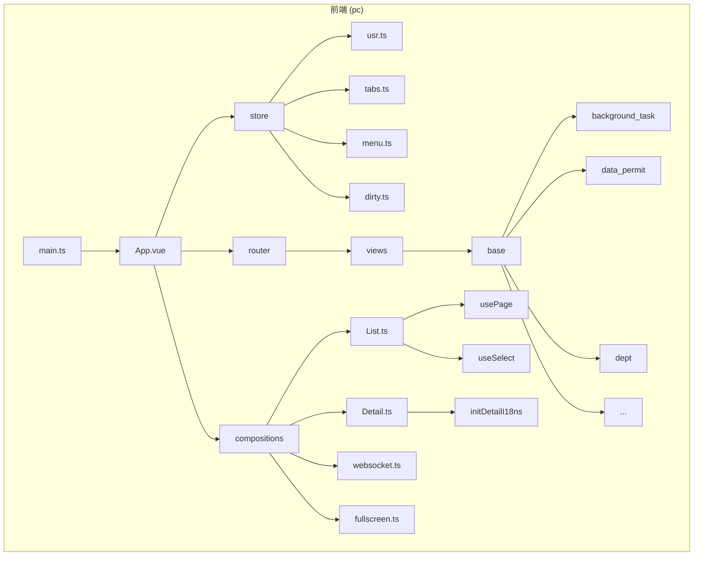
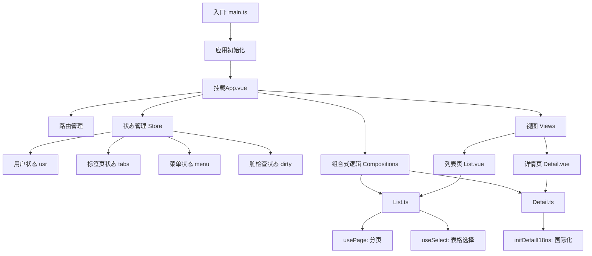
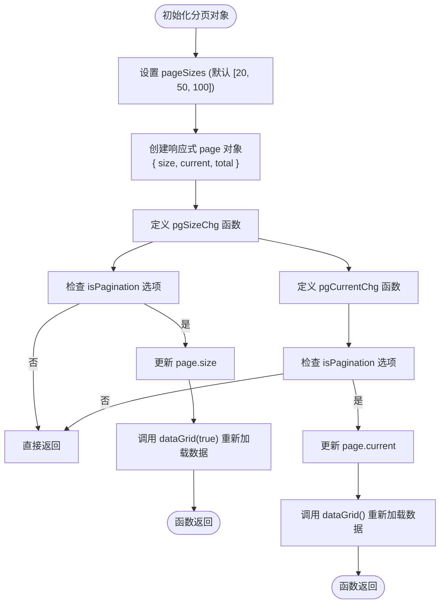
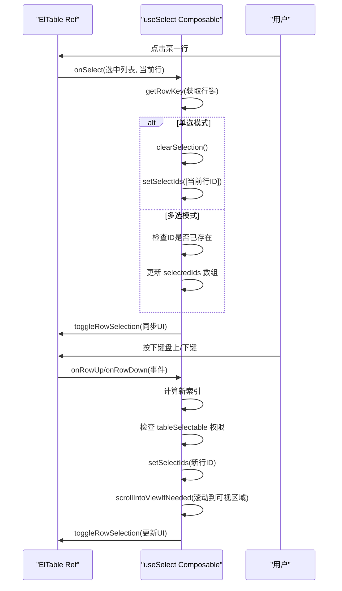
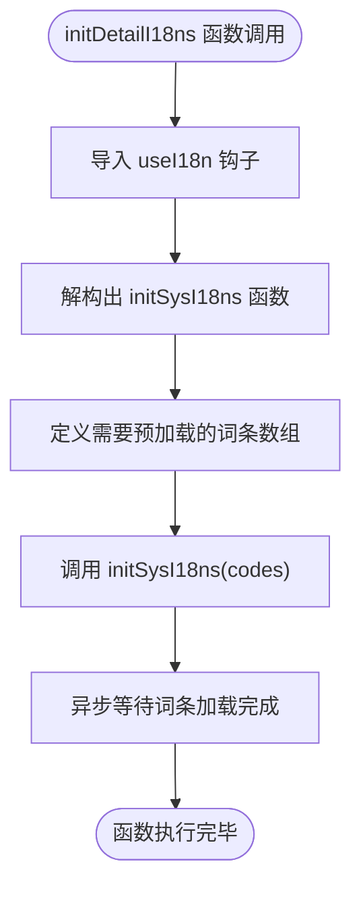
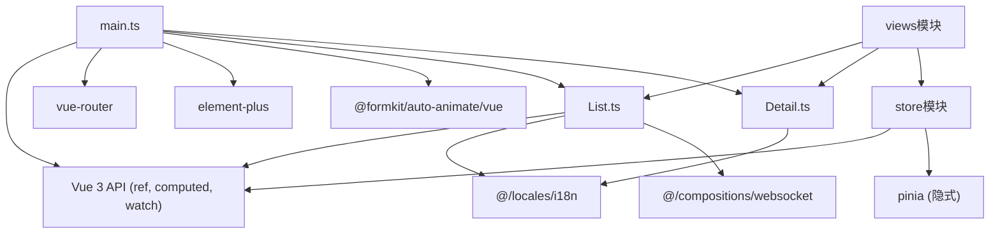

# Vue 3组合式API

**本文档中引用的文件**   
- [List.ts](https://github.com/sail-sail/nest/blob/main/pc/src/compositions/List.ts)
- [Detail.ts](https://github.com/sail-sail/nest/blob/main/pc/src/compositions/Detail.ts)
- [main.ts](https://github.com/sail-sail/nest/blob/main/pc/src/main.ts)
- [dirty.ts](https://github.com/sail-sail/nest/blob/main/pc/src/store/dirty.ts)
- [usr.ts](https://github.com/sail-sail/nest/blob/main/pc/src/store/usr.ts)
- [tabs.ts](https://github.com/sail-sail/nest/blob/main/pc/src/store/tabs.ts)
- [menu.ts](https://github.com/sail-sail/nest/blob/main/pc/src/store/menu.ts)
- [KFrame.vue](https://github.com/sail-sail/nest/blob/main/pc/src/components/KFrame/KFrame.vue)
- [index.ts](https://github.com/sail-sail/nest/blob/main/pc/src/store/index.ts)

## 目录
1. [简介](#简介)
2. [项目结构](#项目结构)
3. [核心组件](#核心组件)
4. [架构概述](#架构概述)
5. [详细组件分析](#详细组件分析)
6. [依赖分析](#依赖分析)
7. [性能考虑](#性能考虑)
8. [故障排除指南](#故障排除指南)
9. [结论](#结论)

## 简介
本文档深入分析了基于Vue 3组合式API的前端项目实现，重点探讨了在`nest`项目中如何利用组合式API构建可复用、可维护的前端功能模块。文档详细解析了`List`和`Detail`两个核心组合函数的设计模式与实现原理，阐述了响应式系统、生命周期钩子、自定义组合函数等关键概念在实际项目中的应用。通过具体代码示例，展示了数据流管理、状态管理、跨组件通信等核心功能的实现方式，并提供了性能优化建议。

## 项目结构
该项目采用模块化设计，前端部分主要位于`pc`目录下，使用Vue 3 + TypeScript + Vite技术栈。核心的组合式API逻辑被封装在`compositions`目录中，实现了高度的代码复用。`store`目录使用组合式API定义了多个状态管理模块，`views`目录下的各个业务模块通过导入这些组合函数来快速构建列表页和详情页。

**图示来源**
- [main.ts](https://github.com/sail-sail/nest/blob/main/pc/src/main.ts)
- [List.ts](https://github.com/sail-sail/nest/blob/main/pc/src/compositions/List.ts)
- [Detail.ts](https://github.com/sail-sail/nest/blob/main/pc/src/compositions/Detail.ts)
- [store目录](https://github.com/sail-sail/nest/blob/main/pc/src/store/)

**本节来源**
- [main.ts](https://github.com/sail-sail/nest/blob/main/pc/src/main.ts)
- [项目结构](https://github.com/sail-sail/nest/blob/main/)

## 核心组件
本项目的核心在于其精心设计的组合式API，特别是`List.ts`和`Detail.ts`文件中定义的可复用逻辑。这些组合函数将通用的业务逻辑（如分页、选择、国际化初始化）从具体的UI组件中抽离出来，实现了逻辑与视图的分离，极大地提高了代码的可维护性和开发效率。

**本节来源**
- [List.ts](https://github.com/sail-sail/nest/blob/main/pc/src/compositions/List.ts)
- [Detail.ts](https://github.com/sail-sail/nest/blob/main/pc/src/compositions/Detail.ts)

## 架构概述
整个前端应用的架构围绕Vue 3的组合式API构建。`main.ts`是应用的入口，负责初始化Vue实例、路由和全局指令。`store`目录下的模块使用组合式API创建，通过`provide/inject`或直接导入的方式在组件间共享状态。`compositions`目录是逻辑复用的核心，`List`和`Detail`组合函数被`views`下的所有业务模块所使用，确保了功能的一致性。

**图示来源**
- [main.ts](https://github.com/sail-sail/nest/blob/main/pc/src/main.ts)
- [List.ts](https://github.com/sail-sail/nest/blob/main/pc/src/compositions/List.ts)
- [Detail.ts](https://github.com/sail-sail/nest/blob/main/pc/src/compositions/Detail.ts)
- [store模块](https://github.com/sail-sail/nest/blob/main/pc/src/store/)

## 详细组件分析
本节将深入分析`List.ts`和`Detail.ts`中的关键函数，揭示其内部实现机制和最佳实践。

### List组合函数分析
`List.ts`文件提供了处理列表页通用逻辑的组合函数，是项目中复用度最高的模块之一。

#### usePage分页功能
`usePage`函数封装了分页逻辑，是响应式系统和生命周期钩子的典型应用。

**图示来源**
- [List.ts](https://github.com/sail-sail/nest/blob/main/pc/src/compositions/List.ts#L100-L200)

**本节来源**
- [List.ts](https://github.com/sail-sail/nest/blob/main/pc/src/compositions/List.ts#L80-L250)

#### useSelect表格选择功能
`useSelect`函数实现了复杂的表格行选择逻辑，包括鼠标点击、键盘导航和多选控制。

**图示来源**
- [List.ts](https://github.com/sail-sail/nest/blob/main/pc/src/compositions/List.ts#L200-L700)

**本节来源**
- [List.ts](https://github.com/sail-sail/nest/blob/main/pc/src/compositions/List.ts#L200-L800)

### Detail组合函数分析
`Detail.ts`文件相对简单，专注于详情页的初始化逻辑。

#### initDetailI18ns国际化初始化
`initDetailI18ns`函数负责在详情页加载时预加载所需的国际化词条。

**图示来源**
- [Detail.ts](https://github.com/sail-sail/nest/blob/main/pc/src/compositions/Detail.ts#L1-L22)

**本节来源**
- [Detail.ts](https://github.com/sail-sail/nest/blob/main/pc/src/compositions/Detail.ts#L1-L22)

## 依赖分析
本项目各模块间依赖关系清晰，遵循了低耦合、高内聚的设计原则。

**图示来源**
- [List.ts](https://github.com/sail-sail/nest/blob/main/pc/src/compositions/List.ts)
- [Detail.ts](https://github.com/sail-sail/nest/blob/main/pc/src/compositions/Detail.ts)
- [main.ts](https://github.com/sail-sail/nest/blob/main/pc/src/main.ts)
- [store目录](https://github.com/sail-sail/nest/blob/main/pc/src/store/)

**本节来源**
- [List.ts](https://github.com/sail-sail/nest/blob/main/pc/src/compositions/List.ts)
- [Detail.ts](https://github.com/sail-sail/nest/blob/main/pc/src/compositions/Detail.ts)
- [main.ts](https://github.com/sail-sail/nest/blob/main/pc/src/main.ts)
- [store目录](https://github.com/sail-sail/nest/blob/main/pc/src/store/)

## 性能考虑
1.  **避免不必要的响应式开销**：`useSelect`中使用`$ref`和`$$`宏来优化响应式对象的创建。
2.  **防抖与节流**：虽然代码中未直接体现，但`menu.ts`中的搜索功能使用了`setTimeout`进行防抖，这是处理频繁输入事件的良好实践。
3.  **懒加载与缓存**：`KFrame.vue`组件在`onDeactivated`时隐藏或销毁iframe，在`onActivated`时重新显示或创建，有效管理了资源。
4.  **减少DOM操作**：`useSelect`中的`scrollIntoViewIfNeeded`函数确保选中行始终可见，提升了用户体验。

## 故障排除指南
1.  **列表页数据未更新**：检查`dataGrid`函数是否正确实现了数据获取逻辑，并确保在`pgSizeChg`或`pgCurrentChg`被调用后执行。
2.  **表格选择失效**：确认`tableRef`正确指向了`ElTable`实例，并检查`rowKey`是否在数据中存在。
3.  **国际化词条未加载**：确保`initDetailI18ns`在详情页的`setup`函数中被调用。
4.  **状态管理模块未生效**：检查`store`模块是否在`main.ts`中被正确引入和使用。

**本节来源**
- [List.ts](https://github.com/sail-sail/nest/blob/main/pc/src/compositions/List.ts)
- [Detail.ts](https://github.com/sail-sail/nest/blob/main/pc/src/compositions/Detail.ts)
- [KFrame.vue](https://github.com/sail-sail/nest/blob/main/pc/src/components/KFrame/KFrame.vue)

## 结论
该`nest`项目中的Vue 3组合式API实现展现了现代前端开发的最佳实践。通过将分页、选择、国际化等通用逻辑封装成`List`和`Detail`组合函数，项目实现了高度的代码复用和模块化。结合`store`模块进行状态管理，以及在`main.ts`中进行应用的统一配置，整个前端架构清晰、高效且易于维护。这种设计模式为快速开发功能一致的业务模块提供了坚实的基础。