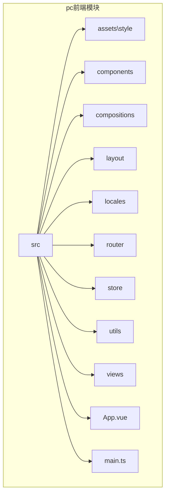
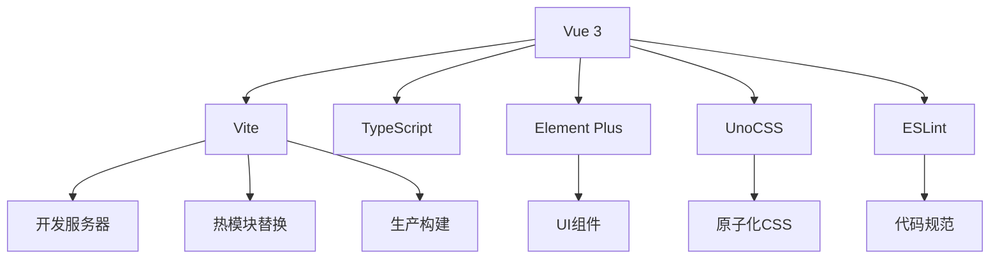

# 前端PC端技术栈


**本文档引用文件**  
- [package.json](https://github.com/sail-sail/nest/blob/main/pc/package.json)
- [tsconfig.json](https://github.com/sail-sail/nest/blob/main/pc/tsconfig.json)
- [uno.config.ts](https://github.com/sail-sail/nest/blob/main/pc/uno.config.ts)
- [eslint.config.mjs](https://github.com/sail-sail/nest/blob/main/pc/eslint.config.mjs)
- [main.ts](https://github.com/sail-sail/nest/blob/main/pc/src/main.ts)
- [App.vue](https://github.com/sail-sail/nest/blob/main/pc/src/App.vue)
- [router/index.ts](https://github.com/sail-sail/nest/blob/main/pc/src/router/index.ts)
- [router/gen.ts](https://github.com/sail-sail/nest/blob/main/pc/src/router/gen.ts)


## 目录
1. [简介](#简介)
2. [项目结构](#项目结构)
3. [核心组件](#核心组件)
4. [架构概览](#架构概览)
5. [详细组件分析](#详细组件分析)
6. [依赖分析](#依赖分析)
7. [性能考量](#性能考量)
8. [学习路径建议](#学习路径建议)
9. [结论](#结论)

## 简介
本技术文档全面解析基于 Vue 3 的前端 PC 端项目技术栈，涵盖 Vue 3 组合式 API、Vite 构建工具、Element Plus 组件库、TypeScript 类型系统、UnoCSS 原子化 CSS 方案以及 ESLint 代码质量管控等核心技术。文档旨在为开发者提供深入的技术理解与实践指导，帮助快速掌握项目开发所需技能。

## 项目结构
项目采用模块化分层架构，主要包含 `codegen`（代码生成）、`deno`（后端服务）、`pc`（PC端前端）和 `uni`（移动端前端）四大模块。其中 `pc` 模块为本次分析重点，其结构清晰，遵循功能划分原则。



**图示来源**
- [main.ts](https://github.com/sail-sail/nest/blob/main/pc/src/main.ts)
- [App.vue](https://github.com/sail-sail/nest/blob/main/pc/src/App.vue)

## 核心组件
项目核心依赖于 Vue 3 的组合式 API 与 Vite 构建工具，结合 Element Plus 提供丰富的 UI 组件，并通过 UnoCSS 实现高效的样式管理。

**本节来源**
- [package.json](https://github.com/sail-sail/nest/blob/main/pc/package.json)
- [main.ts](https://github.com/sail-sail/nest/blob/main/pc/src/main.ts)

## 架构概览
系统采用现代化前端架构，以 Vue 3 为核心框架，Vite 作为开发与构建工具，TypeScript 提供类型安全，Element Plus 构建用户界面，UnoCSS 实现原子化样式，ESLint 保障代码质量。



**图示来源**
- [package.json](https://github.com/sail-sail/nest/blob/main/pc/package.json)
- [tsconfig.json](https://github.com/sail-sail/nest/blob/main/pc/tsconfig.json)
- [uno.config.ts](https://github.com/sail-sail/nest/blob/main/pc/uno.config.ts)
- [eslint.config.mjs](https://github.com/sail-sail/nest/blob/main/pc/eslint.config.mjs)

## 详细组件分析

### Vue 3 组合式 API 分析
Vue 3 的组合式 API 提供了更灵活的逻辑组织方式，通过 `setup` 函数和 `ref`、`reactive` 等响应式 API 实现数据驱动。

```typescript
// 示例：在 main.ts 中创建应用实例
import { createApp } from "vue";
import App from "./App.vue";
const app = createApp(App);
app.mount("#app");
```

#### 响应式系统
Vue 3 使用 `Proxy` 实现响应式，`ref` 用于包装基本类型，`reactive` 用于包装对象。

#### 生命周期钩子
组合式 API 中的生命周期钩子如 `onMounted`、`onUnmounted` 等，需在 `setup` 内调用。

```typescript
// 示例：在 App.vue 中使用 onMounted
import { onMounted } from "vue";
onMounted(() => {
  console.log("组件已挂载");
});
```

#### 自定义组合函数
项目中 `compositions` 目录下的 `Detail.ts` 和 `List.ts` 即为自定义组合函数，用于复用逻辑。

**本节来源**
- [main.ts](https://github.com/sail-sail/nest/blob/main/pc/src/main.ts)
- [App.vue](https://github.com/sail-sail/nest/blob/main/pc/src/App.vue)
- [compositions/Detail.ts](https://github.com/sail-sail/nest/blob/main/pc/src/compositions/Detail.ts)
- [compositions/List.ts](https://github.com/sail-sail/nest/blob/main/pc/src/compositions/List.ts)

### Vite 构建工具分析
Vite 利用浏览器原生 ES 模块导入，提供极快的冷启动和热更新体验。

#### 开发服务器与热模块替换
Vite 的开发服务器基于原生 ESM，无需打包即可启动，HMR 更新速度极快。

#### 构建配置
`vite.config.ts`（未直接提供，但由 `package.json` 脚本推断）配置了构建行为。

```json
// package.json 中的构建脚本
"scripts": {
  "build-prod": "set NODE_OPTIONS=--max-old-space-size=4096 && vite build --emptyOutDir && node src/utils/postbuild.js"
}
```

#### 性能优化
通过 `NODE_OPTIONS` 增加内存限制，确保大型项目构建成功。

**本节来源**
- [package.json](https://github.com/sail-sail/nest/blob/main/pc/package.json)

### Element Plus 组件库分析
Element Plus 是一套为 Vue 3 设计的桌面端组件库，项目中通过全局引入方式使用。

#### 集成方式
在 `main.ts` 中直接导入 CSS 文件。

```typescript
import "element-plus/dist/index.css";
```

#### 按需加载
虽然当前为全局引入，但可通过 `unplugin-vue-components` 插件实现按需加载。

#### 主题定制
引入了 Element Plus 的暗色主题变量。

```typescript
import "element-plus/theme-chalk/dark/css-vars.css";
```

#### 组件扩展
项目封装了大量自定义组件，如 `CustomInput.vue`、`CustomSelect.vue` 等，位于 `components` 目录。

**本节来源**
- [main.ts](https://github.com/sail-sail/nest/blob/main/pc/src/main.ts)
- [components](https://github.com/sail-sail/nest/blob/main/pc/src/components)

### 前端工程化实践分析

#### TypeScript 类型系统
项目使用 TypeScript 提供静态类型检查，`tsconfig.json` 配置了编译选项。

```json
{
  "compilerOptions": {
    "target": "ESNext",
    "module": "ESNext",
    "strict": true,
    "esModuleInterop": true
  }
}
```

#### UnoCSS 原子化 CSS 方案
UnoCSS 是一个原子化 CSS 引擎，提供极高的构建性能和灵活性。

```typescript
// uno.config.ts 配置
import { defineConfig, presetWind3, presetRemToPx } from "unocss";
export default defineConfig({
  presets: [presetWind3(), presetRemToPx()],
});
```

UnoCSS 与 Windi CSS 兼容，支持 `un-*` 前缀的原子类。

#### ESLint 代码质量管控
项目使用 ESLint 进行代码规范检查，配置文件为 `eslint.config.mjs`。

```javascript
// eslint.config.mjs 配置
export default typescriptEslint.config(
  vueMacros,
  {
    extends: [
      eslint.configs.recommended,
      ...typescriptEslint.configs.recommended,
      ...eslintPluginVue.configs["flat/recommended"],
    ],
  }
);
```

规则中禁用了部分 Vue 和 TypeScript 的警告，以适应项目实际需求。

**本节来源**
- [tsconfig.json](https://github.com/sail-sail/nest/blob/main/pc/tsconfig.json)
- [uno.config.ts](https://github.com/sail-sail/nest/blob/main/pc/uno.config.ts)
- [eslint.config.mjs](https://github.com/sail-sail/nest/blob/main/pc/eslint.config.mjs)

### 路由系统分析
项目使用 Vue Router 4 实现路由管理，采用模块化设计。

#### 路由配置
主路由文件 `router/index.ts` 引入了自动生成的路由 `routesGen`。

```typescript
import { routesGen } from "./gen";
const routes: Array<RouteRecordRaw> = [...routesGen, ...];
```

#### 路由生成
`router/gen.ts` 文件包含了所有业务模块的路由定义，如用户、角色、菜单等。

```typescript
export const routesGen: Array<RouteRecordRaw> = [
  {
    path: "/base/usr",
    component: Layout1,
    children: [
      {
        path: "",
        name: "用户",
        component: () => import("@/views/base/usr/List.vue"),
      },
    ],
  },
];
```

所有路由均采用懒加载（`import()`），优化首屏加载性能。

**本节来源**
- [router/index.ts](https://github.com/sail-sail/nest/blob/main/pc/src/router/index.ts)
- [router/gen.ts](https://github.com/sail-sail/nest/blob/main/pc/src/router/gen.ts)

## 依赖分析
项目依赖关系清晰，核心依赖为 Vue 3 生态，包括 Vue、Vue Router、@vueuse/core 等。UI 组件依赖 Element Plus 及其图标库。构建工具依赖 Vite 及其插件。样式依赖 UnoCSS 及其预设。代码质量依赖 ESLint 及其插件。

```mermaid
graph LR
A[Vue 3] --> B[Vue Router]
A --> C[@vueuse/core]
D[Element Plus] --> E[@element-plus/icons-vue]
F[Vite] --> G[@vitejs/plugin-vue]
F --> H[vite-plugin-inspect]
I[UnoCSS] --> J[@unocss/preset-rem-to-px]
K[ESLint] --> L[typescript-eslint]
K --> M[eslint-plugin-vue]
```

**图示来源**
- [package.json](https://github.com/sail-sail/nest/blob/main/pc/package.json)

## 性能考量
项目在性能方面做了多项优化：
1. **构建性能**：使用 Vite，利用原生 ESM 实现快速冷启动。
2. **运行时性能**：Vue 3 的 Composition API 和 Proxy 响应式系统提供高效更新。
3. **包体积**：通过 `pnpm` 的 `onlyBuiltDependencies` 配置，优化依赖构建。
4. **内存管理**：构建脚本中设置 `NODE_OPTIONS=--max-old-space-size=4096` 防止内存溢出。
5. **代码分割**：路由懒加载实现按需加载。

## 学习路径建议
为帮助开发者快速上手，建议按以下路径学习：
1. **基础掌握**：学习 Vue 3 组合式 API、TypeScript 基础语法。
2. **工具熟悉**：掌握 Vite 的配置与使用，了解其工作原理。
3. **UI 组件**：学习 Element Plus 的常用组件及其 API。
4. **样式方案**：掌握 UnoCSS 的原子类命名规则和配置方法。
5. **工程化**：理解 ESLint 配置，掌握代码规范。
6. **项目实践**：阅读 `pc` 模块源码，特别是 `main.ts`、`App.vue` 和 `router` 目录。

## 结论
该项目构建了一个现代化、高性能的前端 PC 端应用，技术栈选型合理，架构清晰。通过 Vue 3 + Vite + Element Plus + UnoCSS + TypeScript 的组合，实现了开发效率与运行性能的平衡。建议未来可进一步探索按需加载、微前端等高级架构模式，持续优化用户体验与开发体验。