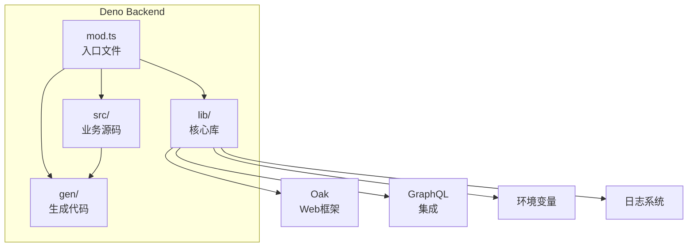
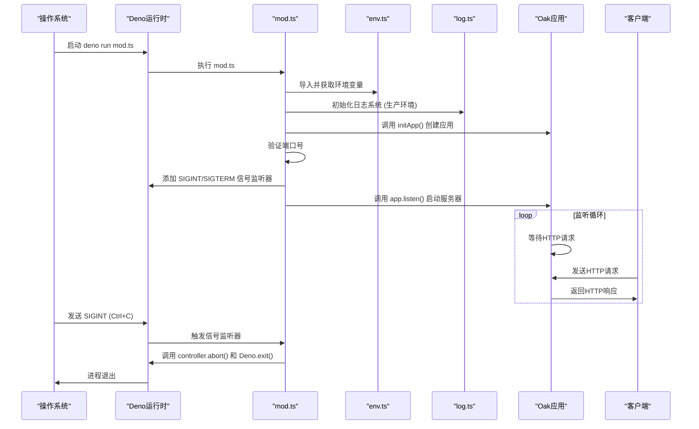
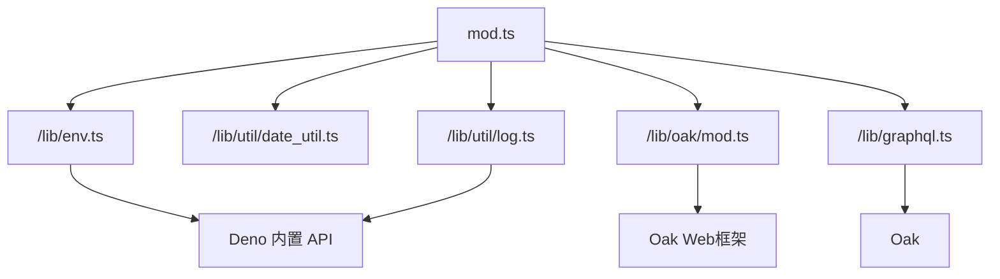

# Deno运行时


**本文档引用文件**  
- [mod.ts](https://github.com/sail-sail/nest/blob/main/deno/mod.ts#L1-L48)
- [env.ts](https://github.com/sail-sail/nest/blob/main/deno/lib/env.ts)
- [oak/mod.ts](https://github.com/sail-sail/nest/blob/main/deno/lib/oak/mod.ts)
- [log.ts](https://github.com/sail-sail/nest/blob/main/deno/lib/util/log.ts)
- [graphql.config.js](https://github.com/sail-sail/nest/blob/main/deno/graphql.config.js)
- [ecosystem.config.json](https://github.com/sail-sail/nest/blob/main/deno/ecosystem.config.json)
- [package.json](https://github.com/sail-sail/nest/blob/main/deno/package.json)


## 目录
1. [简介](#简介)
2. [项目结构](#项目结构)
3. [核心组件](#核心组件)
4. [架构概览](#架构概览)
5. [详细组件分析](#详细组件分析)
6. [依赖分析](#依赖分析)
7. [性能考虑](#性能考虑)
8. [故障排除指南](#故障排除指南)
9. [结论](#结论)

## 简介
本文档深入分析了在 `nest` 项目中使用 **Deno运行时** 的技术实现。Deno 是一个现代的 JavaScript/TypeScript 运行时，具备默认安全隔离、原生 TypeScript 支持、ES 模块系统和现代 JavaScript 特性支持等核心优势。本项目通过 Deno 构建了一个基于 Oak 框架和 GraphQL 的高效后端服务架构。文档将详细阐述 Deno 的配置、启动流程、权限控制、与 Oak 和 GraphQL 的集成方式，并提供实际代码示例和最佳实践。

## 项目结构
项目 `` 包含多个子模块，其中 `deno` 目录是后端服务的核心。该目录遵循模块化设计，主要结构如下：
- `gen/`: 自动生成的 GraphQL 模型和服务代码。
- `lib/`: 核心库，包含环境变量、日志、GraphQL、Oak 集成、S3 客户端等。
- `src/`: 业务逻辑源码，按功能模块组织。
- `mod.ts`: 应用程序的入口文件。
- `package.json`: 依赖管理。
- `ecosystem.config.json`: PM2 进程管理配置。

这种结构清晰地分离了生成代码、核心库和业务逻辑，便于维护和扩展。



**图示来源**
- [mod.ts](https://github.com/sail-sail/nest/blob/main/deno/mod.ts#L1-L48)
- [lib/](https://github.com/sail-sail/nest/blob/main/deno/lib)

## 核心组件
项目的核心组件包括：
- **Deno 运行时**: 提供安全、高效的执行环境。
- **Oak 框架**: 轻量级的 Web 框架，用于处理 HTTP 请求。
- **GraphQL**: 声明式的数据查询语言，提供灵活的 API 接口。
- **环境变量管理 (`env.ts`)**: 统一管理应用配置。
- **日志系统 (`log.ts`)**: 记录应用运行状态。

这些组件共同构成了一个现代化、可维护的后端服务。

**本节来源**
- [mod.ts](https://github.com/sail-sail/nest/blob/main/deno/mod.ts#L1-L48)
- [lib/env.ts](https://github.com/sail-sail/nest/blob/main/deno/lib/env.ts)
- [lib/util/log.ts](https://github.com/sail-sail/nest/blob/main/deno/lib/util/log.ts)

## 架构概览
整个后端服务的架构基于 Deno 运行时，使用 Oak 作为 Web 服务器，通过 GraphQL 暴露 API。应用启动时，首先加载环境变量和初始化日志，然后创建 Oak 应用实例并监听指定端口。同时，应用注册了信号监听器，以优雅地处理进程终止。



**图示来源**
- [mod.ts](https://github.com/sail-sail/nest/blob/main/deno/mod.ts#L1-L48)
- [lib/env.ts](https://github.com/sail-sail/nest/blob/main/deno/lib/env.ts)
- [lib/oak/mod.ts](https://github.com/sail-sail/nest/blob/main/deno/lib/oak/mod.ts)
- [lib/util/log.ts](https://github.com/sail-sail/nest/blob/main/deno/lib/util/log.ts)

## 详细组件分析

### 入口文件分析 (mod.ts)
`mod.ts` 是应用程序的唯一入口，其主要职责是协调各个核心组件的初始化和启动。

#### 初始化流程
1.  **导入依赖**: 导入环境变量、日志、Oak 和 GraphQL 相关模块。
2.  **日志初始化**: 在生产环境下，根据环境变量配置日志路径和过期天数。
3.  **应用创建**: 调用 `initApp()` 函数创建 Oak 应用实例。
4.  **端口验证**: 从环境变量 `server_port` 读取端口号，并进行有效性检查（必须为大于等于1024的数字）。
5.  **信号监听**: 为 `SIGINT` (Ctrl+C) 和非Windows系统的 `SIGTERM` 信号注册监听器，实现优雅关闭。
6.  **启动服务器**: 调用 `app.listen()`，绑定到 `server_host` 和 `server_port` 并开始监听。

关键代码片段：
```typescript
// 从环境变量获取端口
const server_port = await getEnv("server_port");
const port = Number(server_port);
// 严格的端口验证
if (isNaN(port) || port < 1024) {
  throw `端口号 server_port: (${ server_port }) 错误，请检查环境变量！`;
}

// 优雅关闭
Deno.addSignalListener("SIGINT", () => {
  console.log("SIGINT");
  controller.abort();
  Deno.exit();
});
```

此设计确保了应用的健壮性和可维护性。

**本节来源**
- [mod.ts](https://github.com/sail-sail/nest/blob/main/deno/mod.ts#L1-L48)

### Deno与Node.js对比分析
| 特性 | Deno | Node.js | 本项目中的优势 |
| :--- | :--- | :--- | :--- |
| **默认安全性** | 默认隔离，需显式授权（如 `--allow-net`）才能访问网络、文件系统等。 | 默认拥有对系统资源的完全访问权限。 | 极大提升了应用安全性，防止恶意代码或漏洞造成系统破坏。 |
| **模块系统** | 原生支持 ES 模块，使用 URL 或相对路径导入。 | 主要使用 CommonJS (`require`)，对 ES 模块支持较晚且有兼容性问题。 | 代码更现代化，与前端生态（如 Vite）无缝集成，避免了 `node_modules` 的复杂性。 |
| **TypeScript 支持** | 原生支持，无需额外编译步骤。 | 需要 `tsc` 编译或使用 `ts-node`。 | 简化了开发流程，提高了开发效率，保证了类型安全。 |
| **依赖管理** | 依赖直接通过 URL 导入，缓存在本地。 | 依赖通过 `npm install` 安装到 `node_modules` 目录。 | 依赖关系更透明，避免了 `node_modules` 的臃肿和“依赖地狱”问题。 |
| **标准库** | 提供了功能丰富的标准库（`Deno` 命名空间），如 `Deno.readFile`, `Deno.run`。 | 核心模块（如 `fs`, `path`）功能相对基础。 | 减少了对外部包的依赖，内置功能更强大。 |

## 依赖分析
项目通过 `import` 语句直接从本地路径或 URL 导入模块，避免了传统的 `node_modules`。核心依赖关系如下：



此外，`package.json` 文件的存在表明项目可能也使用了 npm 包，这可能是为了兼容某些工具或库，但核心运行时逻辑完全基于 Deno 的原生特性。

**图示来源**
- [mod.ts](https://github.com/sail-sail/nest/blob/main/deno/mod.ts#L1-L48)
- [package.json](https://github.com/sail-sail/nest/blob/main/deno/package.json)

## 性能考虑
- **冷启动**: Deno 在首次运行时需要下载和缓存远程依赖，这会导致冷启动时间较长。但在后续运行中，由于依赖已缓存，启动速度会很快。
- **权限开销**: 显式的权限控制不会带来显著的性能开销，反而能防止不必要的系统调用。
- **V8 引擎**: Deno 和 Node.js 共享相同的 V8 JavaScript 引擎，因此在纯 JavaScript 执行性能上非常接近。
- **建议**: 使用 `deno cache` 命令预缓存所有依赖，以优化生产环境的启动时间。

## 故障排除指南
1.  **应用无法启动，提示端口错误**:
    *   **检查**: 确认环境变量 `server_port` 是否已设置，且值为一个大于等于1024的数字。
    *   **来源**: [mod.ts](https://github.com/sail-sail/nest/blob/main/deno/mod.ts#L15-L18)

2.  **生产环境日志未生成**:
    *   **检查**: 确认环境变量 `NODE_ENV=production`，并且 `log_path` 和 `log_expire_day` 已正确配置。
    *   **来源**: [mod.ts](https://github.com/sail-sail/nest/blob/main/deno/mod.ts#L5-L9), [log.ts](https://github.com/sail-sail/nest/blob/main/deno/lib/util/log.ts)

3.  **无法处理 HTTP 请求**:
    *   **检查**: 确保 `server_host` 环境变量配置正确（例如 `0.0.0.0` 或 `localhost`），并且防火墙允许该端口的连接。
    *   **来源**: [mod.ts](https://github.com/sail-sail/nest/blob/main/deno/mod.ts#L44-L48)

4.  **模块导入失败**:
    *   **检查**: 确认导入路径是否正确。如果是远程 URL，检查网络连接。
    *   **来源**: 所有 `import` 语句。

## 结论
该项目成功地利用了 Deno 运行时的现代特性，构建了一个安全、高效且易于维护的后端服务。通过原生 TypeScript 支持和 ES 模块，简化了开发和构建流程。默认的安全模型为应用提供了坚实的基础。与 Oak 框架和 GraphQL 的结合，创造了一个灵活且强大的 API 层。尽管 Deno 生态仍在发展中，但其设计理念代表了 JavaScript/TypeScript 运行时的未来方向。建议持续关注 Deno 的更新，并充分利用其标准库来减少外部依赖。