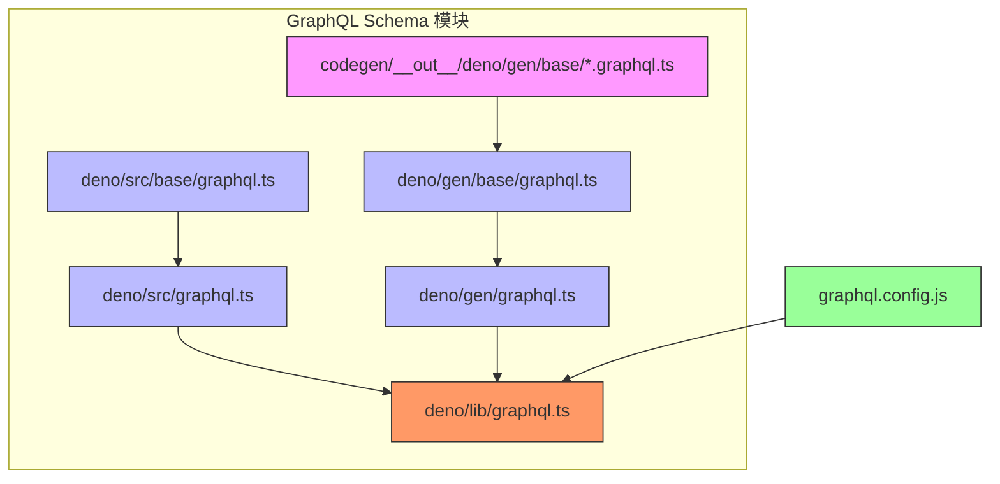
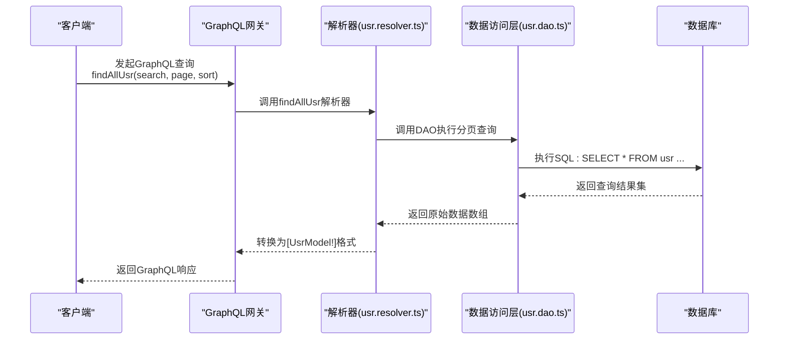

# GraphQL应用


**本文档引用文件**   
- [usr.graphql.ts](https://github.com/sail-sail/nest/blob/main/codegen/__out__/deno/gen/base/usr/usr.graphql.ts)
- [graphql.config.js](https://github.com/sail-sail/nest/blob/main/deno/graphql.config.js)
- [lib/graphql.ts](https://github.com/sail-sail/nest/blob/main/deno/lib/graphql.ts)
- [src/graphql.ts](https://github.com/sail-sail/nest/blob/main/deno/src/graphql.ts)
- [base/graphql.ts](https://github.com/sail-sail/nest/blob/main/deno/src/base/graphql.ts)
- [gen/graphql.ts](https://github.com/sail-sail/nest/blob/main/deno/gen/graphql.ts)
- [base/graphql.ts](https://github.com/sail-sail/nest/blob/main/deno/gen/base/graphql.ts)


## 目录
1. [项目结构](#项目结构)
2. [GraphQL模式定义](#graphql模式定义)
3. [解析器与数据流](#解析器与数据流)
4. [架构集成与模块化设计](#架构集成与模块化设计)
5. [查询与变更操作详解](#查询与变更操作详解)
6. [类型系统与输入验证](#类型系统与输入验证)
7. [自动生成机制分析](#自动生成机制分析)
8. [实际使用示例](#实际使用示例)

## 项目结构

本项目采用分层模块化架构，GraphQL相关实现主要集中在`deno`目录下。核心结构包括：

- `codegen/__out__/deno/gen/base/`：存放由代码生成工具自动生成的GraphQL模式文件（`.graphql.ts`），每个业务实体（如用户、角色、组织等）均有独立的GraphQL定义。
- `deno/gen/`：包含对所有生成模块的统一导入入口。
- `deno/src/`：包含自定义业务模块的GraphQL定义。
- `deno/lib/`：包含基础服务（如OSS、App）的GraphQL定义。
- 配置文件`graphql.config.js`用于指定GraphQL模式的扫描路径。

该结构实现了自动生成与手动扩展的良好分离，便于维护和扩展。



**图示来源**
- [usr.graphql.ts](https://github.com/sail-sail/nest/blob/main/codegen/__out__/deno/gen/base/usr/usr.graphql.ts)
- [lib/graphql.ts](https://github.com/sail-sail/nest/blob/main/deno/lib/graphql.ts)
- [graphql.config.js](https://github.com/sail-sail/nest/blob/main/deno/graphql.config.js)

**本节来源**
- [graphql.config.js](https://github.com/sail-sail/nest/blob/main/deno/graphql.config.js)
- [lib/graphql.ts](https://github.com/sail-sail/nest/blob/main/deno/lib/graphql.ts)
- [gen/base/graphql.ts](https://github.com/sail-sail/nest/blob/main/deno/gen/base/graphql.ts)
- [src/base/graphql.ts](https://github.com/sail-sail/nest/blob/main/deno/src/base/graphql.ts)

## GraphQL模式定义

GraphQL模式（Schema）通过TypeScript文件中的字符串模板定义，使用`defineGraphql`函数注册解析器和类型。以用户（Usr）为例，其模式定义包含：

- **标量类型**：`UsrId`，用于标识用户唯一ID。
- **枚举类型**：`UsrType`，定义用户类型（登录用户、第三方接口）。
- **对象类型**：`UsrModel`，描述用户实体的所有字段，包含ID、用户名、角色、组织等信息，并附带中文注释。
- **输入类型**：`UsrInput` 和 `UsrSearch`，分别用于创建/更新操作和查询条件过滤。
- **查询类型**：`Query`，定义数据读取操作，如`findAllUsr`（分页查询）、`findByIdUsr`（根据ID查询）等。
- **变更类型**：`Mutation`，定义数据写入操作，如`createsUsr`（批量创建）、`updateByIdUsr`（更新）、`deleteByIdsUsr`（删除）等。

所有模式定义均通过`defineGraphql(resolver, /* GraphQL */ `...`)`语法与对应的解析器绑定。

**本节来源**
- [usr.graphql.ts](https://github.com/sail-sail/nest/blob/main/codegen/__out__/deno/gen/base/usr/usr.graphql.ts)

## 解析器与数据流

GraphQL解析器（Resolver）位于`*.resolver.ts`文件中，与`.graphql.ts`文件同目录。当GraphQL请求到达时，执行流程如下：

1. 请求通过GraphQL网关（由`lib/oak/gql.ts`提供）接收。
2. 根据请求中的操作类型（Query/Mutation）和字段名，查找对应的解析器函数。
3. 解析器函数调用DAO层（`*.dao.ts`）与数据库交互，获取或修改数据。
4. DAO层返回原始数据，解析器将其封装为`UsrModel`等GraphQL类型对象。
5. 结果通过GraphQL响应返回给客户端。

例如，`findAllUsr`查询会调用`usr.resolver.ts`中的对应函数，该函数接收`search`、`page`、`sort`参数，委托`usr.dao.ts`执行分页SQL查询，并将结果集转换为`UsrModel`数组。



**图示来源**
- [usr.graphql.ts](https://github.com/sail-sail/nest/blob/main/codegen/__out__/deno/gen/base/usr/usr.graphql.ts)
- [usr.resolver.ts](https://github.com/sail-sail/nest/blob/main/codegen/__out__/deno/gen/base/usr/usr.resolver.ts)
- [usr.dao.ts](https://github.com/sail-sail/nest/blob/main/codegen/__out__/deno/gen/base/usr/usr.dao.ts)

## 架构集成与模块化设计

项目通过多层`import`语句实现GraphQL模式的自动聚合，形成清晰的依赖树：

1. **最底层**：每个实体的`*.graphql.ts`文件定义其自身的GraphQL类型和解析器。
2. **中间层**：
   - `deno/gen/base/graphql.ts` 导入所有由代码生成器生成的模块。
   - `deno/src/base/graphql.ts` 导入所有自定义业务模块。
3. **上层**：
   - `deno/gen/graphql.ts` 导入`gen/base/graphql.ts`。
   - `deno/src/graphql.ts` 导入`src/base/graphql.ts`。
4. **顶层**：`deno/lib/graphql.ts` 统一导入`/gen/graphql.ts`、`/src/graphql.ts`以及`/lib/oss/oss.graphql.ts`等服务模块。

最终，`lib/graphql.ts`作为单一入口，被GraphQL服务器加载，从而注册所有模式。`graphql.config.js`中的`schema`配置指定了模式文件的扫描路径，确保开发工具（如IDE、代码生成器）能正确识别。

**本节来源**
- [lib/graphql.ts](https://github.com/sail-sail/nest/blob/main/deno/lib/graphql.ts)
- [src/graphql.ts](https://github.com/sail-sail/nest/blob/main/deno/src/graphql.ts)
- [gen/graphql.ts](https://github.com/sail-sail/nest/blob/main/deno/gen/graphql.ts)
- [base/graphql.ts](https://github.com/sail-sail/nest/blob/main/deno/gen/base/graphql.ts)
- [base/graphql.ts](https://github.com/sail-sail/nest/blob/main/deno/src/base/graphql.ts)
- [graphql.config.js](https://github.com/sail-sail/nest/blob/main/deno/graphql.config.js)

## 查询与变更操作详解

### 查询操作 (Query)

- `findCountUsr(search: UsrSearch)`: 根据搜索条件返回用户总数，用于分页计算总页数。
- `findAllUsr(search: UsrSearch, page: PageInput, sort: [SortInput!])`: 核心分页查询接口，返回用户列表。`PageInput`包含页码和页大小，`SortInput`定义排序字段和方向。
- `findOneUsr(search: UsrSearch, sort: [SortInput!])`: 返回满足条件的第一个用户。
- `findByIdUsr(id: UsrId!)`: 根据唯一ID精确查询单个用户。
- `findByIdsUsr(ids: [UsrId!]!)`: 根据ID列表批量查询用户。
- `findLastOrderByUsr`: 查询`order_by`字段的最大值，用于新记录的排序定位。

### 变更操作 (Mutation)

- `createsUsr(inputs: [UsrInput!]!, unique_type: UniqueType)`: 批量创建用户，支持唯一性检查策略。
- `updateByIdUsr(id: UsrId!, input: UsrInput!)`: 根据ID更新单个用户信息。
- `deleteByIdsUsr(ids: [UsrId!]!)`: 标记删除（软删除）指定ID的用户。
- `enableByIdsUsr(ids: [UsrId!]!, is_enabled: Int!)`: 批量启用或禁用用户。
- `lockByIdsUsr(ids: [UsrId!]!, is_locked: Int!)`: 批量锁定或解锁用户。
- `revertByIdsUsr(ids: [UsrId!]!)`: 还原已删除的用户。
- `forceDeleteByIdsUsr(ids: [UsrId!]!)`: 从数据库中彻底删除用户（硬删除）。

**本节来源**
- [usr.graphql.ts](https://github.com/sail-sail/nest/blob/main/codegen/__out__/deno/gen/base/usr/usr.graphql.ts)

## 类型系统与输入验证

GraphQL类型系统提供了强类型保障：

- **标量类型**：除了内置的`String`、`Int`、`Boolean`，项目定义了`UsrId`、`NaiveDateTime`等自定义标量，确保ID格式和时间格式的统一。
- **枚举类型**：`UsrType`等枚举限制了字段的合法取值范围，避免无效数据。
- **输入对象**：`UsrInput`和`UsrSearch`结构化了客户端传参，`UsrSearch`提供了丰富的查询条件（如`_like`模糊匹配、`_is_null`空值判断、数组包含等），支持复杂业务场景。
- **非空约束**：使用`!`符号（如`UsrId!`）明确标识必填字段，提升API的健壮性。

虽然文档未直接展示，但结合`lib/validators`目录，可推断项目在解析器或DAO层对输入进行了进一步的业务规则验证（如邮箱格式、密码强度等）。

**本节来源**
- [usr.graphql.ts](https://github.com/sail-sail/nest/blob/main/codegen/__out__/deno/gen/base/usr/usr.graphql.ts)

## 自动生成机制分析

项目通过`codegen`模块实现GraphQL模式的自动化生成，其工作流程如下：

1. **源数据**：基于数据库表结构（可能在`codegen/src/tables/`中定义）或配置文件。
2. **代码生成**：运行`codegen.ts`脚本，读取源数据，应用模板（`codegen/src/template/`）。
3. **输出**：生成`codegen/__out__/deno/gen/base/`下的`*.model.ts`、`*.dao.ts`、`*.service.ts`、`*.resolver.ts`和`*.graphql.ts`文件。
4. **集成**：生成的`*.graphql.ts`文件被`gen/base/graphql.ts`自动导入，最终通过`lib/graphql.ts`集成到应用中。

这种机制极大地减少了重复性代码，保证了数据模型、DAO、GraphQL接口之间的一致性，当数据库结构变更时，只需重新生成代码即可同步更新API。

**本节来源**
- [usr.graphql.ts](https://github.com/sail-sail/nest/blob/main/codegen/__out__/deno/gen/base/usr/usr.graphql.ts)
- [gen/base/graphql.ts](https://github.com/sail-sail/nest/blob/main/deno/gen/base/graphql.ts)

## 实际使用示例

### 查询用户列表（分页）

```graphql
query GetUsers($search: UsrSearch, $page: PageInput) {
  findAllUsr(search: $search, page: $page) {
    id
    lbl
    username
    role_ids_lbl
    org_ids_lbl
    is_enabled_lbl
    create_time_lbl
  }
}
```

**变量 (Variables):**
```json
{
  "search": {
    "username_like": "admin",
    "is_enabled": [1]
  },
  "page": {
    "page_no": 1,
    "page_size": 10
  }
}
```

### 创建用户

```graphql
mutation CreateUsers($inputs: [UsrInput!]!) {
  createsUsr(inputs: $inputs) {
    id
  }
}
```

**变量 (Variables):**
```json
{
  "inputs": [
    {
      "lbl": "张三",
      "username": "zhangsan",
      "password": "encrypted_password",
      "role_ids": ["role_admin"],
      "org_ids": ["org_001"],
      "default_org_id": "org_001",
      "type": "login"
    }
  ]
}
```

### 更新用户状态

```graphql
mutation EnableUsers($ids: [UsrId!]!, $isEnabled: Int!) {
  enableByIdsUsr(ids: $ids, is_enabled: $isEnabled)
}
```

**变量 (Variables):**
```json
{
  "ids": ["usr_001", "usr_002"],
  "isEnabled": 1
}
```

**本节来源**
- [usr.graphql.ts](https://github.com/sail-sail/nest/blob/main/codegen/__out__/deno/gen/base/usr/usr.graphql.ts)