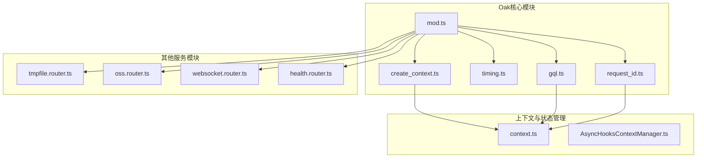
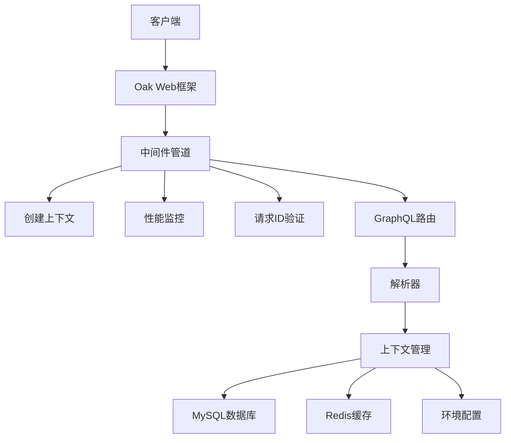
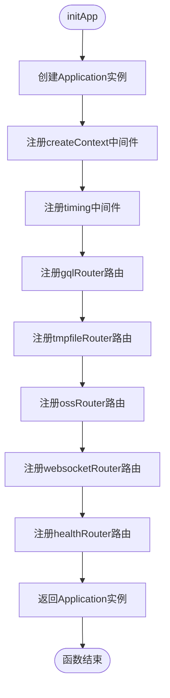
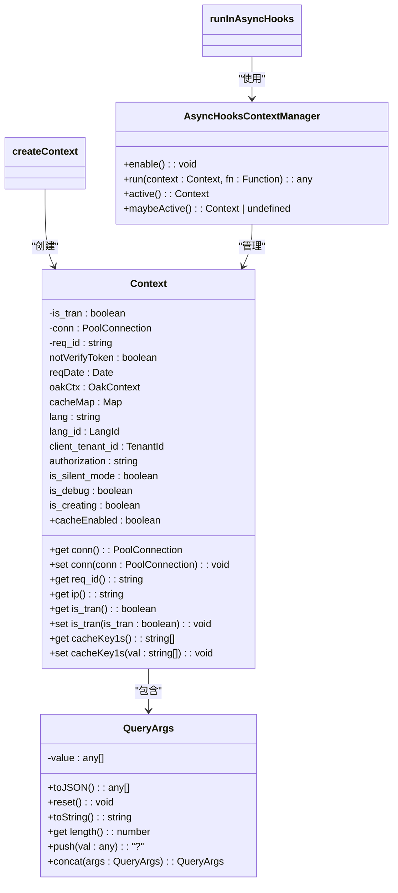
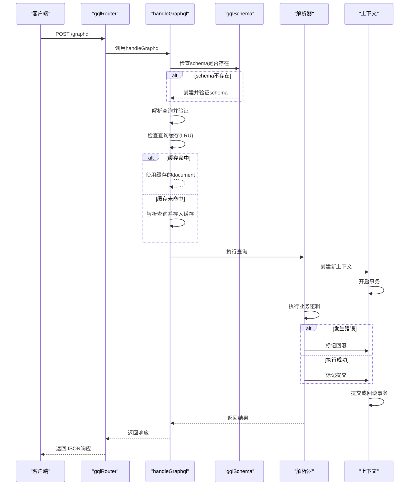
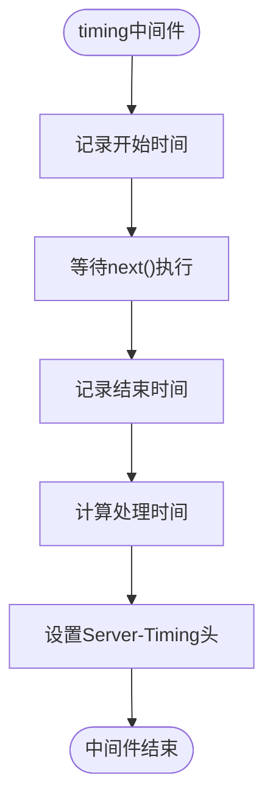
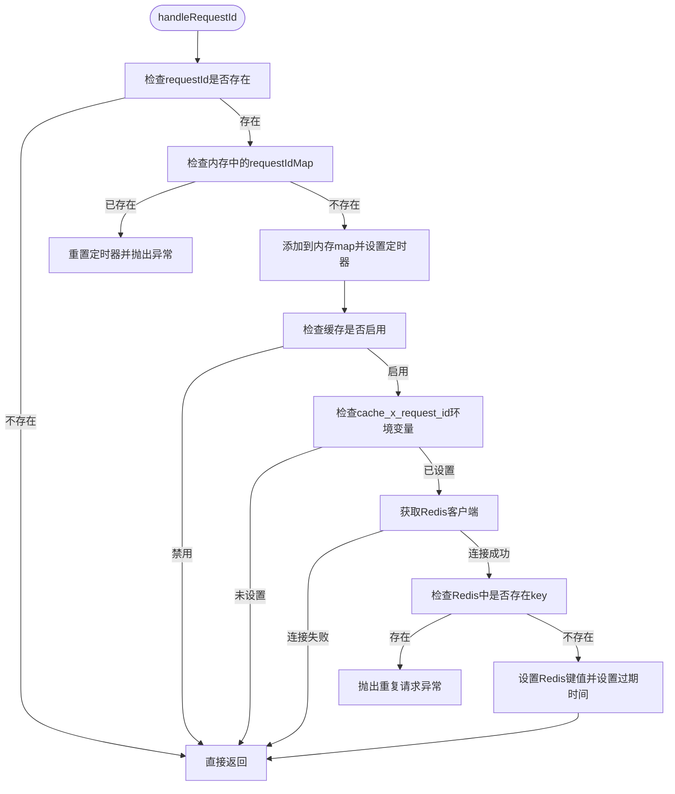

# Oak框架


**本文档引用文件**  
- [mod.ts](https://github.com/sail-sail/nest/blob/main/deno/lib/oak/mod.ts)
- [gql.ts](https://github.com/sail-sail/nest/blob/main/deno/lib/oak/gql.ts)
- [create_context.ts](https://github.com/sail-sail/nest/blob/main/deno/lib/oak/create_context.ts)
- [timing.ts](https://github.com/sail-sail/nest/blob/main/deno/lib/oak/timing.ts)
- [request_id.ts](https://github.com/sail-sail/nest/blob/main/deno/lib/oak/request_id.ts)
- [context.ts](https://github.com/sail-sail/nest/blob/main/deno/lib/context.ts)


## 目录
1. [简介](#简介)
2. [项目结构](#项目结构)
3. [核心组件](#核心组件)
4. [架构概览](#架构概览)
5. [详细组件分析](#详细组件分析)
6. [依赖分析](#依赖分析)
7. [性能考量](#性能考量)
8. [故障排除指南](#故障排除指南)
9. [结论](#结论)

## 简介
Oak框架是基于Deno平台的Web服务器框架，用于构建高性能、可扩展的后端服务。本技术文档全面解析了在nest项目中Oak Web框架的架构与实现。文档详细阐述了Oak作为Deno平台Web框架的核心概念，包括中间件管道、路由系统、请求响应处理和错误处理机制。深入分析了Oak在项目中的具体应用，涵盖GraphQL中间件集成、请求ID生成、性能监控和上下文管理等关键功能。同时，文档还展示了如何开发自定义中间件以扩展框架功能，并提供了丰富的代码示例说明路由定义、参数解析、请求验证和响应格式化等实现方式。此外，文档解释了Oak如何与Deno运行时和GraphQL服务协同工作，构建高性能的Web服务，并包含性能调优建议、安全配置和常见问题排查指南，帮助开发者高效使用Oak框架。

## 项目结构
项目结构遵循模块化设计原则，将不同功能组件分离到独立目录中，便于维护和扩展。核心的Oak框架相关代码位于`deno/lib/oak/`目录下，包含中间件、上下文管理和GraphQL集成等功能。其他功能模块如健康检查、临时文件处理、对象存储（OSS）和WebSocket服务通过独立的路由器接入主应用。整体结构清晰，职责分明，体现了良好的分层架构设计。



**图示来源**  
- [mod.ts](https://github.com/sail-sail/nest/blob/main/deno/lib/oak/mod.ts)
- [context.ts](https://github.com/sail-sail/nest/blob/main/deno/lib/context.ts)

**本节来源**  
- [mod.ts](https://github.com/sail-sail/nest/blob/main/deno/lib/oak/mod.ts)
- [context.ts](https://github.com/sail-sail/nest/blob/main/deno/lib/context.ts)

## 核心组件
Oak框架的核心组件包括应用初始化、中间件管道、上下文管理、GraphQL集成和性能监控。这些组件共同构成了一个完整的Web服务运行环境。`initApp`函数负责创建和配置Oak应用实例，注册所有必要的中间件和路由。`createContext`中间件为每个请求创建独立的执行上下文，确保请求间的状态隔离。`timing`中间件用于记录请求处理时间并添加性能头信息。`gqlRouter`提供了GraphQL API的统一入口，支持POST和GET请求。`request_id`机制防止重复请求，保证系统的幂等性。

**本节来源**  
- [mod.ts](https://github.com/sail-sail/nest/blob/main/deno/lib/oak/mod.ts#L1-L24)
- [gql.ts](https://github.com/sail-sail/nest/blob/main/deno/lib/oak/gql.ts#L1-L447)
- [create_context.ts](https://github.com/sail-sail/nest/blob/main/deno/lib/oak/create_context.ts#L1-L43)
- [timing.ts](https://github.com/sail-sail/nest/blob/main/deno/lib/oak/timing.ts#L1-L12)
- [request_id.ts](https://github.com/sail-sail/nest/blob/main/deno/lib/oak/request_id.ts#L1-L75)

## 架构概览
整个系统采用分层架构设计，最上层是Oak Web框架，负责HTTP请求的接收和响应。中间层是各种功能中间件，包括上下文创建、性能监控、请求ID验证和GraphQL处理。底层是业务逻辑和数据访问层，通过上下文对象访问数据库连接、缓存和配置信息。异步钩子（AsyncHooks）用于维护每个请求的上下文状态，确保在异步调用链中能够正确传递和访问上下文数据。



**图示来源**  
- [mod.ts](https://github.com/sail-sail/nest/blob/main/deno/lib/oak/mod.ts#L1-L24)
- [context.ts](https://github.com/sail-sail/nest/blob/main/deno/lib/context.ts#L1-L1065)

## 详细组件分析
### 应用初始化分析
`initApp`函数是整个Web服务的入口点，负责创建Oak应用实例并注册所有中间件和路由。该函数返回一个配置好的Application对象，可以直接启动监听HTTP请求。



**图示来源**  
- [mod.ts](https://github.com/sail-sail/nest/blob/main/deno/lib/oak/mod.ts#L1-L24)

**本节来源**  
- [mod.ts](https://github.com/sail-sail/nest/blob/main/deno/lib/oak/mod.ts#L1-L24)

### 上下文管理分析
上下文管理是Oak框架的核心机制之一，确保每个请求都有独立的状态空间。`Context`类封装了请求相关的所有信息，包括数据库连接、缓存、语言设置和租户ID等。`runInAsyncHooks`函数利用Deno的异步钩子功能，在异步调用链中保持上下文的传递。



**图示来源**  
- [context.ts](https://github.com/sail-sail/nest/blob/main/deno/lib/context.ts#L300-L800)
- [create_context.ts](https://github.com/sail-sail/nest/blob/main/deno/lib/oak/create_context.ts#L1-L43)

**本节来源**  
- [context.ts](https://github.com/sail-sail/nest/blob/main/deno/lib/context.ts#L300-L800)
- [create_context.ts](https://github.com/sail-sail/nest/blob/main/deno/lib/oak/create_context.ts#L1-L43)

### GraphQL集成分析
GraphQL集成是Oak框架的重要特性，通过`gqlRouter`提供统一的API入口。系统使用LRU缓存来存储解析后的GraphQL查询，提高执行效率。每个GraphQL解析器在执行时都会创建一个新的上下文，并在事务中运行，确保数据一致性。



**图示来源**  
- [gql.ts](https://github.com/sail-sail/nest/blob/main/deno/lib/oak/gql.ts#L1-L447)
- [context.ts](https://github.com/sail-sail/nest/blob/main/deno/lib/context.ts#L393-L464)

**本节来源**  
- [gql.ts](https://github.com/sail-sail/nest/blob/main/deno/lib/oak/gql.ts#L1-L447)
- [context.ts](https://github.com/sail-sail/nest/blob/main/deno/lib/context.ts#L393-L464)

### 性能监控分析
性能监控中间件`timing`用于测量每个请求的处理时间，并将结果通过HTTP头返回给客户端。这对于性能分析和优化至关重要。



**图示来源**  
- [timing.ts](https://github.com/sail-sail/nest/blob/main/deno/lib/oak/timing.ts#L1-L12)

**本节来源**  
- [timing.ts](https://github.com/sail-sail/nest/blob/main/deno/lib/oak/timing.ts#L1-L12)

### 请求ID机制分析
请求ID机制用于防止重复请求，保证系统的幂等性。系统在内存和Redis中同时维护请求ID的状态，确保在分布式环境下也能有效工作。



**图示来源**  
- [request_id.ts](https://github.com/sail-sail/nest/blob/main/deno/lib/oak/request_id.ts#L1-L75)
- [context.ts](https://github.com/sail-sail/nest/blob/main/deno/lib/context.ts#L1-L1065)

**本节来源**  
- [request_id.ts](https://github.com/sail-sail/nest/blob/main/deno/lib/oak/request_id.ts#L1-L75)

## 依赖分析
Oak框架依赖于多个外部库和内部模块，形成了一个复杂的依赖网络。主要依赖包括@oak/oak（核心Web框架）、graphql（GraphQL实现）、mysql2/promise（MySQL数据库驱动）、redis（Redis客户端）和lru-cache（内存缓存）。内部模块之间通过明确的接口进行通信，降低了耦合度。

```mermaid
graph TD
Oak[Oak框架] --> @oak/oak["@oak/oak"]
Oak --> graphql["graphql"]
Oak --> lru-cache["lru-cache"]
Oak --> mysql2["mysql2/promise"]
Oak --> redis["redis"]
Oak --> context["context.ts"]
Oak --> async_hooks["AsyncHooksContextManager.ts"]
context --> mysql2
context --> redis
context --> async_hooks
gql --> graphql
gql --> lru-cache
request_id --> redis
request_id --> context
```

**图示来源**  
- [mod.ts](https://github.com/sail-sail/nest/blob/main/deno/lib/oak/mod.ts)
- [gql.ts](https://github.com/sail-sail/nest/blob/main/deno/lib/oak/gql.ts)
- [request_id.ts](https://github.com/sail-sail/nest/blob/main/deno/lib/oak/request_id.ts)
- [context.ts](https://github.com/sail-sail/nest/blob/main/deno/lib/context.ts)

**本节来源**  
- [mod.ts](https://github.com/sail-sail/nest/blob/main/deno/lib/oak/mod.ts)
- [gql.ts](https://github.com/sail-sail/nest/blob/main/deno/lib/oak/gql.ts)
- [request_id.ts](https://github.com/sail-sail/nest/blob/main/deno/lib/oak/request_id.ts)
- [context.ts](https://github.com/sail-sail/nest/blob/main/deno/lib/context.ts)

## 性能考量
Oak框架在设计时充分考虑了性能因素。通过使用LRU缓存来存储解析后的GraphQL查询，避免了重复解析的开销。异步钩子（AsyncHooks）的使用确保了上下文管理的高效性，而不会影响请求处理性能。性能监控中间件提供了宝贵的性能数据，有助于识别瓶颈。请求ID机制虽然增加了少量开销，但通过内存缓存和合理的超时设置，将性能影响降到最低。

**本节来源**  
- [gql.ts](https://github.com/sail-sail/nest/blob/main/deno/lib/oak/gql.ts#L1-L447)
- [timing.ts](https://github.com/sail-sail/nest/blob/main/deno/lib/oak/timing.ts#L1-L12)
- [request_id.ts](https://github.com/sail-sail/nest/blob/main/deno/lib/oak/request_id.ts#L1-L75)

## 故障排除指南
### 常见问题
1. **GraphQL查询解析失败**：检查查询语法是否正确，确保所有字段和参数都符合schema定义。
2. **数据库连接失败**：确认数据库配置正确，检查网络连接和数据库服务状态。
3. **Redis缓存无法连接**：验证Redis服务是否正常运行，检查连接配置和防火墙设置。
4. **请求ID重复错误**：这通常是客户端重试机制导致的，确保客户端在收到响应后不再重试。
5. **上下文丢失**：在异步操作中确保使用`runInAsyncHooks`来保持上下文传递。

### 调试技巧
- 使用`log`和`error`函数输出调试信息，这些信息会包含请求ID，便于追踪。
- 检查响应头中的`Server-Timing`字段，了解请求处理时间分布。
- 在开发环境中启用详细的错误信息输出，但在生产环境中应关闭以避免信息泄露。
- 使用Redis CLI检查请求ID的状态，验证幂等性机制是否正常工作。

**本节来源**  
- [gql.ts](https://github.com/sail-sail/nest/blob/main/deno/lib/oak/gql.ts#L1-L447)
- [context.ts](https://github.com/sail-sail/nest/blob/main/deno/lib/context.ts#L1-L1065)
- [request_id.ts](https://github.com/sail-sail/nest/blob/main/deno/lib/oak/request_id.ts#L1-L75)

## 结论
Oak框架为Deno平台提供了一个强大而灵活的Web开发解决方案。通过精心设计的中间件管道、高效的上下文管理和完善的GraphQL集成，框架能够支持复杂的业务需求。异步钩子的使用确保了请求状态的正确传递，而性能监控和请求ID机制则增强了系统的可靠性和可维护性。整体架构清晰，模块化程度高，便于扩展和维护。开发者可以基于此框架快速构建高性能、可扩展的Web服务，同时利用提供的工具和最佳实践确保代码质量和系统稳定性。