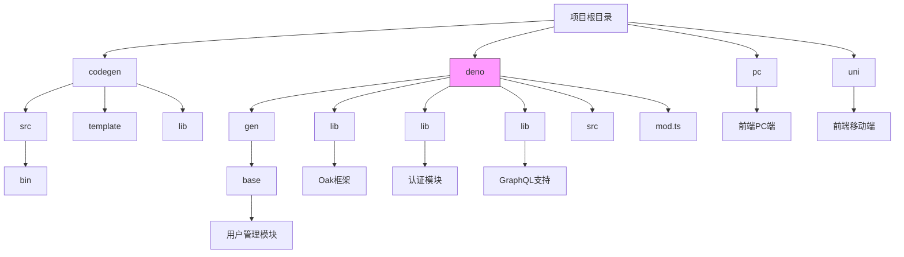
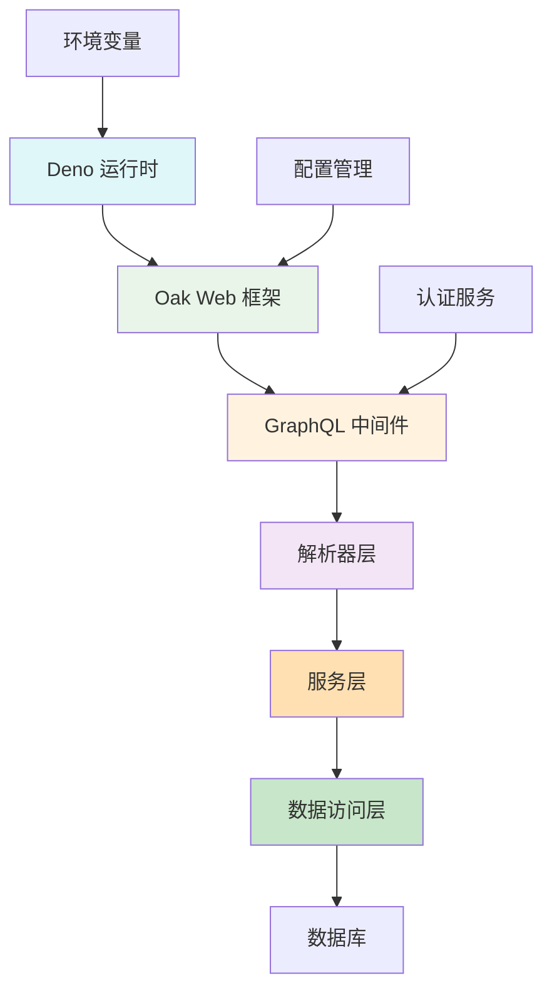
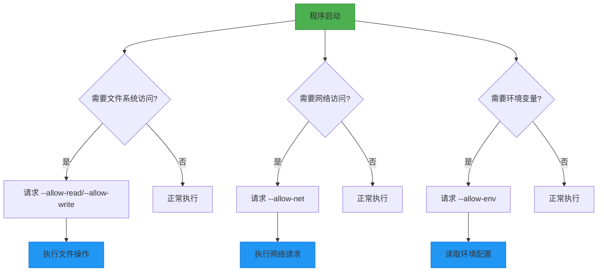
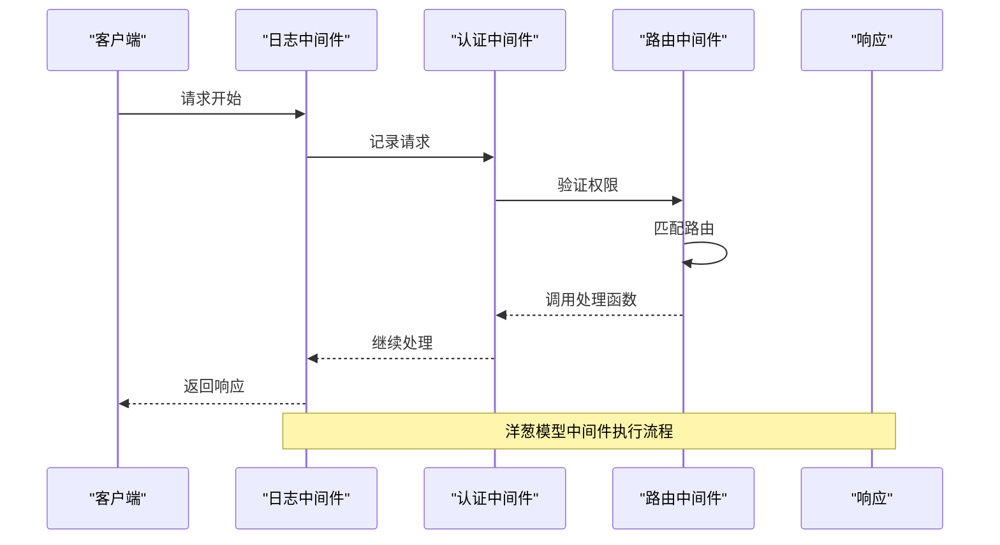
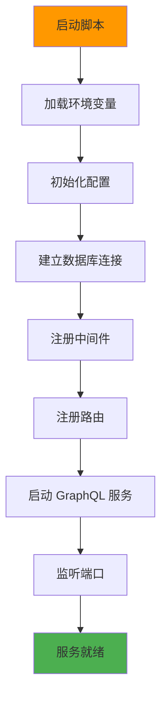
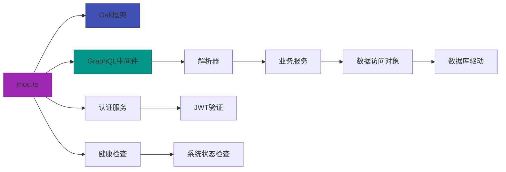

# 后端技术栈


**本文档引用文件**  
- [mod.ts](https://github.com/sail-sail/nest/blob/main/deno/mod.ts)
- [graphql.config.js](https://github.com/sail-sail/nest/blob/main/deno/graphql.config.js)
- [ecosystem.config.json](https://github.com/sail-sail/nest/blob/main/deno/ecosystem.config.json)
- [lib/oak/mod.ts](https://github.com/sail-sail/nest/blob/main/deno/lib/oak/mod.ts)
- [lib/graphql.ts](https://github.com/sail-sail/nest/blob/main/deno/lib/graphql.ts)
- [gen/base/usr/usr.resolver.ts](https://github.com/sail-sail/nest/blob/main/deno/gen/base/usr/usr.resolver.ts)
- [gen/base/usr/usr.service.ts](https://github.com/sail-sail/nest/blob/main/deno/gen/base/usr/usr.service.ts)
- [gen/base/usr/usr.dao.ts](https://github.com/sail-sail/nest/blob/main/deno/gen/base/usr/usr.dao.ts)
- [lib/auth/auth.service.ts](https://github.com/sail-sail/nest/blob/main/deno/lib/auth/auth.service.ts)
- [src/graphql.ts](https://github.com/sail-sail/nest/blob/main/deno/src/graphql.ts)
- [lib/env.ts](https://github.com/sail-sail/nest/blob/main/deno/lib/env.ts)
- [codegen/src/config.ts](https://github.com/sail-sail/nest/blob/main/codegen/src/config.ts)
- [package.json](https://github.com/sail-sail/nest/blob/main/package.json)
- [deno/package.json](https://github.com/sail-sail/nest/blob/main/deno/package.json)


## 目录
1. [简介](#简介)
2. [项目结构](#项目结构)
3. [核心组件](#核心组件)
4. [架构概览](#架构概览)
5. [详细组件分析](#详细组件分析)
6. [依赖分析](#依赖分析)
7. [性能考量](#性能考量)
8. [故障排除指南](#故障排除指南)
9. [结论](#结论)

## 简介
本项目是一个基于 Deno 运行时和 Oak 框架构建的现代化后端服务，采用 GraphQL 作为主要 API 接口协议。系统设计注重安全性、类型安全和可扩展性，利用 Deno 的原生 TypeScript 支持和权限控制机制，构建了一个高效、安全的企业级应用后端。项目通过代码生成机制自动化创建数据访问层、服务层和解析器，极大提升了开发效率。后端技术栈融合了现代 JavaScript 特性、函数式编程思想和微服务架构理念，形成了一个完整的技术生态。

## 项目结构
项目采用分层架构设计，主要分为四个顶级目录：`codegen`、`deno`、`pc` 和 `uni`。其中 `deno` 目录是后端核心，包含了所有服务器端逻辑。



**图示来源**
- [mod.ts](https://github.com/sail-sail/nest/blob/main/deno/mod.ts)
- [codegen/src/config.ts](https://github.com/sail-sail/nest/blob/main/codegen/src/config.ts)

**本节来源**
- [mod.ts](https://github.com/sail-sail/nest/blob/main/deno/mod.ts)
- [codegen/src/config.ts](https://github.com/sail-sail/nest/blob/main/codegen/src/config.ts)

## 核心组件
后端系统由三大核心组件构成：Deno 运行时、Oak Web 框架和 GraphQL API 层。这些组件协同工作，提供了从底层运行环境到上层业务逻辑的完整解决方案。

**本节来源**
- [mod.ts](https://github.com/sail-sail/nest/blob/main/deno/mod.ts)
- [lib/oak/mod.ts](https://github.com/sail-sail/nest/blob/main/deno/lib/oak/mod.ts)
- [lib/graphql.ts](https://github.com/sail-sail/nest/blob/main/deno/lib/graphql.ts)

## 架构概览
系统采用典型的分层架构，从下至上分别为：运行时层、框架层、业务逻辑层和数据访问层。



**图示来源**
- [mod.ts](https://github.com/sail-sail/nest/blob/main/deno/mod.ts#L1-L20)
- [lib/oak/mod.ts](https://github.com/sail-sail/nest/blob/main/deno/lib/oak/mod.ts#L5-L15)
- [lib/graphql.ts](https://github.com/sail-sail/nest/blob/main/deno/lib/graphql.ts#L10-L25)

## 详细组件分析

### Deno 运行时分析
Deno 作为现代 JavaScript/TypeScript 运行时，为本项目提供了安全、高效的执行环境。

#### 安全性与权限模型
Deno 默认在沙箱环境中运行代码，所有敏感操作都需要显式授权。项目通过配置文件和命令行参数管理权限。



**图示来源**
- [mod.ts](https://github.com/sail-sail/nest/blob/main/deno/mod.ts)
- [lib/env.ts](https://github.com/sail-sail/nest/blob/main/deno/lib/env.ts)

#### TypeScript 原生支持
Deno 原生支持 TypeScript，无需额外编译步骤。项目充分利用这一特性，实现了类型安全的开发体验。

```typescript
// 示例：类型安全的配置管理
import { config } from "./lib/env.ts";

interface ServerConfig {
  port: number;
  hostname: string;
  env: string;
}

const serverConfig: ServerConfig = {
  port: config.PORT ? parseInt(config.PORT) : 8000,
  hostname: config.HOSTNAME || "0.0.0.0",
  env: config.NODE_ENV || "development",
};
```

**本节来源**
- [lib/env.ts](https://github.com/sail-sail/nest/blob/main/deno/lib/env.ts#L1-L30)
- [mod.ts](https://github.com/sail-sail/nest/blob/main/deno/mod.ts#L1-L10)

### Oak 框架工作机制
Oak 是一个受 Koa 启发的 Deno Web 框架，提供了中间件管道和路由系统。

#### 中间件管道
Oak 使用洋葱模型的中间件管道，请求和响应按相反顺序通过中间件。



**图示来源**
- [lib/oak/mod.ts](https://github.com/sail-sail/nest/blob/main/deno/lib/oak/mod.ts#L20-L50)
- [mod.ts](https://github.com/sail-sail/nest/blob/main/deno/mod.ts#L15-L25)

#### 路由系统实现
项目通过模块化方式组织路由，每个业务模块都有独立的路由配置。

```typescript
// 示例：Oak 路由配置
import { Router } from "https://deno.land/x/oak/mod.ts";
import { userRoutes } from "./routes/user.ts";

const router = new Router();

// 挂载用户相关路由
userRoutes.forEach((route) => {
  router[route.method](route.path, route.middleware);
});

export default router;
```

**本节来源**
- [lib/oak/mod.ts](https://github.com/sail-sail/nest/blob/main/deno/lib/oak/mod.ts)
- [mod.ts](https://github.com/sail-sail/nest/blob/main/deno/mod.ts)

### GraphQL 应用分析
GraphQL 作为主要 API 协议，提供了灵活的数据查询能力。

#### 模式定义与解析器
项目采用代码生成方式创建 GraphQL 模式和解析器，确保类型一致性。

```mermaid
classDiagram
class UserResolver {
+findUser(id : string) : User
+findUsers(filter : UserFilter) : User[]
+createUser(input : UserInput) : User
+updateUser(id : string, input : UserInput) : User
+deleteUser(id : string) : boolean
}
class UserService {
+getUser(id : string) : Promise~User~
+getUsers(filter : UserFilter) : Promise~User[]~
+createUser(userData : UserCreateInput) : Promise~User~
+updateUser(id : string, userData : UserUpdateInput) : Promise~User~
+deleteUser(id : string) : Promise~boolean~
}
class UserDao {
+findById(id : string) : Promise~UserEntity | null~
+findByFilter(filter : UserFilter) : Promise~UserEntity[]~
+insert(user : UserEntity) : Promise~string~
+update(id : string, user : UserEntity) : Promise~number~
+delete(id : string) : Promise~number~
}
UserResolver --> UserService : "依赖"
UserService --> UserDao : "依赖"
UserDao --> "数据库" : "访问"
```

**图示来源**
- [gen/base/usr/usr.resolver.ts](https://github.com/sail-sail/nest/blob/main/deno/gen/base/usr/usr.resolver.ts#L5-L20)
- [gen/base/usr/usr.service.ts](https://github.com/sail-sail/nest/blob/main/deno/gen/base/usr/usr.service.ts#L5-L15)
- [gen/base/usr/usr.dao.ts](https://github.com/sail-sail/nest/blob/main/deno/gen/base/usr/usr.dao.ts#L5-L15)

#### 数据加载器优化
使用 DataLoader 解决 N+1 查询问题，提升查询性能。

```typescript
// 示例：DataLoader 实现
import DataLoader from "https://deno.land/x/dataloader/mod.ts";

const userLoader = new DataLoader<string, User>(async (ids) => {
  const users = await userService.findUsersByIds(ids);
  return ids.map((id) => users.find((user) => user.id === id) || null);
});

// 在解析器中使用
const resolver = {
  Query: {
    user: (_parent, { id }) => userLoader.load(id),
  },
};
```

**本节来源**
- [lib/graphql.ts](https://github.com/sail-sail/nest/blob/main/deno/lib/graphql.ts#L30-L50)
- [src/graphql.ts](https://github.com/sail-sail/nest/blob/main/deno/src/graphql.ts#L20-L40)

### 启动流程与配置管理
系统启动流程经过精心设计，确保配置正确加载和依赖正确初始化。

#### 启动流程


**图示来源**
- [mod.ts](https://github.com/sail-sail/nest/blob/main/deno/mod.ts#L1-L30)
- [lib/env.ts](https://github.com/sail-sail/nest/blob/main/deno/lib/env.ts#L1-L20)

#### 配置管理
项目采用分层配置管理，支持环境特定配置。

```typescript
// 示例：配置管理实现
import { config } from "./lib/env.ts";

export const appConfig = {
  server: {
    port: parseInt(config.PORT || "8000"),
    hostname: config.HOSTNAME || "0.0.0.0",
  },
  database: {
    connectionString: config.DATABASE_URL,
    maxConnections: parseInt(config.DB_MAX_CONNECTIONS || "10"),
  },
  security: {
    jwtSecret: config.JWT_SECRET,
    tokenExpiry: config.JWT_EXPIRY || "24h",
  },
};
```

**本节来源**
- [lib/env.ts](https://github.com/sail-sail/nest/blob/main/deno/lib/env.ts)
- [mod.ts](https://github.com/sail-sail/nest/blob/main/deno/mod.ts)

## 依赖分析
项目依赖关系清晰，采用模块化设计降低耦合度。



**图示来源**
- [mod.ts](https://github.com/sail-sail/nest/blob/main/deno/mod.ts)
- [package.json](https://github.com/sail-sail/nest/blob/main/deno/package.json)
- [lib/oak/mod.ts](https://github.com/sail-sail/nest/blob/main/deno/lib/oak/mod.ts)

**本节来源**
- [mod.ts](https://github.com/sail-sail/nest/blob/main/deno/mod.ts#L1-L50)
- [package.json](https://github.com/sail-sail/nest/blob/main/deno/package.json#L1-L30)

## 性能考量
系统在多个层面进行了性能优化：

1. **数据库查询优化**：通过批量加载和缓存减少数据库访问次数
2. **连接池管理**：合理配置数据库连接池大小，避免资源耗尽
3. **静态资源缓存**：对频繁访问的数据进行内存缓存
4. **异步处理**：将耗时操作放入后台任务队列
5. **压缩传输**：启用 GZIP 压缩减少网络传输量

这些优化措施确保了系统在高并发场景下的稳定性和响应速度。

## 故障排除指南
常见问题及解决方案：

1. **服务无法启动**：检查环境变量配置，确保必要参数已设置
2. **数据库连接失败**：验证数据库连接字符串和网络连通性
3. **GraphQL 查询超时**：检查查询复杂度，考虑添加分页或优化数据加载
4. **认证失败**：确认 JWT 密钥配置正确，检查令牌有效期
5. **性能下降**：监控数据库查询，识别慢查询并优化

**本节来源**
- [lib/exceptions/service.exception.ts](https://github.com/sail-sail/nest/blob/main/deno/lib/exceptions/service.exception.ts)
- [lib/health/health.service.ts](https://github.com/sail-sail/nest/blob/main/deno/lib/health/health.service.ts)

## 结论
本项目构建了一个现代化、高性能的后端技术栈，充分利用了 Deno 运行时的安全特性、Oak 框架的灵活性和 GraphQL 的强大查询能力。通过代码生成机制和分层架构设计，实现了开发效率和系统性能的平衡。建议开发者深入学习 Deno 的权限模型、Oak 的中间件机制和 GraphQL 的优化技巧，以充分发挥该技术栈的潜力。