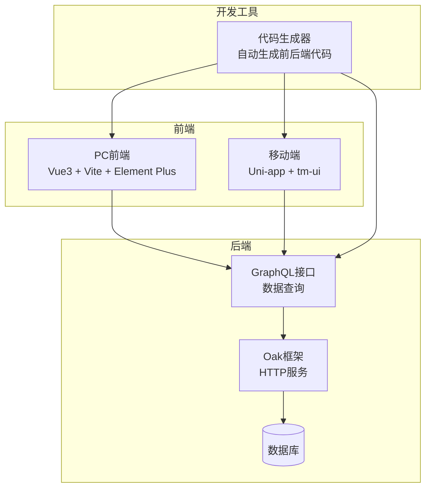
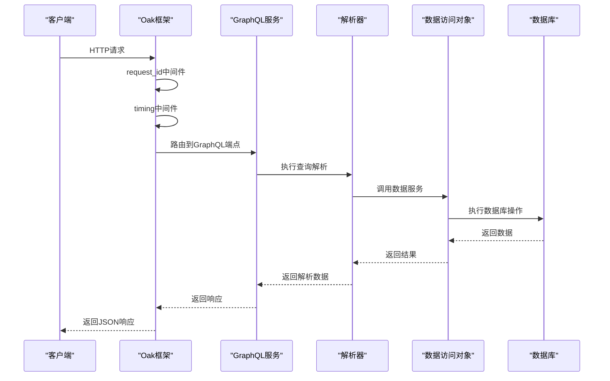
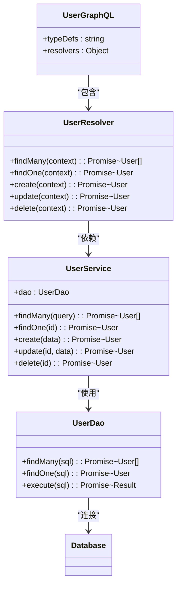
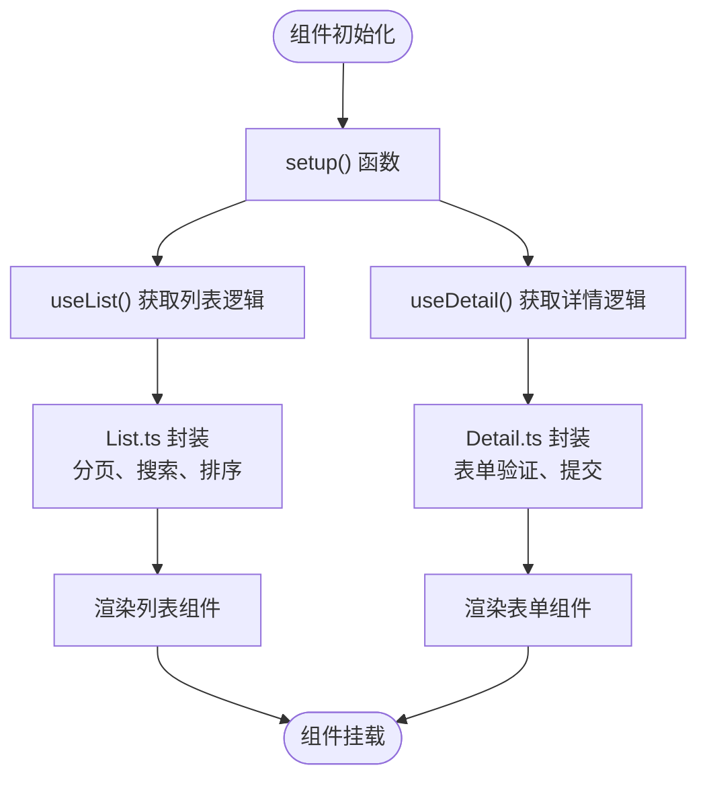
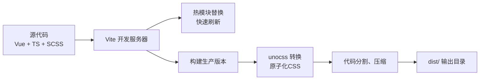
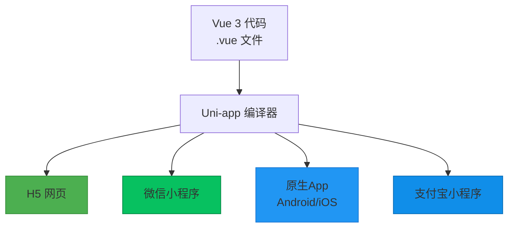
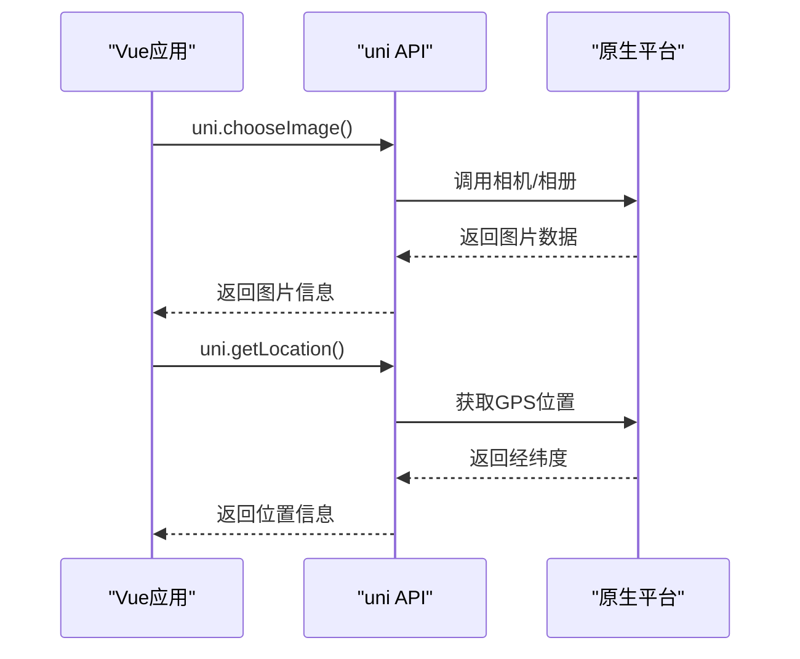

# 技术栈详解


**本文档引用的文件**  
- [mod.ts](https://github.com/sail-sail/nest/blob/main/deno/mod.ts)
- [graphql.ts](https://github.com/sail-sail/nest/blob/main/deno/lib/graphql.ts)
- [oak.ts](https://github.com/sail-sail/nest/blob/main/deno/lib/oak/mod.ts)
- [app.resolver.ts](https://github.com/sail-sail/nest/blob/main/deno/lib/app/app.resolver.ts)
- [main.ts](https://github.com/sail-sail/nest/blob/main/pc/src/main.ts)
- [App.vue](https://github.com/sail-sail/nest/blob/main/pc/src/App.vue)
- [KFrame.vue](https://github.com/sail-sail/nest/blob/main/pc/src/components/KFrame/KFrame.vue)
- [CustomInput.vue](https://github.com/sail-sail/nest/blob/main/pc/src/components/CustomInput.vue)
- [main.ts](https://github.com/sail-sail/nest/blob/main/uni/src/main.ts)
- [App.vue](https://github.com/sail-sail/nest/blob/main/uni/src/App.vue)
- [config.ts](https://github.com/sail-sail/nest/blob/main/codegen/src/config.ts)
- [codegen.ts](https://github.com/sail-sail/nest/blob/main/codegen/src/lib/codegen.ts)
- [graphql.config.js](https://github.com/sail-sail/nest/blob/main/deno/graphql.config.js)
- [graphql.config.js](https://github.com/sail-sail/nest/blob/main/pc/graphql.config.js)
- [graphql.config.js](https://github.com/sail-sail/nest/blob/main/uni/graphql.config.js)
- [package.json](https://github.com/sail-sail/nest/blob/main/deno/package.json)
- [package.json](https://github.com/sail-sail/nest/blob/main/pc/package.json)
- [package.json](https://github.com/sail-sail/nest/blob/main/uni/package.json)


## 目录
1. [引言](#引言)
2. [项目结构](#项目结构)
3. [核心组件](#核心组件)
4. [架构概览](#架构概览)
5. [详细组件分析](#详细组件分析)
6. [依赖分析](#依赖分析)
7. [性能考量](#性能考量)
8. [故障排除指南](#故障排除指南)
9. [结论](#结论)

## 引言
本技术栈详解文档旨在深入剖析基于 Nest 架构的全栈项目所采用的核心技术与框架。项目采用 Deno 运行时作为后端基础，结合 Oak 框架构建高性能 Web 服务，并通过 GraphQL 实现灵活的数据查询。前端部分分为 PC 端和移动端：PC 端采用 Vue 3 组合式 API、Vite 构建工具和 Element Plus 组件库；移动端则使用 Uni-app 框架实现跨平台开发。本文档将详细阐述各技术选型的实现机制、协同工作方式，并为开发者提供清晰的学习路径。

## 项目结构
项目采用模块化分层结构，主要分为四个核心目录：`codegen`（代码生成器）、`deno`（后端服务）、`pc`（PC 前端）和 `uni`（移动端）。这种结构清晰地分离了关注点，便于维护和扩展。

```mermaid
graph TB
subgraph "根目录"
Codegen[codegen<br/>代码生成器]
Deno[deno<br/>后端服务]
Pc[pc<br/>PC前端]
Uni[uni<br/>移动端]
end
Codegen --> Deno : 生成后端代码
Codegen --> Pc : 生成PC端代码
Codegen --> Uni : 生成移动端代码
Deno --> Pc : 提供GraphQL API
Deno --> Uni : 提供GraphQL API
```

**图示来源**
- [mod.ts](https://github.com/sail-sail/nest/blob/main/deno/mod.ts)
- [codegen.ts](https://github.com/sail-sail/nest/blob/main/codegen/src/lib/codegen.ts)

**本节来源**
- [mod.ts](https://github.com/sail-sail/nest/blob/main/deno/mod.ts)
- [main.ts](https://github.com/sail-sail/nest/blob/main/pc/src/main.ts)
- [main.ts](https://github.com/sail-sail/nest/blob/main/uni/src/main.ts)

## 核心组件
项目的核心组件包括基于 Deno 和 Oak 的后端服务、基于 Vue 3 和 Vite 的 PC 前端，以及基于 Uni-app 的移动端应用。后端通过 GraphQL 统一数据接口，前端通过代码生成器自动生成业务模块，实现了高效开发。

**本节来源**
- [mod.ts](https://github.com/sail-sail/nest/blob/main/deno/mod.ts)
- [main.ts](https://github.com/sail-sail/nest/blob/main/pc/src/main.ts)
- [main.ts](https://github.com/sail-sail/nest/blob/main/uni/src/main.ts)

## 架构概览
系统采用典型的前后端分离架构，后端基于 Deno 运行时，使用 Oak 框架处理 HTTP 请求，并通过 GraphQL 提供统一的数据查询接口。前端 PC 端和移动端共享同一套后端服务，通过代码生成器自动化生成 CRUD 界面，极大提升了开发效率。



**图示来源**
- [mod.ts](https://github.com/sail-sail/nest/blob/main/deno/mod.ts)
- [oak.ts](https://github.com/sail-sail/nest/blob/main/deno/lib/oak/mod.ts)
- [graphql.ts](https://github.com/sail-sail/nest/blob/main/deno/lib/graphql.ts)
- [main.ts](https://github.com/sail-sail/nest/blob/main/pc/src/main.ts)
- [main.ts](https://github.com/sail-sail/nest/blob/main/uni/src/main.ts)

## 详细组件分析

### 后端服务分析
后端服务基于 Deno 运行时，利用其原生 TypeScript 支持和安全沙箱特性。Oak 框架作为中间件层，负责路由分发和请求处理。GraphQL 服务通过 `graphql.ts` 文件配置，定义了数据模式和解析器。

#### Deno 与 Oak 工作机制
Deno 提供了一个现代、安全的 JavaScript/TypeScript 运行环境。Oak 作为其 Web 框架，采用了中间件管道模式处理请求。



**图示来源**
- [mod.ts](https://github.com/sail-sail/nest/blob/main/deno/mod.ts)
- [oak/mod.ts](https://github.com/sail-sail/nest/blob/main/deno/lib/oak/mod.ts)
- [graphql.ts](https://github.com/sail-sail/nest/blob/main/deno/lib/graphql.ts)
- [app.resolver.ts](https://github.com/sail-sail/nest/blob/main/deno/lib/app/app.resolver.ts)

**本节来源**
- [mod.ts](https://github.com/sail-sail/nest/blob/main/deno/mod.ts)
- [oak/mod.ts](https://github.com/sail-sail/nest/blob/main/deno/lib/oak/mod.ts)

#### GraphQL 应用分析
GraphQL 在项目中作为核心数据层，通过 `*.graphql.ts` 文件定义模式（Schema），并通过 `*.resolver.ts` 文件实现解析器（Resolver）。每个业务模块（如 `usr`, `dept`, `menu`）都有独立的 GraphQL 定义和服务。



**图示来源**
- [usr.graphql.ts](https://github.com/sail-sail/nest/blob/main/deno/gen/base/usr/usr.graphql.ts)
- [usr.resolver.ts](https://github.com/sail-sail/nest/blob/main/deno/gen/base/usr/usr.resolver.ts)
- [usr.service.ts](https://github.com/sail-sail/nest/blob/main/deno/gen/base/usr/usr.service.ts)
- [usr.dao.ts](https://github.com/sail-sail/nest/blob/main/deno/gen/base/usr/usr.dao.ts)

**本节来源**
- [usr.graphql.ts](https://github.com/sail-sail/nest/blob/main/deno/gen/base/usr/usr.graphql.ts)
- [usr.resolver.ts](https://github.com/sail-sail/nest/blob/main/deno/gen/base/usr/usr.resolver.ts)

### PC 前端分析
PC 端基于 Vue 3 组合式 API 构建，使用 Vite 作为构建工具，Element Plus 作为 UI 组件库。通过 `KFrame` 等自定义组件封装了通用业务逻辑。

#### Vue 3 组合式 API 使用模式
项目在 `compositions` 目录下封装了可复用的逻辑，如 `List.ts` 和 `Detail.ts`，通过 `setup` 函数在组件中导入使用。



**图示来源**
- [List.ts](https://github.com/sail-sail/nest/blob/main/pc/src/compositions/List.ts)
- [Detail.ts](https://github.com/sail-sail/nest/blob/main/pc/src/compositions/Detail.ts)
- [KFrame.vue](https://github.com/sail-sail/nest/blob/main/pc/src/components/KFrame/KFrame.vue)

**本节来源**
- [List.ts](https://github.com/sail-sail/nest/blob/main/pc/src/compositions/List.ts)
- [Detail.ts](https://github.com/sail-sail/nest/blob/main/pc/src/compositions/Detail.ts)

#### Vite 构建与优化
Vite 配置在 `vite.config.ts` 中，通过 `unocss` 实现原子化 CSS，极大提升了构建速度和运行时性能。



**图示来源**
- [vite.config.ts](https://github.com/sail-sail/nest/blob/main/pc/vite.config.ts)
- [uno.config.ts](https://github.com/sail-sail/nest/blob/main/pc/uno.config.ts)
- [package.json](https://github.com/sail-sail/nest/blob/main/pc/package.json)

**本节来源**
- [vite.config.ts](https://github.com/sail-sail/nest/blob/main/pc/vite.config.ts)
- [uno.config.ts](https://github.com/sail-sail/nest/blob/main/pc/uno.config.ts)

### 移动端分析
移动端采用 Uni-app 框架，基于 Vue 3 语法，可编译到微信小程序、H5 等多个平台。使用 `tm-ui` 组件库提供丰富的移动端 UI 组件。

#### Uni-app 跨平台机制
Uni-app 通过编译器将 Vue 代码转换为各平台原生代码或小程序代码，实现“一次开发，多端运行”。



**图示来源**
- [main.ts](https://github.com/sail-sail/nest/blob/main/uni/src/main.ts)
- [App.vue](https://github.com/sail-sail/nest/blob/main/uni/src/App.vue)
- [pages.json](https://github.com/sail-sail/nest/blob/main/uni/src/pages.json)

**本节来源**
- [main.ts](https://github.com/sail-sail/nest/blob/main/uni/src/main.ts)
- [App.vue](https://github.com/sail-sail/nest/blob/main/uni/src/App.vue)

#### 与原生功能交互
通过 `uni` 对象提供的 API，可以调用摄像头、地理位置、文件系统等原生功能。



**图示来源**
- [CustomInputModal.vue](https://github.com/sail-sail/nest/blob/main/uni/src/components/CustomInputModal.vue)
- [UserAgent.ts](https://github.com/sail-sail/nest/blob/main/uni/src/utils/UserAgent.ts)

**本节来源**
- [CustomInputModal.vue](https://github.com/sail-sail/nest/blob/main/uni/src/components/CustomInputModal.vue)
- [UserAgent.ts](https://github.com/sail-sail/nest/blob/main/uni/src/utils/UserAgent.ts)

## 依赖分析
项目依赖关系清晰，代码生成器是核心驱动，自动生成前后端代码。前后端通过 GraphQL 协议通信，各模块高度内聚，低耦合。

```mermaid
graph TD
Codegen --> Deno : 生成 *.graphql.ts, *.resolver.ts
Codegen --> Pc : 生成 views, Api.ts
Codegen --> Uni : 生成 pages, Api.ts
Deno --> Pc : GraphQL API
Deno --> Uni : GraphQL API
Pc --> ElementPlus : UI组件
Uni --> TmUI : UI组件
Deno --> Oak : Web框架
Deno --> GraphQL : 数据查询
```

**图示来源**
- [package.json](https://github.com/sail-sail/nest/blob/main/deno/package.json)
- [package.json](https://github.com/sail-sail/nest/blob/main/pc/package.json)
- [package.json](https://github.com/sail-sail/nest/blob/main/uni/package.json)
- [config.ts](https://github.com/sail-sail/nest/blob/main/codegen/src/config.ts)

**本节来源**
- [package.json](https://github.com/sail-sail/nest/blob/main/deno/package.json)
- [package.json](https://github.com/sail-sail/nest/blob/main/pc/package.json)
- [package.json](https://github.com/sail-sail/nest/blob/main/uni/package.json)

## 性能考量
- **后端**：Deno 的 V8 引擎和原生 TypeScript 支持提供了高性能运行环境。GraphQL 减少了过度获取数据的问题。
- **前端**：Vite 的 ES 模块原生加载实现了极速开发启动。unocss 的原子化 CSS 减少了 CSS 文件体积。
- **移动端**：Uni-app 的编译优化确保了各平台的运行效率。

## 故障排除指南
- **GraphQL 查询失败**：检查 `*.graphql.ts` 模式定义与 `*.resolver.ts` 解析器实现是否匹配。
- **Vite 启动慢**：检查 `node_modules` 和 `unocss` 缓存，尝试清除后重新安装。
- **Uni-app 编译错误**：确认 `pages.json` 配置正确，检查组件路径是否正确。
- **代码生成器不工作**：检查 `codegen/src/config.ts` 配置，确保数据库连接正常。

**本节来源**
- [graphql.config.js](https://github.com/sail-sail/nest/blob/main/deno/graphql.config.js)
- [vite.config.ts](https://github.com/sail-sail/nest/blob/main/pc/vite.config.ts)
- [config.ts](https://github.com/sail-sail/nest/blob/main/codegen/src/config.ts)

## 结论
该项目构建了一个高效、现代化的全栈技术生态。通过 Deno + Oak + GraphQL 的后端组合，以及 Vue 3 + Vite + Uni-app 的前端组合，实现了高性能、高开发效率的统一架构。代码生成器的引入进一步提升了开发速度，是现代化企业级应用开发的优秀实践。开发者应优先掌握 TypeScript、GraphQL 和 Vue 3 组合式 API，再深入学习 Deno 和 Uni-app 的特定机制。