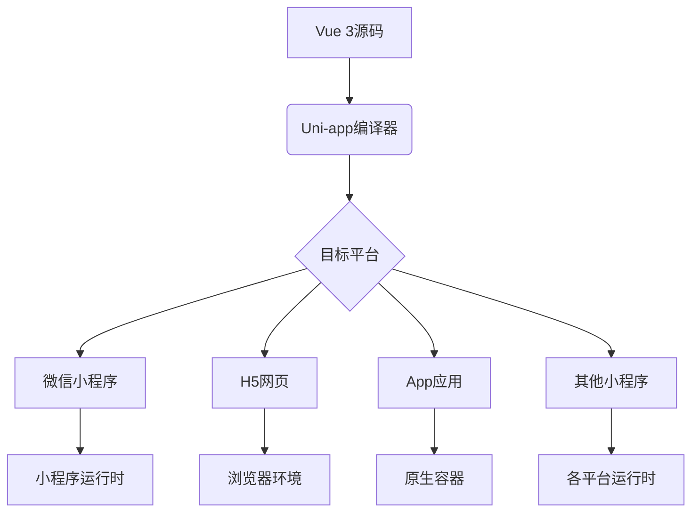
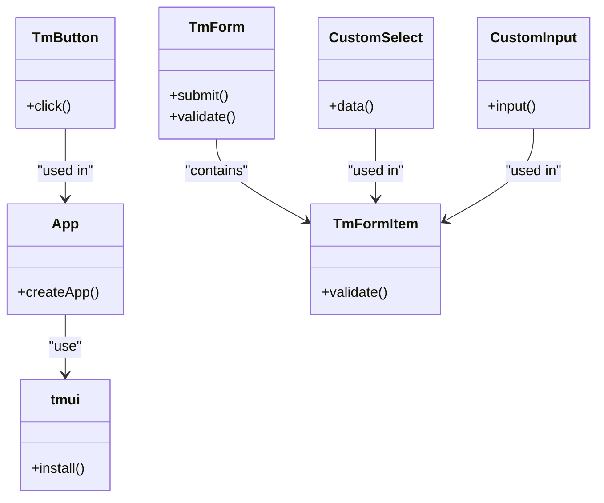
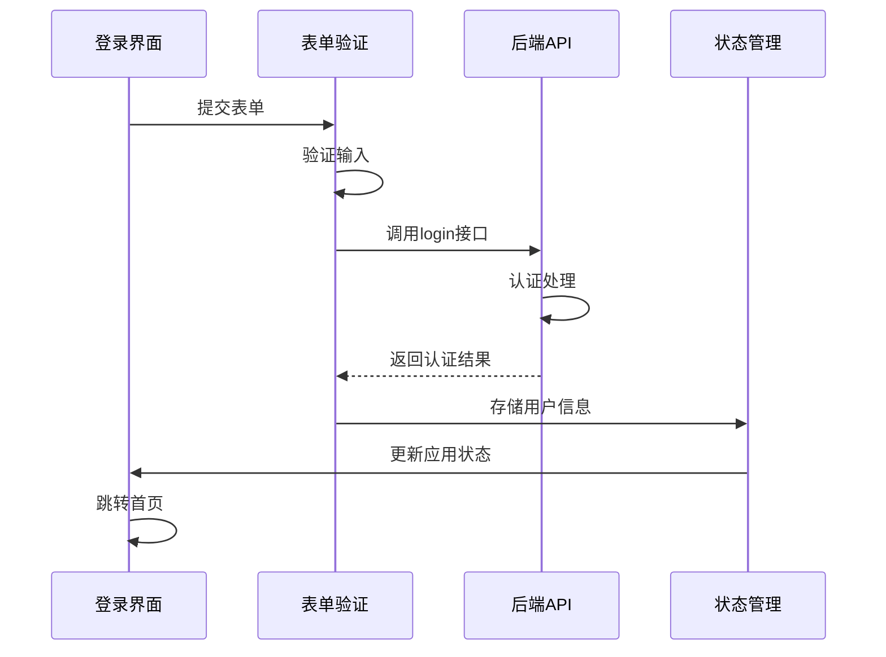
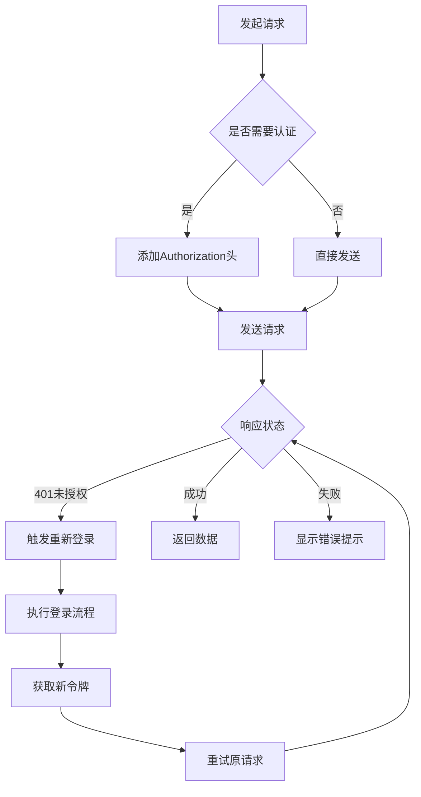

# 移动端技术栈


**本文档引用文件**  
- [package.json](https://github.com/sail-sail/nest/blob/main/uni/package.json)
- [main.ts](https://github.com/sail-sail/nest/blob/main/uni/src/main.ts)
- [App.vue](https://github.com/sail-sail/nest/blob/main/uni/src/App.vue)
- [Login.vue](https://github.com/sail-sail/nest/blob/main/uni/src/pages/index/Login.vue)
- [Api.ts](https://github.com/sail-sail/nest/blob/main/uni/src/pages/index/Api.ts)
- [request.ts](https://github.com/sail-sail/nest/blob/main/uni/src/utils/request.ts)
- [config.ts](https://github.com/sail-sail/nest/blob/main/uni/src/utils/config.ts)


## 目录
1. [项目概述](#项目概述)
2. [Uni-app框架解析](#uni-app框架解析)
3. [tm-ui组件库集成与使用](#tm-ui组件库集成与使用)
4. [移动端工程化实践](#移动端工程化实践)
5. [核心功能实现分析](#核心功能实现分析)
6. [网络请求与GraphQL集成](#网络请求与graphql集成)
7. [条件编译与多端适配](#条件编译与多端适配)
8. [性能优化与用户体验](#性能优化与用户体验)
9. [开发者学习路径建议](#开发者学习路径建议)

## 项目概述

本项目采用Uni-app框架构建跨平台移动端应用，基于Vue 3与Pinia状态管理，结合tm-ui组件库实现现代化UI交互。项目支持微信小程序、H5、App等多种终端，通过统一代码库实现"一次开发，多端运行"的目标。核心架构采用模块化设计，集成GraphQL接口通信、响应式数据流和组件化UI体系。

**Section sources**
- [package.json](https://github.com/sail-sail/nest/blob/main/uni/package.json#L1-L117)

## Uni-app框架解析

Uni-app是一个基于Vue.js的跨平台开发框架，允许开发者使用一套代码同时发布到iOS、Android、Web以及各类小程序平台。其核心机制是通过编译器将Vue单文件组件转换为目标平台的原生代码或运行时代码。

### 工作原理
Uni-app通过条件编译和平台适配层实现跨平台兼容性。在编译阶段，根据目标平台（如mp-weixin、h5、app）生成对应的平台特定代码。运行时通过统一的API抽象层调用各平台原生能力。

### 多端编译机制
通过`package.json`中的scripts配置实现多端构建：
```json
"scripts": {
  "dev:mp-weixin": "uni -p mp-weixin",
  "dev:h5": "uni",
  "build:mp-weixin": "uni build -p mp-weixin",
  "build:h5": "uni build"
}
```
使用`-p`参数指定目标平台，支持微信小程序(mp-weixin)、H5、App等多种输出格式。

### 平台适配策略
项目通过条件编译指令处理平台差异：
```typescript
// #ifdef H5
// H5特定逻辑
// #endif
// #ifdef MP-WEIXIN
// 微信小程序特定逻辑
// #endif
```



**Diagram sources**
- [package.json](https://github.com/sail-sail/nest/blob/main/uni/package.json#L20-L50)

**Section sources**
- [package.json](https://github.com/sail-sail/nest/blob/main/uni/package.json#L1-L117)

## tm-ui组件库集成与使用

tm-ui是本项目采用的UI组件库，提供丰富的移动端组件和主题系统，支持按需引入和样式定制。

### 组件库集成
在`main.ts`中完成tm-ui的全局注册：
```typescript
import tmui from "./uni_modules/tm-ui";
app.use(tmui);
```
通过Vue插件机制将所有tm-ui组件注入到全局应用实例中，实现组件的全局可用性。

### 核心组件使用示例
以登录页面为例，展示tm-ui组件的实际应用：

```vue
<tm-form ref="formRef" v-model="login_input" :label-width="120">
  <tm-form-item label="租户" name="tenant_id">
    <CustomSelect v-model="login_input.tenant_id">
      <template #left>
        <i un-i="iconfont-tenant"></i>
      </template>
    </CustomSelect>
  </tm-form-item>
  <tm-form-item label="用户名" name="username">
    <CustomInput v-model="login_input.username" placeholder="请输入 用户名">
      <template #left>
        <i un-i="iconfont-user"></i>
      </template>
    </CustomInput>
  </tm-form-item>
  <tm-button block @click="formRef?.submit()">登录</tm-button>
</tm-form>
```

### 样式定制与扩展
tm-ui支持通过SCSS变量进行主题定制，在`App.vue`中引入自定义样式：
```scss
@use "./uni_modules/tm-ui/css/remixicon.min.css";
@use "./assets/style/common.scss";
```
通过UnoCSS原子化CSS引擎实现细粒度样式控制，支持`un-*`前缀的实用类。



**Diagram sources**
- [main.ts](https://github.com/sail-sail/nest/blob/main/uni/src/main.ts#L1-L29)
- [App.vue](https://github.com/sail-sail/nest/blob/main/uni/src/App.vue#L1-L21)
- [Login.vue](https://github.com/sail-sail/nest/blob/main/uni/src/pages/index/Login.vue#L1-L228)

**Section sources**
- [main.ts](https://github.com/sail-sail/nest/blob/main/uni/src/main.ts#L1-L29)
- [App.vue](https://github.com/sail-sail/nest/blob/main/uni/src/App.vue#L1-L21)
- [Login.vue](https://github.com/sail-sail/nest/blob/main/uni/src/pages/index/Login.vue#L1-L228)

## 移动端工程化实践

项目建立了完整的移动端工程化体系，涵盖状态管理、路由控制、构建流程等关键环节。

### 状态管理方案
采用Pinia作为状态管理库，创建用户状态存储：
```typescript
const usrStore = useUsrStore();
usrStore.setAuthorization(token);
```
通过`$ref`和`ref`实现响应式数据绑定，确保状态变更能及时反映到UI层。

### 构建与调试流程
项目配置了完整的开发-测试-生产工作流：
- 开发环境：`npm run dev:mp-weixin` 启动微信小程序调试
- 测试构建：`npm run build-test` 生成测试包
- 生产构建：`npm run build-prod` 生成生产包

### 目录结构规范
遵循功能模块化组织原则：
```
src/
├── pages/        # 页面模块
├── components/   # 通用组件
├── utils/        # 工具函数
├── store/        # 状态管理
├── api/          # 接口定义
└── assets/       # 静态资源
```

**Section sources**
- [main.ts](https://github.com/sail-sail/nest/blob/main/uni/src/main.ts#L1-L29)
- [store/usr.ts](https://github.com/sail-sail/nest/blob/main/uni/src/store/usr.ts)

## 核心功能实现分析

深入分析登录认证等核心业务流程的实现机制。

### 登录流程实现
登录功能包含完整的用户交互和状态管理：

```typescript
async function onLogin(formSubmitResult?: TM.FORM_SUBMIT_RESULT) {
  if (formSubmitResult?.isPass === false) return;
  
  const loginModel = await login(login_input.value);
  if (!loginModel.authorization) return;
  
  usrStore.setAuthorization(loginModel.authorization);
  usrStore.setUsrId(loginModel.usr_id);
  // ... 设置其他用户信息
  
  await uni.reLaunch({ url: redirect_uri });
}
```

### 生命周期管理
合理利用页面生命周期钩子：
```typescript
onLoad(async function(query) {
  if (query?.redirect_uri) {
    redirect_uri = decodeURIComponent(query.redirect_uri);
  }
  await initFrame();
});
```



**Diagram sources**
- [Login.vue](https://github.com/sail-sail/nest/blob/main/uni/src/pages/index/Login.vue#L1-L228)
- [Api.ts](https://github.com/sail-sail/nest/blob/main/uni/src/pages/index/Api.ts#L1-L144)

**Section sources**
- [Login.vue](https://github.com/sail-sail/nest/blob/main/uni/src/pages/index/Login.vue#L1-L228)

## 网络请求与GraphQL集成

项目采用GraphQL作为主要数据交互协议，配合自定义请求封装实现高效通信。

### GraphQL查询封装
在`Api.ts`中定义类型安全的GraphQL操作：
```typescript
export async function getLoginTenants(variables: { domain: string }) {
  const data = await query({
    query: /* GraphQL */ `
      query($domain: String!) {
        getLoginTenants(domain: $domain) {
          id
          lbl
        }
      }
    `,
    variables,
  });
  return data.getLoginTenants;
}
```

### 请求拦截与错误处理
`request.ts`提供了完整的请求拦截机制：
```typescript
export async function request<T>(config: { url?: string; showErrMsg?: boolean }) {
  try {
    // 显示加载状态
    indexStore.addLoading();
    // 自动添加认证头
    const authorization = usrStore.getAuthorization();
    // 发起请求
    res = await uni.request(config as any);
  } catch(err) {
    // 统一错误提示
    if (config.showErrMsg) {
      uni.showToast({ title: err.toString(), icon: "none" });
    }
    throw err;
  } finally {
    // 隐藏加载状态
    indexStore.minusLoading();
  }
}
```

### 认证令牌管理
自动处理JWT令牌的刷新与存储：
```typescript
if (data && (data.key === "token_empty" || data.key === "refresh_token_expired")) {
  usrStore.setAuthorization("");
  if (await uniLogin()) {
    return await request(config); // 自动重试
  }
}
```



**Diagram sources**
- [request.ts](https://github.com/sail-sail/nest/blob/main/uni/src/utils/request.ts#L1-L704)
- [Api.ts](https://github.com/sail-sail/nest/blob/main/uni/src/pages/index/Api.ts#L1-L144)

**Section sources**
- [request.ts](https://github.com/sail-sail/nest/blob/main/uni/src/utils/request.ts#L1-L704)
- [Api.ts](https://github.com/sail-sail/nest/blob/main/uni/src/pages/index/Api.ts#L1-L144)

## 条件编译与多端适配

项目通过精细化的条件编译实现不同平台的差异化处理。

### 环境配置管理
`config.ts`根据运行环境动态配置服务地址：
```typescript
if (import.meta.env.MODE === "development") {
  host = "localhost";
  port = "4000";
} else if (import.meta.env.MODE === "production") {
  // 生产环境配置
}
```

### 平台特定逻辑
使用条件编译指令处理平台差异：
```typescript
// #ifdef H5
// H5特有的OAuth2登录流程
// #endif
// #ifdef MP-WEIXIN
// 微信小程序特有的code2Session流程
// #endif
```

### 微信生态适配
针对企业微信和微信公众号提供专门的登录适配：
```typescript
// #ifdef H5
if (userAgent.isWxwork || userAgent.isWechat) {
  // 企业微信登录流程
}
// #endif
```

**Section sources**
- [config.ts](https://github.com/sail-sail/nest/blob/main/uni/src/utils/config.ts#L1-L118)
- [request.ts](https://github.com/sail-sail/nest/blob/main/uni/src/utils/request.ts#L1-L704)

## 性能优化与用户体验

项目在性能优化和用户体验方面采取了多项措施。

### 加载性能优化
- 实现全局加载状态管理
- 采用懒加载策略
- 优化图片加载（getImgUrl函数支持压缩参数）

### 用户体验设计
- 统一的错误提示机制（短消息+模态框）
- 自动化的认证状态管理
- 友好的表单验证反馈
- 平滑的页面跳转动画

### 资源管理
```typescript
export function getImgUrl(model: { id: string; width?: number; height?: number }) {
  const params = `w=${model.width}&h=${model.height}&q=80`;
  return `${cfg.url}/oss/img?id=${model.id}&${params}`;
}
```
支持按需获取指定尺寸的图片资源，减少带宽消耗。

**Section sources**
- [request.ts](https://github.com/sail-sail/nest/blob/main/uni/src/utils/request.ts#L1-L704)
- [config.ts](https://github.com/sail-sail/nest/blob/main/uni/src/utils/config.ts#L1-L118)

## 开发者学习路径建议

为新开发者提供高效的学习路线图。

### 基础技能要求
1. **Vue 3基础**：掌握Composition API、响应式系统
2. **TypeScript**：理解类型定义、接口使用
3. **Uni-app框架**：熟悉跨平台开发概念
4. **GraphQL**：了解查询语法和类型系统

### 学习资源推荐
- 官方文档：Uni-app、tm-ui、Pinia
- 代码示例：从`Login.vue`开始阅读
- 调试技巧：熟练使用uni-devtools

### 实践建议
1. 从简单的页面修改开始
2. 逐步理解状态管理流程
3. 掌握网络请求的调试方法
4. 学习条件编译的实际应用

### 调试技巧
- 使用`console.log`配合uni-app开发者工具
- 利用Vite的热重载功能
- 通过网络面板监控GraphQL请求

**Section sources**
- [Login.vue](https://github.com/sail-sail/nest/blob/main/uni/src/pages/index/Login.vue#L1-L228)
- [main.ts](https://github.com/sail-sail/nest/blob/main/uni/src/main.ts#L1-L29)
- [request.ts](https://github.com/sail-sail/nest/blob/main/uni/src/utils/request.ts#L1-L704)