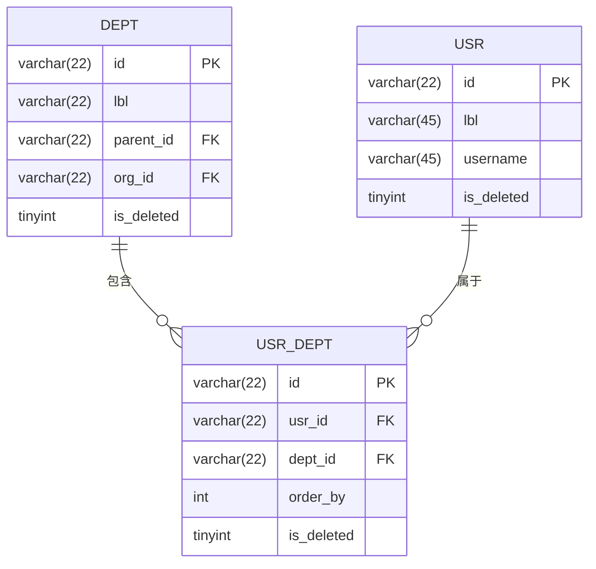
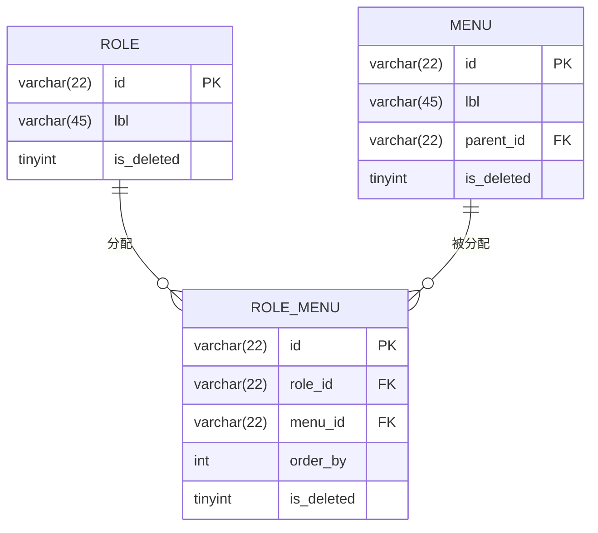
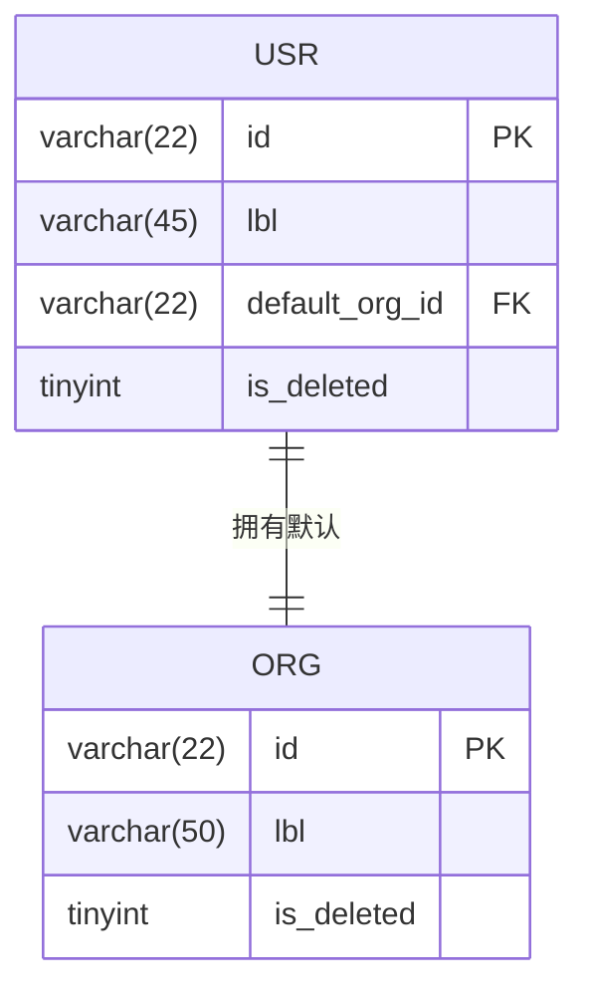

# 关系设计


**本文档引用的文件**  
- [role.dao.ts](https://github.com/sail-sail/nest/blob/main/deno/gen/base/role/role.dao.ts)
- [dept.dao.ts](https://github.com/sail-sail/nest/blob/main/deno/gen/base/dept/dept.dao.ts)
- [base.sql](https://github.com/sail-sail/nest/blob/main/codegen/src/tables/base/base.sql)
- [types.ts](https://github.com/sail-sail/nest/blob/main/deno/gen/types.ts)


## 目录
1. [引言](#引言)
2. [数据库关系设计](#数据库关系设计)
3. [实体关系实现](#实体关系实现)
4. [数据访问层实现](#数据访问层实现)
5. [GraphQL查询处理](#graphql查询处理)
6. [最佳实践与性能优化](#最佳实践与性能优化)

## 引言
本设计文档系统性地介绍了Nest项目中实体间关系的实现方式。通过分析角色、菜单、用户、部门等核心实体之间的关联，详细说明了一对一、一对多和多对多关系在数据库层面的设计模式。文档涵盖了从数据库表结构设计到DAO层数据访问逻辑，再到GraphQL查询处理的完整技术栈，为开发者提供了关系设计的全面指导。

## 数据库关系设计

### 一对多关系设计
在本系统中，一对多关系通过外键约束实现。以部门（dept）和用户（usr）为例，`base_dept`表与`base_usr`表通过`base_usr_dept`关联表建立一对多关系。



**图示来源**  
- [base.sql](https://github.com/sail-sail/nest/blob/main/codegen/src/tables/base/base.sql#L191-L207)

### 多对多关系设计
多对多关系通过关联表实现。以角色（role）和菜单（menu）为例，`base_role`表与`base_menu`表通过`base_role_menu`关联表建立多对多关系。



**图示来源**  
- [base.sql](https://github.com/sail-sail/nest/blob/main/codegen/src/tables/base/base.sql#L561-L582)

### 一对一关系设计
一对一关系通过唯一外键实现。以用户（usr）和默认组织（org）为例，`base_usr`表中的`default_org_id`字段作为外键指向`base_org`表，形成一对一关系。



**图示来源**  
- [base.sql](https://github.com/sail-sail/nest/blob/main/codegen/src/tables/base/base.sql#L278-L322)

## 实体关系实现

### 角色与菜单关系
角色与菜单之间存在多对多关系，通过`base_role_menu`关联表实现。每个角色可以拥有多个菜单权限，每个菜单也可以被多个角色分配。

```sql
CREATE TABLE `base_role_menu` (
  `id` varchar(22) NOT NULL COMMENT 'ID',
  `role_id` varchar(22) NOT NULL DEFAULT '' COMMENT '角色',
  `menu_id` varchar(22) NOT NULL DEFAULT '' COMMENT '菜单',
  `order_by` int unsigned NOT NULL DEFAULT 1 COMMENT '排序',
  `tenant_id` varchar(22) NOT NULL DEFAULT '' COMMENT '租户',
  `is_deleted` tinyint unsigned NOT NULL DEFAULT 0 COMMENT '删除',
  INDEX (`role_id`, `menu_id`, `tenant_id`, `is_deleted`),
  PRIMARY KEY (`id`)
) ENGINE=InnoDB DEFAULT CHARSET=utf8mb4 COMMENT='角色菜单';
```

### 用户与部门关系
用户与部门之间存在多对多关系，通过`base_usr_dept`关联表实现。一个用户可以属于多个部门，一个部门也可以包含多个用户。

```sql
CREATE TABLE `base_usr_dept` (
  `id` varchar(22) NOT NULL COMMENT 'ID',
  `usr_id` varchar(22) NOT NULL DEFAULT '' COMMENT '用户',
  `dept_id` varchar(22) NOT NULL DEFAULT '' COMMENT '部门',
  `order_by` int unsigned NOT NULL DEFAULT 1 COMMENT '排序',
  `tenant_id` varchar(22) NOT NULL DEFAULT '' COMMENT '租户',
  `is_deleted` tinyint unsigned NOT NULL DEFAULT 0 COMMENT '删除',
  INDEX (`usr_id`, `dept_id`, `tenant_id`, `is_deleted`),
  PRIMARY KEY (`id`)
) ENGINE=InnoDB DEFAULT CHARSET=utf8mb4 COMMENT='用户部门';
```

### 部门负责人关系
部门与负责人之间存在一对多关系，通过`base_dept_usr`关联表实现。一个部门可以有多个负责人，一个用户也可以担任多个部门的负责人。

```sql
CREATE TABLE `base_dept_usr` (
  `id` varchar(22) NOT NULL COMMENT 'ID',
  `dept_id` varchar(22) NOT NULL DEFAULT '' COMMENT '部门',
  `usr_id` varchar(22) NOT NULL DEFAULT '' COMMENT '负责人',
  `order_by` int unsigned NOT NULL DEFAULT 1 COMMENT '排序',
  `tenant_id` varchar(22) NOT NULL DEFAULT '' COMMENT '租户',
  `is_deleted` tinyint unsigned NOT NULL DEFAULT 0 COMMENT '删除',
  INDEX (`dept_id`, `usr_id`, `tenant_id`, `is_deleted`),
  PRIMARY KEY (`id`)
) ENGINE=InnoDB DEFAULT CHARSET=utf8mb4 COMMENT='部门负责人';
```

## 数据访问层实现

### DAO层关系查询
在DAO层，通过复杂的SQL查询实现关联数据的获取。以角色DAO为例，`getFromQuery`方法使用多个LEFT JOIN来获取角色关联的菜单、权限等信息。

```typescript
// deno-lint-ignore require-await
async function getFromQuery(
  args: QueryArgs,
  search?: Readonly<RoleSearch>,
  options?: {
  },
) {
  
  const is_deleted = search?.is_deleted ?? 0;
  let fromQuery = `base_role t
  left join base_role_menu
    on base_role_menu.role_id=t.id
    and base_role_menu.is_deleted=${ args.push(is_deleted) }
  left join base_menu
    on base_role_menu.menu_id=base_menu.id
    and base_menu.is_deleted=${ args.push(is_deleted) }
  left join(select
  json_objectagg(base_role_menu.order_by,base_menu.id) menu_ids,
  json_objectagg(base_role_menu.order_by,base_menu.lbl) menu_ids_lbl,
  base_role.id role_id
  from base_role_menu
  inner join base_menu on base_menu.id=base_role_menu.menu_id
  inner join base_role on base_role.id=base_role_menu.role_id
  where base_role_menu.is_deleted=${ args.push(is_deleted) }
  group by role_id) _menu on _menu.role_id=t.id`;
  return fromQuery;
}
```

**代码来源**  
- [role.dao.ts](https://github.com/sail-sail/nest/blob/main/deno/gen/base/role/role.dao.ts#L218-L253)

### 级联删除实现
在删除操作中，实现了级联删除逻辑，确保关联数据的一致性。以角色删除为例，同时删除角色关联的菜单、权限等数据。

```typescript
let sql = `update base_role set is_deleted=1`;
// ... 其他字段更新
sql += ` where id=${ args.push(id) } limit 1`;
const res = await execute(sql, args);
affectedRows += res.affectedRows;

// 删除关联的菜单权限
{
  const menu_ids = oldModel.menu_ids;
  if (menu_ids && menu_ids.length > 0) {
    const args = new QueryArgs();
    const sql = `update base_role_menu set is_deleted=1 where role_id=${ args.push(id) } and menu_id in (${ args.push(menu_ids) }) and is_deleted=0`;
    await execute(sql, args);
  }
}

// 删除关联的按钮权限
{
  const permit_ids = oldModel.permit_ids;
  if (permit_ids && permit_ids.length > 0) {
    const args = new QueryArgs();
    const sql = `update base_role_permit set is_deleted=1 where role_id=${ args.push(id) } and permit_id in (${ args.push(permit_ids) }) and is_deleted=0`;
    await execute(sql, args);
  }
}
```

**代码来源**  
- [role.dao.ts](https://github.com/sail-sail/nest/blob/main/deno/gen/base/role/role.dao.ts#L2415-L2453)

## GraphQL查询处理

### 嵌套查询实现
在GraphQL查询中，通过嵌套查询获取关联数据。以部门模型为例，包含了用户负责人（usr_ids）的关联字段。

```typescript
export interface DeptModel {
  __typename?: 'DeptModel';
  /** ID */
  id: Scalars['DeptId']['output'];
  /** 名称 */
  lbl: Scalars['String']['output'];
  /** 父部门 */
  parent_id: Scalars['DeptId']['output'];
  /** 父部门 */
  parent_id_lbl: Scalars['String']['output'];
  /** 组织 */
  org_id: Scalars['OrgId']['output'];
  /** 组织 */
  org_id_lbl: Scalars['String']['output'];
  /** 部门负责人 */
  usr_ids: Array<Scalars['UsrId']['output']>;
  /** 部门负责人 */
  usr_ids_lbl: Array<Scalars['String']['output']>;
  /** 已删除 */
  is_deleted: Scalars['Int']['output'];
}
```

**代码来源**  
- [types.ts](https://github.com/sail-sail/nest/blob/main/deno/gen/types.ts#L861-L909)

### 数据加载器使用
通过在DAO层的SQL查询中使用JSON聚合函数，将关联数据预加载到主查询结果中，避免了N+1查询问题。

```sql
left join(select
  json_objectagg(base_dept_usr.order_by,base_usr.id) usr_ids,
  json_objectagg(base_dept_usr.order_by,base_usr.lbl) usr_ids_lbl,
  base_dept.id dept_id
  from base_dept_usr
  inner join base_usr on base_usr.id=base_dept_usr.usr_id
  inner join base_dept on base_dept.id=base_dept_usr.dept_id
  where base_dept_usr.is_deleted=${ args.push(is_deleted) }
  group by dept_id) _usr on _usr.dept_id=t.id
```

**代码来源**  
- [dept.dao.ts](https://github.com/sail-sail/nest/blob/main/deno/gen/base/dept/dept.dao.ts#L187-L235)

## 最佳实践与性能优化

### 性能优化建议
1. **索引优化**：为所有外键字段和常用查询条件字段创建索引
2. **批量操作**：使用批量插入和更新操作减少数据库往返次数
3. **查询优化**：使用JSON聚合函数预加载关联数据，避免N+1查询
4. **缓存策略**：对频繁访问但不常变更的数据实施缓存

### 常见陷阱规避
1. **循环引用**：避免在实体关系设计中出现循环引用
2. **级联删除风险**：谨慎使用级联删除，确保不会意外删除重要数据
3. **事务管理**：在涉及多个表的操作中使用事务确保数据一致性
4. **软删除处理**：正确处理`is_deleted`字段，避免查询到已删除的数据

### 设计原则
1. **单一职责**：每个表只负责一个业务实体
2. **数据完整性**：通过外键约束和检查约束保证数据完整性
3. **可扩展性**：设计时考虑未来可能的业务扩展
4. **性能优先**：在满足业务需求的前提下优先考虑查询性能