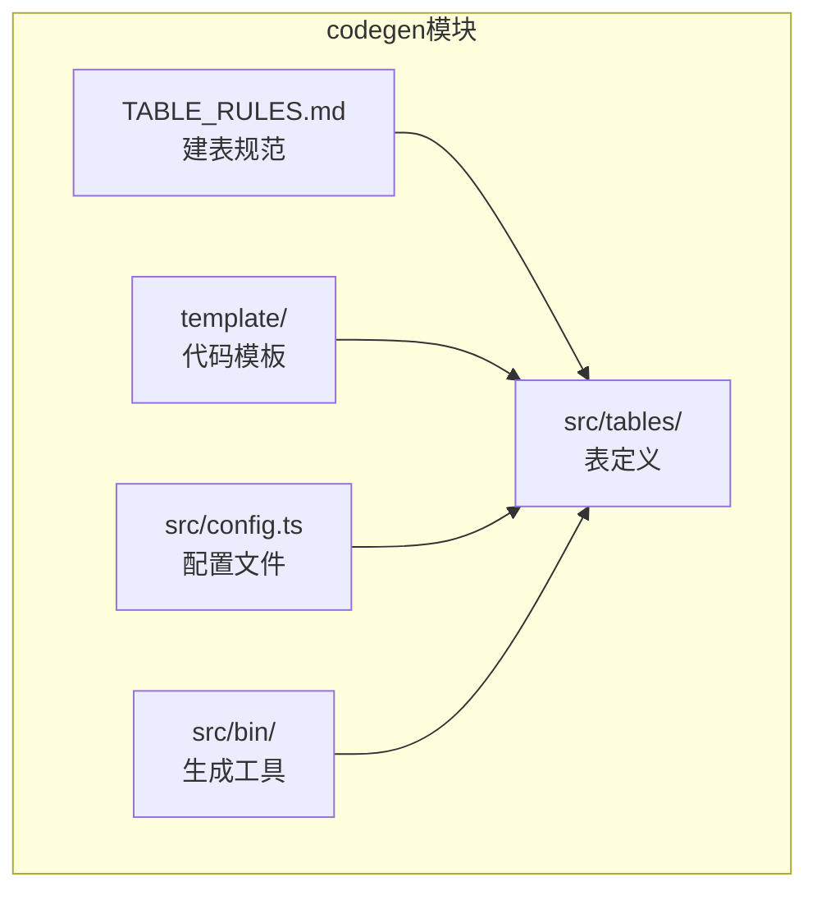
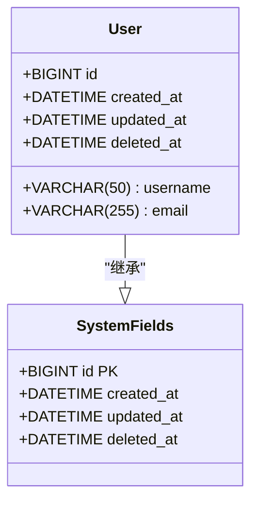

# 建表规范


**本文档引用文件**  
- [TABLE_RULES.md](https://github.com/sail-sail/nest/blob/main/codegen/.github/TABLE_RULES.md)
- [create_table.md](https://github.com/sail-sail/nest/blob/main/codegen/.github/create_table.md)
- [create_table_cnf.md](https://github.com/sail-sail/nest/blob/main/codegen/.github/create_table_cnf.md)
- [dict.md](https://github.com/sail-sail/nest/blob/main/codegen/.github/dict.md)
- [config.ts](https://github.com/sail-sail/nest/blob/main/codegen/src/config.ts)
- [tables.ts](https://github.com/sail-sail/nest/blob/main/codegen/src/tables/tables.ts)
- [base.sql](https://github.com/sail-sail/nest/blob/main/codegen/src/tables/base/base.sql)


## 目录
1. [引言](#引言)
2. [项目结构分析](#项目结构分析)
3. [核心建表规范](#核心建表规范)
4. [字段类型选择标准](#字段类型选择标准)
5. [系统字段规范](#系统字段规范)
6. [约束定义规则](#约束定义规则)
7. [SQL建表示例](#sql建表示例)
8. [常见错误与反模式](#常见错误与反模式)
9. [总结](#总结)

## 引言

本规范文档旨在为Nest项目中的数据库表结构设计提供统一、标准化的指导原则。通过遵循本规范，开发团队可以确保数据库设计的一致性、可维护性和性能优化。文档重点阐述了表命名约定、字段类型选择、约束定义以及系统字段的使用标准，所有规则均基于`TABLE_RULES.md`文件中定义的规范。

**Section sources**
- [TABLE_RULES.md](https://github.com/sail-sail/nest/blob/main/codegen/.github/TABLE_RULES.md)

## 项目结构分析

项目根目录下的`codegen`模块是代码生成和数据库管理的核心组件。该模块包含建表规则、模板文件和配置信息，支持自动化生成数据库表结构及相关代码。



**Diagram sources**
- [TABLE_RULES.md](https://github.com/sail-sail/nest/blob/main/codegen/.github/TABLE_RULES.md)
- [config.ts](https://github.com/sail-sail/nest/blob/main/codegen/src/config.ts)
- [tables.ts](https://github.com/sail-sail/nest/blob/main/codegen/src/tables/tables.ts)

## 核心建表规范

### 表命名约定

数据库表名应遵循以下命名规则：

- **小写字母**：所有表名必须使用小写字母
- **下划线分隔**：单词间使用下划线`_`连接
- **语义清晰**：表名应准确反映其业务含义
- **单数形式**：优先使用单数名词（如`user`而非`users`）
- **前缀规范**：基础表无前缀，业务扩展表可使用`biz_`前缀

**示例：**
- 正确：`user`, `order_info`, `product_category`
- 错误：`User`, `Users`, `orderInfo`, `PRODUCT_CATEGORY`

### 模块化组织

表结构定义位于`codegen/src/tables/`目录下，采用模块化组织方式：

- `base/`：基础系统表（如用户、角色、菜单等）
- 其他模块：按业务领域划分

**Section sources**
- [TABLE_RULES.md](https://github.com/sail-sail/nest/blob/main/codegen/.github/TABLE_RULES.md)
- [tables.ts](https://github.com/sail-sail/nest/blob/main/codegen/src/tables/tables.ts)

## 字段类型选择标准

### 字符串类型

#### VARCHAR
- **用途**：存储可变长度的字符串
- **长度选择**：
  - 短文本（1-50字符）：`VARCHAR(50)`
  - 中等文本（51-255字符）：`VARCHAR(255)`
  - 长文本（256-1000字符）：`VARCHAR(1000)`
- **最佳实践**：避免过度分配长度，根据实际需求选择最合适的长度

#### TEXT
- **用途**：存储长文本内容（如描述、备注、文章正文）
- **类型选择**：
  - `TINYTEXT`：最多255字节
  - `TEXT`：最多65,535字节
  - `MEDIUMTEXT`：最多16,777,215字节
  - `LONGTEXT`：最多4,294,967,295字节
- **建议**：一般情况下使用`TEXT`即可满足大多数需求

### 数值类型

#### BIGINT
- **用途**：存储大整数，特别是主键ID
- **范围**：-9,223,372,036,854,775,808 到 9,223,372,036,854,775,807
- **优势**：支持超大数量级的数据，适合分布式系统中的唯一标识
- **使用场景**：主键、外键、计数器等

#### INT
- **用途**：存储普通整数
- **范围**：-2,147,483,648 到 2,147,483,647
- **使用场景**：状态码、排序号、普通计数等

### 日期时间类型

#### DATETIME
- **用途**：存储日期和时间
- **格式**：`YYYY-MM-DD HH:MM:SS`
- **精度**：标准精度（不带时区）
- **使用场景**：创建时间、更新时间、业务时间点

#### TIMESTAMP
- **用途**：存储时间戳，自动时区转换
- **特性**：受时区影响，自动转换
- **使用场景**：需要时区支持的场景（本项目中不推荐使用）

### 布尔类型

#### TINYINT(1)
- **用途**：表示布尔值
- **约定**：`0`表示`false`，`1`表示`true`
- **替代方案**：避免使用`BOOLEAN`或`BOOL`，保持跨数据库兼容性

**Section sources**
- [TABLE_RULES.md](https://github.com/sail-sail/nest/blob/main/codegen/.github/TABLE_RULES.md)
- [create_table_cnf.md](https://github.com/sail-sail/nest/blob/main/codegen/.github/create_table_cnf.md)

## 系统字段规范

所有数据表必须包含以下系统字段，确保数据的可追溯性和完整性：

### id
- **类型**：`BIGINT`
- **约束**：`PRIMARY KEY`, `AUTO_INCREMENT`
- **说明**：全局唯一主键，采用大整数类型以支持大规模数据

### created_at
- **类型**：`DATETIME`
- **默认值**：`CURRENT_TIMESTAMP`
- **说明**：记录创建时间，自动填充

### updated_at
- **类型**：`DATETIME`
- **默认值**：`CURRENT_TIMESTAMP`
- **更新规则**：`ON UPDATE CURRENT_TIMESTAMP`
- **说明**：记录最后更新时间，每次修改自动更新

### deleted_at
- **类型**：`DATETIME`
- **默认值**：`NULL`
- **说明**：软删除标记，`NULL`表示未删除，有值表示已删除



**Diagram sources**
- [base.sql](https://github.com/sail-sail/nest/blob/main/codegen/src/tables/base/base.sql)
- [TABLE_RULES.md](https://github.com/sail-sail/nest/blob/main/codegen/.github/TABLE_RULES.md)

**Section sources**
- [base.sql](https://github.com/sail-sail/nest/blob/main/codegen/src/tables/base/base.sql)
- [TABLE_RULES.md](https://github.com/sail-sail/nest/blob/main/codegen/.github/TABLE_RULES.md)

## 约束定义规则

### 主键约束
- 每个表必须定义一个主键
- 使用`id`字段作为主键
- 类型为`BIGINT`并启用`AUTO_INCREMENT`

```sql
PRIMARY KEY (id)
```

### 唯一约束
- 对需要保证唯一性的字段添加唯一索引
- 命名规范：`uk_表名_字段名`

```sql
UNIQUE KEY uk_user_email (email)
```

### 非空约束
- 重要字段必须设置为`NOT NULL`
- 避免不必要的`NULL`值，提高数据完整性

```sql
username VARCHAR(50) NOT NULL
```

### 外键约束
- 在需要引用其他表的场景下使用外键
- 命名规范：`fk_当前表_引用表_字段`
- 级联规则根据业务需求选择

```sql
FOREIGN KEY (user_id) REFERENCES user(id) ON DELETE CASCADE
```

### 默认值约束
- 为可选字段设置合理的默认值
- 减少应用程序的判断逻辑

```sql
status TINYINT(1) DEFAULT 1
```

**Section sources**
- [TABLE_RULES.md](https://github.com/sail-sail/nest/blob/main/codegen/.github/TABLE_RULES.md)
- [create_table.md](https://github.com/sail-sail/nest/blob/main/codegen/.github/create_table.md)

## SQL建表示例

以下是一个完整的用户表建表示例，展示了所有规范的应用：

```sql
CREATE TABLE `user` (
  `id` BIGINT NOT NULL AUTO_INCREMENT COMMENT '主键ID',
  `username` VARCHAR(50) NOT NULL COMMENT '用户名',
  `email` VARCHAR(255) NOT NULL COMMENT '邮箱',
  `password` VARCHAR(255) NOT NULL COMMENT '密码',
  `real_name` VARCHAR(50) DEFAULT NULL COMMENT '真实姓名',
  `phone` VARCHAR(20) DEFAULT NULL COMMENT '手机号',
  `status` TINYINT(1) DEFAULT 1 COMMENT '状态：1-启用，0-禁用',
  `created_at` DATETIME NOT NULL DEFAULT CURRENT_TIMESTAMP COMMENT '创建时间',
  `updated_at` DATETIME NOT NULL DEFAULT CURRENT_TIMESTAMP ON UPDATE CURRENT_TIMESTAMP COMMENT '更新时间',
  `deleted_at` DATETIME DEFAULT NULL COMMENT '删除时间',
  
  PRIMARY KEY (`id`),
  UNIQUE KEY `uk_user_username` (`username`),
  UNIQUE KEY `uk_user_email` (`email`),
  INDEX `idx_user_status` (`status`),
  INDEX `idx_user_deleted_at` (`deleted_at`)
) ENGINE=InnoDB DEFAULT CHARSET=utf8mb4 COMMENT='用户表';
```

### 设计决策说明

1. **主键选择**：使用`BIGINT`而非`INT`，为未来数据增长预留空间
2. **字符集**：使用`utf8mb4`支持完整的Unicode字符（包括emoji）
3. **存储引擎**：使用`InnoDB`支持事务和外键
4. **索引设计**：
   - 唯一索引确保用户名和邮箱的唯一性
   - 普通索引优化状态和删除时间的查询
5. **注释**：每个字段都有清晰的中文注释，便于维护

**Section sources**
- [base.sql](https://github.com/sail-sail/nest/blob/main/codegen/src/tables/base/base.sql)
- [TABLE_RULES.md](https://github.com/sail-sail/nest/blob/main/codegen/.github/TABLE_RULES.md)

## 常见错误与反模式

### 错误1：使用过小的主键类型
```sql
-- 错误示例
id INT AUTO_INCREMENT PRIMARY KEY
```
**风险**：`INT`最大值约21亿，对于高并发系统可能不够用  
**解决方案**：始终使用`BIGINT`作为主键类型

### 错误2：忽略软删除字段
```sql
-- 错误示例
没有deleted_at字段
```
**风险**：无法实现数据恢复，影响数据审计  
**解决方案**：所有表都必须包含`deleted_at`字段

### 错误3：过度使用TEXT类型
```sql
-- 错误示例
title TEXT
```
**风险**：浪费存储空间，影响性能  
**解决方案**：短文本使用`VARCHAR`，长文本才使用`TEXT`

### 错误4：缺少必要索引
```sql
-- 错误示例
没有为频繁查询的字段创建索引
```
**风险**：查询性能低下，全表扫描  
**解决方案**：为`WHERE`、`ORDER BY`、`JOIN`中使用的字段创建适当索引

### 错误5：使用保留字作为字段名
```sql
-- 错误示例
order VARCHAR(50)
```
**风险**：SQL语法冲突，需要额外转义  
**解决方案**：避免使用数据库保留字，必要时使用反引号

**Section sources**
- [TABLE_RULES.md](https://github.com/sail-sail/nest/blob/main/codegen/.github/TABLE_RULES.md)
- [create_table.md](https://github.com/sail-sail/nest/blob/main/codegen/.github/create_table.md)

## 总结

本建表规范为Nest项目的数据库设计提供了全面的指导。通过遵循这些规则，可以确保：

1. **一致性**：所有开发人员遵循相同的命名和设计标准
2. **可维护性**：清晰的结构和注释便于后期维护
3. **性能优化**：合理的类型选择和索引设计提升查询效率
4. **数据完整性**：完善的约束机制保障数据质量
5. **扩展性**：`BIGINT`主键和模块化设计支持系统扩展

建议在项目初期就严格执行这些规范，并通过代码生成工具自动化实施，减少人为错误，提高开发效率。