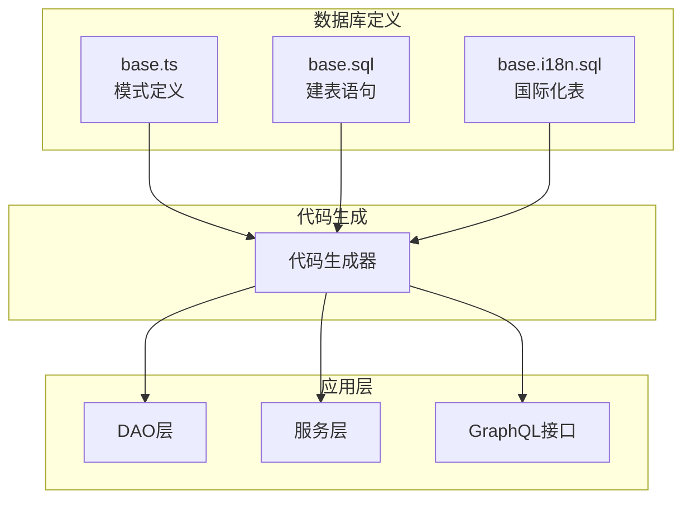
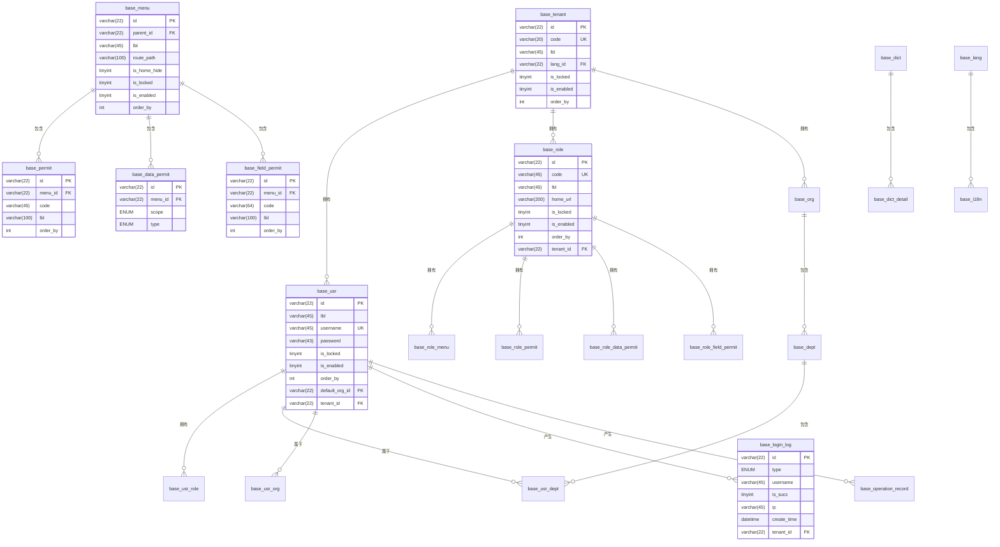
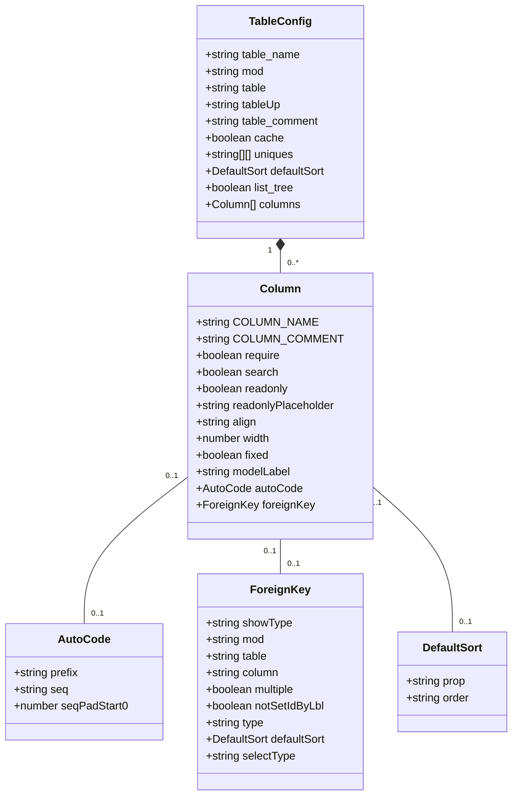
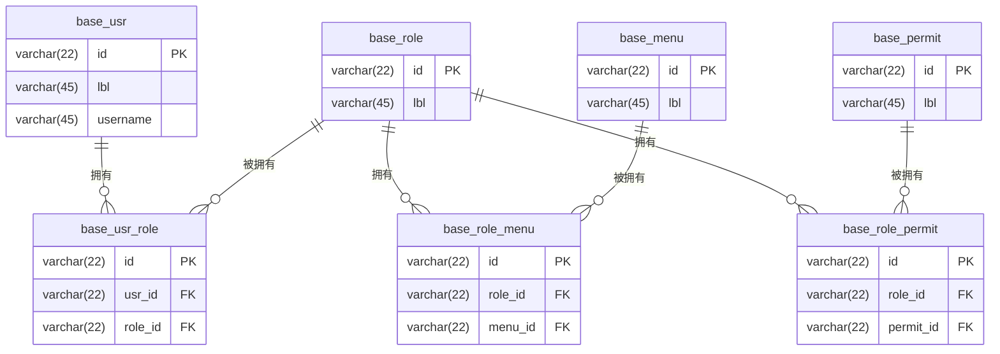
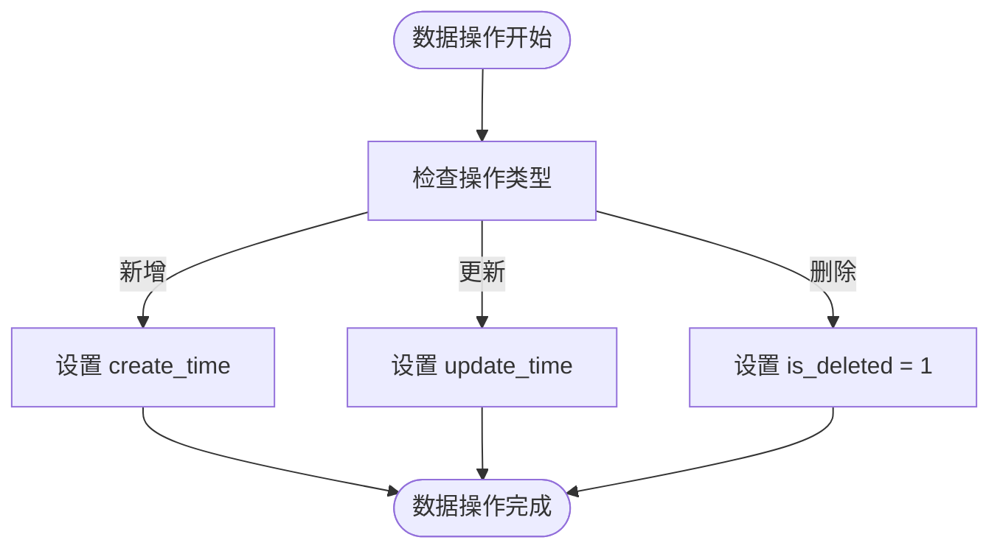
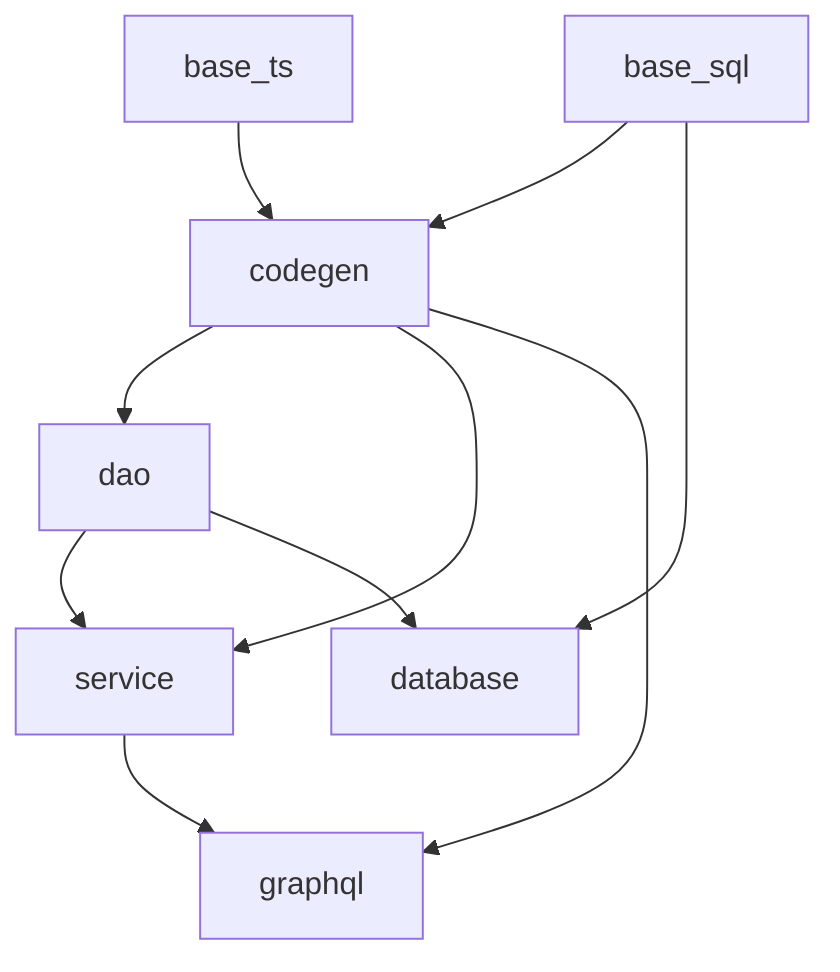

# 数据库设计

**本文档引用的文件**   
- [base.ts](https://github.com/sail-sail/nest/blob/main/codegen/src/tables/base/base.ts)
- [base.sql](https://github.com/sail-sail/nest/blob/main/codegen/src/tables/base/base.sql)
- [base.i18n.sql](https://github.com/sail-sail/nest/blob/main/codegen/src/tables/base/base.i18n.sql)
- [information_schema.ts](https://github.com/sail-sail/nest/blob/main/codegen/src/lib/information_schema.ts)
- [graphql_codegen_scalars.ts](https://github.com/sail-sail/nest/blob/main/codegen/src/template/deno/lib/script/graphql_codegen_scalars.ts)

## 目录
1. [引言](#引言)
2. [项目结构](#项目结构)
3. [核心组件](#核心组件)
4. [架构概述](#架构概述)
5. [详细组件分析](#详细组件分析)
6. [依赖分析](#依赖分析)
7. [性能考虑](#性能考虑)
8. [故障排除指南](#故障排除指南)
9. [结论](#结论)

## 引言
本文档系统性地介绍了基于 Nest 框架的数据库设计规范与最佳实践。文档详细阐述了数据库建表规范、模式定义文件结构、实体关系设计、特殊字段处理以及索引设计原则。通过分析 `base.ts` 和 `base.sql` 等核心文件，揭示了代码生成机制和数据库迁移策略，旨在为开发者提供一套完整的数据库设计与管理指南。

## 项目结构
项目采用模块化设计，数据库相关配置文件集中存放在 `codegen/src/tables/base/` 目录下。主要文件包括 `base.ts`（TypeScript 模式定义）、`base.sql`（SQL 建表语句）和 `base.i18n.sql`（国际化支持表）。代码生成器根据这些定义文件自动生成数据访问对象（DAO）、服务层和 GraphQL 接口，实现了数据库模式与应用代码的高度一致性。

**图示来源**
- [base.ts](https://github.com/sail-sail/nest/blob/main/codegen/src/tables/base/base.ts)
- [base.sql](https://github.com/sail-sail/nest/blob/main/codegen/src/tables/base/base.sql)
- [base.i18n.sql](https://github.com/sail-sail/nest/blob/main/codegen/src/tables/base/base.i18n.sql)

**本节来源**
- [base.ts](https://github.com/sail-sail/nest/blob/main/codegen/src/tables/base/base.ts)
- [base.sql](https://github.com/sail-sail/nest/blob/main/codegen/src/tables/base/base.sql)

## 核心组件
核心组件包括数据库模式定义（`base.ts`）、SQL 建表脚本（`base.sql`）和代码生成引擎。`base.ts` 文件使用 TypeScript 定义了所有数据表的结构、约束和元数据，是整个数据库设计的单一事实来源。`base.sql` 文件则包含了具体的 SQL 建表语句，确保了数据库物理结构的正确性。代码生成引擎读取这些定义，自动生成应用所需的代码，极大地提高了开发效率和代码一致性。

**本节来源**
- [base.ts](https://github.com/sail-sail/nest/blob/main/codegen/src/tables/base/base.ts)
- [base.sql](https://github.com/sail-sail/nest/blob/main/codegen/src/tables/base/base.sql)

## 架构概述
系统采用分层架构，数据库层位于最底层，为上层应用提供数据存储服务。数据库设计遵循规范化原则，同时通过代码生成技术实现了数据模型与应用逻辑的紧密耦合。实体关系通过外键和关联表实现，支持一对一、一对多和多对多关系。系统还集成了软删除、数据权限和字段权限等高级功能，确保了数据的安全性和可维护性。

**图示来源**
- [base.sql](https://github.com/sail-sail/nest/blob/main/codegen/src/tables/base/base.sql)
- [base.ts](https://github.com/sail-sail/nest/blob/main/codegen/src/tables/base/base.ts)

## 详细组件分析

### 数据库模式定义分析
数据库模式定义文件 `base.ts` 采用声明式语法，清晰地定义了每个数据表的结构和行为。每个表的定义包含 `opts`（选项）和 `columns`（列）两个主要部分。`opts` 部分定义了表级别的配置，如缓存策略、唯一约束和默认排序。`columns` 部分则详细描述了每一列的属性，包括列名、对齐方式、宽度、是否只读、是否必需、是否可搜索等。

**图示来源**
- [base.ts](https://github.com/sail-sail/nest/blob/main/codegen/src/tables/base/base.ts)

**本节来源**
- [base.ts](https://github.com/sail-sail/nest/blob/main/codegen/src/tables/base/base.ts)

### 实体关系设计分析
系统通过外键和关联表实现了复杂的数据关系。例如，用户（`base_usr`）与角色（`base_role`）之间通过 `base_usr_role` 关联表实现多对多关系。同样，角色与菜单、角色与权限之间也采用了类似的多对多关联设计。这种设计模式确保了数据的灵活性和可扩展性，允许一个用户拥有多个角色，一个角色拥有多个菜单和权限。

**图示来源**
- [base.sql](https://github.com/sail-sail/nest/blob/main/codegen/src/tables/base/base.sql)

**本节来源**
- [base.sql](https://github.com/sail-sail/nest/blob/main/codegen/src/tables/base/base.sql)

### 特殊字段处理分析
系统对创建时间、更新时间、软删除标志等系统字段进行了统一处理。所有数据表都包含 `create_time`、`update_time` 和 `is_deleted` 字段。`create_time` 和 `update_time` 字段由系统自动填充，记录数据的创建和最后修改时间。`is_deleted` 字段作为软删除标志，当记录被删除时，该字段被设置为 1，而不是从数据库中物理删除，从而保证了数据的可追溯性。

**图示来源**
- [base.sql](https://github.com/sail-sail/nest/blob/main/codegen/src/tables/base/base.sql)

**本节来源**
- [base.sql](https://github.com/sail-sail/nest/blob/main/codegen/src/tables/base/base.sql)

## 依赖分析
系统各组件之间存在明确的依赖关系。代码生成器依赖于 `base.ts` 和 `base.sql` 文件中的模式定义。应用层的 DAO、服务和 GraphQL 组件依赖于代码生成器生成的代码。数据库模式本身也存在内部依赖，如外键约束和关联表。这种清晰的依赖关系确保了系统的可维护性和可测试性。

**图示来源**
- [base.ts](https://github.com/sail-sail/nest/blob/main/codegen/src/tables/base/base.ts)
- [base.sql](https://github.com/sail-sail/nest/blob/main/codegen/src/tables/base/base.sql)
- [information_schema.ts](https://github.com/sail-sail/nest/blob/main/codegen/src/lib/information_schema.ts)

**本节来源**
- [base.ts](https://github.com/sail-sail/nest/blob/main/codegen/src/tables/base/base.ts)
- [base.sql](https://github.com/sail-sail/nest/blob/main/codegen/src/tables/base/base.sql)
- [information_schema.ts](https://github.com/sail-sail/nest/blob/main/codegen/src/lib/information_schema.ts)

## 性能考虑
数据库设计充分考虑了性能因素。通过为常用查询字段（如 `lbl`、`username`、`create_time`）创建索引，确保了查询效率。同时，采用软删除而非物理删除，避免了频繁的 DELETE 操作对性能的影响。对于大文本字段，如 `old_data` 和 `new_data`，使用了 `text` 类型，并通过 `is_deleted` 字段进行过滤，减少了不必要的数据加载。

## 故障排除指南
在进行数据库操作时，常见的问题包括外键约束冲突、唯一索引冲突和数据类型不匹配。解决这些问题的关键是仔细检查数据的完整性和一致性。例如，在插入 `base_usr_role` 记录时，必须确保 `usr_id` 和 `role_id` 在各自的表中存在。在更新 `code` 字段时，必须确保新值在 `base_role` 表中是唯一的。

**本节来源**
- [base.sql](https://github.com/sail-sail/nest/blob/main/codegen/src/tables/base/base.sql)

## 结论
本文档全面介绍了 Nest 项目的数据库设计规范和最佳实践。通过分析模式定义文件、SQL 脚本和代码生成机制，揭示了系统如何实现高效、安全和可维护的数据管理。遵循本文档中的指导原则，开发者可以更好地理解和使用该数据库系统，从而构建出高质量的应用程序。