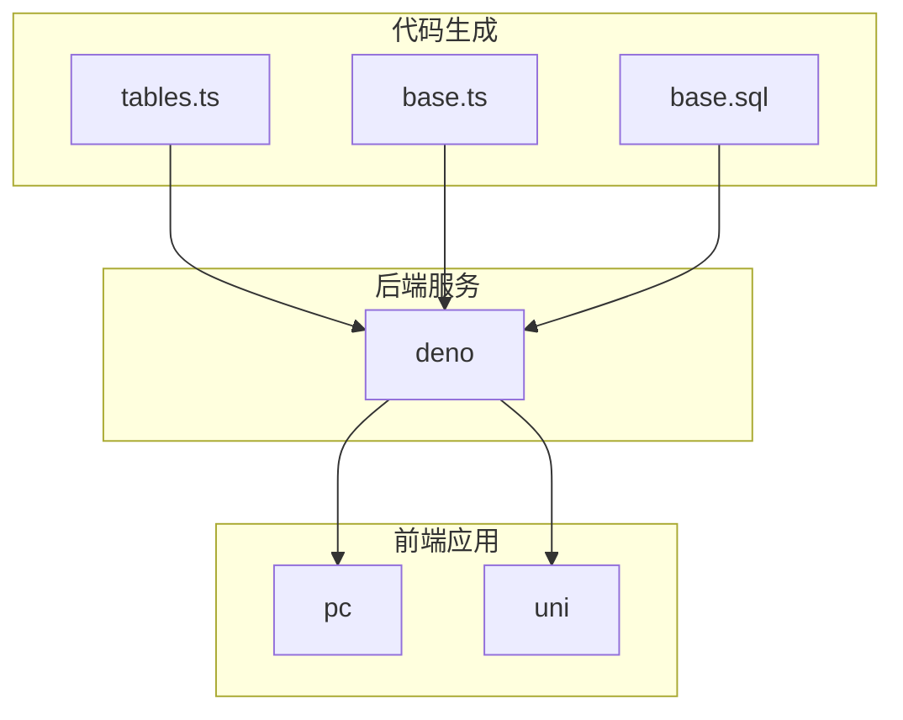
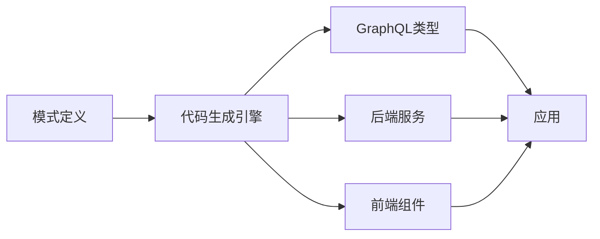
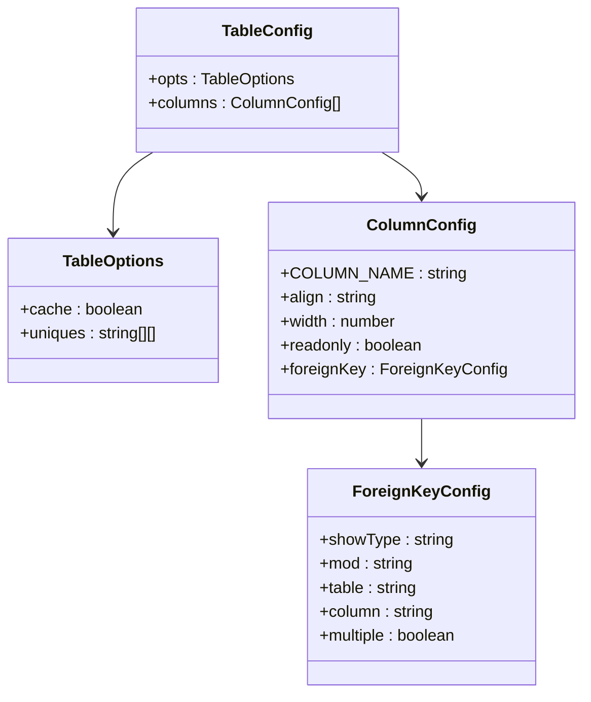
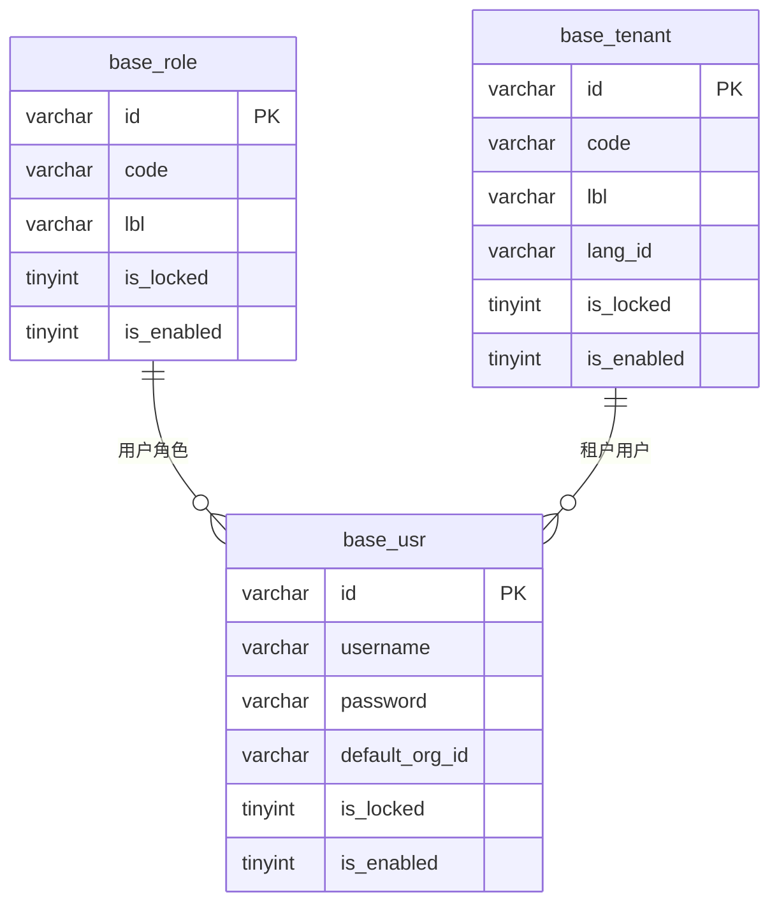
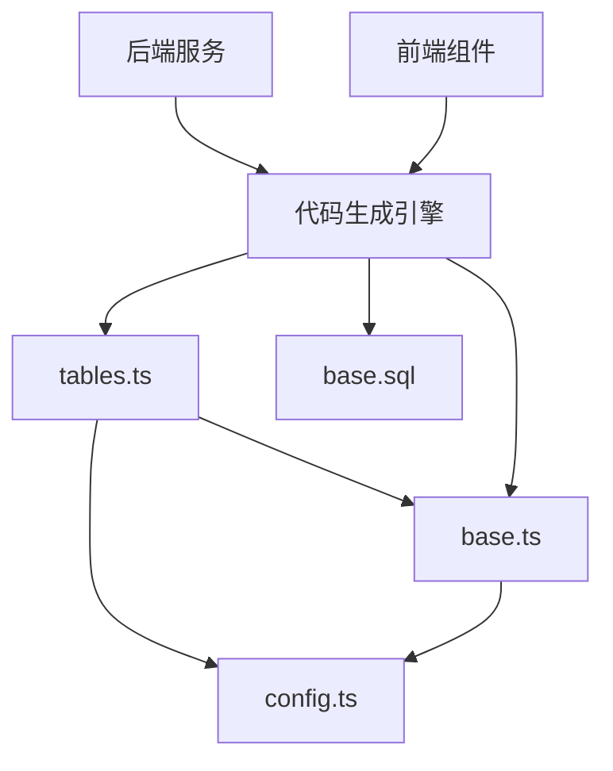

# 模式定义


**本文档中引用的文件**   
- [base.ts](https://github.com/sail-sail/nest/blob/main/codegen\src\tables\base\base.ts)
- [base.sql](https://github.com/sail-sail/nest/blob/main/codegen\src\tables\base\base.sql)
- [tables.ts](https://github.com/sail-sail/nest/blob/main/codegen\src\tables\tables.ts)
- [config.ts](https://github.com/sail-sail/nest/blob/main/codegen\src\config.ts)


## 目录
1. [简介](#简介)
2. [项目结构](#项目结构)
3. [核心组件](#核心组件)
4. [架构概述](#架构概述)
5. [详细组件分析](#详细组件分析)
6. [依赖分析](#依赖分析)
7. [性能考虑](#性能考虑)
8. [故障排除指南](#故障排除指南)
9. [结论](#结论)

## 简介
本项目是一个基于NestJS框架的后端系统，通过代码生成引擎实现数据库模式到GraphQL类型、后端服务和前端组件的自动化转换。系统采用TypeScript接口定义表结构，并通过SQL DDL语句确保数据库一致性。核心机制是通过`base.ts`中的TypeScript接口描述表结构，`base.sql`中的SQL语句定义物理表，`tables.ts`组织管理所有表定义，最终驱动代码生成引擎创建完整的应用组件。

## 项目结构
项目采用模块化分层架构，主要包含codegen、deno、pc和uni四个核心模块。codegen模块负责代码生成，包含模式定义和生成逻辑；deno模块为后端服务，包含GraphQL API和业务逻辑；pc模块为PC端前端应用；uni模块为移动端应用。模式定义文件位于`codegen/src/tables`目录下，通过TypeScript和SQL文件共同描述数据库模式。



**图表来源**
- [tables.ts](https://github.com/sail-sail/nest/blob/main/codegen\src\tables\tables.ts)
- [base.ts](https://github.com/sail-sail/nest/blob/main/codegen\src\tables\base\base.ts)
- [base.sql](https://github.com/sail-sail/nest/blob/main/codegen\src\tables\base\base.sql)

**章节来源**
- [tables.ts](https://github.com/sail-sail/nest/blob/main/codegen\src\tables\tables.ts)
- [base.ts](https://github.com/sail-sail/nest/blob/main/codegen\src\tables\base\base.ts)
- [base.sql](https://github.com/sail-sail/nest/blob/main/codegen\src\tables\base\base.sql)

## 核心组件
系统的核心组件包括模式定义文件`base.ts`、`base.sql`和`tables.ts`。`base.ts`使用TypeScript接口定义表结构和字段属性，`base.sql`提供SQL DDL语句确保数据库一致性，`tables.ts`作为入口文件整合所有表定义。这些组件共同驱动代码生成引擎，将数据库模式转换为GraphQL类型、后端服务和前端组件。

**章节来源**
- [base.ts](https://github.com/sail-sail/nest/blob/main/codegen\src\tables\base\base.ts)
- [base.sql](https://github.com/sail-sail/nest/blob/main/codegen\src\tables\base\base.sql)
- [tables.ts](https://github.com/sail-sail/nest/blob/main/codegen\src\tables\tables.ts)

## 架构概述
系统采用代码生成驱动的架构，通过模式定义文件自动生成完整的应用组件。开发者定义数据库模式后，系统自动生成GraphQL API、后端服务、前端路由和UI组件。这种架构实现了数据模型与应用组件的高度一致性，提高了开发效率和系统可维护性。



**图表来源**
- [base.ts](https://github.com/sail-sail/nest/blob/main/codegen\src\tables\base\base.ts)
- [base.sql](https://github.com/sail-sail/nest/blob/main/codegen\src\tables\base\base.sql)

## 详细组件分析

### base.ts分析
`base.ts`文件使用TypeScript接口定义数据库表结构，每个表对应一个配置对象，包含字段定义和表选项。字段定义使用`columns`数组，每个字段包含`COLUMN_NAME`等属性，表选项使用`opts`对象配置缓存、唯一约束等。



**图表来源**
- [base.ts](https://github.com/sail-sail/nest/blob/main/codegen\src\tables\base\base.ts#L0-L1440)

**章节来源**
- [base.ts](https://github.com/sail-sail/nest/blob/main/codegen\src\tables\base\base.ts#L0-L1440)

### base.sql分析
`base.sql`文件包含SQL DDL语句，定义数据库表的物理结构。每个表使用`CREATE TABLE`语句创建，包含字段定义、索引和约束。SQL语句与`base.ts`中的TypeScript定义保持一致，确保模式定义的准确性。



**图表来源**
- [base.sql](https://github.com/sail-sail/nest/blob/main/codegen\src\tables\base\base.sql#L0-L738)

**章节来源**
- [base.sql](https://github.com/sail-sail/nest/blob/main/codegen\src\tables\base\base.sql#L0-L738)

### tables.ts分析
`tables.ts`文件是模式定义的入口，通过导入`base.ts`中的定义并使用`defineConfig`函数整合所有表配置。该文件还包含国际化开关等全局配置，是连接模式定义和代码生成引擎的桥梁。

```mermaid
flowchart TD
Start([入口文件]) --> ImportBase["导入base.ts"]
ImportBase --> DefineConfig["调用defineConfig"]
DefineConfig --> ExportConfig["导出完整配置"]
ExportConfig --> Codegen["代码生成引擎"]
Note over Start,Codegen: 模式定义整合流程
```

**图表来源**
- [tables.ts](https://github.com/sail-sail/nest/blob/main/codegen\src\tables\tables.ts#L0-L13)

**章节来源**
- [tables.ts](https://github.com/sail-sail/nest/blob/main/codegen\src\tables\tables.ts#L0-L13)

## 依赖分析
系统各组件之间存在明确的依赖关系。`tables.ts`依赖`base.ts`和`config.ts`，`base.ts`依赖`config.ts`中的类型定义。代码生成引擎依赖所有模式定义文件，后端和前端应用依赖生成的代码。这种依赖结构确保了模式定义的集中管理和一致性。



**图表来源**
- [tables.ts](https://github.com/sail-sail/nest/blob/main/codegen\src\tables\tables.ts)
- [base.ts](https://github.com/sail-sail/nest/blob/main/codegen\src\tables\base\base.ts)
- [config.ts](https://github.com/sail-sail/nest/blob/main/codegen\src\config.ts)

**章节来源**
- [tables.ts](https://github.com/sail-sail/nest/blob/main/codegen\src\tables\tables.ts)
- [base.ts](https://github.com/sail-sail/nest/blob/main/codegen\src\tables\base\base.ts)
- [config.ts](https://github.com/sail-sail/nest/blob/main/codegen\src\config.ts)

## 性能考虑
系统通过缓存配置、批量文件操作和增量更新等机制优化性能。代码生成引擎只在模式定义发生变化时重新生成相关文件，避免了全量生成的开销。同时，使用异步操作和流式处理提高大文件处理效率。

## 故障排除指南
常见问题包括模式定义不一致、代码生成失败和文件冲突。解决方案包括检查`base.ts`和`base.sql`的一致性，确保`tables.ts`正确导入所有定义，以及使用git工具解决文件冲突。

**章节来源**
- [base.ts](https://github.com/sail-sail/nest/blob/main/codegen\src\tables\base\base.ts)
- [base.sql](https://github.com/sail-sail/nest/blob/main/codegen\src\tables\base\base.sql)
- [tables.ts](https://github.com/sail-sail/nest/blob/main/codegen\src\tables\tables.ts)

## 结论
本系统通过TypeScript接口和SQL语句共同定义数据库模式，实现了从模式定义到应用组件的自动化生成。这种架构提高了开发效率，确保了数据模型与应用组件的一致性，为大型应用开发提供了可靠的基础设施。