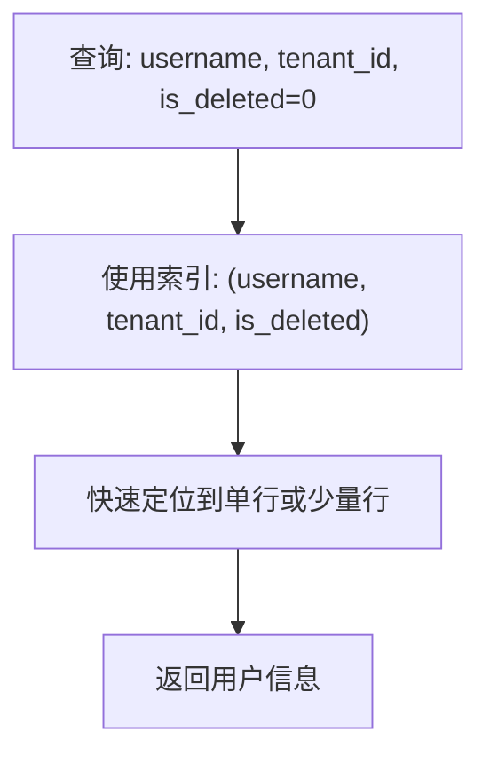
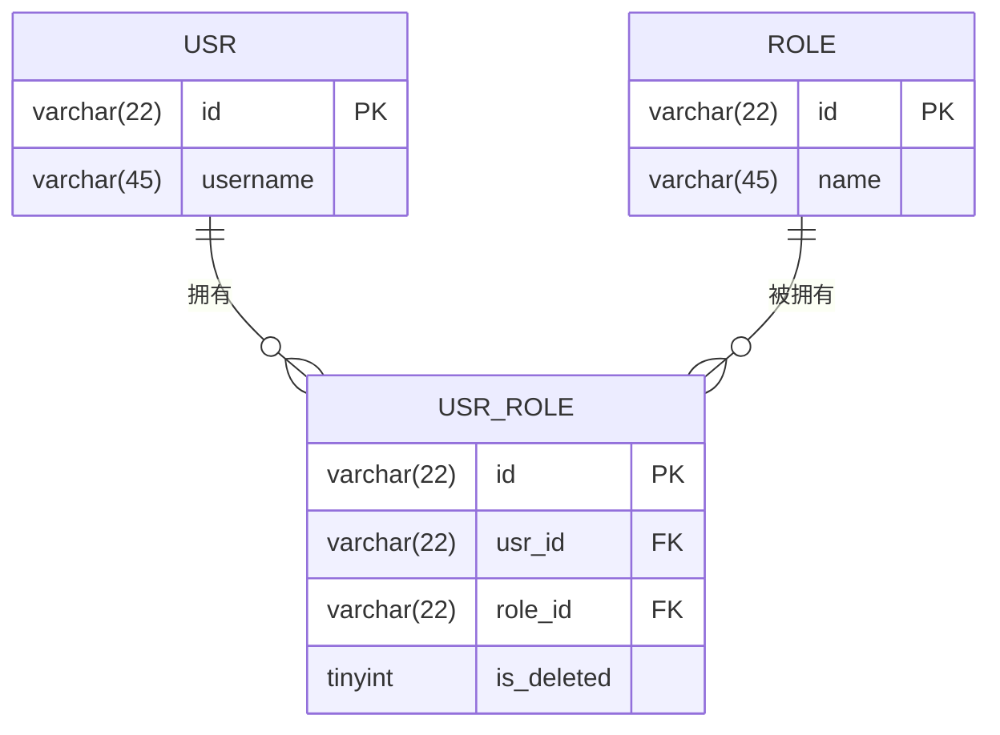
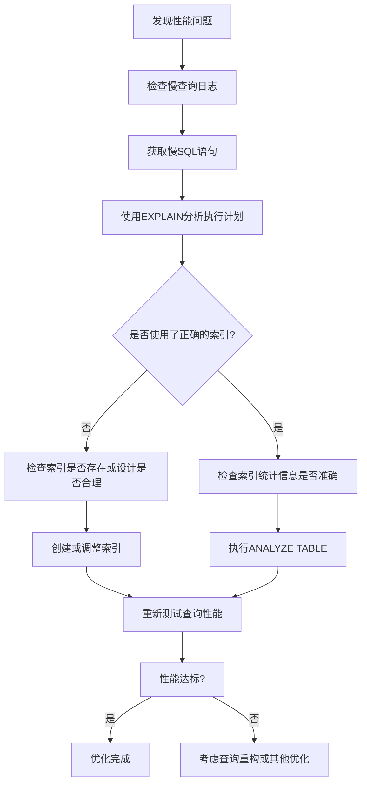

# 索引策略


**本文档引用文件**  
- [TABLE_RULES.md](https://github.com/sail-sail/nest/blob/main/codegen/.github/TABLE_RULES.md)
- [usr.dao.ts](https://github.com/sail-sail/nest/blob/main/deno/src/base/usr/usr.dao.ts)
- [role.dao.ts](https://github.com/sail-sail/nest/blob/main/deno/src/base/role/role.dao.ts)


## 目录
1. [引言](#引言)
2. [索引设计原则](#索引设计原则)
3. [索引类型与创建规则](#索引类型与创建规则)
4. [索引声明与SQL生成](#索引声明与sql生成)
5. [查询模式与索引优化](#查询模式与索引优化)
6. [索引设计指导原则](#索引设计指导原则)
7. [索引性能监控与优化](#索引性能监控与优化)

## 引言
本文档全面介绍 Nest 项目中数据库索引的设计原则和实现方法。基于 `TABLE_RULES.md` 中的规范要求，详细说明主键索引、唯一索引和普通索引的创建规则，以及如何通过代码注解声明索引。通过分析用户（usr）和角色（role）模块的查询模式，展示索引如何优化常见查询性能，并提供索引设计的最佳实践。

## 索引设计原则
根据 `TABLE_RULES.md` 文件中的规范，索引设计遵循以下核心原则：

1. **数据隔离原则**：所有涉及多租户或组织隔离的查询必须包含 `tenant_id` 和 `is_deleted` 字段，以确保数据安全和逻辑删除的正确处理。
2. **业务唯一性原则**：仅对具有业务唯一性约束的字段组合创建唯一索引，避免不必要的索引开销。
3. **查询驱动设计**：索引的创建应直接响应高频查询模式，优先为 WHERE、JOIN 和 ORDER BY 子句中的字段创建索引。
4. **最小化原则**：索引字段数量应尽可能少，复合索引的字段顺序应遵循最左前缀匹配原则。

**Section sources**
- [TABLE_RULES.md](https://github.com/sail-sail/nest/blob/main/codegen/.github/TABLE_RULES.md#L145-L160)

## 索引类型与创建规则
### 主键索引
主键索引是数据库表的强制性索引，用于唯一标识每一行数据。

```sql
PRIMARY KEY (`id`)
```
- **字段**：`id`
- **类型**：`varchar(22)`，存储 Base64 编码的 UUID。
- **特点**：自动创建，保证全局唯一性。

### 唯一索引
唯一索引确保索引字段的组合值在表中是唯一的。

```sql
-- 示例：在用户表中，用户名（username）在租户内必须唯一
UNIQUE KEY `uk_username_tenant` (`username`, `tenant_id`)
```
- **应用场景**：业务上要求字段组合唯一，如用户在租户内的唯一性。
- **规范**：根据 `TABLE_RULES.md`，对于有业务唯一性约束的字段组合，应创建唯一索引。

### 普通索引（组合索引）
普通索引用于加速数据检索，特别是针对复杂查询条件。

```sql
INDEX (`lbl`, `org_id`, `tenant_id`, `is_deleted`)
```
- **字段选择**：通常包含业务标签（`lbl`）、组织ID（`org_id`）、租户ID（`tenant_id`）和删除标记（`is_deleted`）。
- **设计规范**：
  - 必须包含 `tenant_id` 和 `is_deleted` 以支持多租户隔离和软删除。
  - 高频查询的业务字段应作为索引的前导列。
  - 避免为低选择性的布尔字段（如 `is_enabled`）单独创建索引。

**Section sources**
- [TABLE_RULES.md](https://github.com/sail-sail/nest/blob/main/codegen/.github/TABLE_RULES.md#L130-L160)

## 索引声明与SQL生成
在 Nest 项目中，索引的声明通常在实体模型（Entity Model）或表定义文件中通过特定的注解（如 `@Index`）来实现。虽然当前代码库中未直接展示注解用法，但其工作流程如下：

1. **模式定义**：在 TypeScript 的模型定义中，使用装饰器声明索引。
    ```typescript
    @Entity()
    @Index(["lbl", "tenant_id", "is_deleted"]) // 声明组合索引
    @Index(["username", "tenant_id"], { unique: true }) // 声明唯一索引
    export class Usr {
      @PrimaryColumn()
      id: string;

      @Column()
      lbl: string;

      @Column()
      username: string;

      @Column()
      tenant_id: string;

      @Column()
      is_deleted: number;
    }
    ```
2. **代码生成**：项目中的代码生成器（codegen）会解析这些注解，并根据 `TABLE_RULES.md` 的规范，自动生成符合要求的 SQL 建表语句。
3. **SQL 转换**：上述声明最终会转化为以下 SQL 语句：
    ```sql
    CREATE TABLE `base_usr` (
      `id` varchar(22) NOT NULL COMMENT 'ID',
      `lbl` varchar(45) NOT NULL DEFAULT '' COMMENT '名称',
      `username` varchar(45) NOT NULL DEFAULT '' COMMENT '用户名',
      `tenant_id` varchar(22) NOT NULL DEFAULT '' COMMENT '租户',
      `is_deleted` tinyint unsigned NOT NULL DEFAULT 0 COMMENT '删除',
      INDEX `idx_lbl_tenant_deleted` (`lbl`, `tenant_id`, `is_deleted`),
      UNIQUE KEY `uk_username_tenant` (`username`, `tenant_id`),
      PRIMARY KEY (`id`)
    ) ENGINE=InnoDB DEFAULT CHARSET=utf8mb4 COLLATE=utf8mb4_bin COMMENT='用户';
    ```

**Section sources**
- [TABLE_RULES.md](https://github.com/sail-sail/nest/blob/main/codegen/.github/TABLE_RULES.md#L130-L160)

## 查询模式与索引优化
通过分析 `usr.dao.ts` 和 `role.dao.ts` 中的查询模式，可以验证索引的有效性。

### 用户模块（usr）查询分析
在 `usr.dao.ts` 中，`findLoginUsr` 函数执行登录查询：
```typescript
const sql = /*sql*/`
  select
    t.id,
    t.default_org_id,
    t.is_hidden
  from base_usr t
  where
    t.is_deleted = 0
    and t.is_enabled = 1
    and t.username = ${ args.push(username) }
    and t.password = ${ args.push(password) }
    and t.tenant_id = ${ args.push(tenant_id) }
  limit 1
`;
```
- **查询条件**：`is_deleted`, `is_enabled`, `username`, `password`, `tenant_id`。
- **优化建议**：
  - **主索引**：应创建一个包含 `username` 和 `tenant_id` 的唯一索引，因为登录时这两个字段是确定用户的最直接条件。
  - **辅助索引**：`is_deleted` 和 `is_enabled` 字段的选择性较低，通常不作为索引的前导列。但 `is_deleted = 0` 是一个非常普遍的过滤条件，可以考虑将其与 `username` 和 `tenant_id` 组合，形成 `(username, tenant_id, is_deleted)` 的复合索引，以覆盖此查询。



**Diagram sources**
- [usr.dao.ts](https://github.com/sail-sail/nest/blob/main/deno/src/base/usr/usr.dao.ts#L30-L50)

### 角色模块（role）查询分析
在 `role.dao.ts` 中，`getAuthRoleModels` 函数用于获取当前用户的角色：
```typescript
// 1. 通过 usr_id 获取用户模型
const usr_model = await findByIdUsr(auth_model.id);
// 2. 通过 role_ids 获取角色列表
const role_models = await findByIdsRole(role_ids);
```
- **查询模式**：这是一个典型的“一对多”关联查询。
- **优化建议**：
  - **外键索引**：`base_usr` 表的主键 `id` 已有主键索引。
  - **中间表索引**：用户角色的关联通常存储在 `base_usr_role` 中间表中。根据 `TABLE_RULES.md`，该表应有如下索引：
    ```sql
    INDEX (`usr_id`, `role_id`, `tenant_id`, `is_deleted`)
    ```
    此索引可以高效地通过 `usr_id` 查找其所有角色。



**Diagram sources**
- [role.dao.ts](https://github.com/sail-sail/nest/blob/main/deno/src/base/role/role.dao.ts#L15-L35)
- [TABLE_RULES.md](https://github.com/sail-sail/nest/blob/main/codegen/.github/TABLE_RULES.md#L50-L65)

## 索引设计指导原则
### 选择索引字段的考虑因素
1. **查询频率**：优先为 WHERE 子句中频繁出现的字段创建索引。
2. **选择性**：选择性高的字段（即唯一值多的字段）更适合做索引。例如，`username` 的选择性远高于 `is_deleted`。
3. **数据类型**：优先为整数、短字符串等固定长度或短长度的数据类型创建索引，避免为长文本（TEXT）创建索引。
4. **更新成本**：频繁更新的字段会增加索引维护的开销，需权衡利弊。

### 复合索引的使用场景
1. **覆盖查询**：当索引包含了查询所需的所有字段时，数据库可以直接从索引中获取数据，无需回表，称为“覆盖索引”。
2. **多条件查询**：当查询涉及多个 AND 条件时，复合索引比多个单列索引更高效。
3. **排序和分组**：如果 ORDER BY 或 GROUP BY 子句中的字段顺序与复合索引一致，可以避免额外的排序操作。

### 索引维护的注意事项
1. **避免过度索引**：每个索引都会增加 INSERT、UPDATE 和 DELETE 操作的开销。应定期审查并删除未使用或低效的索引。
2. **监控索引使用率**：利用数据库的性能监控工具（如 `SHOW INDEX`、`INFORMATION_SCHEMA.STATISTICS`）检查索引的实际使用情况。
3. **定期分析和优化**：对大表执行 `ANALYZE TABLE` 命令，以更新索引统计信息，帮助查询优化器做出更好的决策。

**Section sources**
- [TABLE_RULES.md](https://github.com/sail-sail/nest/blob/main/codegen/.github/TABLE_RULES.md#L145-L160)

## 索引性能监控与优化
### 监控工具与方法
1. **慢查询日志**：启用数据库的慢查询日志（Slow Query Log），分析执行时间超过阈值的 SQL 语句。
2. **执行计划分析**：使用 `EXPLAIN` 或 `EXPLAIN ANALYZE` 命令查看 SQL 语句的执行计划，确认是否使用了预期的索引。
    ```sql
    EXPLAIN SELECT * FROM base_usr WHERE username = 'admin' AND tenant_id = 't123';
    ```
3. **性能模式（Performance Schema）**：利用 MySQL 的 Performance Schema 来监控索引的使用频率和效率。

### 优化方法
1. **重构查询**：简化复杂的查询逻辑，避免在索引字段上使用函数或表达式（如 `WHERE YEAR(create_time) = 2023`），这会导致索引失效。
2. **调整索引结构**：根据 `EXPLAIN` 的结果，调整复合索引的字段顺序，确保最常用于过滤的字段在前。
3. **使用提示（Hints）**：在极少数情况下，可以使用 `USE INDEX` 或 `FORCE INDEX` 提示来强制优化器使用特定索引，但这应作为最后的手段。



**Diagram sources**
- [TABLE_RULES.md](https://github.com/sail-sail/nest/blob/main/codegen/.github/TABLE_RULES.md#L145-L160)