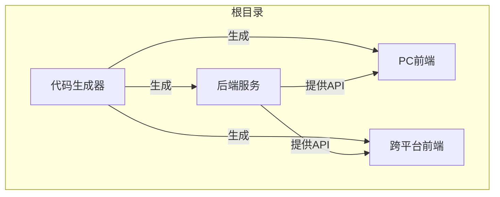
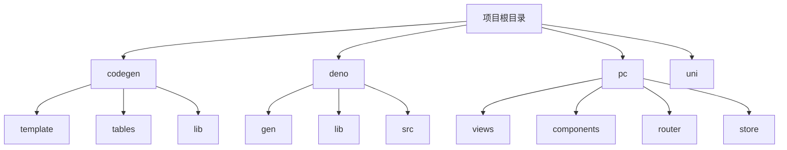
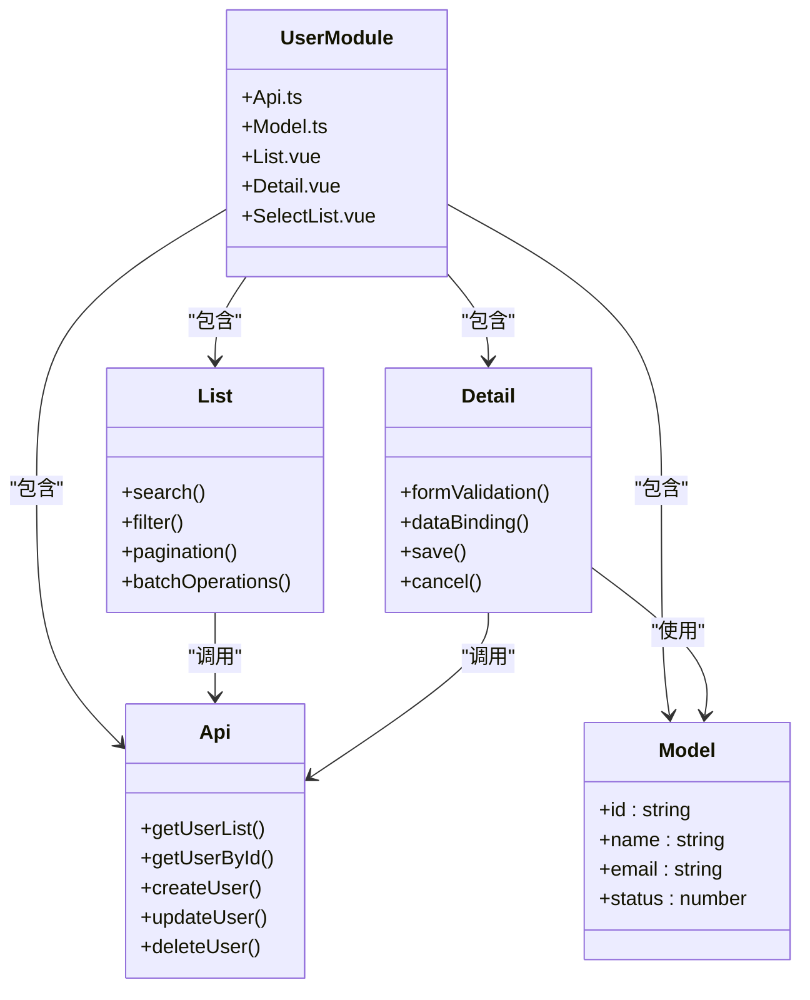
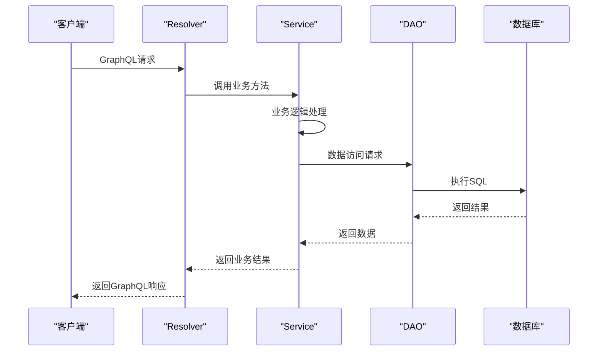
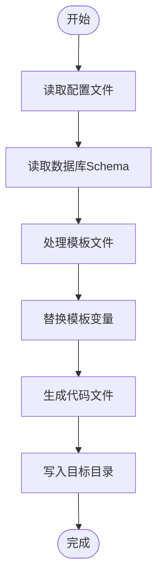
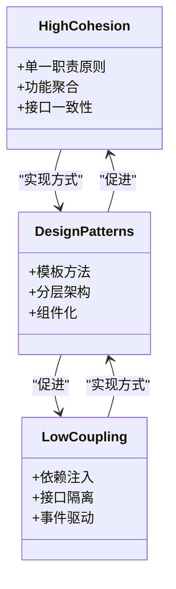

# 代码组织


**本文档引用文件**  
- [config.ts](https://github.com/sail-sail/nest/blob/main/codegen/src/config.ts)
- [codegen.ts](https://github.com/sail-sail/nest/blob/main/codegen/src/lib/codegen.ts)
- [tables.ts](https://github.com/sail-sail/nest/blob/main/codegen/src/tables/tables.ts)
- [base.sql](https://github.com/sail-sail/nest/blob/main/codegen/src/tables/base/base.sql)
- [template](https://github.com/sail-sail/nest/blob/main/codegen/src/template)
- [background_task.model.ts](https://github.com/sail-sail/nest/blob/main/deno/gen/base/background_task/background_task.model.ts)
- [background_task.resolver.ts](https://github.com/sail-sail/nest/blob/main/deno/gen/base/background_task/background_task.resolver.ts)
- [background_task.service.ts](https://github.com/sail-sail/nest/blob/main/deno/gen/base/background_task/background_task.service.ts)
- [background_task.dao.ts](https://github.com/sail-sail/nest/blob/main/deno/gen/base/background_task/background_task.dao.ts)
- [background_task.graphql.ts](https://github.com/sail-sail/nest/blob/main/deno/gen/base/background_task/background_task.graphql.ts)
- [List.vue](https://github.com/sail-sail/nest/blob/main/pc/src/views/base/usr/List.vue)
- [Detail.vue](https://github.com/sail-sail/nest/blob/main/pc/src/views/base/usr/Detail.vue)
- [Api.ts](https://github.com/sail-sail/nest/blob/main/pc/src/views/base/usr/Api.ts)
- [Model.ts](https://github.com/sail-sail/nest/blob/main/pc/src/views/base/usr/Model.ts)
- [gen.ts](https://github.com/sail-sail/nest/blob/main/pc/src/router/gen.ts)
- [graphql.config.js](https://github.com/sail-sail/nest/blob/main/deno/graphql.config.js)
- [mod.ts](https://github.com/sail-sail/nest/blob/main/deno/mod.ts)


## 目录
1. [引言](#引言)
2. [项目结构](#项目结构)
3. [模块划分原则](#模块划分原则)
4. [文件命名约定](#文件命名约定)
5. [目录结构设计](#目录结构设计)
6. [前端组件组织](#前端组件组织)
7. [后端服务划分](#后端服务划分)
8. [代码生成器模板结构](#代码生成器模板结构)
9. [高内聚低耦合设计](#高内聚低耦合设计)
10. [正反例对比](#正反例对比)
11. [可维护性与可扩展性](#可维护性与可扩展性)
12. [结论](#结论)

## 引言

本项目采用模块化、分层化和自动化代码生成相结合的架构设计，旨在实现高内聚、低耦合的代码组织结构。通过分析 `` 项目结构，本文档系统阐述了项目中的模块划分原则、文件命名约定、目录结构设计以及代码生成器的实现机制。文档重点说明前端组件如何按功能模块组织，后端服务如何按领域划分，以及代码生成器的模板结构设计，为团队提供清晰的代码组织最佳实践指导。

## 项目结构

项目采用多模块分层架构，主要包含四个核心模块：`codegen`（代码生成器）、`deno`（后端服务）、`pc`（PC端前端）和`uni`（跨平台前端）。整体结构清晰，职责分离明确。



**图示来源**  
- [项目结构](https://github.com/sail-sail/nest/blob/main/#L1-L200)

## 模块划分原则

项目遵循功能模块化和领域驱动设计（DDD）原则进行模块划分。每个模块代表一个业务领域或功能单元，如`usr`（用户）、`role`（角色）、`dept`（部门）、`dict`（字典）等。

### 功能模块化
- **按业务领域划分**：将相关功能聚合到同一模块中，如所有用户管理功能集中在`usr`模块
- **高内聚**：模块内部组件高度相关，共同完成特定业务功能
- **低耦合**：模块间依赖最小化，通过明确定义的接口进行交互

### 领域驱动设计
后端服务采用领域驱动设计思想，每个领域实体（如`usr`、`role`）拥有完整的领域模型、数据访问对象（DAO）、业务服务（Service）和GraphQL解析器（Resolver）。

**模块来源**  
- [项目结构](https://github.com/sail-sail/nest/blob/main/#L1-L200)
- [base](https://github.com/sail-sail/nest/blob/main/deno/gen/base#L1-L10)

## 文件命名约定

项目采用一致的文件命名约定，提高代码可读性和可维护性。

### 后端文件命名
后端文件采用`实体名.功能.ts`的命名模式，确保功能类型一目了然：
- `*.model.ts`：领域模型定义
- `*.dao.ts`：数据访问对象
- `*.service.ts`：业务服务逻辑
- `*.resolver.ts`：GraphQL解析器
- `*.graphql.ts`：GraphQL模式定义

例如：`usr.model.ts`、`usr.service.ts`、`usr.resolver.ts`

### 前端文件命名
前端文件采用组件化命名，每个功能模块包含标准组件集：
- `List.vue`：列表页面
- `Detail.vue`：详情页面
- `Api.ts`：API接口定义
- `Model.ts`：数据模型定义
- `*.Dialog.vue`：弹窗组件

例如：`usr/List.vue`、`usr/Detail.vue`、`usr/Api.ts`

**命名来源**  
- [background_task.model.ts](https://github.com/sail-sail/nest/blob/main/deno/gen/base/background_task/background_task.model.ts)
- [List.vue](https://github.com/sail-sail/nest/blob/main/pc/src/views/base/usr/List.vue)
- [Api.ts](https://github.com/sail-sail/nest/blob/main/pc/src/views/base/usr/Api.ts)

## 目录结构设计

项目采用分层目录结构设计，确保代码组织清晰、易于导航。

### 核心目录结构
```
.
├── codegen          # 代码生成器
├── deno             # 后端服务
├── pc               # PC前端
└── uni              # 跨平台前端
```

### 代码生成器结构
`codegen`目录包含代码生成器的核心组件：
- `src/template`：代码模板
- `src/tables`：表结构定义
- `src/lib`：核心生成逻辑
- `src/bin`：命令行工具

### 后端服务结构
`deno`目录采用分层架构：
- `gen/base`：生成的领域模块
- `lib`：公共库和工具
- `src`：自定义业务逻辑

### 前端结构
`pc`和`uni`目录采用组件化结构：
- `views/base`：基础功能视图
- `components`：可复用组件
- `router`：路由配置
- `store`：状态管理



**目录来源**  
- [项目结构](https://github.com/sail-sail/nest/blob/main/#L1-L200)
- [template](https://github.com/sail-sail/nest/blob/main/codegen/src/template#L1-L50)

## 前端组件组织

前端组件按功能模块组织，采用"功能模块+标准组件"的设计模式。

### 功能模块化组织
在`pc/src/views/base`目录下，每个业务实体作为一个独立模块：
- `usr/`：用户管理
- `role/`：角色管理
- `dept/`：部门管理
- `dict/`：字典管理

### 标准组件集
每个模块包含一套标准化的组件，确保开发一致性：
- **Api.ts**：封装模块相关的API调用
- **Model.ts**：定义模块相关的数据模型
- **List.vue**：列表展示和管理界面
- **Detail.vue**：详情查看和编辑界面
- ***.Dialog.vue**：各种弹窗组件

### 组件间关系


**组件来源**  
- [usr](https://github.com/sail-sail/nest/blob/main/pc/src/views/base/usr#L1-L20)
- [Api.ts](https://github.com/sail-sail/nest/blob/main/pc/src/views/base/usr/Api.ts)
- [List.vue](https://github.com/sail-sail/nest/blob/main/pc/src/views/base/usr/List.vue)

## 后端服务划分

后端服务采用领域驱动设计和分层架构，确保业务逻辑清晰分离。

### 领域服务划分
在`deno/gen/base`目录下，每个业务领域作为一个独立服务模块：
- `usr/`：用户服务
- `role/`：角色服务
- `dept/`：部门服务
- `dict/`：字典服务

### 分层架构
每个服务模块采用标准的分层架构：
- **Model层**：`*.model.ts` - 领域模型定义
- **DAO层**：`*.dao.ts` - 数据访问逻辑
- **Service层**：`*.service.ts` - 业务逻辑处理
- **Resolver层**：`*.resolver.ts` - GraphQL接口暴露

### 服务调用流程


**服务来源**  
- [background_task](https://github.com/sail-sail/nest/blob/main/deno/gen/base/background_task#L1-L10)
- [background_task.service.ts](https://github.com/sail-sail/nest/blob/main/deno/gen/base/background_task/background_task.service.ts)
- [background_task.dao.ts](https://github.com/sail-sail/nest/blob/main/deno/gen/base/background_task/background_task.dao.ts)

## 代码生成器模板结构

代码生成器是项目的核心工具，通过模板驱动的方式自动生成前后端代码。

### 模板目录结构
`codegen/src/template`目录包含所有代码生成模板：
- `deno/`：后端Deno模板
- `pc/src/`：PC前端模板
- `uni/src/pages/`：跨平台前端模板

### 模板变量
模板使用`[[variable]]`语法定义可替换变量：
- `[[mod]]`：模块名称
- `[[mod_slash_table]]`：模块/表名路径
- `[[table]]`：表名称

### 模板示例
以`pc/src/views\[[mod_slash_table]]`模板为例：
- `Api.ts`：API接口模板
- `Model.ts`：数据模型模板
- `List.vue`：列表页面模板
- `Detail.vue`：详情页面模板

### 生成流程


**模板来源**  
- [template](https://github.com/sail-sail/nest/blob/main/codegen/src/template#L1-L100)
- [TABLE_RULES.md](https://github.com/sail-sail/nest/blob/main/codegen/.github/TABLE_RULES.md#L1-L50)

## 高内聚低耦合设计

项目通过多种设计原则实现高内聚低耦合的目标。

### 高内聚实现
- **功能聚合**：将相关功能集中在一个模块内
- **单一职责**：每个文件只负责一个特定功能
- **接口一致性**：同一模块内的组件遵循相同的接口规范

### 低耦合实现
- **依赖注入**：通过依赖注入管理组件间依赖
- **接口隔离**：定义清晰的模块接口，隐藏内部实现
- **事件驱动**：使用事件机制减少直接依赖

### 设计模式应用
- **模板方法模式**：代码生成器使用模板方法生成代码
- **分层架构**：前后端均采用分层架构分离关注点
- **组件化**：前端采用组件化设计提高复用性



**设计来源**  
- [项目整体结构](https://github.com/sail-sail/nest/blob/main/#L1-L200)
- [代码生成器设计](https://github.com/sail-sail/nest/blob/main/codegen/src#L1-L100)

## 正反例对比

通过正反例对比，展示良好代码组织的优势。

### 正例：规范的模块组织
**优点**：
- 结构清晰，易于导航
- 职责明确，便于维护
- 标准化，提高开发效率
- 易于自动化生成

```text
pc/src/views/base/usr/
├── Api.ts        # API接口
├── Model.ts      # 数据模型
├── List.vue      # 列表页面
├── Detail.vue    # 详情页面
└── SelectList.vue # 选择组件
```

### 反例：混乱的文件组织
**缺点**：
- 结构混乱，难以查找
- 职责不清，容易出错
- 缺乏标准，开发效率低
- 难以维护和扩展

```text
src/
├── api.js
├── model.js
├── list.js
├── detail.js
├── utils.js
├── components.js
└── services.js
```

### 对比分析
| 维度 | 正例 | 反例 |
|------|------|------|
| 可读性 | 高 | 低 |
| 可维护性 | 高 | 低 |
| 可扩展性 | 高 | 低 |
| 开发效率 | 高 | 低 |
| 团队协作 | 容易 | 困难 |

**对比来源**  
- [规范组织](https://github.com/sail-sail/nest/blob/main/pc/src/views/base/usr#L1-L20)
- [项目结构原则](https://github.com/sail-sail/nest/blob/main/#L1-L200)

## 可维护性与可扩展性

良好的代码组织显著提高了项目的可维护性和可扩展性。

### 可维护性优势
- **定位快速**：功能模块化使问题定位更快速
- **修改安全**：低耦合减少修改的副作用
- **文档自明**：结构即文档，降低理解成本
- **测试方便**：模块化便于单元测试和集成测试

### 可扩展性优势
- **新增模块**：复制模板即可快速创建新模块
- **功能扩展**：在现有模块中添加新功能
- **技术演进**：可独立升级特定模块的技术栈
- **团队扩展**：多个团队可并行开发不同模块

### 扩展示例
当需要添加新的"订单管理"模块时：
1. 在数据库中创建`order`表
2. 运行代码生成器
3. 自动生成`order`模块的前后端代码
4. 开发人员只需添加特定业务逻辑


**可维护性来源**  
- [代码生成流程](https://github.com/sail-sail/nest/blob/main/codegen/src/lib/codegen.ts#L1-L50)
- [模块化结构](https://github.com/sail-sail/nest/blob/main/#L1-L200)

## 结论

本项目通过模块化划分、标准化命名、分层目录结构和代码生成器等手段，实现了优秀的代码组织。这种组织方式具有以下优势：

1. **提高开发效率**：通过代码生成器自动化生成基础代码
2. **保证代码质量**：标准化的结构和命名减少人为错误
3. **增强可维护性**：清晰的结构使代码易于理解和修改
4. **提升可扩展性**：模块化设计支持快速添加新功能
5. **促进团队协作**：统一的规范降低沟通成本

建议团队在开发新功能时严格遵循此代码组织规范，确保项目长期健康发展。同时，可根据实际需求不断完善代码生成器模板，进一步提高开发效率。