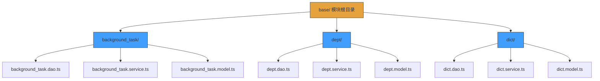

# 命名规范


**本文档引用文件**  
- [background_task.dao.ts](https://github.com/sail-sail/nest/blob/main/codegen/__out__/deno/gen/base/background_task/background_task.dao.ts)
- [background_task.service.ts](https://github.com/sail-sail/nest/blob/main/codegen/__out__/deno/gen/base/background_task/background_task.service.ts)
- [dept.model.ts](https://github.com/sail-sail/nest/blob/main/codegen/__out__/deno/gen/base/dept/dept.model.ts)
- [CustomInput.vue](https://github.com/sail-sail/nest/blob/main/pc/src/components/CustomInput.vue)
- [DictSelect.vue](https://github.com/sail-sail/nest/blob/main/pc/src/components/DictSelect.vue)
- [config.ts](https://github.com/sail-sail/nest/blob/main/codegen/src/config.ts)
- [codegen.ts](https://github.com/sail-sail/nest/blob/main/codegen/src/lib/codegen.ts)
- [package.json](https://github.com/sail-sail/nest/blob/main/package.json)
- [tsconfig.json](https://github.com/sail-sail/nest/blob/main/tsconfig.json)


## 目录
1. [简介](#简介)
2. [项目结构与命名模式](#项目结构与命名模式)
3. [核心命名约定](#核心命名约定)
4. [变量与常量命名](#变量与常量命名)
5. [函数与方法命名](#函数与方法命名)
6. [类与接口命名](#类与接口命名)
7. [组件命名](#组件命名)
8. [文件命名规范](#文件命名规范)
9. [模块与目录结构](#模块与目录结构)
10. [自动化检查与工具配置](#自动化检查与工具配置)
11. [命名规范的可维护性影响](#命名规范的可维护性影响)
12. [结论](#结论)

## 简介

本命名规范文档旨在为 `` 项目建立统一、清晰且可维护的命名体系。通过分析项目结构和现有代码模式，本文档详细定义了变量、函数、类、组件和文件的命名规则，涵盖 camelCase、PascalCase 等命名风格，并提供具体示例。良好的命名规范能显著提升代码可读性、降低维护成本，并减少团队协作中的误解。本文档还介绍了如何通过自动化工具确保命名一致性，防止命名违规。

## 项目结构与命名模式

项目采用分层架构与模块化组织方式，主要分为 `codegen`、`deno`、`pc` 和 `uni` 四大模块。各模块内部遵循一致的命名模式，尤其在生成代码中体现明显。

```mermaid
graph TB
Project[] --> Codegen[codegen]
Project --> Deno[deno]
Project --> Pc[pc]
Project --> Uni[uni]
Codegen --> Src[src]
Codegen --> Out[__out__]
Out --> DenoGen[deno/gen/base]
DenoGen --> Module[模块名]
Module --> Dao[*.dao.ts]
Module --> Service[*.service.ts]
Module --> Model[*.model.ts]
Module --> Resolver[*.resolver.ts]
Module --> Graphql[*.graphql.ts]
Pc --> Components[components]
Components --> Custom[Custom前缀组件]
Components --> Dict[DictSelect等业务组件]
Deno --> Lib[lib]
Lib --> Util[util工具类]
Lib --> App[app.service.ts等服务类]
style Project fill:#4B7EB0,stroke:#333
style Codegen fill:#67C23A,stroke:#333
style Deno fill:#67C23A,stroke:#333
style Pc fill:#67C23A,stroke:#333
style Uni fill:#67C23A,stroke:#333
```

**图示来源**  
- [project_structure](https://github.com/sail-sail/nest/blob/main/#L1-L200)

## 核心命名约定

项目中广泛采用以下命名风格，确保代码风格统一：

- **camelCase**：用于变量、函数、方法名
- **PascalCase**：用于类、接口、组件名
- **kebab-case**：用于文件名、目录名
- **全大写 + 下划线**：用于常量

命名规则强调语义清晰、简洁且避免缩写，除非是广泛接受的缩写（如 `id`、`url`）。

**Section sources**
- [config.ts](https://github.com/sail-sail/nest/blob/main/codegen/src/config.ts#L1-L50)
- [codegen.ts](https://github.com/sail-sail/nest/blob/main/codegen/src/lib/codegen.ts#L100-L150)

## 变量与常量命名

变量命名使用 **camelCase**，要求语义明确，避免单字母命名。

### 示例
```ts
// 正确：语义清晰
let userCount: number = 0;
const maxLoginAttempts = 5;

// 错误：含义模糊
let a = 0;
const MAX = 5;
```

常量使用 **全大写 + 下划线** 分隔，定义不可变值。

### 示例
```ts
const API_BASE_URL = "https://api.example.com";
const DEFAULT_PAGE_SIZE = 20;
```

**Section sources**
- [config.ts](https://github.com/sail-sail/nest/blob/main/codegen/src/config.ts#L20-L40)

## 函数与方法命名

函数与方法名使用 **camelCase**，动词开头，清晰表达其行为。

### 命名模式
- `get`：获取数据
- `set`：设置数据
- `create`：创建资源
- `update`：更新资源
- `delete`：删除资源
- `validate`：验证逻辑
- `handle`：处理事件

### 示例
```ts
function getUserById(userId: string): User { ... }
function validateEmail(email: string): boolean { ... }
function handleLoginSubmit(): void { ... }
```

**Section sources**
- [codegen.ts](https://github.com/sail-sail/nest/blob/main/codegen/src/lib/codegen.ts#L80-L120)

## 类与接口命名

类与接口使用 **PascalCase**，名词或名词短语，清晰表达其职责。

### 通用类命名
```ts
class UserService { ... }
class DatabaseManager { ... }
interface UserConfig { ... }
```

### 特定后缀类
项目中约定特定类型使用固定后缀：
- **Service 类**：以 `Service` 结尾，如 `backgroundTaskService`
- **DAO 类**：以 `Dao` 结尾，如 `deptDao`
- **Model 类**：以 `Model` 结尾，如 `dictModel`
- **Resolver 类**：以 `Resolver` 结尾，如 `menuResolver`

### 示例
```ts
// 来自 background_task.service.ts
export class BackgroundTaskService { ... }

// 来自 dept.dao.ts
export class DeptDao { ... }

// 来自 dict.model.ts
export class DictModel { ... }
```

**Diagram sources**  
- [background_task.service.ts](https://github.com/sail-sail/nest/blob/main/codegen/__out__/deno/gen/base/background_task/background_task.service.ts#L1-L10)
- [dept.dao.ts](https://github.com/sail-sail/nest/blob/main/codegen/__out__/deno/gen/base/dept/dept.dao.ts#L1-L10)
- [dict.model.ts](https://github.com/sail-sail/nest/blob/main/codegen/__out__/deno/gen/base/dict/dict.model.ts#L1-L10)

## 组件命名

前端组件（Vue）使用 **PascalCase**，并采用语义化前缀区分类型。

### 前缀约定
- **Custom**：通用自定义输入组件
- **Dict**：字典选择组件
- **App**：应用级布局组件

### 示例
```vue
<!-- CustomInput.vue -->
<template>
  <input v-model="value" type="text" />
</template>
<script lang="ts">
export default class CustomInput extends Vue { ... }
</script>

<!-- DictSelect.vue -->
<template>
  <select v-model="selected">
    <option v-for="item in dictItems" :key="item.id">{{ item.label }}</option>
  </select>
</template>
<script lang="ts">
export default class DictSelect extends Vue { ... }
</script>
```

**Section sources**
- [CustomInput.vue](https://github.com/sail-sail/nest/blob/main/pc/src/components/CustomInput.vue#L1-L50)
- [DictSelect.vue](https://github.com/sail-sail/nest/blob/main/pc/src/components/DictSelect.vue#L1-L50)

## 文件命名规范

文件名使用 **kebab-case**，与模块名一致，并包含类型后缀。

### 文件命名模式
```
[模块名].[类型].ts
```

### 示例
- `background-task.service.ts`
- `user.dao.ts`
- `menu.resolver.ts`
- `app.module.ts`

在生成代码路径中，如 `deno/gen/base/background_task/`，所有文件均遵循此模式：
- `background_task.dao.ts`
- `background_task.service.ts`
- `background_task.model.ts`

尽管文件名使用下划线分隔（可能是生成器配置），但推荐统一使用连字符（kebab-case）以符合现代前端惯例。

**Section sources**
- [background_task.dao.ts](https://github.com/sail-sail/nest/blob/main/codegen/__out__/deno/gen/base/background_task/background_task.dao.ts#L1)
- [dept.service.ts](https://github.com/sail-sail/nest/blob/main/codegen/__out__/deno/gen/base/dept/dept.service.ts#L1)

## 模块与目录结构

目录结构按功能模块划分，每个模块包含其所有相关文件。

### 目录结构示例
```
gen/base/
├── background_task/
│   ├── background_task.dao.ts
│   ├── background_task.service.ts
│   └── background_task.model.ts
├── dept/
│   ├── dept.dao.ts
│   └── dept.service.ts
```

这种结构确保高内聚、低耦合，便于定位和维护代码。



**Diagram sources**  
- [project_structure](https://github.com/sail-sail/nest/blob/main/#L50-L100)

## 自动化检查与工具配置

为确保命名规范一致性，建议配置以下工具：

### ESLint 规则
```json
{
  "rules": {
    "camelcase": ["error", { "properties": "always" }],
    "@typescript-eslint/naming-convention": [
      "error",
      { "selector": "variable", "format": ["camelCase", "UPPER_CASE"] },
      { "selector": "function", "format": ["camelCase"] },
      { "selector": "class", "format": ["PascalCase"] },
      { "selector": "interface", "format": ["PascalCase"] }
    ]
  }
}
```

### Prettier 配置
确保文件名和路径在生成时使用 kebab-case。

### 代码生成器配置
在 `codegen/src/config.ts` 中定义命名模板，确保生成文件自动符合规范。

**Section sources**
- [config.ts](https://github.com/sail-sail/nest/blob/main/codegen/src/config.ts#L10-L30)
- [package.json](https://github.com/sail-sail/nest/blob/main/package.json#L20-L40)

## 命名规范的可维护性影响

遵循统一命名规范带来显著优势：

- **提升可读性**：开发者能快速理解代码意图
- **降低维护成本**：新成员可快速上手
- **减少错误**：清晰命名减少误解和误用
- **增强可搜索性**：一致命名便于全局搜索

违反命名规范可能导致：
- 代码理解困难
- 团队协作障碍
- 调试和重构成本增加
- 自动生成工具出错

## 结论

本命名规范为 `` 项目提供了全面的命名指导。通过严格执行 camelCase、PascalCase 和 kebab-case 等约定，并结合自动化检查工具，可确保代码库长期保持高质量和可维护性。建议所有开发者遵循此规范，并在代码审查中重点关注命名一致性。