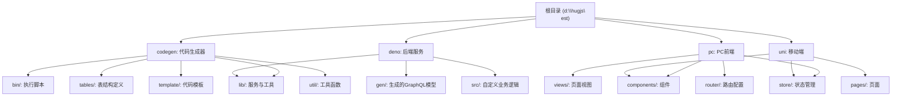
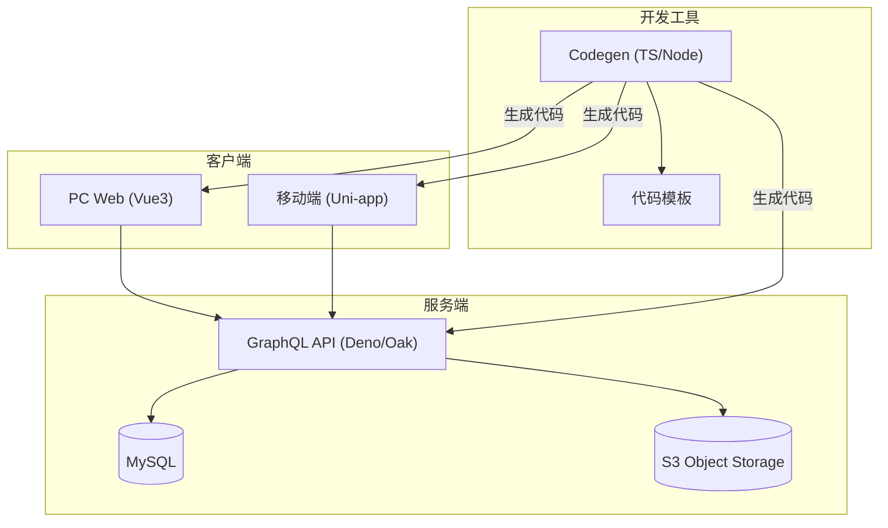
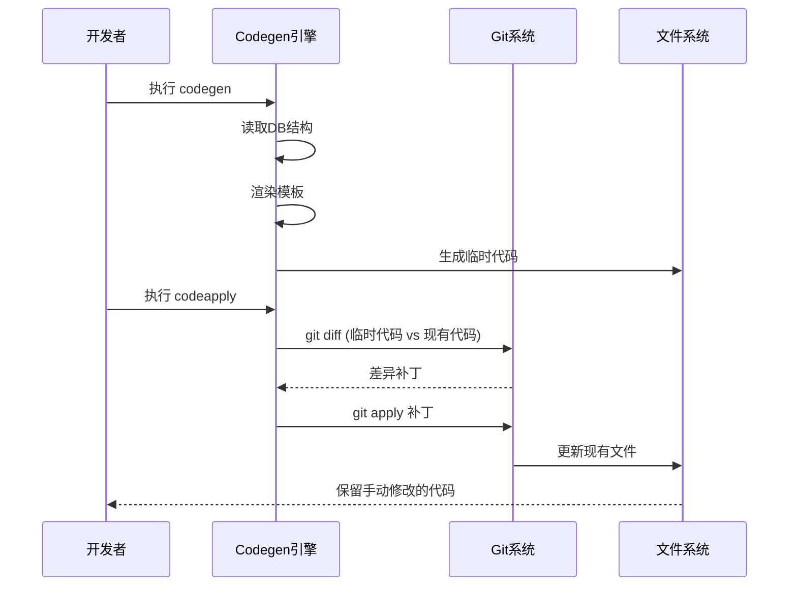

# 最佳实践

**本文档引用文件**  
- [README.md](https://github.com/sail-sail/nest/blob/main/README.md)
- [package.json](https://github.com/sail-sail/nest/blob/main/package.json)
- [codegen/package.json](https://github.com/sail-sail/nest/blob/main/codegen/package.json)
- [deno/package.json](https://github.com/sail-sail/nest/blob/main/deno/package.json)
- [pc/package.json](https://github.com/sail-sail/nest/blob/main/pc/package.json)
- [uni/package.json](https://github.com/sail-sail/nest/blob/main/uni/package.json)
- [codegen/src/config.ts](https://github.com/sail-sail/nest/blob/main/codegen/src/config.ts)
- [deno/graphql.config.js](https://github.com/sail-sail/nest/blob/main/deno/graphql.config.js)
- [pc/graphql.config.js](https://github.com/sail-sail/nest/blob/main/pc/graphql.config.js)
- [uni/graphql.config.js](https://github.com/sail-sail/nest/blob/main/uni/graphql.config.js)
- [pc/src/main.ts](https://github.com/sail-sail/nest/blob/main/pc/src/main.ts)
- [deno/mod.ts](https://github.com/sail-sail/nest/blob/main/deno/mod.ts)
- [uni/src/main.ts](https://github.com/sail-sail/nest/blob/main/uni/src/main.ts)

## 目录
1. [项目概述](#项目概述)
2. [项目结构](#项目结构)
3. [技术栈与架构](#技术栈与架构)
4. [代码生成与增量更新机制](#代码生成与增量更新机制)
5. [模块划分与目录结构](#模块划分与目录结构)
6. [命名规范](#命名规范)
7. [错误处理与日志记录](#错误处理与日志记录)
8. [版本管理与协作流程](#版本管理与协作流程)
9. [前端组件设计最佳实践](#前端组件设计最佳实践)
10. [后端服务开发最佳实践](#后端服务开发最佳实践)
11. [正反例对比分析](#正反例对比分析)

## 项目概述

本项目是一个基于低代码理念的全栈开发框架，旨在通过智能代码生成与手动开发的无缝融合，提升开发效率。系统采用模块化设计，支持多端（PC、移动端）统一开发，并通过 GraphQL 实现前后端数据交互。其核心创新在于代码生成器能够识别并保留手动修改的代码，避免传统代码生成器覆盖已有变更的问题，从而支持项目全生命周期的持续迭代。

项目包含四个主要模块：
- **codegen**：代码生成引擎，负责根据数据库表结构生成前后端代码。
- **deno**：后端服务，基于 Deno 运行时，提供 GraphQL API 接口。
- **pc**：PC 端前端应用，基于 Vue3 和 Vite 构建。
- **uni**：移动端前端应用，基于 Uni-app 框架，支持多平台发布。

**Section sources**
- [README.md](https://github.com/sail-sail/nest/blob/main/README.md#L1-L32)

## 项目结构

项目采用多包（multi-package）结构，各模块职责清晰，便于独立开发与部署。

**Diagram sources**
- [README.md](https://github.com/sail-sail/nest/blob/main/README.md#L1-L32)
- [project_structure](https://github.com/sail-sail/nest/blob/main/project_structure)

## 技术栈与架构

项目采用现代化的技术栈，前后端均使用 TypeScript，保证类型安全。

### 前端技术栈
- **PC端**：Vue3 + Vite + Element Plus + TypeScript + UnoCSS
- **移动端**：Uni-app + Vue3 + TypeScript
- **状态管理**：Pinia (uni) / Vuex-like (pc)
- **路由**：Vue Router
- **GraphQL客户端**：集成 graphql 包进行数据查询

### 后端技术栈
- **运行时**：Deno (主) / Rust (备选)
- **数据库**：MySQL
- **API协议**：GraphQL
- **服务器框架**：Oak (Deno 的 Web 框架)
- **文件存储**：S3 兼容服务

### 架构图

**Diagram sources**
- [README.md](https://github.com/sail-sail/nest/blob/main/README.md#L60-L65)
- [package.json](https://github.com/sail-sail/nest/blob/main/package.json)
- [pc/package.json](https://github.com/sail-sail/nest/blob/main/pc/package.json)
- [deno/package.json](https://github.com/sail-sail/nest/blob/main/deno/package.json)
- [uni/package.json](https://github.com/sail-sail/nest/blob/main/uni/package.json)

## 代码生成与增量更新机制

本项目的核心优势在于其智能代码生成机制，解决了传统代码生成器“覆盖修改”的痛点。

### 工作原理
1. **代码生成**：`codegen` 模块读取数据库表结构和配置，使用预定义的模板生成初始代码。
2. **变更检测**：当需要重新生成代码时，系统使用 `git diff` 比较新生成的代码与现有代码的差异。
3. **增量应用**：利用 `git apply` 将新代码中的变更以补丁形式应用到现有代码库，从而保留开发者的手动修改。

### 关键脚本
- `npm run codegen`: 执行代码生成。
- `npm run codeapply`: 应用代码变更（内部调用 `codeapply.ts`）。
- `npm run coderemove`: 移除已生成的模块。

**Diagram sources**
- [README.md](https://github.com/sail-sail/nest/blob/main/README.md#L20-L25)
- [codegen/package.json](https://github.com/sail-sail/nest/blob/main/codegen/package.json)
- [package.json](https://github.com/sail-sail/nest/blob/main/package.json)
- [codegen/src/bin/codeapply.ts](https://github.com/sail-sail/nest/blob/main/codegen/src/bin/codeapply.ts)
- [codegen/src/bin/coderemove.ts](https://github.com/sail-sail/nest/blob/main/codegen/src/bin/coderemove.ts)

## 模块划分与目录结构

项目遵循功能模块化和分层架构原则。

### codegen 模块
- **bin/**: 命令行入口 (`codegen.ts`, `codeapply.ts`)。
- **lib/**: 核心逻辑，如数据库连接 (`information_schema.ts`)、S3 客户端。
- **tables/**: 定义基础表结构和 SQL 脚本。
- **template/**: 包含 Deno、PC、Uni 三端的代码模板，使用 `[[mod_slash_table]]` 等占位符。
- **util/**: 各类工具函数，如数据库初始化、CSV 导入、密码加密。

### deno 模块
- **gen/**: 由 codegen 生成的 GraphQL 模型、DAO、Resolver。
- **lib/**: 核心服务，如 `auth.service.ts`、`oss.service.ts`、`websocket.router.ts`。
- **src/**: 开发者自定义的业务逻辑，优先级高于 `gen/` 目录。

### pc 模块
- **views/base/**: 由 codegen 生成的页面组件。
- **components/**: 可复用的 UI 组件，如 `CustomInput.vue`、`DictSelect.vue`。
- **store/**: Pinia 状态管理模块。
- **router/**: 路由配置，`gen.ts` 为生成的路由。

### uni 模块
- **pages/**: 页面文件，`optbiz` 等目录为生成的业务页面。
- **uni_modules/tm-ui**: 第三方 UI 组件库。

**Section sources**
- [project_structure](https://github.com/sail-sail/nest/blob/main/project_structure)
- [codegen/src/config.ts](https://github.com/sail-sail/nest/blob/main/codegen/src/config.ts)

## 命名规范

项目整体遵循 TypeScript 和 Vue 社区的通用规范。

### 文件与目录命名
- **PascalCase**: 组件文件 (e.g., `CustomInput.vue`, `KFrame.vue`)。
- **camelCase**: 非组件脚本 (e.g., `Api.ts`, `Model.ts`)。
- **kebab-case**: 目录名 (e.g., `background_task`, `field_permit`)，与数据库表名保持一致。

### 变量与函数命名
- **camelCase**: 变量、函数、方法 (e.g., `userName`, `getUserInfo()`)。
- **PascalCase**: 类、接口、类型 (e.g., `UserService`, `LoginRequest`)。
- **UPPER_CASE**: 常量 (e.g., `MAX_RETRY_COUNT`)。

### GraphQL 相关命名
- **类型 (Type)**: `User`, `Dept` (与数据库表名对应)。
- **查询 (Query)**: `users`, `depts` (复数形式)。
- **变更 (Mutation)**: `createUser`, `updateDept` (动词+名词)。

**Section sources**
- [project_structure](https://github.com/sail-sail/nest/blob/main/project_structure)
- [pc/src/components/CustomInput.vue](https://github.com/sail-sail/nest/blob/main/pc/src/components/CustomInput.vue)
- [deno/gen/base/usr/usr.model.ts](https://github.com/sail-sail/nest/blob/main/deno/gen/base/usr/usr.model.ts)

## 错误处理与日志记录

### 后端错误处理
在 `deno/lib/exceptions/` 目录下定义了自定义异常类，如 `ServiceException` 和 `UniqueException`。服务层 (`*.service.ts`) 在捕获到业务或数据异常时，抛出自定义异常，由 GraphQL 的全局错误处理机制捕获并返回结构化错误信息。

### 前端错误处理
- **网络请求**: 使用 `try-catch` 包裹 GraphQL 请求，捕获网络或 GraphQL 错误。
- **用户提示**: 通过 `MessageBox.ts` 统一弹窗，提供友好的错误信息。
- **日志记录**: 在 `utils/request.ts` 中集成请求日志，记录请求 URL、参数和响应时间。

### 日志工具
- **后端**: `deno/lib/util/log.ts` 提供日志记录功能。
- **前端**: `unplugin-turbo-console` 插件用于开发环境的增强日志。

**Section sources**
- [deno/lib/exceptions/service.exception.ts](https://github.com/sail-sail/nest/blob/main/deno/lib/exceptions/service.exception.ts)
- [pc/src/utils/request.ts](https://github.com/sail-sail/nest/blob/main/pc/src/utils/request.ts)
- [pc/src/components/MessageBox.ts](https://github.com/sail-sail/nest/blob/main/pc/src/components/MessageBox.ts)
- [deno/lib/util/log.ts](https://github.com/sail-sail/nest/blob/main/deno/lib/util/log.ts)

## 版本管理与协作流程

### Git 分支策略
建议采用简化版的 Git Flow：
- **main**: 生产环境分支，受保护。
- **develop**: 集成开发分支。
- **feature/\***: 功能开发分支，从 `develop` 创建，完成后合并回 `develop`。
- **hotfix/\***: 热修复分支，从 `main` 创建，合并回 `main` 和 `develop`。

### 提交信息规范
采用 Angular 提交规范：
- **feat**: 新功能
- **fix**: 修复 Bug
- **docs**: 文档更新
- **style**: 代码格式调整
- **refactor**: 代码重构
- **test**: 测试相关
- **chore**: 构建或辅助工具变动

### 代码审查流程
1. 创建 Pull Request (PR)。
2. 至少一名团队成员进行代码审查。
3. CI/CD 流水线自动运行 `lint-staged` 和测试。
4. 审查通过后合并。

**Section sources**
- [package.json](https://github.com/sail-sail/nest/blob/main/package.json)
- [deno/package.json](https://github.com/sail-sail/nest/blob/main/deno/package.json)
- [pc/package.json](https://github.com/sail-sail/nest/blob/main/pc/package.json)

## 前端组件设计最佳实践

### 可复用性
- **原子化设计**: 组件如 `CustomInput.vue`、`CustomSelect.vue` 封装了基础表单元素，统一了样式和行为。
- **属性驱动**: 通过 `props` 接收配置，如 `placeholder`, `disabled`，提高灵活性。
- **插槽 (Slots)**: 使用 `<slot>` 支持内容分发，增强扩展性。

### 可访问性 (Accessibility)
- **语义化标签**: 使用正确的 HTML 元素。
- **ARIA 属性**: 为自定义组件添加 `aria-*` 属性。
- **键盘导航**: 确保组件可通过 Tab 键访问。

### 响应式设计
- **CSS 框架**: 使用 UnoCSS 提供原子化 CSS，结合 `@unocss/preset-rem-to-px` 实现移动端适配。
- **媒体查询**: 在 SCSS 文件中定义断点。
- **弹性布局**: 大量使用 Flexbox 和 Grid 布局。

**Section sources**
- [pc/src/components/CustomInput.vue](https://github.com/sail-sail/nest/blob/main/pc/src/components/CustomInput.vue)
- [pc/src/assets/style/common.scss](https://github.com/sail-sail/nest/blob/main/pc/src/assets/style/common.scss)
- [pc/package.json](https://github.com/sail-sail/nest/blob/main/pc/package.json)

## 后端服务开发最佳实践

### API 设计
- **GraphQL 优先**: 使用 GraphQL 提供灵活的数据查询，减少网络请求。
- **类型安全**: 通过 `graphql-codegen` 自动生成 TypeScript 类型，保证前后端类型一致。
- **分页与过滤**: 在 `*.graphql.ts` 中定义标准的分页输入类型 (`PaginationInput`)。

### 事务管理
- **数据库事务**: 在 `*.dao.ts` 中，对于涉及多表操作的业务，使用 `BEGIN TRANSACTION` 和 `COMMIT/ROLLBACK`。
- **服务层协调**: `*.service.ts` 调用多个 DAO 方法时，负责开启和提交事务。

### 并发控制
- **乐观锁**: 在数据表中增加 `version` 字段，更新时检查版本号。
- **缓存**: 使用 `lru-cache` 库缓存高频读取的数据，减少数据库压力。
- **异步处理**: 耗时操作（如文件上传、批量导入）放入 `background_task` 表，由后台任务处理。

**Section sources**
- [deno/gen/base/background_task/background_task.service.ts](https://github.com/sail-sail/nest/blob/main/deno/gen/base/background_task/background_task.service.ts)
- [deno/lib/dao_util.ts](https://github.com/sail-sail/nest/blob/main/deno/lib/util/dao_util.ts)
- [deno/graphql.config.js](https://github.com/sail-sail/nest/blob/main/deno/graphql.config.js)

## 正反例对比分析

### 正例：智能代码生成
**场景**: 开发者修改了 `pc/views/base/usr/UserList.vue`，增加了自定义筛选功能。
**正确做法**: 再次运行 `npm run codegen && npm run codeapply`。
**结果**: 新生成的代码中，`UserList.vue` 的其他部分（如表格列）被更新，而开发者添加的筛选功能被保留。

### 反例：直接覆盖生成
**场景**: 开发者手动修改了 `deno/gen/base/usr/usr.resolver.ts`。
**错误做法**: 直接运行 `npm run codegen` 覆盖整个 `gen/` 目录。
**后果**: 手动修改的 Resolver 逻辑丢失，导致线上功能异常。

### 正例：模块化状态管理
**场景**: 管理用户权限。
**正确做法**: 在 `pc/store/permit.ts` 中定义独立的 Pinia store。
**优点**: 逻辑集中，易于维护和测试。

### 反例：全局状态滥用
**场景**: 在多个组件中直接使用全局变量存储用户信息。
**错误做法**: 使用 `window.currentUser`。
**缺点**: 难以追踪状态变化，不利于单元测试，违反单向数据流原则。

**Section sources**
- [README.md](https://github.com/sail-sail/nest/blob/main/README.md#L20-L25)
- [package.json](https://github.com/sail-sail/nest/blob/main/package.json)
- [pc/store/permit.ts](https://github.com/sail-sail/nest/blob/main/pc/store/permit.ts)