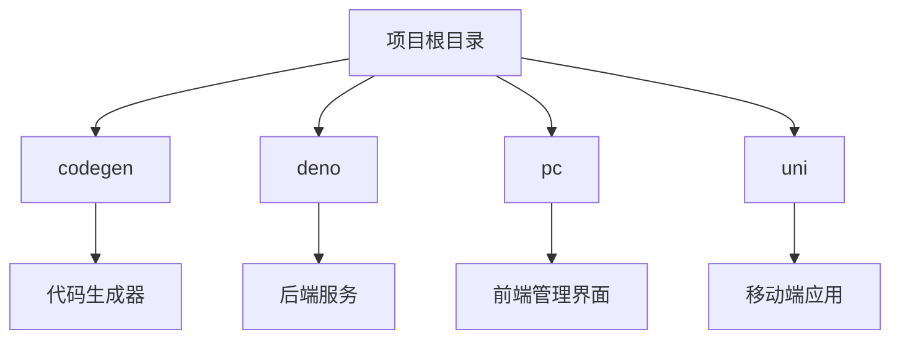
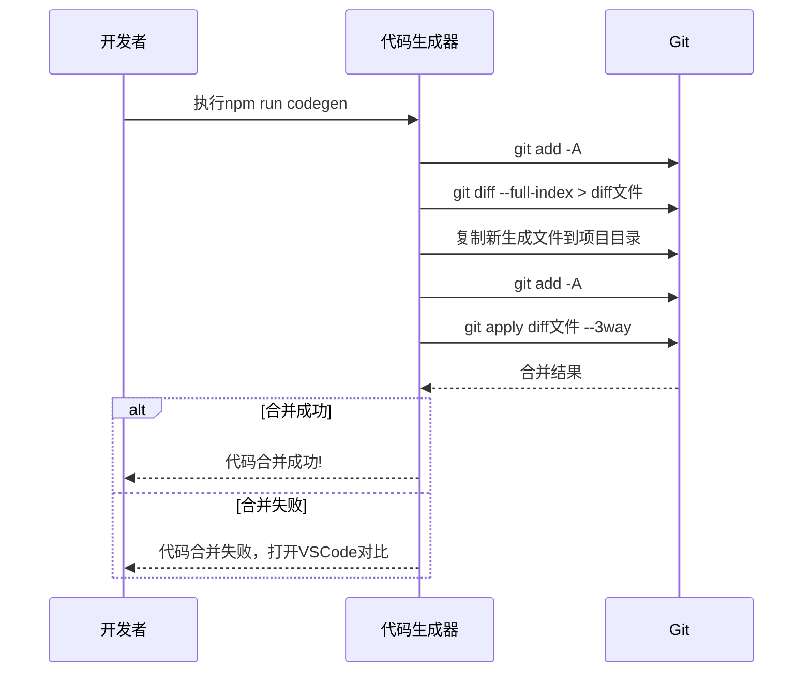
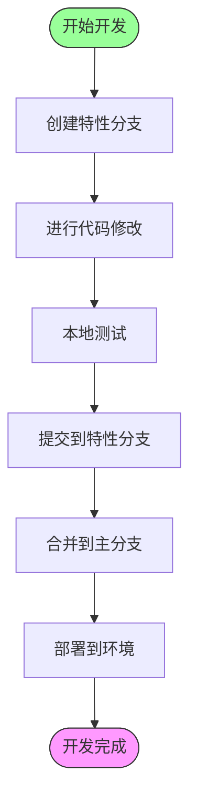
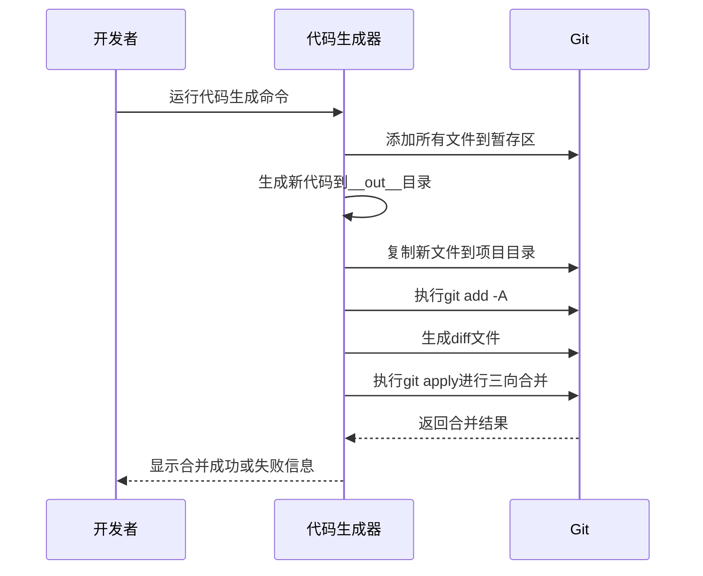
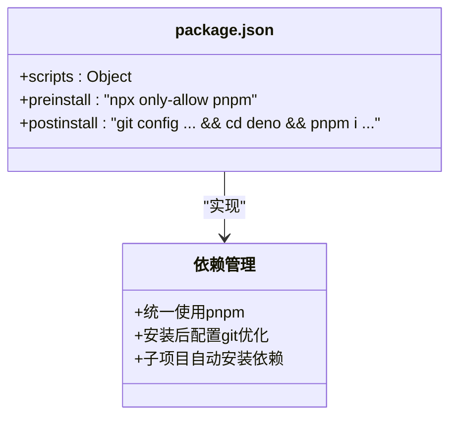
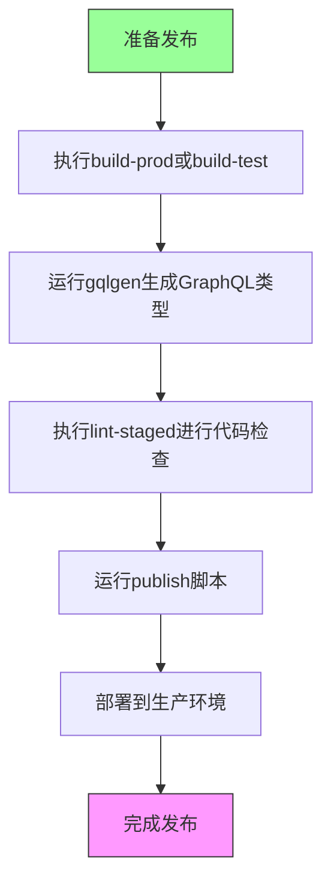
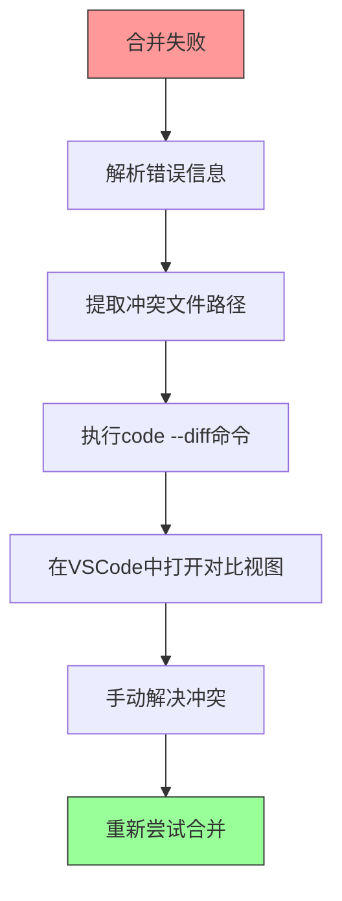

# 版本管理


**本文档引用的文件**   
- [package.json](https://github.com/sail-sail/nest/blob/main/package.json)
- [README.md](https://github.com/sail-sail/nest/blob/main/README.md)
- [codegen.ts](https://github.com/sail-sail/nest/blob/main/codegen/src/bin/codegen.ts)
- [codeapply.ts](https://github.com/sail-sail/nest/blob/main/codegen/src/bin/codeapply.ts)
- [codegen.ts](https://github.com/sail-sail/nest/blob/main/codegen/src/lib/codegen.ts)
- [npmUpgrade.ts](https://github.com/sail-sail/nest/blob/main/codegen/src/util/npmUpgrade.ts)
- [npmGitCommit.js](https://github.com/sail-sail/nest/blob/main/codegen/src/util/npmGitCommit.js)


## 目录
1. [简介](#简介)
2. [项目结构分析](#项目结构分析)
3. [核心版本管理机制](#核心版本管理机制)
4. [分支策略与工作流](#分支策略与工作流)
5. [代码生成与版本控制集成](#代码生成与版本控制集成)
6. [提交信息规范](#提交信息规范)
7. [依赖管理实践](#依赖管理实践)
8. [版本发布流程](#版本发布流程)
9. [故障排查与常见问题](#故障排查与常见问题)
10. [总结](#总结)

## 简介

本项目采用Git作为版本控制系统，结合自定义的代码生成工具和自动化脚本，实现高效的协作开发流程。项目架构包含多个子模块（codegen、deno、pc、uni），每个模块都有独立的package.json文件，但共享统一的版本管理策略。核心版本管理机制围绕代码生成、增量合并和自动化构建展开，确保开发效率和代码一致性。

## 项目结构分析

项目采用多模块架构，主要包含以下组件：



**图示来源**
- [package.json](https://github.com/sail-sail/nest/blob/main/package.json)
- [README.md](https://github.com/sail-sail/nest/blob/main/README.md)

**本节来源**
- [package.json](https://github.com/sail-sail/nest/blob/main/package.json)
- [README.md](https://github.com/sail-sail/nest/blob/main/README.md)

## 核心版本管理机制

项目的核心版本管理机制基于Git的diff和apply功能，实现了代码生成器与手动修改的无缝集成。该机制允许开发者在生成代码后进行自定义修改，后续代码生成时能智能保留这些修改。

### 代码增量合并流程



**图示来源**
- [codegen.ts](https://github.com/sail-sail/nest/blob/main/codegen/src/lib/codegen.ts#L590-L716)
- [codeapply.ts](https://github.com/sail-sail/nest/blob/main/codegen/src/bin/codeapply.ts)

**本节来源**
- [codegen.ts](https://github.com/sail-sail/nest/blob/main/codegen/src/lib/codegen.ts#L590-L716)
- [codeapply.ts](https://github.com/sail-sail/nest/blob/main/codegen/src/bin/codeapply.ts)

## 分支策略与工作流

项目采用主干开发模式，结合特性分支进行功能开发。从npmUpgrade.ts文件可以看出，项目支持从父分支合并更新，体现了其分支管理策略。

### 分支工作流



**图示来源**
- [npmUpgrade.ts](https://github.com/sail-sail/nest/blob/main/codegen/src/util/npmUpgrade.ts)

**本节来源**
- [npmUpgrade.ts](https://github.com/sail-sail/nest/blob/main/codegen/src/util/npmUpgrade.ts)

## 代码生成与版本控制集成

项目通过codegen工具实现代码的自动化生成，并与Git版本控制深度集成，确保生成代码与手动修改的和谐共存。

### 代码生成流程



**图示来源**
- [codegen.ts](https://github.com/sail-sail/nest/blob/main/codegen/src/bin/codegen.ts)
- [codegen.ts](https://github.com/sail-sail/nest/blob/main/codegen/src/lib/codegen.ts)

**本节来源**
- [codegen.ts](https://github.com/sail-sail/nest/blob/main/codegen/src/bin/codegen.ts)
- [codegen.ts](https://github.com/sail-sail/nest/blob/main/codegen/src/lib/codegen.ts)

## 提交信息规范

项目通过git commit hook（npmGitCommit.js）对提交信息进行规范化处理，确保提交历史的清晰可读。

### 提交信息处理规则

```mermaid
flowchart TD
A[开始提交] --> B{检查COMMIT_EDITMSG}
B --> |文件存在| C{消息是否以"n:"开头}
C --> |是| D[移除"n:"前缀]
C --> |否| E{消息是否为"pkg"}
E --> |是| F[跳过后续处理]
E --> |否| G{消息是否以"!"开头}
G --> |是| H[移除"!"前缀并执行gqlgen和lint-staged]
G --> |否| I[正常提交]
D --> J[正常提交]
H --> K[完成提交]
style A fill:#9f9,stroke:#333
style K fill:#f9f,stroke:#333
```

**图示来源**
- [npmGitCommit.js](https://github.com/sail-sail/nest/blob/main/codegen/src/util/npmGitCommit.js)

**本节来源**
- [npmGitCommit.js](https://github.com/sail-sail/nest/blob/main/codegen/src/util/npmGitCommit.js)

## 依赖管理实践

项目采用pnpm作为包管理器，通过preinstall钩子强制使用pnpm，确保团队成员使用统一的依赖管理工具。

### 依赖管理策略



**图示来源**
- [package.json](https://github.com/sail-sail/nest/blob/main/package.json)

**本节来源**
- [package.json](https://github.com/sail-sail/nest/blob/main/package.json)

## 版本发布流程

项目的版本发布流程通过npm脚本自动化，包含构建、测试和发布等环节。

### 发布流程



**图示来源**
- [package.json](https://github.com/sail-sail/nest/blob/main/package.json)

**本节来源**
- [package.json](https://github.com/sail-sail/nest/blob/main/package.json)

## 故障排查与常见问题

### 代码合并失败处理

当代码生成器的增量合并失败时，系统会自动启动VSCode的diff工具，帮助开发者可视化比较生成代码和现有代码的差异。



**图示来源**
- [codegen.ts](https://github.com/sail-sail/nest/blob/main/codegen/src/lib/codegen.ts#L634-L677)

**本节来源**
- [codegen.ts](https://github.com/sail-sail/nest/blob/main/codegen/src/lib/codegen.ts#L634-L677)

## 总结

本项目通过创新的代码生成与版本控制集成机制，实现了高效、可靠的开发工作流。核心优势包括：
- 代码生成器与手动修改的完美结合
- 自动化的分支更新和依赖管理
- 规范化的提交信息处理
- 完善的构建和发布流程

这些实践确保了团队能够快速迭代开发，同时保持代码质量和一致性。