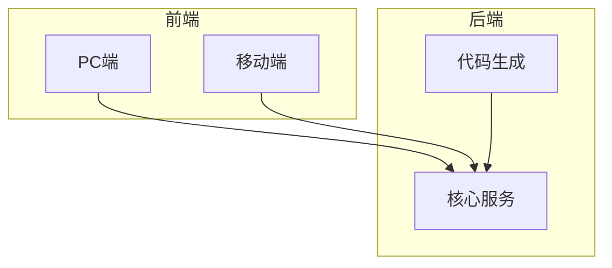
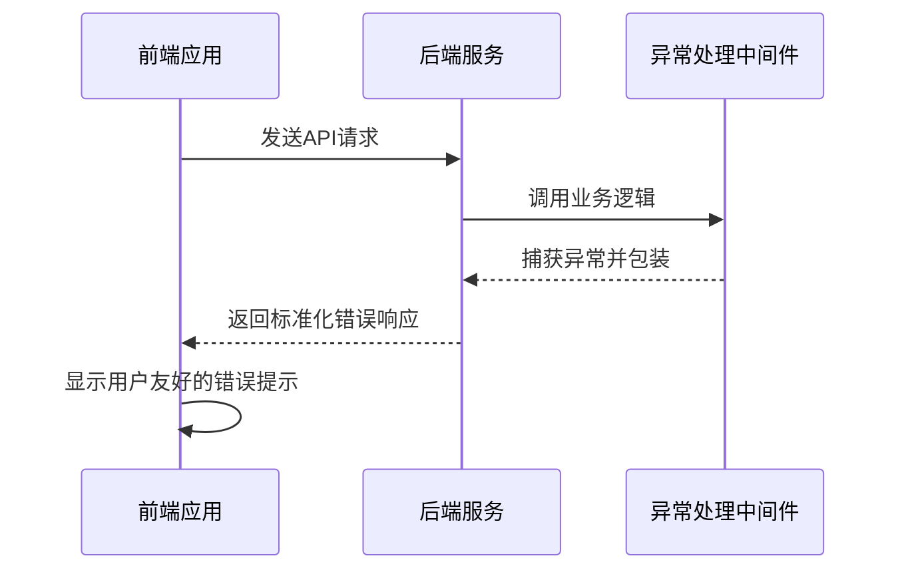
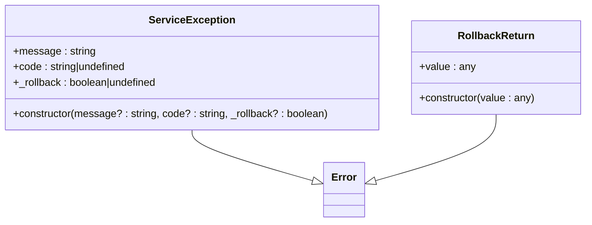
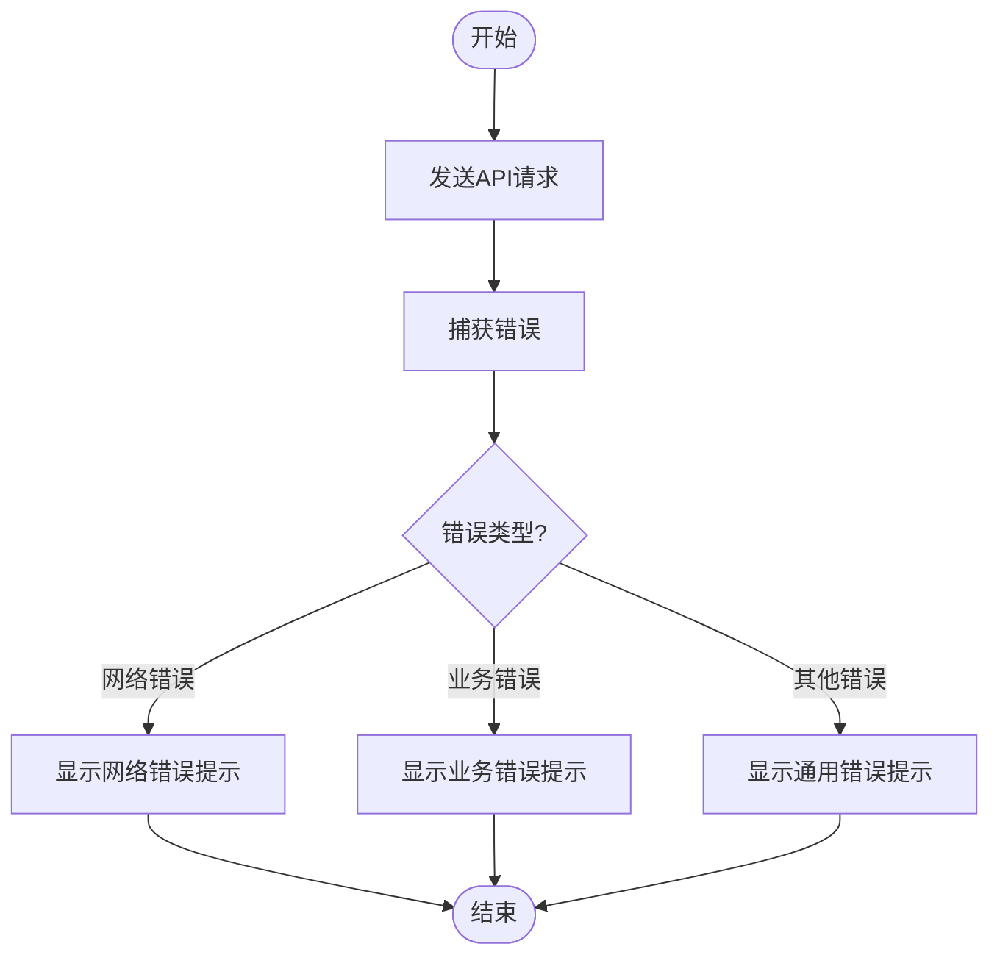
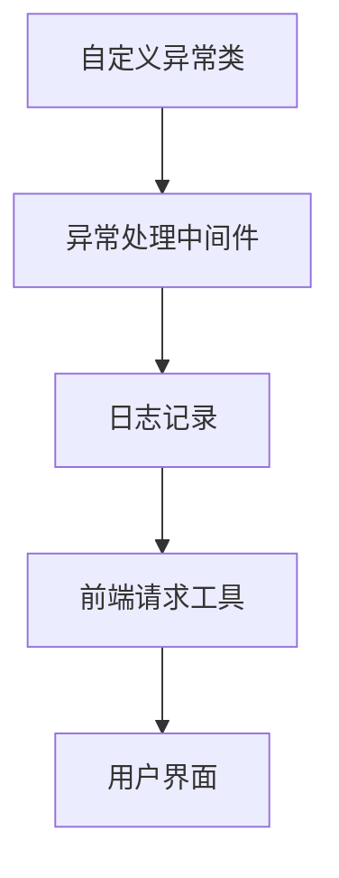

# 错误处理

**本文档引用的文件**  
- [service.exception.ts](https://github.com/sail-sail/nest/blob/main/deno\lib\exceptions\service.exception.ts)
- [gql.ts](https://github.com/sail-sail/nest/blob/main/deno\lib\oak\gql.ts)
- [create_context.ts](https://github.com/sail-sail/nest/blob/main/deno\lib\oak\create_context.ts)
- [request.ts](https://github.com/sail-sail/nest/blob/main/pc\src\utils\request.ts)
- [request.ts](https://github.com/sail-sail/nest/blob/main/uni\src\utils\request.ts)
- [log.ts](https://github.com/sail-sail/nest/blob/main/deno\lib\util\log.ts)

## 目录
1. [简介](#简介)
2. [项目结构](#项目结构)
3. [核心组件](#核心组件)
4. [架构概览](#架构概览)
5. [详细组件分析](#详细组件分析)
6. [依赖分析](#依赖分析)
7. [性能考虑](#性能考虑)
8. [故障排除指南](#故障排除指南)
9. [结论](#结论)

## 简介
本文档系统地介绍了项目中的错误处理机制，涵盖后端服务异常的捕获、包装和返回策略，以及前端如何统一处理API错误响应。文档详细说明了自定义异常类的设计与使用，如`service.exception.ts`中的实现。同时，介绍了错误日志记录的最佳实践，包括关键信息的收集和敏感信息的过滤。此外，还阐述了用户友好的错误提示设计，如何将技术性错误转化为用户可理解的提示，并提供了从异常抛出到最终用户提示的完整链路的代码示例。

## 项目结构
项目采用分层架构，主要分为`codegen`、`deno`、`pc`和`uni`四个部分。`codegen`用于生成代码，`deno`包含后端服务的核心逻辑，`pc`和`uni`分别代表PC端和移动端的前端应用。错误处理机制贯穿整个项目，后端通过自定义异常类和中间件进行异常捕获和处理，前端通过统一的请求工具类处理API响应。

**图示来源**
- [service.exception.ts](https://github.com/sail-sail/nest/blob/main/deno\lib\exceptions\service.exception.ts)
- [gql.ts](https://github.com/sail-sail/nest/blob/main/deno\lib\oak\gql.ts)

**本节来源**
- [service.exception.ts](https://github.com/sail-sail/nest/blob/main/deno\lib\exceptions\service.exception.ts)
- [gql.ts](https://github.com/sail-sail/nest/blob/main/deno\lib\oak\gql.ts)

## 核心组件
项目中的核心错误处理组件包括自定义异常类`ServiceException`和`RollbackReturn`，以及用于处理GraphQL请求的中间件。`ServiceException`允许在抛出异常时指定错误码和是否回滚事务，而`RollbackReturn`用于在不抛出异常的情况下返回值。

**本节来源**
- [service.exception.ts](https://github.com/sail-sail/nest/blob/main/deno\lib\exceptions\service.exception.ts)

## 架构概览
系统的错误处理架构从前端到后端形成闭环。前端通过统一的请求工具类发送请求，后端通过中间件捕获异常并返回标准化的错误响应，前端再根据响应内容显示用户友好的错误提示。

**图示来源**
- [gql.ts](https://github.com/sail-sail/nest/blob/main/deno\lib\oak\gql.ts)
- [request.ts](https://github.com/sail-sail/nest/blob/main/pc\src\utils\request.ts)

## 详细组件分析

### 后端异常处理
后端通过`ServiceException`类实现自定义异常处理。该类继承自`Error`，并添加了`code`和`_rollback`属性，用于指定错误码和是否回滚事务。

**图示来源**
- [service.exception.ts](https://github.com/sail-sail/nest/blob/main/deno\lib\exceptions\service.exception.ts)

**本节来源**
- [service.exception.ts](https://github.com/sail-sail/nest/blob/main/deno\lib\exceptions\service.exception.ts)

### 前端错误处理
前端通过`request`工具类统一处理API响应。该类在捕获到错误时，会根据错误类型显示相应的用户提示。

**图示来源**
- [request.ts](https://github.com/sail-sail/nest/blob/main/pc\src\utils\request.ts)
- [request.ts](https://github.com/sail-sail/nest/blob/main/uni\src\utils\request.ts)

**本节来源**
- [request.ts](https://github.com/sail-sail/nest/blob/main/pc\src\utils\request.ts)
- [request.ts](https://github.com/sail-sail/nest/blob/main/uni\src\utils\request.ts)

## 依赖分析
项目中的错误处理机制依赖于多个组件，包括自定义异常类、中间件、日志记录工具等。这些组件相互协作，共同实现了完整的错误处理流程。

**图示来源**
- [service.exception.ts](https://github.com/sail-sail/nest/blob/main/deno\lib\exceptions\service.exception.ts)
- [gql.ts](https://github.com/sail-sail/nest/blob/main/deno\lib\oak\gql.ts)
- [log.ts](https://github.com/sail-sail/nest/blob/main/deno\lib\util\log.ts)

**本节来源**
- [service.exception.ts](https://github.com/sail-sail/nest/blob/main/deno\lib\exceptions\service.exception.ts)
- [gql.ts](https://github.com/sail-sail/nest/blob/main/deno\lib\oak\gql.ts)
- [log.ts](https://github.com/sail-sail/nest/blob/main/deno\lib\util\log.ts)

## 性能考虑
错误处理机制对性能的影响较小，主要开销在于异常的捕获和日志记录。建议在生产环境中合理配置日志级别，避免记录过多不必要的信息。

## 故障排除指南
当遇到错误处理相关的问题时，可以按照以下步骤进行排查：
1. 检查异常是否被正确抛出和捕获。
2. 确认错误码和错误信息是否正确传递。
3. 查看日志文件，确认是否有相关错误记录。

**本节来源**
- [service.exception.ts](https://github.com/sail-sail/nest/blob/main/deno\lib\exceptions\service.exception.ts)
- [gql.ts](https://github.com/sail-sail/nest/blob/main/deno\lib\oak\gql.ts)
- [log.ts](https://github.com/sail-sail/nest/blob/main/deno\lib\util\log.ts)

## 结论
本文档详细介绍了项目中的错误处理机制，从前端到后端形成了完整的闭环。通过自定义异常类、中间件和统一的请求工具类，实现了高效、可靠的错误处理。建议在开发过程中遵循本文档的最佳实践，确保系统的稳定性和用户体验。