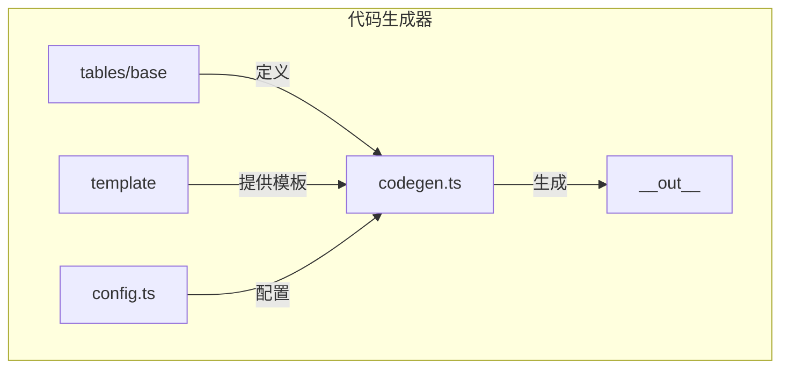
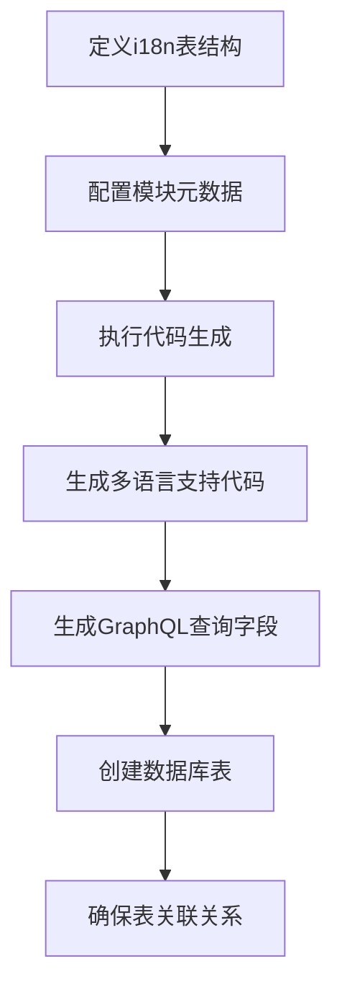
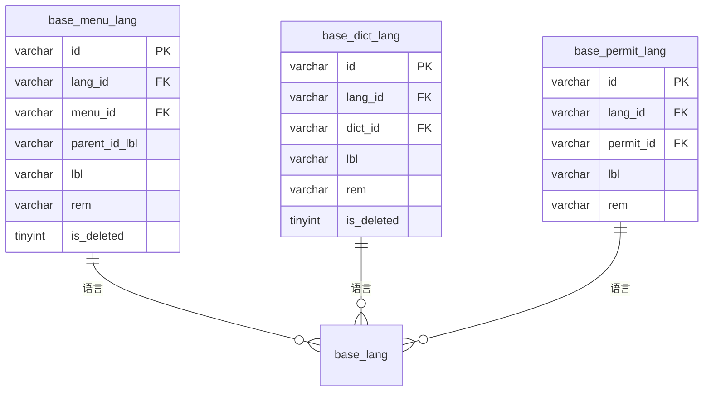
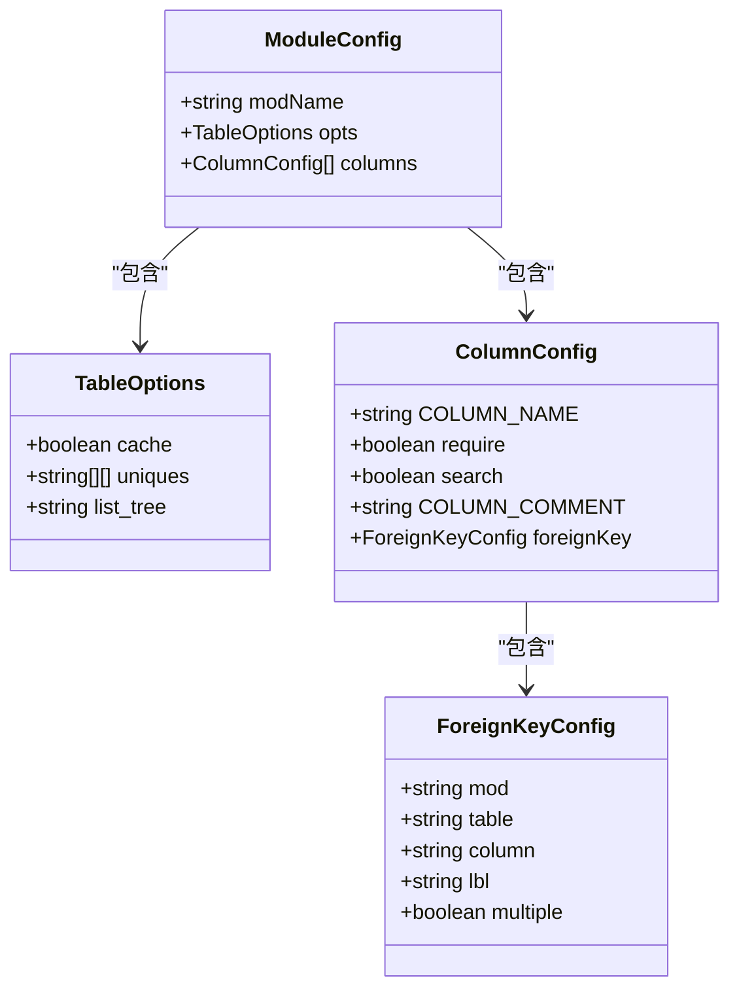
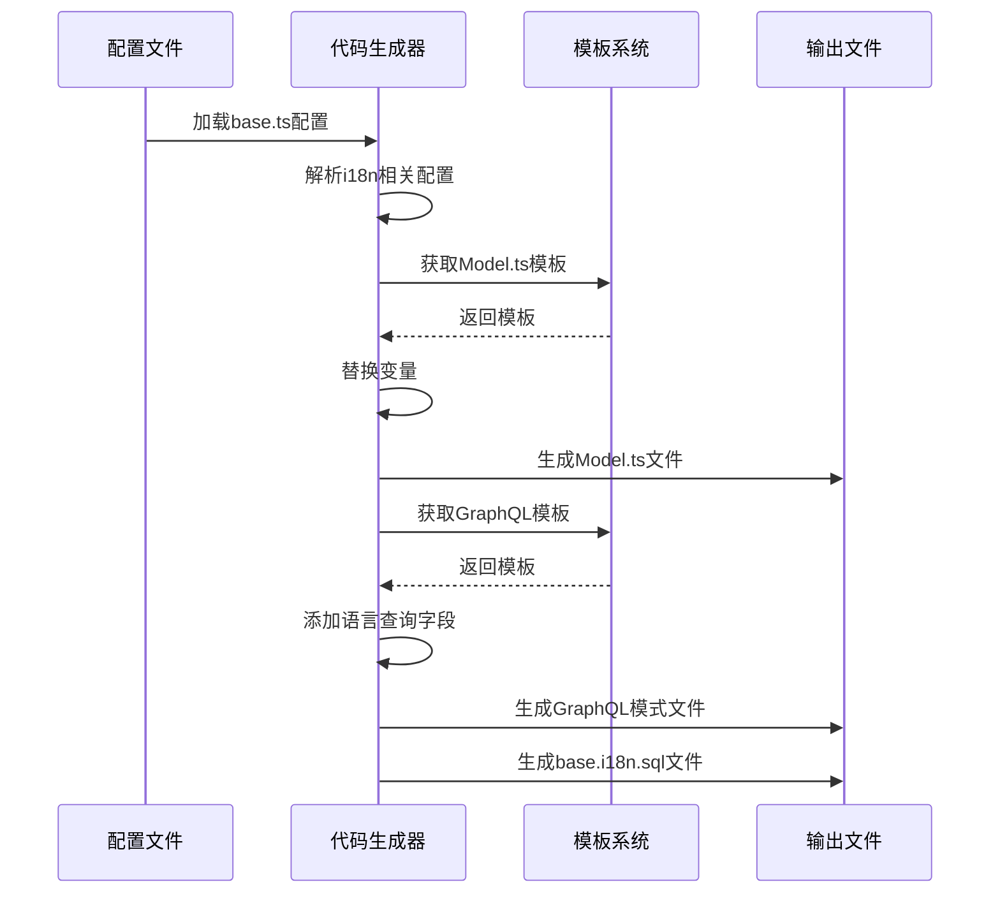
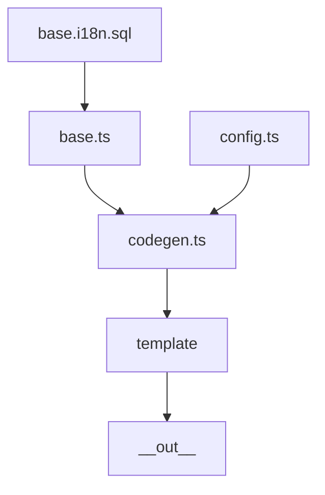

# 代码生成集成

**本文档引用文件**  
- [base.i18n.sql](https://github.com/sail-sail/nest/blob/main/codegen/src/tables/base/base.i18n.sql)
- [base.ts](https://github.com/sail-sail/nest/blob/main/codegen/src/tables/base/base.ts)
- [codegen.ts](https://github.com/sail-sail/nest/blob/main/codegen/src/lib/codegen.ts)
- [config.ts](https://github.com/sail-sail/nest/blob/main/codegen/src/config.ts)

## 目录
1. [简介](#简介)
2. [项目结构](#项目结构)
3. [核心组件](#核心组件)
4. [架构概览](#架构概览)
5. [详细组件分析](#详细组件分析)
6. [依赖分析](#依赖分析)
7. [性能考量](#性能考量)
8. [故障排除指南](#故障排除指南)
9. [结论](#结论)

## 简介
本文档详细阐述了代码生成系统与国际化（i18n）功能的集成机制。重点说明在生成新模块时，如何自动创建相应的语言资源文件和数据库表结构，以及模板系统如何处理多语言字段。文档还介绍了自定义i18n代码生成规则的方法和最佳实践。

## 项目结构
代码生成系统位于`codegen`目录下，其核心结构包括：
- `src/tables/base/`: 存放基础模块的数据库表定义和i18n配置
- `src/template/`: 包含用于生成代码的模板文件
- `src/lib/`: 核心代码生成逻辑
- `__out__/`: 代码生成的输出目录

**图示来源**
- [base.i18n.sql](https://github.com/sail-sail/nest/blob/main/codegen/src/tables/base/base.i18n.sql)
- [base.ts](https://github.com/sail-sail/nest/blob/main/codegen/src/tables/base/base.ts)
- [codegen.ts](https://github.com/sail-sail/nest/blob/main/codegen/src/lib/codegen.ts)

**本节来源**
- [base.i18n.sql](https://github.com/sail-sail/nest/blob/main/codegen/src/tables/base/base.i18n.sql)
- [base.ts](https://github.com/sail-sail/nest/blob/main/codegen/src/tables/base/base.ts)

## 核心组件
系统的核心是`base.i18n.sql`文件和`base.ts`配置文件的协同工作。`base.i18n.sql`定义了i18n数据库表结构，而`base.ts`则提供了代码生成所需的元数据配置。

**本节来源**
- [base.i18n.sql](https://github.com/sail-sail/nest/blob/main/codegen/src/tables/base/base.i18n.sql#L1-L63)
- [base.ts](https://github.com/sail-sail/nest/blob/main/codegen/src/tables/base/base.ts#L1-L800)

## 架构概览
整个i18n代码生成流程遵循以下架构：

**图示来源**
- [base.i18n.sql](https://github.com/sail-sail/nest/blob/main/codegen/src/tables/base/base.i18n.sql)
- [base.ts](https://github.com/sail-sail/nest/blob/main/codegen/src/tables/base/base.ts)

## 详细组件分析

### i18n数据库表结构分析
`base.i18n.sql`文件定义了多个i18n表，用于存储不同实体的多语言信息。

**图示来源**
- [base.i18n.sql](https://github.com/sail-sail/nest/blob/main/codegen/src/tables/base/base.i18n.sql#L1-L63)

**本节来源**
- [base.i18n.sql](https://github.com/sail-sail/nest/blob/main/codegen/src/tables/base/base.i18n.sql#L1-L63)

### 模块配置分析
`base.ts`文件中的配置定义了各个模块的属性和行为，包括i18n相关的字段。

**图示来源**
- [base.ts](https://github.com/sail-sail/nest/blob/main/codegen/src/tables/base/base.ts#L1-L800)

**本节来源**
- [base.ts](https://github.com/sail-sail/nest/blob/main/codegen/src/tables/base/base.ts#L1-L800)

### 代码生成流程分析
代码生成器根据配置文件自动创建相应的语言资源文件和数据库表结构。

**图示来源**
- [base.ts](https://github.com/sail-sail/nest/blob/main/codegen/src/tables/base/base.ts)
- [codegen.ts](https://github.com/sail-sail/nest/blob/main/codegen/src/lib/codegen.ts)
- [config.ts](https://github.com/sail-sail/nest/blob/main/codegen/src/config.ts)

**本节来源**
- [base.ts](https://github.com/sail-sail/nest/blob/main/codegen/src/tables/base/base.ts#L1-L800)
- [codegen.ts](https://github.com/sail-sail/nest/blob/main/codegen/src/lib/codegen.ts)

## 依赖分析
系统各组件之间的依赖关系如下：

**图示来源**
- [base.i18n.sql](https://github.com/sail-sail/nest/blob/main/codegen/src/tables/base/base.i18n.sql)
- [base.ts](https://github.com/sail-sail/nest/blob/main/codegen/src/tables/base/base.ts)
- [codegen.ts](https://github.com/sail-sail/nest/blob/main/codegen/src/lib/codegen.ts)
- [config.ts](https://github.com/sail-sail/nest/blob/main/codegen/src/config.ts)

**本节来源**
- [base.i18n.sql](https://github.com/sail-sail/nest/blob/main/codegen/src/tables/base/base.i18n.sql)
- [base.ts](https://github.com/sail-sail/nest/blob/main/codegen/src/tables/base/base.ts)
- [codegen.ts](https://github.com/sail-sail/nest/blob/main/codegen/src/lib/codegen.ts)
- [config.ts](https://github.com/sail-sail/nest/blob/main/codegen/src/config.ts)

## 性能考量
由于i18n功能涉及多个关联表的查询，建议在关键字段上建立适当的索引以提高查询性能。同时，利用配置中的`cache: true`选项可以有效减少数据库访问次数。

## 故障排除指南
- **问题**：生成的i18n表缺少字段
  - **解决方案**：检查`base.i18n.sql`文件中的表定义是否完整
- **问题**：多语言字段未在GraphQL模式中显示
  - **解决方案**：确认`base.ts`中相关模块的配置是否正确，特别是`foreignKey`设置
- **问题**：语言资源文件未生成
  - **解决方案**：验证代码生成器是否正确读取了`base.ts`配置文件

**本节来源**
- [base.i18n.sql](https://github.com/sail-sail/nest/blob/main/codegen/src/tables/base/base.i18n.sql#L1-L63)
- [base.ts](https://github.com/sail-sail/nest/blob/main/codegen/src/tables/base/base.ts#L1-L800)

## 结论
该代码生成系统通过`base.i18n.sql`和`base.ts`的协同工作，实现了i18n功能的自动化集成。系统能够根据配置自动生成相应的语言资源文件、数据库表结构和GraphQL查询字段，大大提高了开发效率。通过遵循本文档中的最佳实践，可以确保新生成代码的多语言支持一致性。