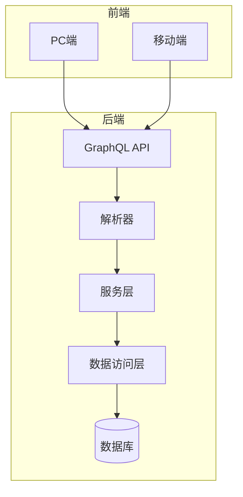
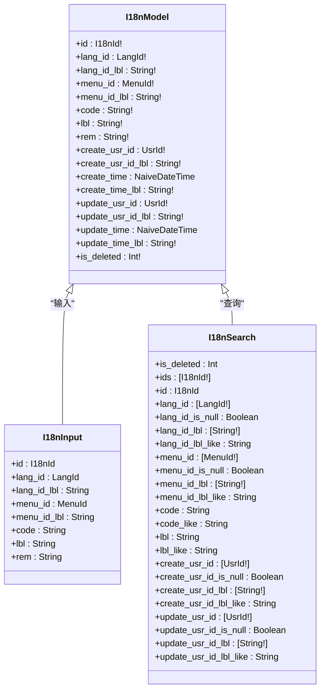
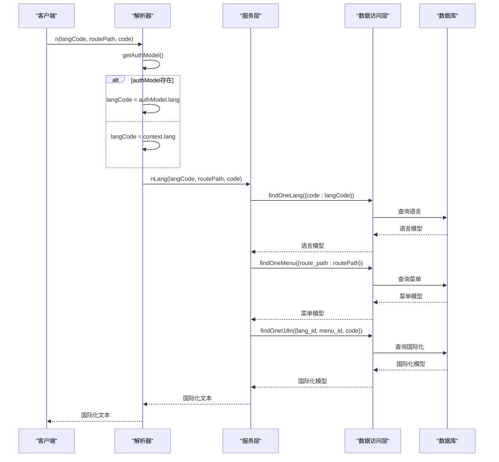
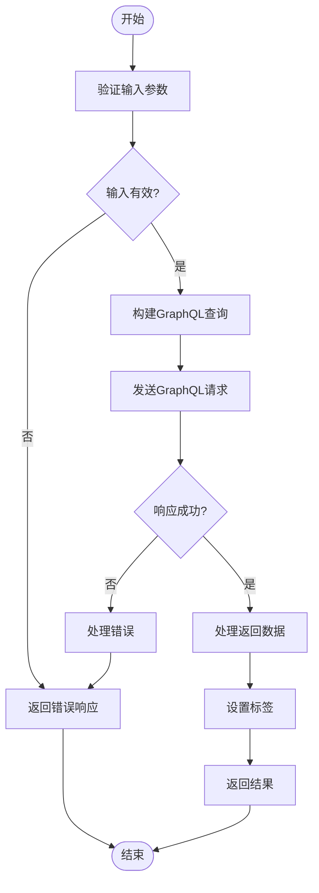
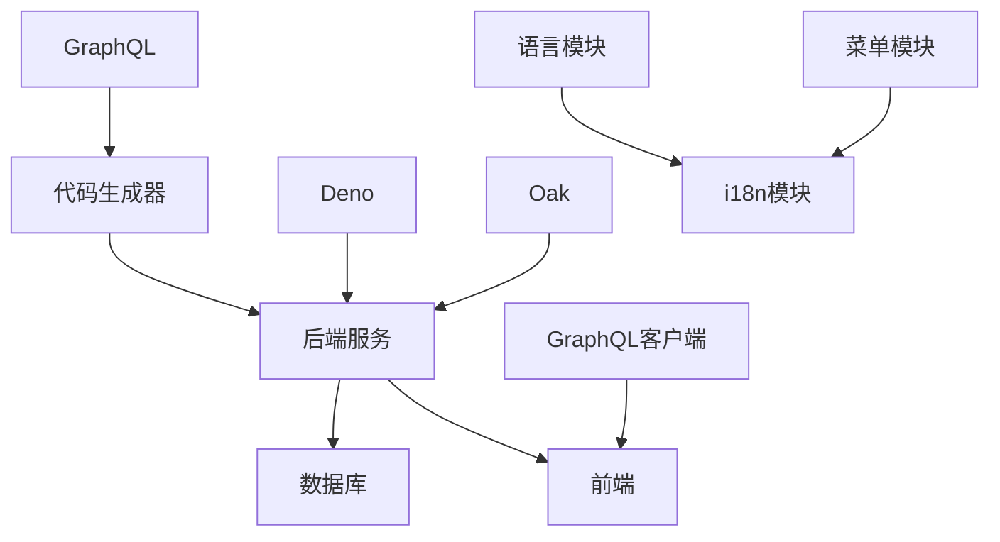

# GraphQL字段处理

**本文档引用的文件**   
- [i18n.graphql.ts](https://github.com/sail-sail/nest/blob/main/deno\gen\base\i18n\i18n.graphql.ts)
- [i18n.resolver.ts](https://github.com/sail-sail/nest/blob/main/deno\src\base\i18n\i18n.resolver.ts)
- [i18n.ts](https://github.com/sail-sail/nest/blob/main/deno\src\base\i18n\i18n.ts)
- [Api.ts](https://github.com/sail-sail/nest/blob/main/pc\src\views\base\i18n\Api.ts)
- [Model.ts](https://github.com/sail-sail/nest/blob/main/pc\src\views\base\i18n\Model.ts)

## 目录
1. [简介](#简介)
2. [项目结构](#项目结构)
3. [核心组件](#核心组件)
4. [架构概述](#架构概述)
5. [详细组件分析](#详细组件分析)
6. [依赖分析](#依赖分析)
7. [性能考虑](#性能考虑)
8. [故障排除指南](#故障排除指南)
9. [结论](#结论)

## 简介
本文档详细描述了在GraphQL层面处理国际化（i18n）字段的机制。重点阐述了代码生成器如何将数据库中的i18n字段映射到GraphQL类型系统，包括类型定义、字段命名、查询与变更操作的设计，以及字段级权限控制和语言环境自动识别的实现。

## 项目结构
项目结构遵循模块化设计，主要分为codegen、deno、pc和uni四个部分。codegen目录包含代码生成器的源码和模板，deno目录包含后端服务的生成代码，pc目录包含前端PC端代码，uni目录包含前端移动端代码。i18n相关的代码分布在各个模块中，实现了前后端的国际化支持。

**Section sources**
- [i18n.graphql.ts](https://github.com/sail-sail/nest/blob/main/deno\gen\base\i18n\i18n.graphql.ts#L0-L170)
- [i18n.ts](https://github.com/sail-sail/nest/blob/main/deno\src\base\i18n\i18n.ts#L0-L153)

## 核心组件
核心组件包括GraphQL模式定义、解析器、数据访问对象（DAO）和服务层。这些组件协同工作，实现i18n字段的增删改查操作。GraphQL模式定义了i18n字段的类型和操作，解析器处理GraphQL请求，DAO层与数据库交互，服务层封装业务逻辑。

**Section sources**
- [i18n.graphql.ts](https://github.com/sail-sail/nest/blob/main/deno\gen\base\i18n\i18n.graphql.ts#L0-L170)
- [i18n.resolver.ts](https://github.com/sail-sail/nest/blob/main/deno\src\base\i18n\i18n.resolver.ts#L0-L24)

## 架构概述
系统架构采用前后端分离模式，前端通过GraphQL API与后端通信。后端使用Deno和Oak框架，通过代码生成器自动生成GraphQL模式和解析器。i18n功能通过专门的模块实现，支持多语言字段的存储和检索。

**Diagram sources**
- [i18n.graphql.ts](https://github.com/sail-sail/nest/blob/main/deno\gen\base\i18n\i18n.graphql.ts#L0-L170)
- [i18n.resolver.ts](https://github.com/sail-sail/nest/blob/main/deno\src\base\i18n\i18n.resolver.ts#L0-L24)

## 详细组件分析
### GraphQL模式定义分析
GraphQL模式定义了i18n字段的类型和操作。`I18nModel`类型包含id、lang_id、menu_id、code、lbl等字段，分别表示国际化记录的ID、语言ID、菜单ID、编码和名称。`I18nInput`输入类型用于创建和更新操作，`I18nSearch`输入类型用于查询操作。

**Diagram sources**
- [i18n.graphql.ts](https://github.com/sail-sail/nest/blob/main/deno\gen\base\i18n\i18n.graphql.ts#L0-L170)

**Section sources**
- [i18n.graphql.ts](https://github.com/sail-sail/nest/blob/main/deno\gen\base\i18n\i18n.graphql.ts#L0-L170)

### 解析器分析
解析器负责处理GraphQL请求，调用服务层的方法获取数据。`n`解析器函数根据语言编码、路由路径和代码返回对应的国际化文本。它首先尝试从认证模型中获取语言编码，如果不存在则从上下文中获取。

**Diagram sources**
- [i18n.resolver.ts](https://github.com/sail-sail/nest/blob/main/deno\src\base\i18n\i18n.resolver.ts#L0-L24)
- [i18n.ts](https://github.com/sail-sail/nest/blob/main/deno\src\base\i18n\i18n.ts#L0-L153)

**Section sources**
- [i18n.resolver.ts](https://github.com/sail-sail/nest/blob/main/deno\src\base\i18n\i18n.resolver.ts#L0-L24)
- [i18n.ts](https://github.com/sail-sail/nest/blob/main/deno\src\base\i18n\i18n.ts#L0-L153)

### 前端API分析
前端API封装了对GraphQL服务的调用，提供了更易用的接口。`findAllI18n`函数根据搜索条件查找国际化列表，`findByIdI18n`函数根据ID查找单个国际化记录。这些函数使用GraphQL查询语句与后端通信，并处理返回的数据。

**Diagram sources**
- [Api.ts](https://github.com/sail-sail/nest/blob/main/pc\src\views\base\i18n\Api.ts#L0-L749)

**Section sources**
- [Api.ts](https://github.com/sail-sail/nest/blob/main/pc\src\views\base\i18n\Api.ts#L0-L749)

## 依赖分析
系统依赖于GraphQL、Deno、Oak等技术栈。代码生成器依赖于项目结构和数据库模式，自动生成GraphQL模式和解析器。前端依赖于GraphQL客户端库与后端通信。i18n模块依赖于语言、菜单等基础数据模块。

**Diagram sources**
- [i18n.graphql.ts](https://github.com/sail-sail/nest/blob/main/deno\gen\base\i18n\i18n.graphql.ts#L0-L170)
- [i18n.resolver.ts](https://github.com/sail-sail/nest/blob/main/deno\src\base\i18n\i18n.resolver.ts#L0-L24)

**Section sources**
- [i18n.graphql.ts](https://github.com/sail-sail/nest/blob/main/deno\gen\base\i18n\i18n.graphql.ts#L0-L170)
- [i18n.resolver.ts](https://github.com/sail-sail/nest/blob/main/deno\src\base\i18n\i18n.resolver.ts#L0-L24)

## 性能考虑
为提高性能，系统采用了多种优化策略。GraphQL查询支持分页和排序，避免一次性加载大量数据。前端API在查询时自动设置标签，减少后续处理开销。服务层和DAO层分离，便于缓存和优化数据库查询。

## 故障排除指南
常见问题包括语言编码未设置、路由路径不匹配、数据库查询失败等。检查认证模型中的语言设置，确保路由路径正确，验证数据库连接和查询语句。使用调试工具查看GraphQL请求和响应，定位问题根源。

**Section sources**
- [i18n.resolver.ts](https://github.com/sail-sail/nest/blob/main/deno\src\base\i18n\i18n.resolver.ts#L0-L24)
- [i18n.ts](https://github.com/sail-sail/nest/blob/main/deno\src\base\i18n\i18n.ts#L0-L153)

## 结论
本文档详细介绍了GraphQL层面的国际化字段处理机制。通过代码生成器自动生成GraphQL模式和解析器，实现了i18n字段的高效管理和使用。前后端分离的架构设计，使得系统具有良好的可维护性和扩展性。未来可以进一步优化性能，增加更多语言支持，提升用户体验。