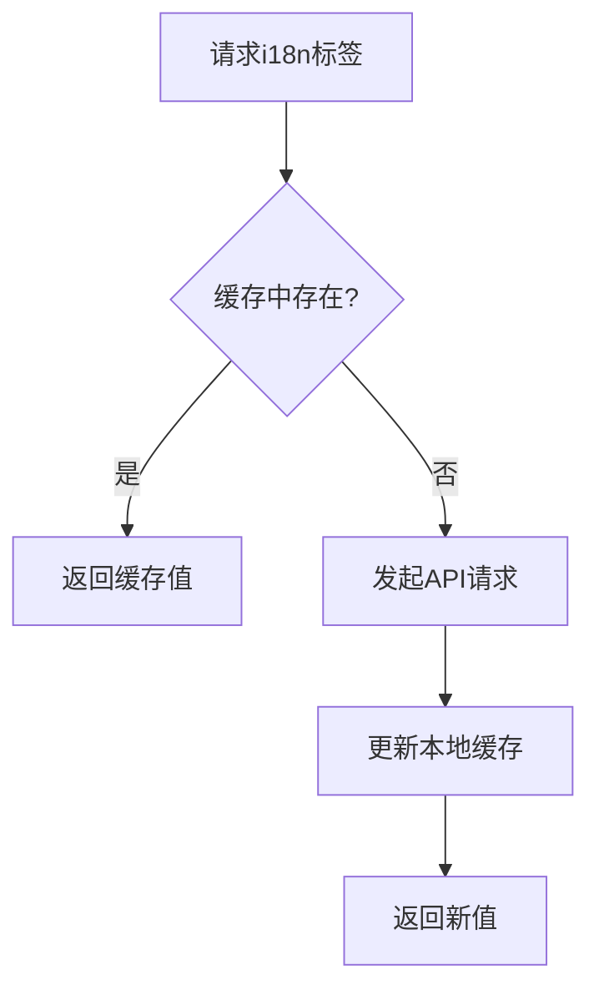
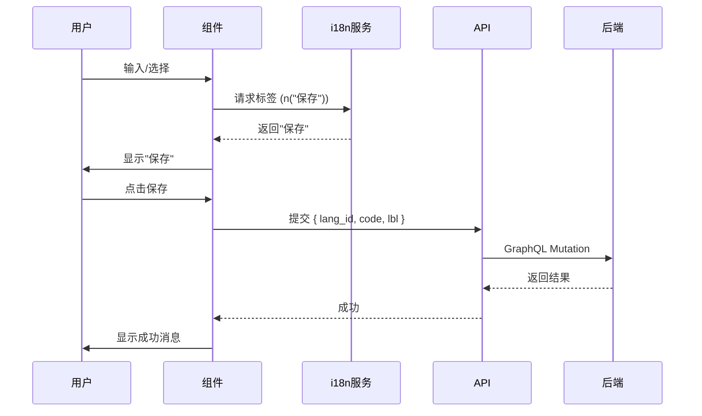

# 前端字段处理


**本文档引用文件**  
- [Model.ts](https://github.com/sail-sail/nest/blob/main/codegen\__out__\pc\src\views\base\i18n\Model.ts)
- [i18n.ts](https://github.com/sail-sail/nest/blob/main/pc\src\locales\i18n.ts)
- [CustomInput.vue](https://github.com/sail-sail/nest/blob/main/pc\src\components\CustomInput.vue)
- [CustomSelect.vue](https://github.com/sail-sail/nest/blob/main/pc\src\components\CustomSelect.vue)
- [Api.ts](https://github.com/sail-sail/nest/blob/main/pc\src\locales\Api.ts)


## 目录
1. [引言](#引言)  
2. [项目结构分析](#项目结构分析)  
3. [i18n字段类型定义与模型](#i18n字段类型定义与模型)  
4. [前端国际化服务实现](#前端国际化服务实现)  
5. [表单组件对i18n字段的处理](#表单组件对i18n字段的处理)  
6. [API客户端序列化与反序列化](#api客户端序列化与反序列化)  
7. [多语言交互最佳实践](#多语言交互最佳实践)  

## 引言
本文档旨在详细说明在PC端和移动端应用中如何处理国际化（i18n）字段。通过分析项目中的关键文件，包括Model.ts、i18n.ts、CustomInput.vue和CustomSelect.vue，阐述i18n字段的类型定义、初始化、验证规则、动态语言切换机制、表单组件的特殊处理逻辑以及API数据的序列化流程。文档将为开发者提供一套完整的前端i18n字段处理方案。

## 项目结构分析
项目采用模块化结构，主要分为codegen、deno、pc和uni四个部分。其中：
- `codegen`：代码生成器，用于自动生成基础CRUD代码。
- `deno`：后端服务，基于Deno运行时。
- `pc`：PC端前端应用，使用Vue 3 + TypeScript + Vite构建。
- `uni`：移动端前端应用，基于uni-app框架。

i18n相关功能分布在`pc/src/locales`和`uni/src/locales`目录下，而表单组件位于`pc/src/components`和`uni/src/components`中。核心的i18n模型定义在`codegen/__out__/pc/src/views/base/i18n/Model.ts`中。

**Section sources**
- [Model.ts](https://github.com/sail-sail/nest/blob/main/codegen\__out__\pc\src\views\base\i18n\Model.ts)
- [i18n.ts](https://github.com/sail-sail/nest/blob/main/pc\src\locales\i18n.ts)

## i18n字段类型定义与模型
在`Model.ts`文件中，i18n字段通过接口扩展的方式进行定义，确保类型安全和可维护性。

### 类型定义
```typescript
/** 国际化 */
interface I18nModel extends I18nModelType {
}

/** 国际化输入 */
interface I18nInput extends I18nInputType {
}

/** 国际化搜索 */
interface I18nSearch extends I18nSearchType {
  is_deleted?: 0 | 1 | null;
}
```

### 字段列表
`i18nFields`数组定义了所有需要国际化的字段名，包括：
- `id`：ID
- `lang_id`, `lang_id_lbl`：语言ID及标签
- `menu_id`, `menu_id_lbl`：菜单ID及标签
- `code`：编码
- `lbl`：名称（核心国际化字段）
- `rem`：备注
- `create_usr_id`, `create_usr_id_lbl`：创建人
- `create_time`, `create_time_lbl`：创建时间
- `update_usr_id`, `update_usr_id_lbl`：更新人
- `update_time`, `update_time_lbl`：更新时间
- `is_deleted`：软删除标记

### 查询字段生成
`i18nQueryField`通过模板字符串将所有字段拼接，用于GraphQL查询，确保一次性获取所有国际化字段。

```typescript
export const i18nQueryField = `
  ${ i18nFields.join(" ") }
`;
```

**Section sources**
- [Model.ts](https://github.com/sail-sail/nest/blob/main/codegen\__out__\pc\src\views\base\i18n\Model.ts#L1-L62)

## 前端国际化服务实现
`pc/src/locales/i18n.ts`是前端i18n服务的核心，负责管理语言包、动态加载和缓存。

### 核心功能
1. **语言包缓存**：使用`localStorage`缓存已加载的语言标签，避免重复请求。
2. **动态加载**：通过`initI18ns`函数按需从服务器加载指定页面的i18n标签。
3. **版本控制**：通过`__i18n_version`检查缓存是否过期。
4. **参数替换**：支持`{0}`、`{name}`等占位符替换。

### 关键函数
#### `useI18n` - 国际化钩子
```typescript
export function useI18n(routePath?: string | null) {
  const usrStore = useUsrStore();
  const lang = usrStore.lang;
  return {
    n(code: string, ...args: any[]) {
      return getLbl(lang, code, routePath, ...args);
    },
    nAsync(code: string, ...args: any[]) {
      return getLblAsync(lang, code, routePath, ...args);
    },
    initI18ns(codes: string[]) {
      return initI18ns(lang, codes, routePath);
    },
    ns(code: string, ...args: any[]) {
      return getLbl(lang, code, "", ...args);
    },
    initSysI18ns(codes: string[]) {
      return initI18ns(lang, codes, "");
    },
  };
}
```
- `n`：同步获取标签
- `nAsync`：异步获取标签
- `initI18ns`：初始化页面级i18n
- `ns`：获取系统级i18n标签

#### `getLbl` - 获取标签
```typescript
function getLbl(lang: string, code: string, routePath: string | null, ...args: any[]) {
  // 1. 检查本地缓存
  const key = `${routePath} ${code}`;
  let i18nLbl: string = i18nLbls[lang]?.[key];
  if (i18nLbl) {
    return setLblArgs(i18nLbl, args);
  }
  // 2. 异步从服务器获取并缓存
  const i18nLblRef = ref(setLblArgs(code, args));
  (async function() {
    await nextTick();
    i18nLbls[key] = await n0(lang, routePath, code, { notLoading: true });
    localStorage.setItem(`i18nLblsLang`, JSON.stringify(i18nLblsLang));
    i18nLblRef.value = setLblArgs(i18nLbls[key], args);
  })();
  return i18nLblRef.value;
}
```

### 缓存机制


**Diagram sources**
- [i18n.ts](https://github.com/sail-sail/nest/blob/main/pc\src\locales\i18n.ts#L0-L217)

**Section sources**
- [i18n.ts](https://github.com/sail-sail/nest/blob/main/pc\src\locales\i18n.ts#L0-L217)

## 表单组件对i18n字段的处理
### CustomInput 组件
`CustomInput.vue`是基础输入组件，支持i18n字段的显示和编辑。

#### 只读模式处理
```vue
<template v-else>
  <div class="custom_input_readonly">
    <span v-if="shouldShowPlaceholder">
      {{ props.readonlyPlaceholder ?? "" }}
    </span>
    <span v-else>
      {{ modelValue ?? "" }}
    </span>
  </div>
</template>
```
- 当`readonly`为`true`时，显示只读文本。
- 支持通过`readonlyPlaceholder`显示占位符。

#### 数据绑定
使用`v-model`双向绑定`modelValue`，并通过`watch`同步props变化。

```typescript
let modelValue = $ref(props.modelValue);

watch(() => props.modelValue, () => {
  modelValue = props.modelValue;
});

watch(() => modelValue, () => {
  emit("update:modelValue", modelValue);
});
```

**Section sources**
- [CustomInput.vue](https://github.com/sail-sail/nest/blob/main/pc\src\components\CustomInput.vue#L0-L252)

### CustomSelect 组件
`CustomSelect.vue`是下拉选择组件，对i18n字段有更复杂的处理。

#### 多语言标签显示
```typescript
const modelLabels: string[] = $computed(() => {
  if (!modelValue) return [ "" ];
  if (!props.multiple) {
    const model = data.find((item) => props.optionsMap(item).value === modelValue);
    return [ props.optionsMap(model).label || "" ];
  }
  // 多选逻辑
});
```
- 通过`optionsMap`函数将数据映射为`{ label, value }`结构，`label`即为i18n字段。

#### 全选功能
```vue
<template #header>
  <el-checkbox v-model="isSelectAll" :indeterminate="isIndeterminate">
    <span>{{ ns("全选") }}</span>
  </el-checkbox>
</template>
```
- 使用`ns("全选")`获取“全选”按钮的多语言文本。

#### 默认值设置
支持多选时“设为默认”功能，按钮文本“设为默认”也应国际化。

```vue
<el-button @click.stop="onSetMultipleDefault(item.value)">
  设为默认
</el-button>
```

#### 异步初始化
```typescript
async function initFrame() {
  const codes = ["全选"];
  await initSysI18ns(codes);
}
initFrame();
```
- 在组件挂载前预加载所需的i18n标签。

**Section sources**
- [CustomSelect.vue](https://github.com/sail-sail/nest/blob/main/pc\src\components\CustomSelect.vue#L0-L1011)

## API客户端序列化与反序列化
### 序列化流程
1. 用户在表单中输入多语言字段。
2. 组件通过`v-model`收集数据。
3. 提交时，数据被序列化为JSON，包含`lang_id`、`code`、`lbl`等字段。
4. 通过GraphQL mutation发送到后端。

### 反序列化流程
1. 后端返回包含`i18nQueryField`的所有字段。
2. 前端将数据填充到`I18nModel`类型对象中。
3. 在模板中直接使用`lbl`字段显示。

### 语言偏好传递
- 通过用户Store（`useUsrStore()`）获取当前语言`lang`。
- 在`useI18n`钩子中自动注入`lang`参数。
- API请求头或查询参数中可携带`lang`以获取特定语言数据。



**Diagram sources**
- [i18n.ts](https://github.com/sail-sail/nest/blob/main/pc\src\locales\i18n.ts#L0-L217)
- [CustomInput.vue](https://github.com/sail-sail/nest/blob/main/pc\src\components\CustomInput.vue#L0-L252)
- [CustomSelect.vue](https://github.com/sail-sail/nest/blob/main/pc\src\components\CustomSelect.vue#L0-L1011)

## 多语言交互最佳实践
### 1. 统一使用`useI18n`钩子
```typescript
const { n, ns, initI18ns } = useI18n();
// 页面级
await initI18ns(["保存", "取消"]);
// 使用
const btnSave = n("保存");
```

### 2. 预加载关键标签
在组件`setup`或`onMounted`中调用`initSysI18ns`预加载。

### 3. 处理动态内容
对于动态生成的标签，使用`{}`占位符：
```typescript
n("用户{0}不存在", username);
```

### 4. 移动端适配
`uni`项目中的`CustomInput`和`CustomSelect`应实现类似逻辑，确保一致性。

### 5. 错误处理
当i18n标签不存在时，回退到默认值或code本身。

### 6. 性能优化
- 合理使用`localStorage`缓存。
- 避免在循环中频繁调用`n()`，可预先获取。