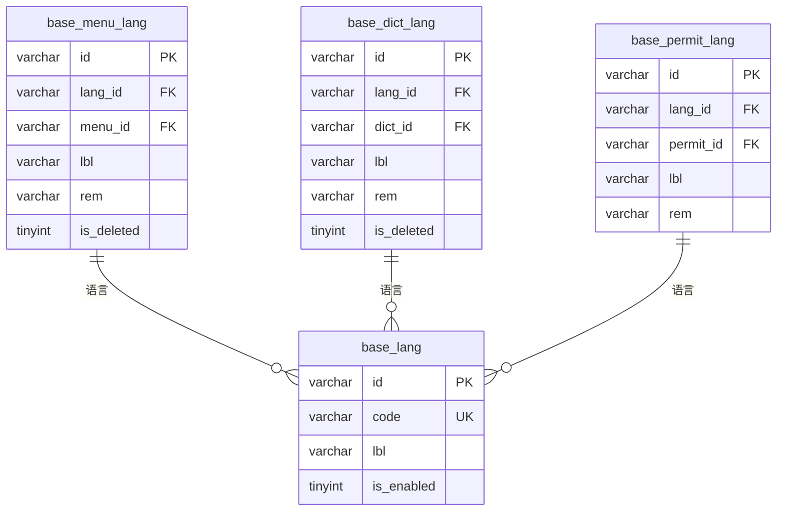
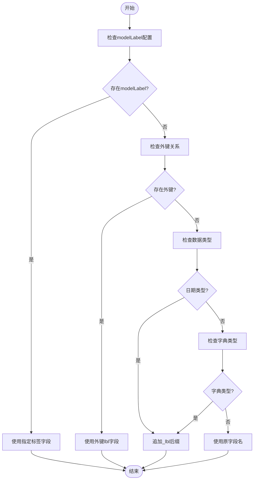
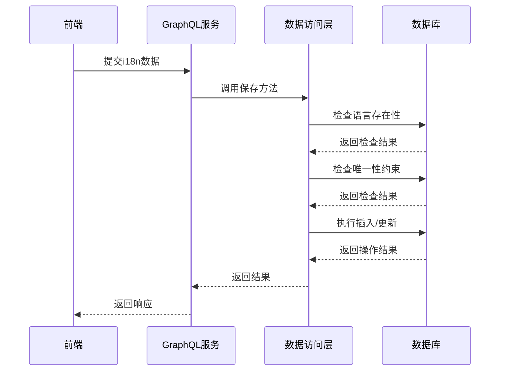

# 字段处理


**本文档引用的文件**   
- [base.i18n.sql](https://github.com/sail-sail/nest/blob/main/codegen\src\tables\base\base.i18n.sql)
- [base.ts](https://github.com/sail-sail/nest/blob/main/codegen\src\tables\base\base.ts)
- [codegen.ts](https://github.com/sail-sail/nest/blob/main/codegen\src\lib\codegen.ts)
- [i18n.dao.ts](https://github.com/sail-sail/nest/blob/main/codegen\src\template\deno\gen\[[mod_slash_table]]\[[table]].dao.ts)
- [Model.ts](https://github.com/sail-sail/nest/blob/main/pc\src\views\base\i18n\Model.ts)


## 目录
1. [国际化字段处理概述](#国际化字段处理概述)
2. [数据库结构设计](#数据库结构设计)
3. [代码生成机制](#代码生成机制)
4. [GraphQL与前端模型映射](#graphql与前端模型映射)
5. [字段验证规则生成](#字段验证规则生成)
6. [特殊i18n字段类型处理](#特殊i18n字段类型处理)

## 国际化字段处理概述

本系统通过代码生成器实现多语言字段的自动化处理，采用分离式存储策略将国际化内容与主数据解耦。系统支持菜单、字典、权限等核心模块的多语言展示，通过`base.i18n.sql`定义的语言表结构实现语言内容的独立管理。代码生成器在编译时自动解析表结构，生成相应的数据访问层、服务层和前端组件，确保三端（数据库、GraphQL API、前端）在i18n字段处理上的一致性。

**Section sources**
- [base.i18n.sql](https://github.com/sail-sail/nest/blob/main/codegen\src\tables\base\base.i18n.sql)
- [base.ts](https://github.com/sail-sail/nest/blob/main/codegen\src\tables\base\base.ts)

## 数据库结构设计

系统采用垂直分表策略处理国际化字段，为每个需要多语言支持的实体创建独立的语言表。所有语言表遵循统一的命名规范`{主表名}_lang`，并包含标准字段结构。



**Diagram sources**
- [base.i18n.sql](https://github.com/sail-sail/nest/blob/main/codegen\src\tables\base\base.i18n.sql)

### 字段命名规范

所有国际化表遵循统一的字段命名规则：
- `id`: 主键，22位字符串
- `lang_id`: 语言ID，关联`base_lang`表
- `{entity}_id`: 实体ID，关联主表
- `lbl`: 名称字段，存储翻译文本
- `rem`: 备注字段，存储翻译备注
- `is_deleted`: 软删除标记

### 数据类型选择

| 字段类型 | 数据类型 | 长度 | 说明 |
|---------|---------|------|------|
| 主键ID | varchar | 22 | 使用短UUIDv4 |
| 文本内容 | varchar | 45-100 | 根据内容重要性分级 |
| 删除标记 | tinyint unsigned | - | 0未删除，1已删除 |
| 备注信息 | varchar | 100 | 通用备注字段 |

### 索引策略

所有语言表均创建复合索引以优化查询性能：
```sql
INDEX (`lang_id`, `{entity}_id`, `is_deleted`)
```
该索引支持按语言、实体ID和删除状态的高效查询，满足最常见的多语言数据检索场景。

**Section sources**
- [base.i18n.sql](https://github.com/sail-sail/nest/blob/main/codegen\src\tables\base\base.i18n.sql)

## 代码生成机制

代码生成器通过分析数据库表结构，自动处理i18n字段的映射关系。核心逻辑位于`codegen.ts`文件中，通过模板引擎生成各层代码。

### 字段映射规则

生成器根据以下规则处理字段映射：
1. **虚拟字段识别**：通过`modelLabel`配置识别需要显示标签的字段
2. **外键关联**：自动识别外键关系并生成对应的标签字段
3. **字典字段**：识别`dict`和`dictbiz`类型字段，生成对应的标签映射



**Diagram sources**
- [codegen.ts](https://github.com/sail-sail/nest/blob/main/codegen\src\lib\codegen.ts)

### 语言数据刷新

系统在数据查询时自动刷新语言内容，核心逻辑如下：
```typescript
async function refreshLangByInput(input: Readonly<<#=inputName#>>) {
  const server_i18n_enable = getParsedEnv("server_i18n_enable") === "true";
  if (!server_i18n_enable) {
    return;
  }
  
  // 遍历所有语言相关字段
  for (let i = 0; i < langTableRecords.length; i++) {
    const record = langTableRecords[i];
    const column_name = record.COLUMN_NAME;
    
    // 动态赋值语言内容
    if ((model as any)[`${column_name}_lang`]) {
      model[column_name] = (model as any)[`${column_name}_lang`];
      (model as any)[`${column_name}_lang`] = undefined;
    }
  }
}
```

**Section sources**
- [i18n.dao.ts](https://github.com/sail-sail/nest/blob/main/codegen\src\template\deno\gen\[[mod_slash_table]]\[[table]].dao.ts)

## GraphQL与前端模型映射

系统通过代码生成器确保数据库表结构、GraphQL类型和前端Model之间的完全一致性。

### GraphQL类型定义

GraphQL模式自动生成包含所有i18n字段的查询接口：
```graphql
type I18nModel {
  id: String!
  lang_id: String!
  lang_id_lbl: String
  menu_id: String
  menu_id_lbl: String
  code: String
  lbl: String
  rem: String
  create_usr_id: String
  create_usr_id_lbl: String
  create_time: DateTime
  create_time_lbl: String
  update_usr_id: String
  update_usr_id_lbl: String
  update_time: DateTime
  update_time_lbl: String
  is_deleted: Int
}
```

### 前端Model定义

前端Model.ts文件定义了字段列表和查询字段：
```typescript
export const i18nFields = [
  "id",
  "lang_id",
  "lang_id_lbl",
  "menu_id",
  "menu_id_lbl",
  "code",
  "lbl",
  "rem",
  "create_usr_id",
  "create_usr_id_lbl",
  "create_time",
  "create_time_lbl",
  "update_usr_id",
  "update_usr_id_lbl",
  "update_time",
  "update_time_lbl",
  "is_deleted",
];

export const i18nQueryField = `
  ${ i18nFields.join(" ") }
`;
```

**Section sources**
- [Model.ts](https://github.com/sail-sail/nest/blob/main/pc\src\views\base\i18n\Model.ts)

## 字段验证规则生成

系统根据数据库约束自动生成相应的验证规则，确保数据完整性。

### 必填性验证

基于`NOT NULL`约束生成必填验证：
- `lang_id`: 必填，关联语言
- `menu_id`: 必填，关联菜单
- `lbl`: 必填，显示名称

### 长度限制

根据`varchar`长度定义生成长度验证：
- `lbl`: 最大45-100字符
- `rem`: 最大100字符
- `id`: 固定22字符

### 语言特定验证

系统支持语言特定的验证逻辑：
1. **语言存在性验证**：确保`lang_id`存在于`base_lang`表
2. **唯一性约束**：在`lang_id`和`{entity}_id`组合上建立唯一索引
3. **启用状态验证**：只允许对启用的语言进行内容编辑



**Diagram sources**
- [i18n.dao.ts](https://github.com/sail-sail/nest/blob/main/codegen\src\template\deno\gen\[[mod_slash_table]]\[[table]].dao.ts)

## 特殊i18n字段类型处理

### 富文本内容处理

对于需要支持富文本的i18n字段，建议采用以下策略：
1. **字段扩展**：在语言表中添加`content`字段，类型为`text`
2. **编辑器集成**：前端使用富文本编辑器（如Quill、TinyMCE）
3. **内容过滤**：服务端对HTML内容进行安全过滤

### HTML内容处理

处理HTML内容的最佳实践：
- **存储策略**：使用`longtext`类型存储大段HTML内容
- **安全防护**：服务端进行XSS过滤
- **前端渲染**：使用`v-html`或`dangerouslySetInnerHTML`安全渲染
- **版本控制**：对HTML内容变更进行版本管理

### 注意事项

1. **性能优化**：对大文本字段建立单独的缓存策略
2. **编辑体验**：提供所见即所得的编辑界面
3. **内容同步**：确保不同语言版本的内容同步更新
4. **备份策略**：对富文本内容实施定期备份

**Section sources**
- [base.i18n.sql](https://github.com/sail-sail/nest/blob/main/codegen\src\tables\base\base.i18n.sql)
- [i18n.dao.ts](https://github.com/sail-sail/nest/blob/main/codegen\src\template\deno\gen\[[mod_slash_table]]\[[table]].dao.ts)