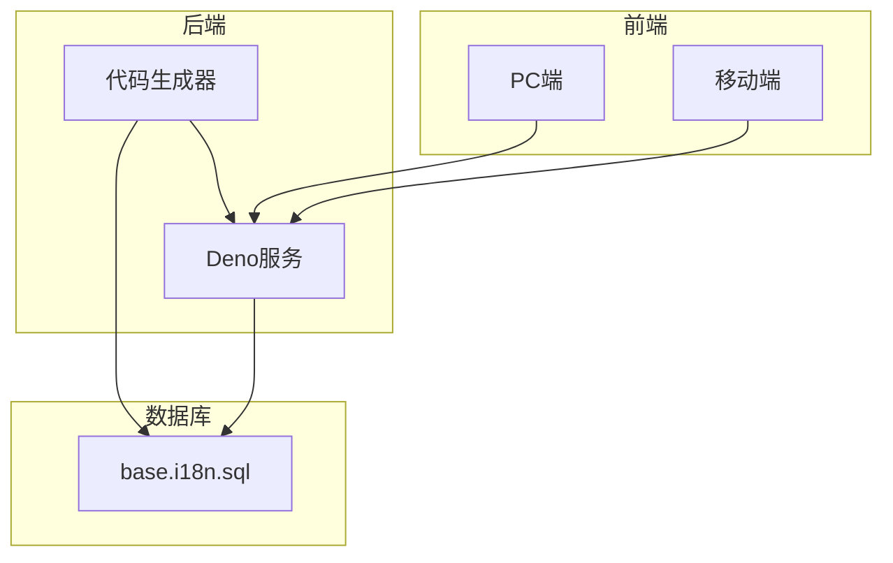

# 数据库字段处理


**本文档中引用的文件**
- [base.i18n.sql](https://github.com/sail-sail/nest/blob/main/codegen/src/tables/base/base.i18n.sql)
- [i18n.dao.ts](https://github.com/sail-sail/nest/blob/main/deno/gen/base/i18n/i18n.dao.ts)
- [i18n.model.ts](https://github.com/sail-sail/nest/blob/main/deno/gen/base/i18n/i18n.model.ts)
- [Model.ts](https://github.com/sail-sail/nest/blob/main/pc/src/views/base/i18n/Model.ts)
- [i18n.ts](https://github.com/sail-sail/nest/blob/main/deno/src/base/i18n/i18n.ts)
- [i18n.ts](https://github.com/sail-sail/nest/blob/main/pc/src/locales/i18n.ts)


## 目录
1. [引言](#引言)
2. [项目结构分析](#项目结构分析)
3. [国际化字段设计原理](#国际化字段设计原理)
4. [数据类型与字符集配置](#数据类型与字符集配置)
5. [索引策略与约束机制](#索引策略与约束机制)
6. [代码生成器实现机制](#代码生成器实现机制)
7. [字段长度与空值处理](#字段长度与空值处理)
8. [多语言字段元数据查询](#多语言字段元数据查询)
9. [跨数据库系统最佳实践](#跨数据库系统最佳实践)
10. [结论](#结论)

## 引言

本文件旨在详细阐述数据库层面的国际化（i18n）字段处理机制，重点分析 `base.i18n.sql` 模板文件的设计原理与实现方式。通过深入解析多语言字段的命名规范、数据类型选择、字符集配置及索引策略，为开发者提供一套完整的国际化字段处理方案。文档还将说明如何通过代码生成器将i18n字段定义转换为实际的数据库表结构，并探讨在不同数据库系统中的最佳实践。

**Section sources**
- [base.i18n.sql](https://github.com/sail-sail/nest/blob/main/codegen/src/tables/base/base.i18n.sql)

## 项目结构分析

项目采用模块化设计，主要分为 `codegen`、`deno`、`pc` 和 `uni` 四个核心模块。其中 `codegen` 负责代码生成，`deno` 实现后端服务逻辑，`pc` 为PC端前端应用，`uni` 为跨平台移动端应用。

国际化功能贯穿整个系统架构，涉及数据库表设计、后端DAO层操作、前端模型定义等多个层面。关键文件分布如下：
- 数据库模板：`codegen/src/tables/base/base.i18n.sql`
- 后端数据访问对象：`deno/gen/base/i18n/i18n.dao.ts`
- 前端模型定义：`pc/src/views/base/i18n/Model.ts`



**Diagram sources**
- [base.i18n.sql](https://github.com/sail-sail/nest/blob/main/codegen/src/tables/base/base.i18n.sql)
- [i18n.dao.ts](https://github.com/sail-sail/nest/blob/main/deno/gen/base/i18n/i18n.dao.ts)
- [Model.ts](https://github.com/sail-sail/nest/blob/main/pc/src/views/base/i18n/Model.ts)

**Section sources**
- [base.i18n.sql](https://github.com/sail-sail/nest/blob/main/codegen/src/tables/base/base.i18n.sql)
- [i18n.dao.ts](https://github.com/sail-sail/nest/blob/main/deno/gen/base/i18n/i18n.dao.ts)
- [Model.ts](https://github.com/sail-sail/nest/blob/main/pc/src/views/base/i18n/Model.ts)

## 国际化字段设计原理

### 多语言字段命名规范

系统采用基于后缀的命名规范来标识多语言字段。对于需要支持国际化的字段，其对应的多语言版本字段以 `_lbl` 作为后缀。例如：
- `menu_id` 对应的显示名称为 `menu_id_lbl`
- `lang_id` 对应的显示名称为 `lang_id_lbl`

这种命名方式确保了字段语义的清晰性和一致性，便于代码生成器自动识别和处理。

### 语言表结构设计

系统通过独立的语言表来存储多语言数据，实现了数据与语言的解耦。以菜单语言为例：

```sql
CREATE TABLE `base_menu_lang` (
  `id` varchar(22) NOT NULL COMMENT 'ID',
  `lang_id` varchar(22) NOT NULL DEFAULT '' COMMENT '语言',
  `menu_id` varchar(22) NOT NULL DEFAULT '' COMMENT '菜单',
  `lbl` varchar(45) NOT NULL DEFAULT '' COMMENT '名称',
  PRIMARY KEY (`id`)
) ENGINE=InnoDB DEFAULT CHARSET=utf8mb4;
```

该设计模式被广泛应用于系统字典、按钮权限等实体，形成了一套统一的国际化处理机制。

**Section sources**
- [base.i18n.sql](https://github.com/sail-sail/nest/blob/main/codegen/src/tables/base/base.i18n.sql)

## 数据类型与字符集配置

### 数据类型选择

系统在设计i18n字段时，根据字段用途合理选择数据类型：

| 字段类型 | 数据类型 | 长度 | 说明 |
|---------|--------|-----|------|
| ID类字段 | VARCHAR | 22 | 使用短UUID作为主键 |
| 名称类字段 | VARCHAR | 45-100 | 根据业务需求设定 |
| 备注类字段 | VARCHAR | 100 | 存储描述信息 |
| 文本类字段 | TEXT | - | 存储大段文本 |

对于短文本如名称、标签等使用 `VARCHAR` 类型，既能保证查询效率，又能有效控制存储空间；对于可能包含大量文本的内容，则考虑使用 `TEXT` 类型。

### 字符集配置

所有i18n相关表均采用 `UTF8MB4` 字符集和 `utf8mb4_0900_ai_ci` 排序规则：

```sql
ENGINE=InnoDB DEFAULT CHARSET=utf8mb4 COLLATE=utf8mb4_0900_ai_ci
```

`UTF8MB4` 字符集支持完整的Unicode编码，能够正确存储和处理包括emoji在内的各种特殊字符，确保多语言环境下的数据完整性。

**Section sources**
- [base.i18n.sql](https://github.com/sail-sail/nest/blob/main/codegen/src/tables/base/base.i18n.sql)

## 索引策略与约束机制

### 主键与外键约束

每个i18n表都定义了明确的主键约束：

```sql
PRIMARY KEY (`id`)
```

同时通过 `lang_id` 和业务实体ID（如 `menu_id`）建立复合索引，提高查询效率：

```sql
INDEX (`lang_id`, `menu_id`, `is_deleted`)
```

这种索引设计特别适合按语言和业务实体查询多语言数据的场景。

### 唯一性索引

虽然当前设计未显式定义唯一性约束，但通过业务逻辑保证了数据的唯一性。例如，在同一语言环境下，一个菜单项的翻译应该是唯一的。

### 软删除机制

系统采用软删除机制，通过 `is_deleted` 字段标记删除状态：

```sql
`is_deleted` tinyint unsigned NOT NULL DEFAULT 0 COMMENT '删除,dict:is_deleted'
```

该字段也被包含在索引中，确保删除状态的查询效率。

**Section sources**
- [base.i18n.sql](https://github.com/sail-sail/nest/blob/main/codegen/src/tables/base/base.i18n.sql)

## 代码生成器实现机制

### 字段映射与生成

代码生成器通过分析数据库表结构，自动生成相应的i18n处理代码。关键实现位于模板文件中：

```typescript
async function refreshLangByInput(
  input: Readonly<<#=inputName#>>,
) {
  const server_i18n_enable = getParsedEnv("server_i18n_enable") === "true";
  if (!server_i18n_enable) {
    return;
  }
  // ... 字段处理逻辑
}
```

生成器会遍历所有需要国际化处理的字段，为每个字段生成相应的语言数据更新逻辑。

### 模型标签处理

系统通过 `modelLabel` 属性确定哪些字段需要生成对应的显示标签：

```javascript
if (!modelLabel) continue;
if (!langTableRecords.some((item) => item.COLUMN_NAME === modelLabel)) {
  continue;
}
```

只有配置了 `modelLabel` 且在语言表中存在对应字段的列才会被处理。

### 动态SQL构建

代码生成器动态构建SQL语句，实现语言数据的插入和更新：

```typescript
let lang_sql = "insert into <#=opts.langTable.opts.table_name#>(id,lang_id,<#=table#>_id";
// ... 字段拼接
lang_sql += ")values(?,?,?";
// ... 参数绑定
```

这种方式确保了代码的灵活性和可维护性。

**Section sources**
- [i18n.dao.ts](https://github.com/sail-sail/nest/blob/main/deno/gen/base/i18n/i18n.dao.ts)
- [base.i18n.sql](https://github.com/sail-sail/nest/blob/main/codegen/src/tables/base/base.i18n.sql)

## 字段长度与空值处理

### 字段长度限制

系统对i18n字段设置了严格的长度限制，确保数据的一致性和完整性：

```typescript
await validators.chars_max_length(
  input.lbl,
  500,
  fieldComments.lbl,
);
```

验证规则包括：
- ID字段：最大22字符
- 名称字段：最大500字符
- 备注字段：最大100字符

这些限制在 `validateI18n` 函数中统一处理，确保输入数据符合预期。

### 默认值设置

所有i18n字段都设置了合理的默认值：

```sql
NOT NULL DEFAULT ''
```

这避免了空值带来的潜在问题，同时也便于前端展示处理。

### 空值处理策略

系统采用严格的非空约束，要求所有字段必须有值。对于暂时无法提供的数据，使用空字符串代替，而不是NULL值。这种策略简化了数据处理逻辑，提高了系统的健壮性。

**Section sources**
- [i18n.dao.ts](https://github.com/sail-sail/nest/blob/main/deno/gen/base/i18n/i18n.dao.ts)
- [base.i18n.sql](https://github.com/sail-sail/nest/blob/main/codegen/src/tables/base/base.i18n.sql)

## 多语言字段元数据查询

### 元数据获取机制

系统提供了获取i18n字段注释的专用函数：

```typescript
export async function getFieldCommentsI18n(): Promise<I18nFieldComment> {
  const fieldComments: I18nFieldComment = {
    id: "ID",
    lang_id: "语言",
    menu_id: "菜单",
    lbl: "名称",
    rem: "备注",
    // ... 其他字段
  };
  return fieldComments;
}
```

该函数返回一个包含所有字段中文注释的对象，用于前端展示和验证提示。

### 前端字段定义

前端通过静态数组定义所有可用的i18n字段：

```typescript
export const i18nFields = [
  "id",
  "lang_id",
  "lang_id_lbl",
  "menu_id",
  "menu_id_lbl",
  "lbl",
  "rem",
  "is_deleted",
];
```

这个数组被用于构建查询语句和表单字段，确保前后端字段的一致性。

### 排序字段控制

系统明确指定了允许前端排序的字段：

```typescript
export const canSortInApiI18n = {
  "create_time": true,
  "update_time": true,
};
```

并通过 `checkSortI18n` 函数进行验证，防止非法排序请求。

**Section sources**
- [i18n.dao.ts](https://github.com/sail-sail/nest/blob/main/deno/gen/base/i18n/i18n.dao.ts)
- [Model.ts](https://github.com/sail-sail/nest/blob/main/pc/src/views/base/i18n/Model.ts)

## 跨数据库系统最佳实践

### MySQL实现特点

当前系统基于MySQL实现，充分利用了其特性：
- 使用 `InnoDB` 存储引擎保证事务完整性
- 采用 `UTF8MB4` 字符集支持多语言
- 利用复合索引优化查询性能

### 可扩展性设计

虽然当前实现针对MySQL，但代码结构具有良好的可移植性：
- SQL语句通过参数化构建，减少数据库依赖
- 数据访问逻辑封装在DAO层，便于替换实现
- 配置项集中管理，方便调整数据库参数

### 迁移建议

若需迁移到其他数据库系统（如PostgreSQL），建议：
1. 检查数据类型映射关系
2. 调整字符集和排序规则配置
3. 优化索引策略以适应目标数据库特性
4. 测试事务处理和并发性能

**Section sources**
- [base.i18n.sql](https://github.com/sail-sail/nest/blob/main/codegen/src/tables/base/base.i18n.sql)
- [i18n.dao.ts](https://github.com/sail-sail/nest/blob/main/deno/gen/base/i18n/i18n.dao.ts)

## 结论

本文档全面解析了系统中数据库层面的国际化字段处理机制。通过 `base.i18n.sql` 模板文件的设计，建立了一套标准化的多语言数据存储方案。代码生成器的引入大大提高了开发效率，减少了人为错误。系统的i18n处理机制具有良好的扩展性和维护性，能够满足复杂的多语言应用场景需求。

未来可考虑进一步优化的方向包括：
- 实现更智能的默认语言回退机制
- 增加批量导入导出功能
- 完善翻译状态跟踪
- 提供可视化翻译管理界面

这套机制为构建真正的国际化应用奠定了坚实的基础。