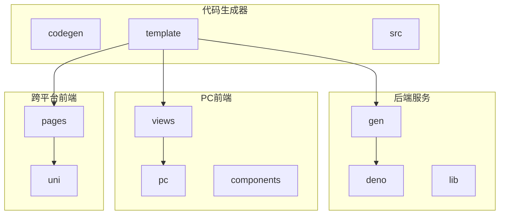
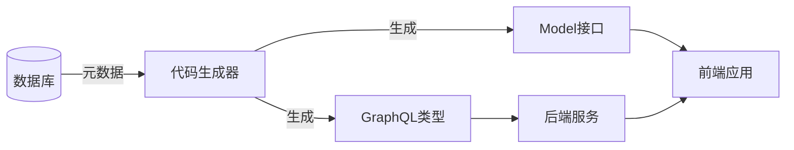
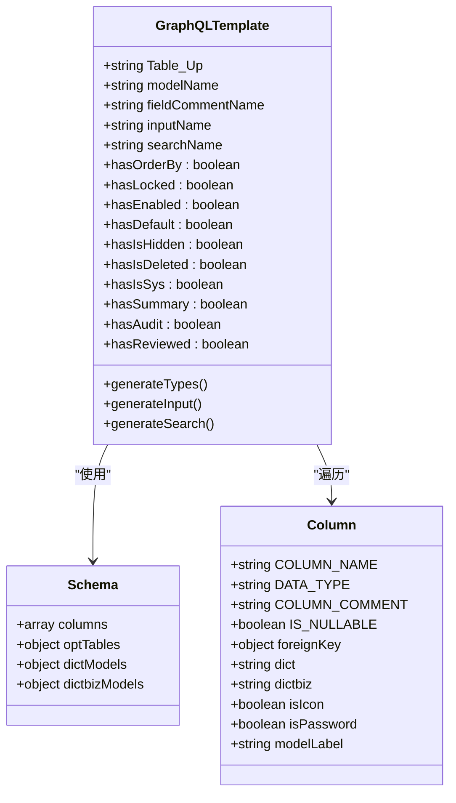
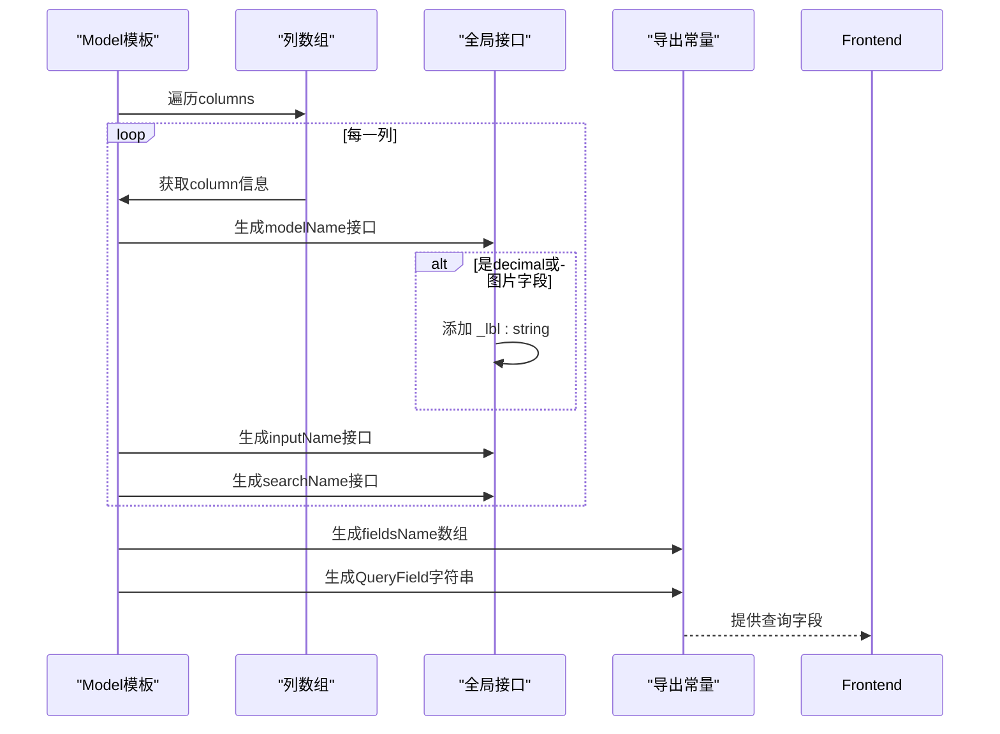
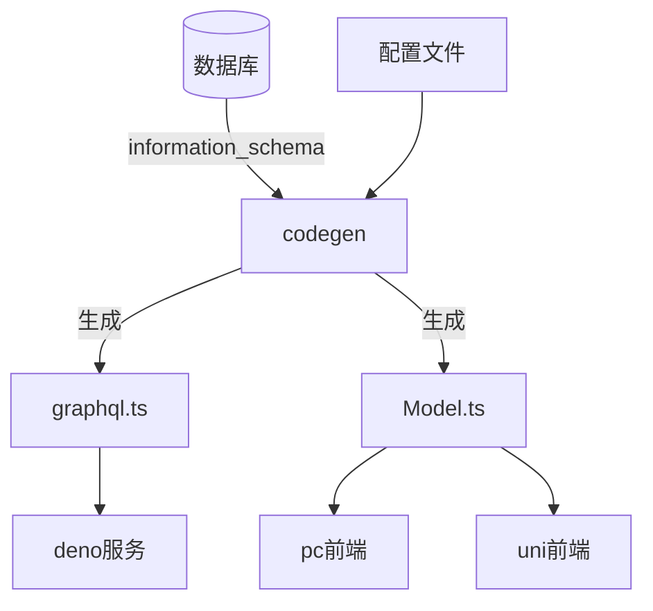

# 模板设计

**本文档引用文件**  
- [codegen\src\template\deno\gen\graphql.ts](https://github.com/sail-sail/nest/blob/main/codegen\src\template\deno\gen\graphql.ts)
- [codegen\src\template\deno\gen\[[mod_slash_table]]\[[table]].graphql.ts](https://github.com/sail-sail/nest/blob/main/codegen\src\template\deno\gen\[[mod_slash_table]]\[[table]].graphql.ts)
- [codegen\src\template\pc\src\views\[[mod_slash_table]]\Model.ts](https://github.com/sail-sail/nest/blob/main/codegen\src\template\pc\src\views\[[mod_slash_table]]\Model.ts)
- [codegen\src\template\uni\src\pages\[[table]]\Model.ts](https://github.com/sail-sail/nest/blob/main/codegen\src\template\uni\src\pages\[[table]]\Model.ts)

## 目录
1. [引言](#引言)
2. [项目结构](#项目结构)
3. [核心组件](#核心组件)
4. [架构概览](#架构概览)
5. [详细组件分析](#详细组件分析)
6. [依赖分析](#依赖分析)
7. [性能考虑](#性能考虑)
8. [故障排除指南](#故障排除指南)
9. [结论](#结论)

## 引言

本项目旨在通过代码生成机制实现国际化（i18n）支持，特别是在GraphQL和前端Model模板中自动生成多语言字段。系统基于模块化设计，利用模板引擎动态生成TypeScript接口、GraphQL类型定义、查询与变更操作，确保类型安全并提升开发效率。本文档将深入解析模板设计机制，重点说明如何在`graphql.ts`和`Model.ts`模板中实现i18n字段的生成，以及变量占位符替换机制和最佳实践。

## 项目结构

项目采用分层与模块化结合的结构，主要分为`codegen`（代码生成器）、`deno`（后端服务）、`pc`（PC端前端）和`uni`（跨平台前端）四大模块。其中`codegen`目录下的`template`子目录存放所有代码生成模板，是实现国际化支持的核心。

**图示来源**  
- [codegen\src\template](https://github.com/sail-sail/nest/blob/main/codegen\src\template)

**本节来源**  
- [codegen\src\template](https://github.com/sail-sail/nest/blob/main/codegen\src\template)

## 核心组件

核心组件包括GraphQL模板（`graphql.ts`）和前端Model模板（`Model.ts`），分别用于生成后端GraphQL类型定义和前端TypeScript接口。这些模板通过嵌入式脚本（如`<# ... #>`）动态处理数据库表结构信息，生成包含多语言支持的代码。

**本节来源**  
- [codegen\src\template\deno\gen\[[mod_slash_table]]\[[table]].graphql.ts](https://github.com/sail-sail/nest/blob/main/codegen\src\template\deno\gen\[[mod_slash_table]]\[[table]].graphql.ts)
- [codegen\src\template\pc\src\views\[[mod_slash_table]]\Model.ts](https://github.com/sail-sail/nest/blob/main/codegen\src\template\pc\src\views\[[mod_slash_table]]\Model.ts)

## 架构概览

系统采用代码生成驱动的架构，通过读取数据库表结构元数据，结合模板引擎生成前后端代码。GraphQL模板负责定义类型、查询和变更，Model模板则生成前端可扩展的接口和查询字段。

**图示来源**  
- [codegen\src\template\deno\gen\[[mod_slash_table]]\[[table]].graphql.ts](https://github.com/sail-sail/nest/blob/main/codegen\src\template\deno\gen\[[mod_slash_table]]\[[table]].graphql.ts)
- [codegen\src\template\pc\src\views\[[mod_slash_table]]\Model.ts](https://github.com/sail-sail/nest/blob/main/codegen\src\template\pc\src\views\[[mod_slash_table]]\Model.ts)

## 详细组件分析

### GraphQL模板中的i18n支持

`graphql.ts`模板通过条件判断为特定字段生成多语言支持字段，如`_lbl`后缀字段，用于显示字段标签。

#### 类图：GraphQL类型生成逻辑

**图示来源**  
- [codegen\src\template\deno\gen\[[mod_slash_table]]\[[table]].graphql.ts](https://github.com/sail-sail/nest/blob/main/codegen\src\template\deno\gen\[[mod_slash_table]]\[[table]].graphql.ts)

**本节来源**  
- [codegen\src\template\deno\gen\[[mod_slash_table]]\[[table]].graphql.ts](https://github.com/sail-sail/nest/blob/main/codegen\src\template\deno\gen\[[mod_slash_table]]\[[table]].graphql.ts)

### Model模板中的多语言属性生成

`Model.ts`模板生成前端TypeScript接口，并通过`declare global`扩展接口，添加`_lbl`字段用于显示标签。

#### 序列图：Model模板生成流程

**图示来源**  
- [codegen\src\template\pc\src\views\[[mod_slash_table]]\Model.ts](https://github.com/sail-sail/nest/blob/main/codegen\src\template\pc\src\views\[[mod_slash_table]]\Model.ts)

**本节来源**  
- [codegen\src\template\pc\src\views\[[mod_slash_table]]\Model.ts](https://github.com/sail-sail/nest/blob/main/codegen\src\template\pc\src\views\[[mod_slash_table]]\Model.ts)

## 依赖分析

系统依赖关系清晰，模板文件依赖于数据库元数据和配置信息，生成的代码被后端和前端模块引用。

**图示来源**  
- [codegen\src\template](https://github.com/sail-sail/nest/blob/main/codegen\src\template)

**本节来源**  
- [codegen\src\template](https://github.com/sail-sail/nest/blob/main/codegen\src\template)

## 性能考虑

模板引擎在代码生成阶段运行，不影响运行时性能。生成的GraphQL类型和Model接口均为静态类型，有助于提升开发效率和减少运行时错误。建议在大型项目中启用缓存机制，避免重复解析数据库结构。

## 故障排除指南

常见问题包括字段注释缺失导致生成失败、外键配置错误、模板变量替换异常等。应确保所有字段均有`COLUMN_COMMENT`，外键关系正确配置，并验证模板语法。

**本节来源**  
- [codegen\src\template\deno\gen\[[mod_slash_table]]\[[table]].graphql.ts](https://github.com/sail-sail/nest/blob/main/codegen\src\template\deno\gen\[[mod_slash_table]]\[[table]].graphql.ts)
- [codegen\src\template\pc\src\views\[[mod_slash_table]]\Model.ts](https://github.com/sail-sail/nest/blob/main/codegen\src\template\pc\src\views\[[mod_slash_table]]\Model.ts)

## 结论

本模板设计通过动态生成机制实现了完善的国际化支持，能够在GraphQL和前端Model中自动添加多语言字段。通过合理使用变量占位符和条件逻辑，确保了生成代码的类型安全和可维护性。建议在实际项目中根据需求扩展模板，添加更多i18n特性。