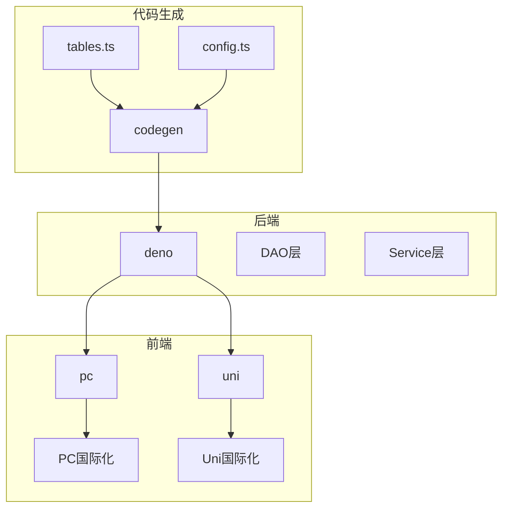
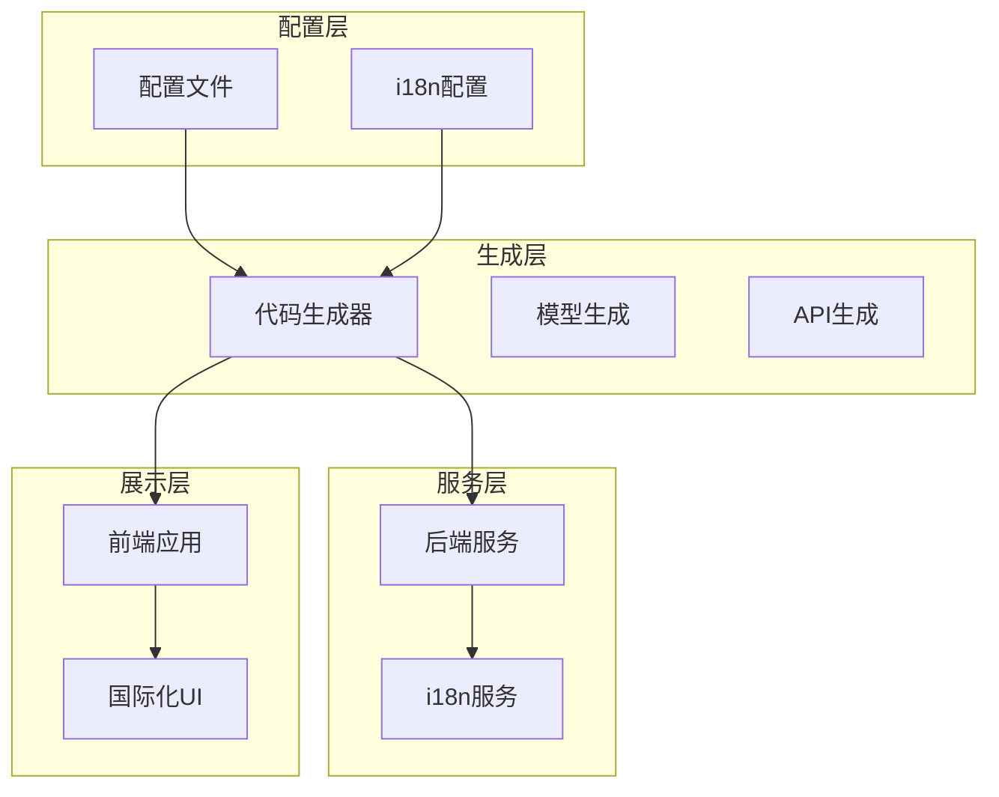
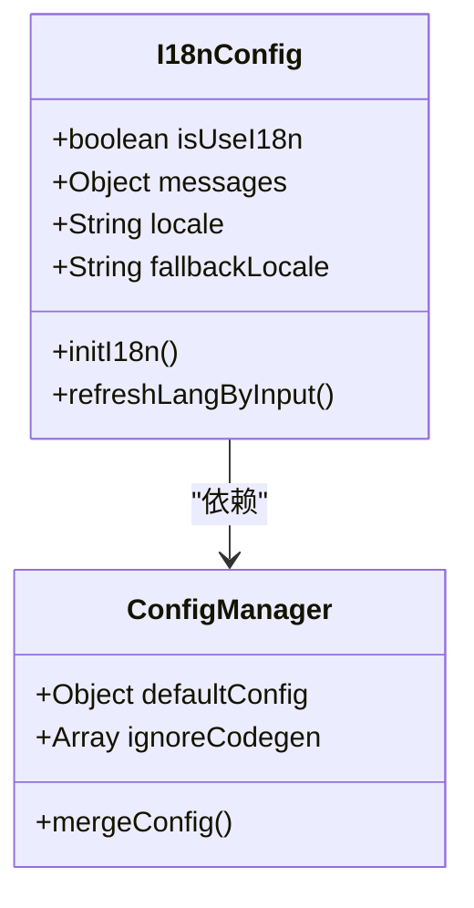
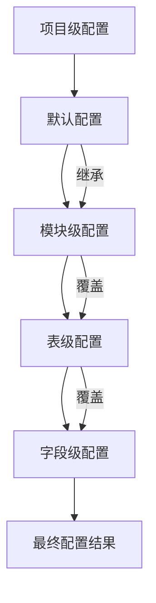
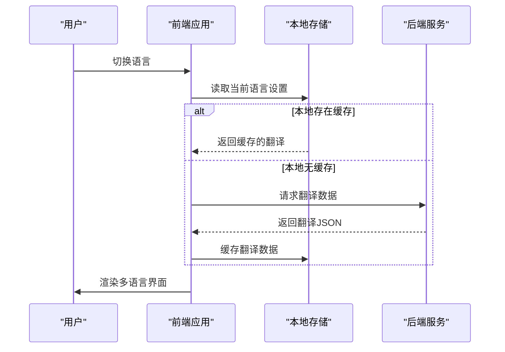
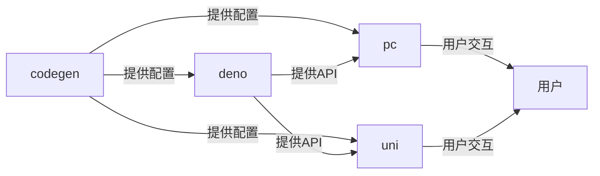

# 配置扩展

**本文档引用的文件**
- [tables.ts](https://github.com/sail-sail/nest/blob/main/codegen\src\tables\tables.ts)
- [config.ts](https://github.com/sail-sail/nest/blob/main/codegen\src\config.ts)
- [i18n.ts](https://github.com/sail-sail/nest/blob/main/uni\src\uni_modules\tm-ui\local\i18n.ts)
- [i18n.ts](https://github.com/sail-sail/nest/blob/main/pc\src\locales\i18n.ts)

## 目录
1. [简介](#简介)
2. [项目结构](#项目结构)
3. [核心组件](#核心组件)
4. [架构概述](#架构概述)
5. [详细组件分析](#详细组件分析)
6. [依赖分析](#依赖分析)
7. [性能考虑](#性能考虑)
8. [故障排除指南](#故障排除指南)
9. [结论](#结论)

## 简介
本文档详细说明了如何在项目中扩展和自定义国际化（i18n）配置。重点介绍如何通过配置文件控制代码生成行为，包括启用/禁用多语言支持、指定默认语言、扩展语言环境支持以及自定义i18n处理插件。文档还涵盖了配置继承与覆盖机制，确保在项目和模块级别都能灵活控制i18n生成行为。

## 项目结构
项目采用模块化结构，主要分为codegen、deno、pc和uni四个核心部分。codegen目录包含代码生成的核心逻辑和配置，其中src/tables/tables.ts负责管理表结构和i18n配置，src/config.ts定义了字段级别的配置选项。deno目录包含后端生成的代码，pc和uni目录分别对应PC端和移动端的前端代码，两者都实现了i18n支持。

**图示来源**
- [tables.ts](https://github.com/sail-sail/nest/blob/main/codegen\src\tables\tables.ts)
- [config.ts](https://github.com/sail-sail/nest/blob/main/codegen\src\config.ts)

**本节来源**
- [tables.ts](https://github.com/sail-sail/nest/blob/main/codegen\src\tables\tables.ts)
- [config.ts](https://github.com/sail-sail/nest/blob/main/codegen\src\config.ts)

## 核心组件
核心组件包括i18n配置管理、代码生成器和前端国际化框架。codegen模块中的tables.ts文件通过isUseI18n常量控制国际化功能的启用状态，config.ts文件定义了详细的字段配置选项。前端部分，pc和uni目录分别使用不同的i18n实现，pc使用基于localStorage的存储机制，uni使用tm-ui组件库内置的i18n系统。

**本节来源**
- [tables.ts](https://github.com/sail-sail/nest/blob/main/codegen\src\tables\tables.ts)
- [config.ts](https://github.com/sail-sail/nest/blob/main/codegen\src\config.ts)
- [i18n.ts](https://github.com/sail-sail/nest/blob/main/pc\src\locales\i18n.ts)
- [i18n.ts](https://github.com/sail-sail/nest/blob/main/uni\src\uni_modules\tm-ui\local\i18n.ts)

## 架构概述
系统采用分层架构，代码生成层负责根据配置生成多语言支持代码，后端服务层处理i18n数据存储和检索，前端展示层实现语言切换和文本渲染。国际化配置从codegen模块传递到前后端，确保一致性。配置继承机制允许在项目级别设置默认值，并在模块级别进行覆盖。

**图示来源**
- [tables.ts](https://github.com/sail-sail/nest/blob/main/codegen\src\tables\tables.ts)
- [config.ts](https://github.com/sail-sail/nest/blob/main/codegen\src\config.ts)

## 详细组件分析

### i18n配置管理分析
i18n配置管理是系统的核心，通过简单的布尔常量即可控制全局多语言支持。

**图示来源**
- [tables.ts](https://github.com/sail-sail/nest/blob/main/codegen\src\tables\tables.ts#L8-L10)
- [config.ts](https://github.com/sail-sail/nest/blob/main/codegen\src\config.ts#L1-L20)

#### 配置继承与覆盖机制
系统实现了灵活的配置继承机制，允许在不同层级覆盖配置。

**图示来源**
- [config.ts](https://github.com/sail-sail/nest/blob/main/codegen\src\config.ts)
- [tables.ts](https://github.com/sail-sail/nest/blob/main/codegen\src\tables\tables.ts)

**本节来源**
- [config.ts](https://github.com/sail-sail/nest/blob/main/codegen\src\config.ts#L1-L1055)
- [tables.ts](https://github.com/sail-sail/nest/blob/main/codegen\src\tables\tables.ts#L1-L14)

### 前端i18n实现分析
前端i18n实现分为PC端和移动端两种方案，但都遵循相同的配置原则。

**图示来源**
- [i18n.ts](https://github.com/sail-sail/nest/blob/main/pc\src\locales\i18n.ts#L116-L150)
- [i18n.ts](https://github.com/sail-sail/nest/blob/main/uni\src\uni_modules\tm-ui\local\i18n.ts#L83-L107)

**本节来源**
- [i18n.ts](https://github.com/sail-sail/nest/blob/main/pc\src\locales\i18n.ts)
- [i18n.ts](https://github.com/sail-sail/nest/blob/main/uni\src\uni_modules\tm-ui\local\i18n.ts)

## 依赖分析
系统各组件之间存在明确的依赖关系。codegen模块是核心依赖源，为后端和前端提供配置和代码生成支持。i18n配置从codegen模块流出，影响整个系统的多语言行为。前端组件依赖于生成的API和配置文件，确保与后端保持一致的i18n行为。

**图示来源**
- [tables.ts](https://github.com/sail-sail/nest/blob/main/codegen\src\tables\tables.ts)
- [config.ts](https://github.com/sail-sail/nest/blob/main/codegen\src\config.ts)

**本节来源**
- [tables.ts](https://github.com/sail-sail/nest/blob/main/codegen\src\tables\tables.ts)
- [config.ts](https://github.com/sail-sail/nest/blob/main/codegen\src\config.ts)

## 性能考虑
i18n系统的性能主要体现在翻译数据的加载和缓存策略上。系统采用本地存储缓存机制，减少重复的网络请求。在代码生成阶段预处理i18n配置，避免运行时的复杂计算。建议在大型应用中按需加载语言包，而不是一次性加载所有翻译数据。

## 故障排除指南
常见问题包括语言切换无效、翻译文本不显示和配置不生效。检查VITE_SERVER_I18N_ENABLE环境变量是否正确设置，验证localStorage中的i18n版本号是否匹配，确认tables.ts中的isUseI18n设置为true。对于动态字段的翻译，确保refreshLangByInput函数被正确调用。

**本节来源**
- [i18n.ts](https://github.com/sail-sail/nest/blob/main/pc\src\locales\i18n.ts#L116-L150)
- [tables.ts](https://github.com/sail-sail/nest/blob/main/codegen\src\tables\tables.ts#L8-L10)

## 结论
本文档详细介绍了i18n配置扩展的各个方面，从全局开关到细粒度的字段配置，从代码生成到前端实现。通过合理的配置继承机制和清晰的架构设计，系统提供了灵活而强大的多语言支持能力。开发者可以根据具体需求自定义i18n行为，确保应用能够满足不同语言用户的需求。