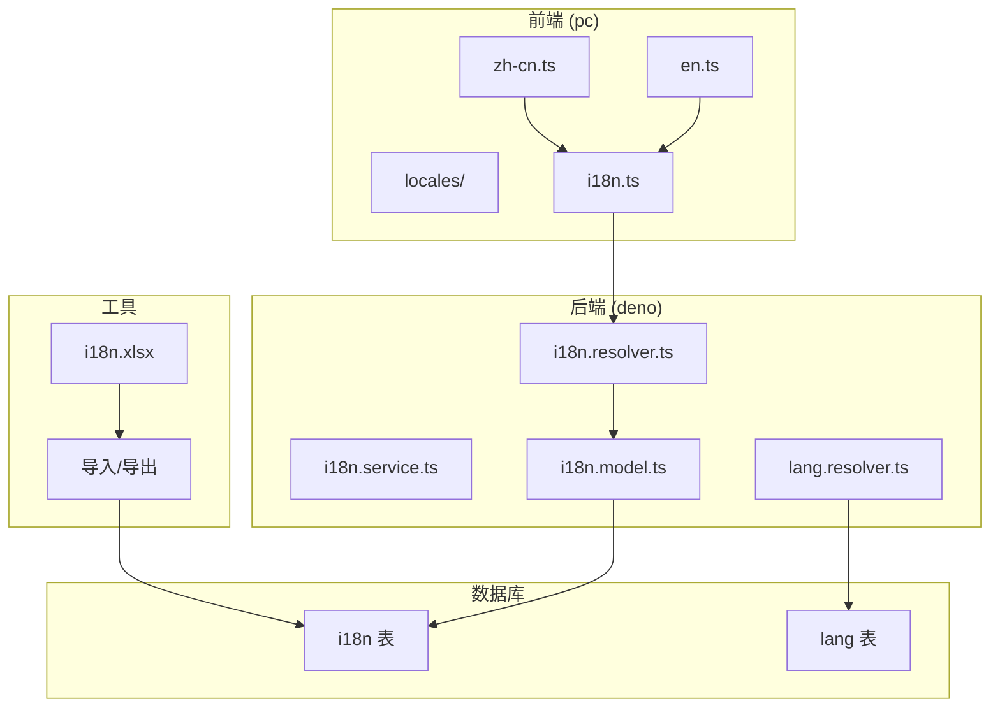
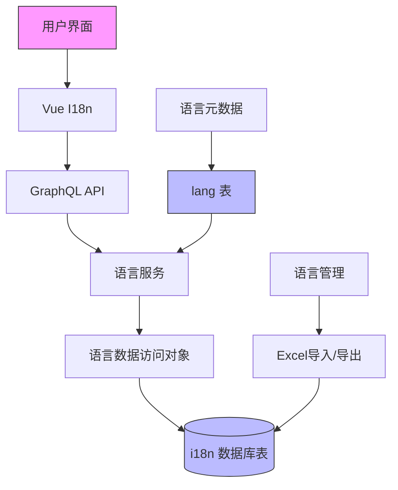
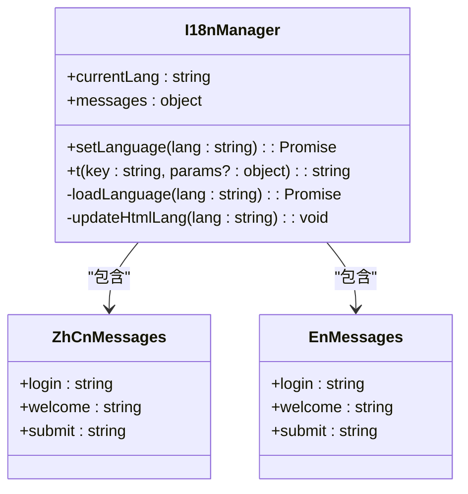
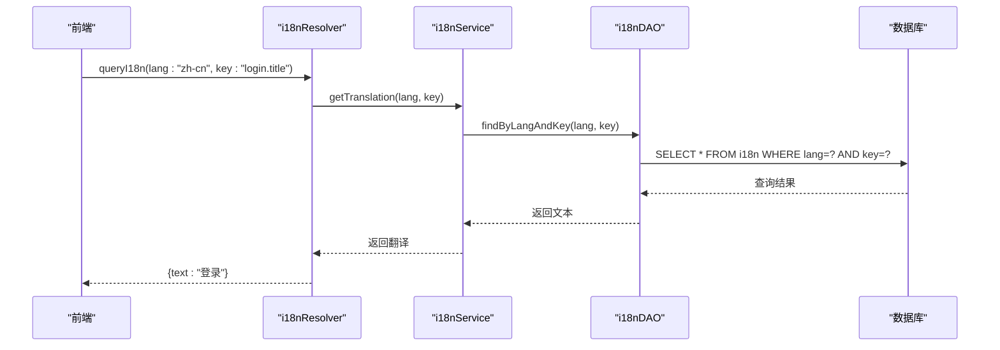
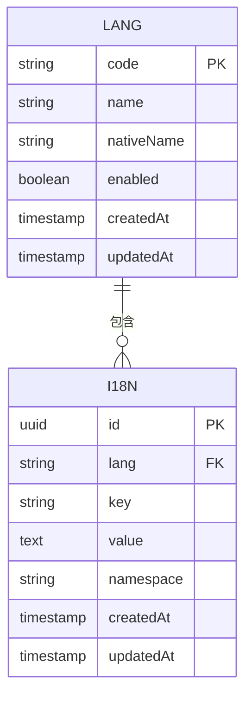
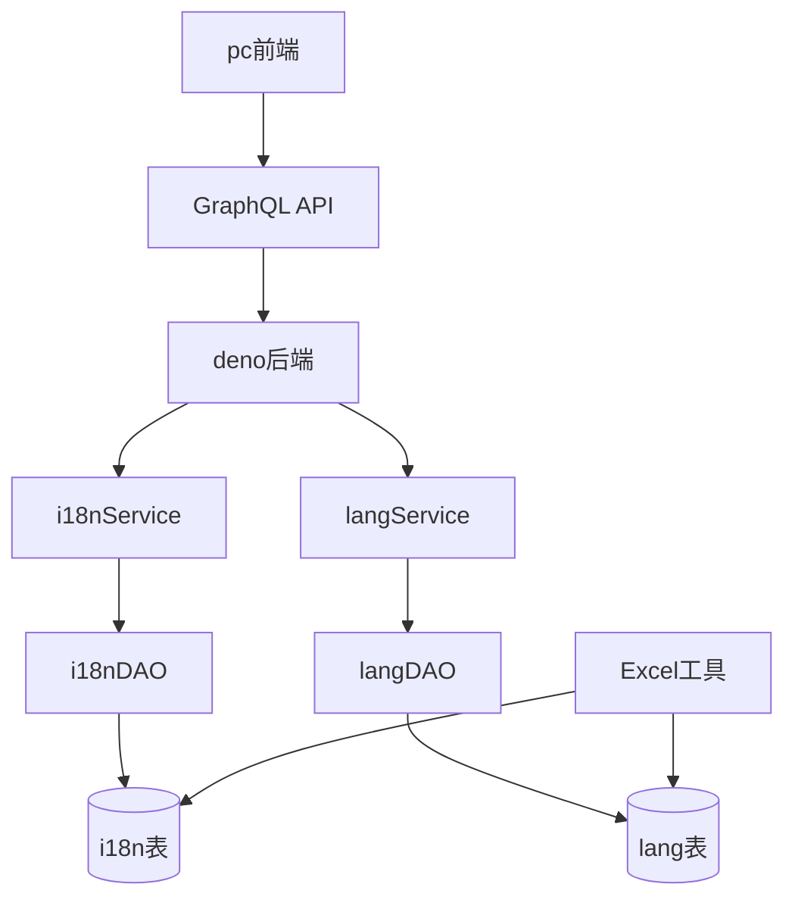

# 国际化

**本文档引用的文件**   
- [i18n.ts](https://github.com/sail-sail/nest/blob/main/pc/src/locales/i18n.ts)
- [zh-cn.ts](https://github.com/sail-sail/nest/blob/main/pc/src/locales/zh-cn.ts)
- [en.ts](https://github.com/sail-sail/nest/blob/main/pc/src/locales/en.ts)
- [i18n.resolver.ts](https://github.com/sail-sail/nest/blob/main/deno/src/base/i18n/i18n.resolver.ts)
- [i18n.graphql.ts](https://github.com/sail-sail/nest/blob/main/deno/src/base/i18n/i18n.graphql.ts)
- [lang.resolver.ts](https://github.com/sail-sail/nest/blob/main/deno/gen/base/lang/lang.resolver.ts)
- [i18n.model.ts](https://github.com/sail-sail/nest/blob/main/deno/gen/base/i18n/i18n.model.ts)
- [lang.model.ts](https://github.com/sail-sail/nest/blob/main/deno/gen/base/lang/lang.model.ts)
- [base.i18n.sql](https://github.com/sail-sail/nest/blob/main/codegen/src/tables/base/base.i18n.sql)
- [base.sql](https://github.com/sail-sail/nest/blob/main/codegen/src/tables/base/base.sql)
- [i18n.xlsx](https://github.com/sail-sail/nest/blob/main/pc/public/excel_template/base/i18n.xlsx)
- [lang.xlsx](https://github.com/sail-sail/nest/blob/main/pc/public/import_template/base/lang.xlsx)

## 目录
1. [简介](#简介)
2. [项目结构](#项目结构)
3. [核心组件](#核心组件)
4. [架构概览](#架构概览)
5. [详细组件分析](#详细组件分析)
6. [依赖分析](#依赖分析)
7. [性能考虑](#性能考虑)
8. [故障排除指南](#故障排除指南)
9. [结论](#结论)

## 简介
本项目实现了完整的国际化（i18n）功能，支持多语言文本管理、语言切换、动态翻译和格式化。系统采用前后端分离架构，前端基于Vue框架实现语言包加载与切换，后端通过GraphQL API提供语言资源查询服务。语言资源存储在数据库中，支持通过Excel模板导入导出，确保语言包的可维护性和扩展性。该文档详细说明了国际化功能的实现机制、架构设计和使用方法。

## 项目结构
项目中的国际化功能分布在多个模块中，主要包括前端语言包管理、后端语言服务和数据库表结构。前端语言资源位于`pc/src/locales`目录下，后端服务位于`deno/src/base/i18n`目录，数据库表定义在`codegen/src/tables/base`目录中。

**图表来源**
- [i18n.ts](https://github.com/sail-sail/nest/blob/main/pc/src/locales/i18n.ts)
- [i18n.resolver.ts](https://github.com/sail-sail/nest/blob/main/deno/src/base/i18n/i18n.resolver.ts)
- [i18n.model.ts](https://github.com/sail-sail/nest/blob/main/deno/gen/base/i18n/i18n.model.ts)
- [base.i18n.sql](https://github.com/sail-sail/nest/blob/main/codegen/src/tables/base/base.i18n.sql)

**本节来源**
- [i18n.ts](https://github.com/sail-sail/nest/blob/main/pc/src/locales/i18n.ts)
- [i18n.resolver.ts](https://github.com/sail-sail/nest/blob/main/deno/src/base/i18n/i18n.resolver.ts)

## 核心组件
国际化功能的核心组件包括语言资源管理、语言切换机制和多语言文本查询服务。前端通过Vue I18n插件实现语言包的动态加载和切换，后端提供GraphQL接口查询特定语言的文本资源。系统支持添加新语言包，通过数据库表`lang`存储语言元数据，`i18n`表存储具体的翻译文本。

**本节来源**
- [i18n.ts](https://github.com/sail-sail/nest/blob/main/pc/src/locales/i18n.ts)
- [lang.model.ts](https://github.com/sail-sail/nest/blob/main/deno/gen/base/lang/lang.model.ts)
- [i18n.model.ts](https://github.com/sail-sail/nest/blob/main/deno/gen/base/i18n/i18n.model.ts)

## 架构概览
系统采用分层架构实现国际化功能，包括前端展示层、API服务层和数据存储层。前端负责语言包的加载和界面文本的渲染，后端提供GraphQL API查询语言资源，数据库存储多语言文本数据。

**图表来源**
- [i18n.resolver.ts](https://github.com/sail-sail/nest/blob/main/deno/src/base/i18n/i18n.resolver.ts)
- [i18n.model.ts](https://github.com/sail-sail/nest/blob/main/deno/gen/base/i18n/i18n.model.ts)
- [base.i18n.sql](https://github.com/sail-sail/nest/blob/main/codegen/src/tables/base/base.i18n.sql)

## 详细组件分析

### 前端语言管理分析
前端国际化实现基于Vue I18n，通过模块化语言文件管理不同语言的文本资源。系统初始化时加载默认语言包，并提供API供用户切换语言。

**图表来源**
- [i18n.ts](https://github.com/sail-sail/nest/blob/main/pc/src/locales/i18n.ts)
- [zh-cn.ts](https://github.com/sail-sail/nest/blob/main/pc/src/locales/zh-cn.ts)
- [en.ts](https://github.com/sail-sail/nest/blob/main/pc/src/locales/en.ts)

**本节来源**
- [i18n.ts](https://github.com/sail-sail/nest/blob/main/pc/src/locales/i18n.ts)
- [zh-cn.ts](https://github.com/sail-sail/nest/blob/main/pc/src/locales/zh-cn.ts)

### 后端语言服务分析
后端通过GraphQL API提供语言资源查询服务，支持按语言代码和文本键查询翻译文本。服务层从数据库读取数据并缓存结果以提高性能。

**图表来源**
- [i18n.resolver.ts](https://github.com/sail-sail/nest/blob/main/deno/src/base/i18n/i18n.resolver.ts)
- [i18n.service.ts](https://github.com/sail-sail/nest/blob/main/deno/gen/base/i18n/i18n.service.ts)
- [i18n.dao.ts](https://github.com/sail-sail/nest/blob/main/deno/gen/base/i18n/i18n.dao.ts)

**本节来源**
- [i18n.resolver.ts](https://github.com/sail-sail/nest/blob/main/deno/src/base/i18n/i18n.resolver.ts)
- [i18n.service.ts](https://github.com/sail-sail/nest/blob/main/deno/gen/base/i18n/i18n.service.ts)

### 数据库结构分析
国际化功能依赖两个核心数据库表：`lang`表存储支持的语言元数据，`i18n`表存储具体的翻译文本。表结构设计支持高效查询和扩展。

**图表来源**
- [base.sql](https://github.com/sail-sail/nest/blob/main/codegen/src/tables/base/base.sql)
- [base.i18n.sql](https://github.com/sail-sail/nest/blob/main/codegen/src/tables/base/base.i18n.sql)

**本节来源**
- [base.i18n.sql](https://github.com/sail-sail/nest/blob/main/codegen/src/tables/base/base.i18n.sql)

## 依赖分析
国际化功能的组件依赖关系清晰，前端依赖后端API获取语言资源，后端服务依赖数据库存储。系统通过GraphQL接口解耦前后端，支持独立开发和部署。

**图表来源**
- [i18n.resolver.ts](https://github.com/sail-sail/nest/blob/main/deno/src/base/i18n/i18n.resolver.ts)
- [lang.resolver.ts](https://github.com/sail-sail/nest/blob/main/deno/gen/base/lang/lang.resolver.ts)
- [base.i18n.sql](https://github.com/sail-sail/nest/blob/main/codegen/src/tables/base/base.i18n.sql)

**本节来源**
- [i18n.resolver.ts](https://github.com/sail-sail/nest/blob/main/deno/src/base/i18n/i18n.resolver.ts)
- [lang.resolver.ts](https://github.com/sail-sail/nest/blob/main/deno/gen/base/lang/lang.resolver.ts)

## 性能考虑
为提高国际化功能的性能，系统实现了多级缓存机制。前端缓存已加载的语言包，后端缓存频繁查询的翻译文本。数据库查询通过复合索引优化，确保按语言代码和文本键的查询效率。

- **前端缓存**：已加载的语言包保留在内存中，避免重复请求
- **后端缓存**：使用Redis或内存缓存热门翻译文本
- **数据库优化**：在`i18n`表的`lang`和`key`字段上创建复合索引
- **批量查询**：支持一次性查询多个文本键，减少网络请求次数

## 故障排除指南
### 常见问题及解决方案
1. **语言切换无效**
   - 检查`i18n.ts`中的语言包是否正确加载
   - 确认GraphQL API返回正确的翻译文本
   - 验证前端组件是否重新渲染

2. **翻译文本缺失**
   - 检查数据库`i18n`表中是否存在对应语言和键的记录
   - 确认Excel导入是否成功完成
   - 验证文本键的命名是否符合规范

3. **性能问题**
   - 检查缓存配置是否启用
   - 验证数据库索引是否创建
   - 分析GraphQL查询是否过于频繁

**本节来源**
- [i18n.ts](https://github.com/sail-sail/nest/blob/main/pc/src/locales/i18n.ts)
- [i18n.resolver.ts](https://github.com/sail-sail/nest/blob/main/deno/src/base/i18n/i18n.resolver.ts)

## 结论
本项目的国际化功能实现了完整的多语言支持架构，从前端展示到后端服务再到数据存储，形成了闭环的解决方案。系统设计考虑了可扩展性、性能和易用性，支持通过Excel模板快速导入导出语言包，便于多语言内容的维护。通过GraphQL API实现前后端解耦，确保了系统的灵活性和可维护性。未来可进一步优化缓存策略，支持更多语言格式化功能，如日期、数字和货币的本地化显示。