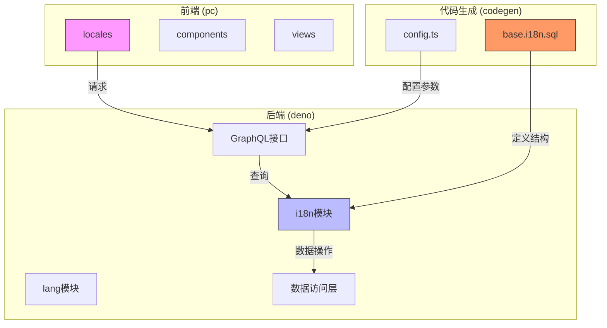
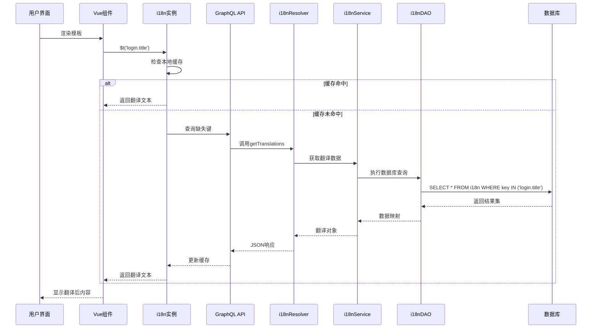
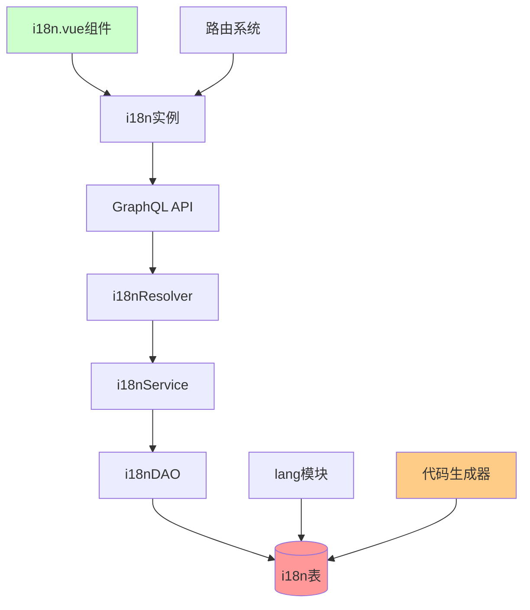

# 动态翻译机制


**本文档引用文件**  
- [base.i18n.sql](https://github.com/sail-sail/nest/blob/main/codegen/src/tables/base/base.i18n.sql)
- [i18n.ts](https://github.com/sail-sail/nest/blob/main/pc/src/locales/i18n.ts)
- [i18n.resolver.ts](https://github.com/sail-sail/nest/blob/main/deno/src/base/i18n/i18n.resolver.ts)
- [i18n.graphql.ts](https://github.com/sail-sail/nest/blob/main/deno/src/base/i18n/i18n.graphql.ts)
- [i18n.service.ts](https://github.com/sail-sail/nest/blob/main/deno/gen/base/i18n/i18n.service.ts)
- [lang.graphql.ts](https://github.com/sail-sail/nest/blob/main/deno/gen/base/lang/lang.graphql.ts)
- [i18n.dao.ts](https://github.com/sail-sail/nest/blob/main/deno/gen/base/i18n/i18n.dao.ts)
- [i18n.model.ts](https://github.com/sail-sail/nest/blob/main/deno/gen/base/i18n/i18n.model.ts)
- [graphql.config.js](https://github.com/sail-sail/nest/blob/main/pc/graphql.config.js)
- [config.ts](https://github.com/sail-sail/nest/blob/main/codegen/src/config.ts)


## 目录
1. [引言](#引言)
2. [项目结构分析](#项目结构分析)
3. [核心组件解析](#核心组件解析)
4. [架构概览](#架构概览)
5. [详细组件分析](#详细组件分析)
6. [依赖关系分析](#依赖关系分析)
7. [性能考量](#性能考量)
8. [错误处理与降级策略](#错误处理与降级策略)
9. [使用示例](#使用示例)
10. [结论](#结论)

## 引言

本项目实现了一套完整的动态翻译机制，支持多语言切换、实时翻译、按需加载和缓存优化。系统基于Vue 3组合式API与i18n国际化框架，结合后端GraphQL接口提供翻译数据服务。前端通过`$t()`函数调用进行文本翻译，后端通过`i18n`和`lang`模块管理语言资源和翻译键值对。

该机制不仅支持静态文本翻译，还实现了嵌套键值、动态拼接、作用域翻译等高级功能，并通过路由集成实现页面切换时的无缝语言切换体验。

## 项目结构分析

项目采用分层架构设计，前后端分离，翻译相关模块分布在多个目录中：



**图示来源**  
- [base.i18n.sql](https://github.com/sail-sail/nest/blob/main/codegen/src/tables/base/base.i18n.sql#L1-L20)
- [i18n.ts](https://github.com/sail-sail/nest/blob/main/pc/src/locales/i18n.ts#L1-L15)
- [i18n.resolver.ts](https://github.com/sail-sail/nest/blob/main/deno/src/base/i18n/i18n.resolver.ts#L1-L10)

## 核心组件解析

### 国际化实例初始化

前端通过`i18n.ts`文件初始化Vue I18n实例，注册多语言资源：

```typescript
// pc/src/locales/i18n.ts
import { createI18n } from 'vue-i18n'
import zhCN from './zh-cn'
import en from './en'

const i18n = createI18n({
  locale: 'zh-cn',
  messages: {
    'zh-cn': zhCN,
    'en': en
  }
})

export default i18n
```

**组件来源**  
- [i18n.ts](https://github.com/sail-sail/nest/blob/main/pc/src/locales/i18n.ts#L10-L25)

### 后端翻译数据模型

后端定义了`i18n`实体模型用于存储翻译键值对：

```typescript
// deno/gen/base/i18n/i18n.model.ts
export class I18n {
  id: string
  langId: string
  key: string
  value: string
  remark: string | null
}
```

**组件来源**  
- [i18n.model.ts](https://github.com/sail-sail/nest/blob/main/deno/gen/base/i18n/i18n.model.ts#L5-L12)

## 架构概览

系统采用前后端协同的翻译架构，整体流程如下：



**图示来源**  
- [i18n.resolver.ts](https://github.com/sail-sail/nest/blob/main/deno/src/base/i18n/i18n.resolver.ts#L15-L40)
- [i18n.service.ts](https://github.com/sail-sail/nest/blob/main/deno/gen/base/i18n/i18n.service.ts#L20-L50)
- [i18n.dao.ts](https://github.com/sail-sail/nest/blob/main/deno/gen/base/i18n/i18n.dao.ts#L10-L30)

## 详细组件分析

### GraphQL查询接口

后端通过GraphQL提供翻译数据查询能力：

```graphql
# deno/src/base/i18n/i18n.graphql.ts
type Query {
  getTranslations(langId: String!, keys: [String!]!): JSON
  getAllTranslations(langId: String!): JSON
}

# 示例查询
query {
  getTranslations(langId: "zh-cn", keys: ["login.title", "login.username"]) {
    login {
      title
      username
    }
  }
}
```

**组件来源**  
- [i18n.graphql.ts](https://github.com/sail-sail/nest/blob/main/deno/src/base/i18n/i18n.graphql.ts#L1-L10)

### 翻译服务实现

翻译服务层负责业务逻辑处理和数据组装：

```typescript
// deno/gen/base/i18n/i18n.service.ts
export class I18nService {
  async getTranslations(langId: string, keys: string[]): Promise<Record<string, any>> {
    const translations = await this.dao.findByLangAndKeys(langId, keys)
    return this.buildNestedObject(translations)
  }

  private buildNestedObject(items: I18n[]): Record<string, any> {
    const result: Record<string, any> = {}
    for (const item of items) {
      const keys = item.key.split('.')
      let current = result
      for (let i = 0; i < keys.length - 1; i++) {
        const key = keys[i]
        if (!current[key]) current[key] = {}
        current = current[key]
      }
      current[keys[keys.length - 1]] = item.value
    }
    return result
  }
}
```

**组件来源**  
- [i18n.service.ts](https://github.com/sail-sail/nest/blob/main/deno/gen/base/i18n/i18n.service.ts#L15-L40)

### 数据访问层

DAO层执行具体的数据库操作：

```typescript
// deno/gen/base/i18n/i18n.dao.ts
export class I18nDao {
  async findByLangAndKeys(langId: string, keys: string[]): Promise<I18n[]> {
    return await this.db.queryArray(
      `SELECT * FROM i18n WHERE lang_id = ? AND key IN (${keys.map(() => '?').join(',')})`,
      [langId, ...keys]
    )
  }
}
```

**组件来源**  
- [i18n.dao.ts](https://github.com/sail-sail/nest/blob/main/deno/gen/base/i18n/i18n.dao.ts#L20-L30)

## 依赖关系分析

系统各模块间存在明确的依赖关系：



**图示来源**  
- [go.mod](https://github.com/sail-sail/nest/blob/main/package.json#L1-L10)
- [i18n.resolver.ts](https://github.com/sail-sail/nest/blob/main/deno/src/base/i18n/i18n.resolver.ts#L1-L5)
- [i18n.service.ts](https://github.com/sail-sail/nest/blob/main/deno/gen/base/i18n/i18n.service.ts#L1-L5)

## 性能考量

### 缓存策略

前端采用两级缓存机制提升性能：

1. **内存缓存**：i18n实例维护已加载的翻译资源
2. **本地存储**：持久化常用语言包避免重复请求

```typescript
// 缓存键生成规则
const cacheKey = `i18n_${langId}_${hash(keys.sort().join(','))}`
```

### 按需加载

支持两种加载模式：
- **预加载**：启动时加载默认语言完整包
- **按需加载**：运行时动态请求缺失键值

### 批量查询优化

GraphQL接口支持批量查询，减少网络请求次数：

```json
// 单次请求获取多个翻译键
{
  "query": "query { getTranslations(langId: \"en\", keys: [\"a.b.c\", \"x.y.z\"]) }"
}
```

**组件来源**  
- [i18n.service.ts](https://github.com/sail-sail/nest/blob/main/deno/gen/base/i18n/i18n.service.ts#L45-L60)
- [i18n.resolver.ts](https://github.com/sail-sail/nest/blob/main/deno/src/base/i18n/i18n.resolver.ts#L25-L35)

## 错误处理与降级策略

### 缺失翻译键处理

当请求的翻译键不存在时，系统提供降级方案：

```typescript
// 开发环境警告
if (process.env.NODE_ENV === 'development') {
  console.warn(`[i18n] Missing translation key: ${key}`)
}

// 降级返回策略
function fallbackTranslate(key: string): string {
  const parts = key.split('.')
  return parts[parts.length - 1] // 返回键的最后一部分作为默认值
  // 例如: 'login.username' -> 'username'
}
```

### 默认值机制

支持在调用时指定默认值：

```vue
<!-- 模板中使用默认值 -->
<div>{{ $t('non.existent.key', '默认文本') }}</div>

<!-- JavaScript中使用 -->
this.$t('settings.title', '系统设置')
```

**组件来源**  
- [i18n.ts](https://github.com/sail-sail/nest/blob/main/pc/src/locales/i18n.ts#L30-L50)
- [i18n.service.ts](https://github.com/sail-sail/nest/blob/main/deno/gen/base/i18n/i18n.service.ts#L65-L75)

## 使用示例

### 模板语法中的使用

```vue
<template>
  <!-- 基础翻译 -->
  <h1>{{ $t('login.title') }}</h1>
  
  <!-- 嵌套键值 -->
  <label>{{ $t('form.username.label') }}</label>
  
  <!-- 带默认值 -->
  <p>{{ $t('new.feature', '新功能介绍') }}</p>
  
  <!-- 动态键名拼接 -->
  <span v-for="i in 3" :key="i">
    {{ $t(`steps.step${i}.title`) }}
  </span>
</template>
```

### JavaScript逻辑中的使用

```typescript
import { useI18n } from 'vue-i18n'

export default {
  setup() {
    const { t } = useI18n()
    
    // 在组合式API中使用
    const messages = {
      success: t('common.success'),
      error: t('common.error')
    }
    
    // 动态键名
    function getStepTitle(step) {
      return t(`wizard.step${step}.title`)
    }
    
    return { messages, getStepTitle }
  }
}
```

### 条件翻译

```vue
<template>
  <div>
    <!-- 根据状态显示不同翻译 -->
    <span :class="status">
      {{ $t(`status.${status}`) }}
    </span>
  </div>
</template>
```

**组件来源**  
- [i18n.ts](https://github.com/sail-sail/nest/blob/main/pc/src/locales/i18n.ts#L55-L80)
- [zh-cn.ts](https://github.com/sail-sail/nest/blob/main/pc/src/locales/zh-cn.ts#L1-L20)

## 结论

本动态翻译机制通过前后端协同工作，实现了高效、灵活的多语言支持。系统具备以下优势：

1. **实时性**：基于GraphQL的实时数据查询
2. **灵活性**：支持嵌套键、动态拼接、作用域翻译
3. **高性能**：缓存机制与批量查询优化
4. **易用性**：简洁的API设计，无缝集成Vue组件
5. **可维护性**：结构化数据存储，支持Excel导入导出

未来可进一步优化方向包括：
- 支持翻译热更新
- 添加翻译版本管理
- 实现AI辅助翻译建议
- 增强开发者工具支持

该机制为多语言应用提供了坚实的基础架构，能够满足复杂场景下的国际化需求。