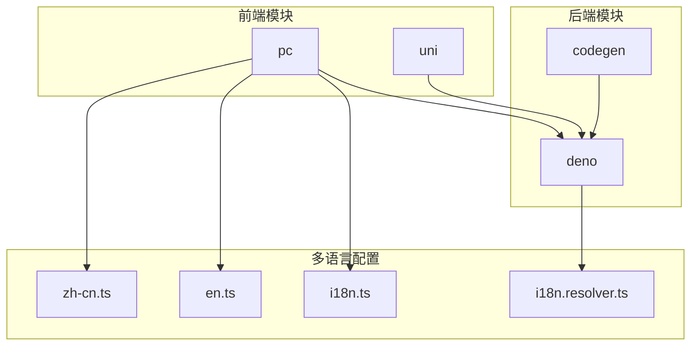
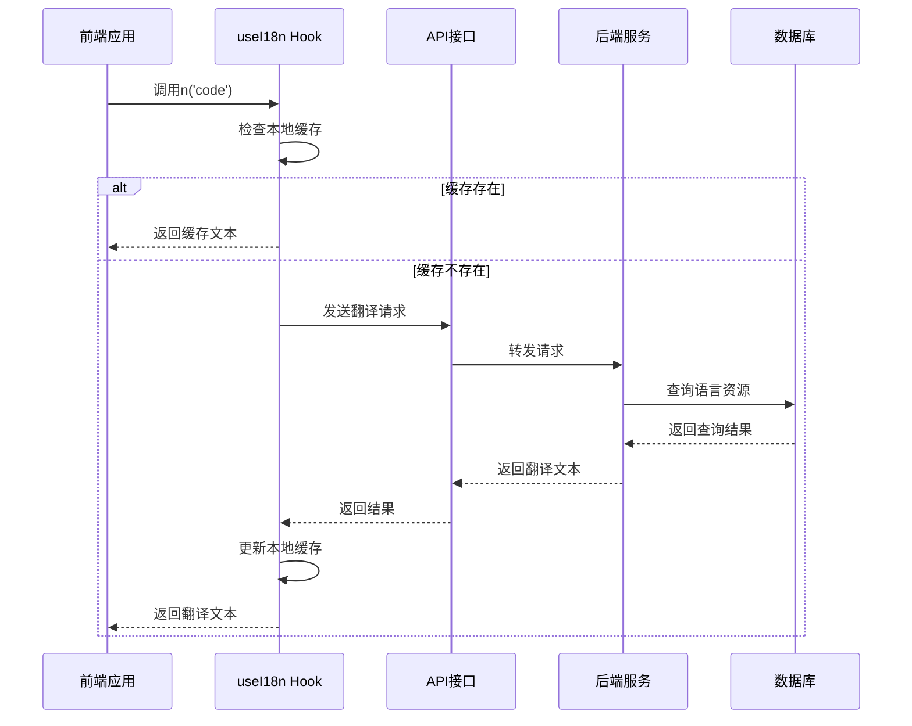
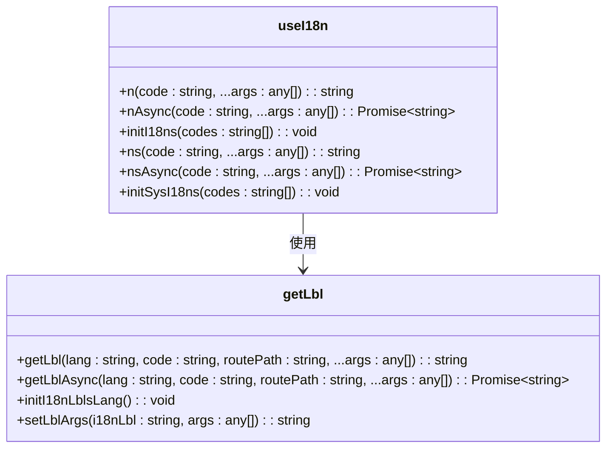
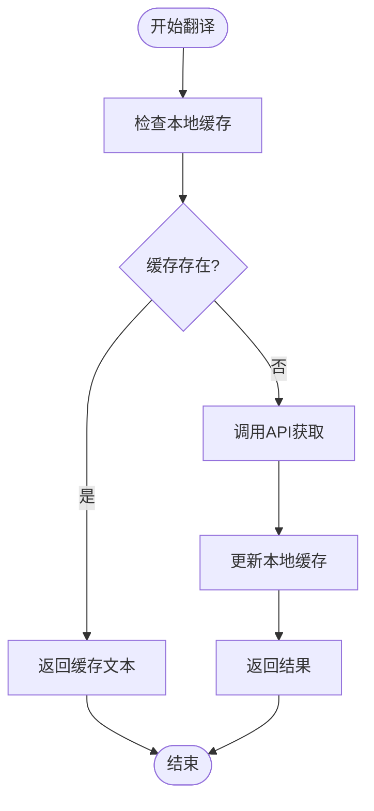
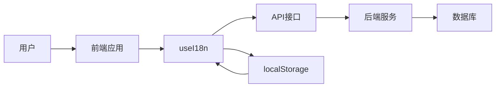

# 多语言文本处理

**本文档引用文件**   
- [i18n.ts](https://github.com/sail-sail/nest/blob/main/pc/src/locales/i18n.ts)
- [zh-cn.ts](https://github.com/sail-sail/nest/blob/main/pc/src/locales/zh-cn.ts)
- [en.ts](https://github.com/sail-sail/nest/blob/main/pc/src/locales/en.ts)
- [i18n.dao.ts](https://github.com/sail-sail/nest/blob/main/deno/gen/base/i18n/i18n.dao.ts)
- [i18n.resolver.ts](https://github.com/sail-sail/nest/blob/main/deno/src/base/i18n/i18n.resolver.ts)
- [i18n.ts](https://github.com/sail-sail/nest/blob/main/deno/src/base/i18n/i18n.ts)

## 目录
1. [简介](#简介)
2. [项目结构](#项目结构)
3. [核心组件](#核心组件)
4. [架构概述](#架构概述)
5. [详细组件分析](#详细组件分析)
6. [依赖分析](#依赖分析)
7. [性能考虑](#性能考虑)
8. [故障排除指南](#故障排除指南)
9. [结论](#结论)

## 简介
本项目实现了完整的多语言文本处理系统，支持动态文本翻译、格式化和本地化功能。系统采用前后端分离架构，通过标准化的API接口实现语言资源的获取与管理。前端使用Vue框架结合TypeScript实现响应式国际化支持，后端基于Deno运行时提供稳定的服务端语言处理能力。系统支持按需加载、本地缓存和动态更新等高级特性，确保在不同语言环境下都能提供流畅的用户体验。

## 项目结构
项目采用模块化设计，分为codegen、deno、pc和uni四个主要部分。codegen用于代码生成，deno包含后端服务逻辑，pc为PC端前端应用，uni为跨平台移动端应用。多语言相关文件主要分布在各模块的locales和i18n目录中。

**图示来源**
- [i18n.ts](https://github.com/sail-sail/nest/blob/main/pc/src/locales/i18n.ts)
- [zh-cn.ts](https://github.com/sail-sail/nest/blob/main/pc/src/locales/zh-cn.ts)
- [en.ts](https://github.com/sail-sail/nest/blob/main/pc/src/locales/en.ts)
- [i18n.resolver.ts](https://github.com/sail-sail/nest/blob/main/deno/src/base/i18n/i18n.resolver.ts)

## 核心组件
系统的核心组件包括语言环境管理、翻译函数封装、本地缓存机制和服务器通信接口。`useI18n`函数提供了统一的翻译接口，支持同步和异步调用模式。`initI18nLblsLang`函数负责初始化语言标签缓存，`getLbl`和`getLblAsync`函数分别处理同步和异步的翻译请求。

**组件来源**
- [i18n.ts](https://github.com/sail-sail/nest/blob/main/pc/src/locales/i18n.ts#L20-L218)
- [i18n.resolver.ts](https://github.com/sail-sail/nest/blob/main/deno/src/base/i18n/i18n.resolver.ts)

## 架构概述
系统采用分层架构设计，前端通过API调用获取翻译文本，后端从数据库查询对应的语言资源。前端实现了本地缓存机制，减少重复请求，提高响应速度。系统支持动态语言切换，用户选择语言后自动加载对应的语言包。

**图示来源**
- [i18n.ts](https://github.com/sail-sail/nest/blob/main/pc/src/locales/i18n.ts)
- [i18n.resolver.ts](https://github.com/sail-sail/nest/blob/main/deno/src/base/i18n/i18n.resolver.ts)

## 详细组件分析

### 翻译函数分析
`useI18n`是系统提供的核心翻译钩子函数，它封装了所有翻译相关的逻辑，提供简洁的API接口。

**图示来源**
- [i18n.ts](https://github.com/sail-sail/nest/blob/main/pc/src/locales/i18n.ts#L20-L218)

#### 翻译流程分析
系统实现了智能的翻译流程，优先使用本地缓存，避免不必要的网络请求。

**图示来源**
- [i18n.ts](https://github.com/sail-sail/nest/blob/main/pc/src/locales/i18n.ts#L100-L150)

## 依赖分析
系统各组件之间存在明确的依赖关系，前端依赖后端提供的API接口获取翻译资源，后端依赖数据库存储语言数据。本地缓存机制减少了对后端服务的依赖，提高了系统的稳定性和响应速度。

**图示来源**
- [i18n.ts](https://github.com/sail-sail/nest/blob/main/pc/src/locales/i18n.ts)
- [i18n.resolver.ts](https://github.com/sail-sail/nest/blob/main/deno/src/base/i18n/i18n.resolver.ts)

## 性能考虑
系统在性能方面做了多项优化：
1. 本地缓存机制减少重复请求
2. 异步加载避免阻塞主线程
3. 批量初始化接口减少请求数量
4. 智能缓存更新策略

缓存键值采用"路由路径+代码"的组合方式，确保不同页面的相同代码能正确区分。系统还实现了版本控制机制，通过`__i18n_version`标识符管理缓存的有效性。

## 故障排除指南
常见问题及解决方案：
1. **翻译文本不显示**：检查`VITE_SERVER_I18N_ENABLE`环境变量是否正确设置
2. **缓存未更新**：清除localStorage中的`i18nLblsLang`项
3. **语言切换无效**：确认用户存储中的语言设置是否正确
4. **占位符替换失败**：检查参数格式是否符合{0}或{propertyName}的规范

**问题来源**
- [i18n.ts](https://github.com/sail-sail/nest/blob/main/pc/src/locales/i18n.ts#L50-L80)
- [i18n.ts](https://github.com/sail-sail/nest/blob/main/deno/src/base/i18n/i18n.ts)

## 结论
本多语言文本处理系统设计合理，功能完整，性能优良。通过前后端协同工作，实现了高效的国际化支持。系统具有良好的扩展性，可以方便地添加新的语言支持。本地缓存机制和异步加载策略确保了用户体验的流畅性。建议在实际使用中定期清理旧的缓存数据，保持系统的高效运行。