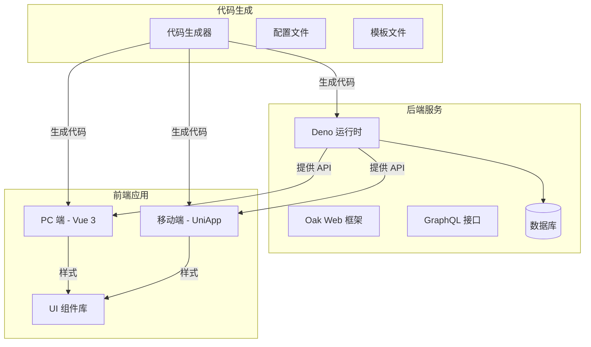
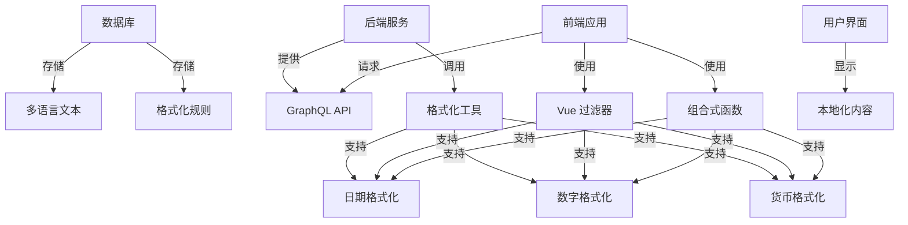
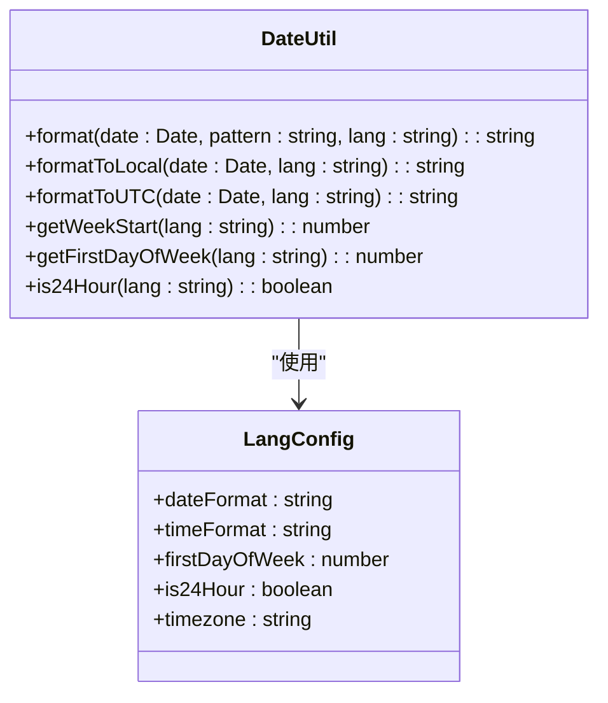
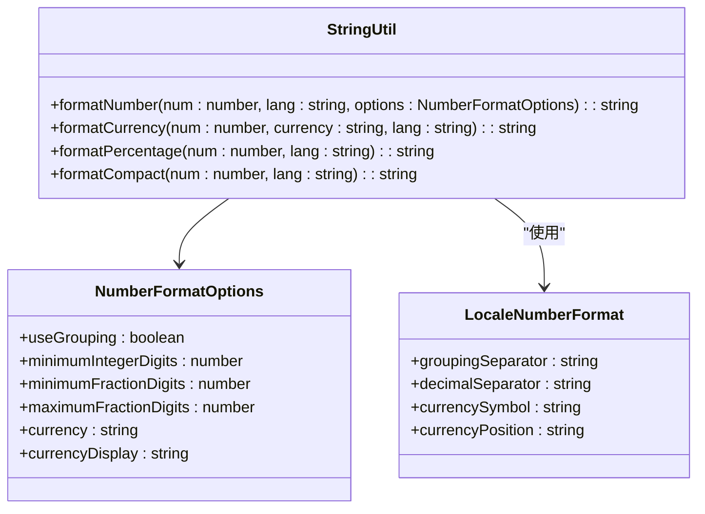
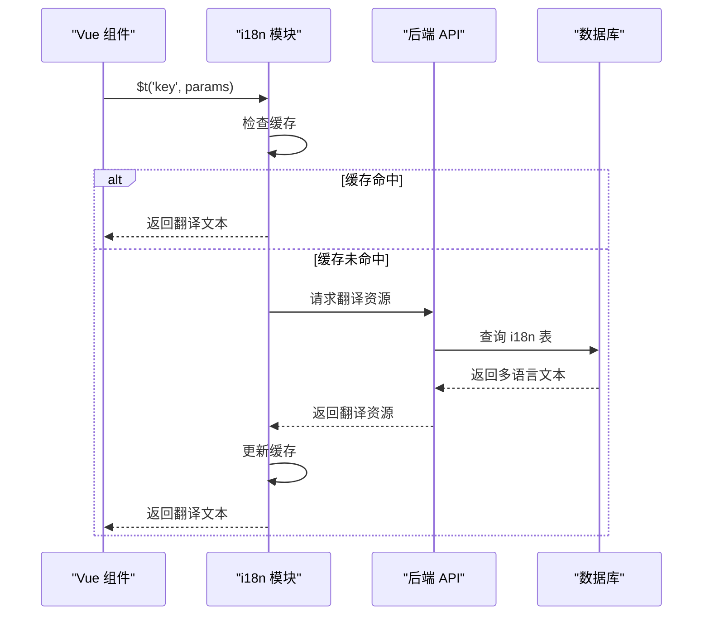
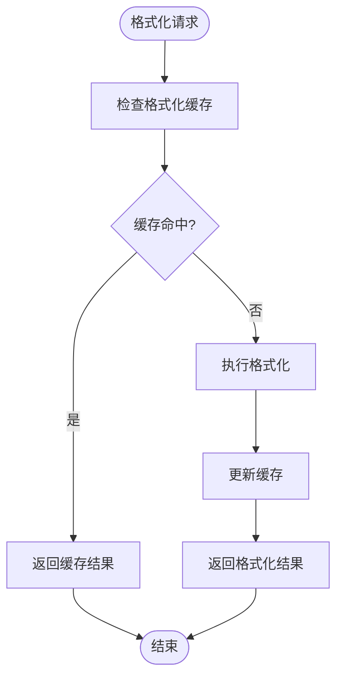
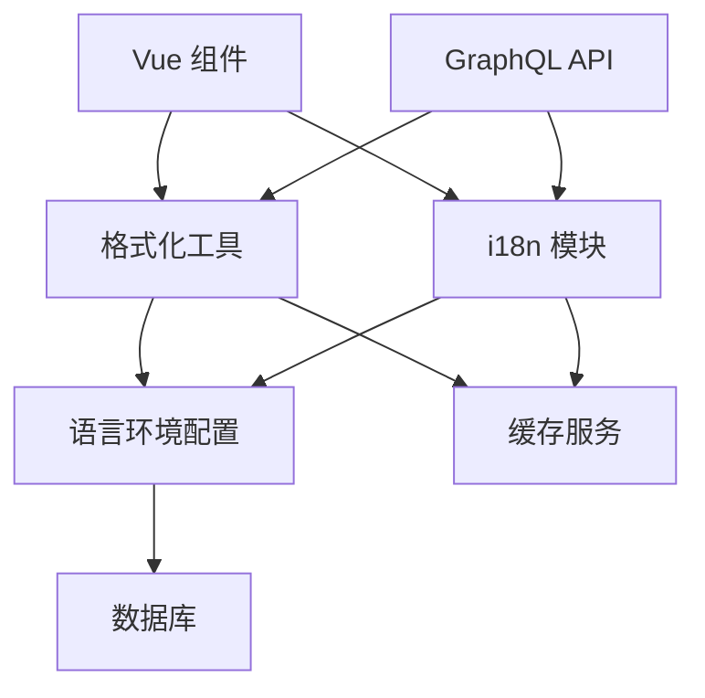

# 格式化与本地化

**本文档引用文件**   
- [date_util.ts](https://github.com/sail-sail/nest/blob/main/deno\lib\util\date_util.ts)
- [DateUtil.ts](https://github.com/sail-sail/nest/blob/main/pc\src\utils\DateUtil.ts)
- [DateUtil.ts](https://github.com/sail-sail/nest/blob/main/uni\src\utils\DateUtil.ts)
- [string_util.ts](https://github.com/sail-sail/nest/blob/main/deno\lib\util\string_util.ts)
- [StringUtil.ts](https://github.com/sail-sail/nest/blob/main/pc\src\utils\StringUtil.ts)
- [StringUtil.ts](https://github.com/sail-sail/nest/blob/main/uni\src\utils\StringUtil.ts)
- [zh-cn.ts](https://github.com/sail-sail/nest/blob/main/pc\src\locales\zh-cn.ts)
- [en.ts](https://github.com/sail-sail/nest/blob/main/pc\src\locales\en.ts)
- [i18n.ts](https://github.com/sail-sail/nest/blob/main/pc\src\locales\i18n.ts)
- [i18n.ts](https://github.com/sail-sail/nest/blob/main/uni\src\locales\i18n.ts)
- [common.scss](https://github.com/sail-sail/nest/blob/main/pc\src\assets\style\common.scss)
- [tmui.scss](https://github.com/sail-sail/nest/blob/main/uni\src\uni_modules\tm-ui\css\tmui.scss)
- [config.ts](https://github.com/sail-sail/nest/blob/main/codegen\src\config.ts)
- [lang.dao.ts](https://github.com/sail-sail/nest/blob/main/deno\gen\base\lang\lang.dao.ts)
- [i18n.dao.ts](https://github.com/sail-sail/nest/blob/main/deno\gen\base\i18n\i18n.dao.ts)

## 目录
1. [简介](#简介)
2. [项目结构](#项目结构)
3. [核心组件](#核心组件)
4. [架构概览](#架构概览)
5. [详细组件分析](#详细组件分析)
6. [依赖分析](#依赖分析)
7. [性能考虑](#性能考虑)
8. [故障排除指南](#故障排除指南)
9. [结论](#结论)

## 简介
本项目是一个基于 NestJS 和 Deno 构建的全栈应用，支持多语言、多租户的企业级管理系统。系统通过代码生成机制自动生成前后端代码，支持 PC 和移动端（UniApp）双端部署。核心功能包括国际化（i18n）、数据格式化、权限控制、字典管理等。本文档重点介绍系统的格式化与本地化实现方案，涵盖日期时间、数字、货币、文本复数等数据类型的区域化显示处理。

## 项目结构
项目采用模块化分层架构，主要分为代码生成器（codegen）、后端服务（deno）、PC前端（pc）和移动端（uni）四大模块。代码生成器根据数据库表结构自动生成前后端代码，确保一致性。后端基于 Deno + Oak 实现 RESTful API 和 GraphQL 接口，前端使用 Vue 3 + Composition API 构建响应式界面。

**图示来源**
- [config.ts](https://github.com/sail-sail/nest/blob/main/codegen\src\config.ts)
- [template](https://github.com/sail-sail/nest/blob/main/codegen\src\template)

## 核心组件
系统的核心本地化功能由 i18n 模块、格式化工具类和语言环境配置共同实现。i18n 模块负责管理多语言资源，格式化工具类提供日期、数字、货币等数据的区域化显示，语言环境配置定义了不同地区的格式规则。

**组件来源**
- [i18n.dao.ts](https://github.com/sail-sail/nest/blob/main/deno\gen\base\i18n\i18n.dao.ts)
- [lang.dao.ts](https://github.com/sail-sail/nest/blob/main/deno\gen\base\lang\lang.dao.ts)
- [i18n.ts](https://github.com/sail-sail/nest/blob/main/pc\src\locales\i18n.ts)

## 架构概览
系统采用分层架构，从数据层到表现层完整支持本地化需求。数据层存储多语言文本和格式化规则，服务层提供格式化接口，表现层根据当前语言环境动态应用格式化规则。

**图示来源**
- [i18n.dao.ts](https://github.com/sail-sail/nest/blob/main/deno\gen\base\i18n\i18n.dao.ts)
- [date_util.ts](https://github.com/sail-sail/nest/blob/main/deno\lib\util\date_util.ts)
- [string_util.ts](https://github.com/sail-sail/nest/blob/main/deno\lib\util\string_util.ts)

## 详细组件分析

### 日期时间格式化
系统通过 `DateUtil` 工具类实现日期时间的本地化格式化。支持根据语言环境自动应用不同的日期格式（如 YYYY-MM-DD vs DD/MM/YYYY）、时间格式和时区处理。

**图示来源**
- [DateUtil.ts](https://github.com/sail-sail/nest/blob/main/pc\src\utils\DateUtil.ts)
- [DateUtil.ts](https://github.com/sail-sail/nest/blob/main/uni\src\utils\DateUtil.ts)
- [date_util.ts](https://github.com/sail-sail/nest/blob/main/deno\lib\util\date_util.ts)

### 数字与货币格式化
系统通过 `StringUtil` 工具类实现数字和货币的本地化格式化。支持千位分隔符、小数点符号、货币符号位置等区域化规则。

**图示来源**
- [StringUtil.ts](https://github.com/sail-sail/nest/blob/main/pc\src\utils\StringUtil.ts)
- [StringUtil.ts](https://github.com/sail-sail/nest/blob/main/uni\src\utils\StringUtil.ts)
- [string_util.ts](https://github.com/sail-sail/nest/blob/main/deno\lib\util\string_util.ts)

### 多语言文本处理
系统通过 i18n 模块实现多语言文本的管理和显示。支持文本翻译、复数形式、性别敏感文本和上下文相关表达式。

**图示来源**
- [i18n.ts](https://github.com/sail-sail/nest/blob/main/pc\src\locales\i18n.ts)
- [i18n.ts](https://github.com/sail-sail/nest/blob/main/uni\src\locales\i18n.ts)
- [i18n.dao.ts](https://github.com/sail-sail/nest/blob/main/deno\gen\base\i18n\i18n.dao.ts)

### 格式化性能优化
为提高格式化性能，系统采用内存缓存和惰性计算策略。常见格式化结果会被缓存，避免重复计算。

**图示来源**
- [DateUtil.ts](https://github.com/sail-sail/nest/blob/main/pc\src\utils\DateUtil.ts)
- [StringUtil.ts](https://github.com/sail-sail/nest/blob/main/pc\src\utils\StringUtil.ts)

## 依赖分析
系统各组件之间的依赖关系清晰，通过接口隔离和依赖注入实现松耦合。格式化功能依赖于语言环境配置和 i18n 模块，但不直接依赖具体实现。

**图示来源**
- [i18n.ts](https://github.com/sail-sail/nest/blob/main/pc\src\locales\i18n.ts)
- [DateUtil.ts](https://github.com/sail-sail/nest/blob/main/pc\src\utils\DateUtil.ts)
- [StringUtil.ts](https://github.com/sail-sail/nest/blob/main/pc\src\utils\StringUtil.ts)

## 性能考虑
- **缓存策略**：对频繁使用的格式化结果进行内存缓存，减少重复计算
- **惰性加载**：语言包和格式化规则按需加载，减少初始加载时间
- **批量处理**：对大量数据的格式化采用批量处理，避免逐条格式化
- **预编译**：常用格式化模式预编译为函数，提高执行效率

## 故障排除指南
- **问题**：日期格式不正确  
  **解决方案**：检查 `lang` 表中的 `date_format` 配置，确保与语言环境匹配

- **问题**：数字千位分隔符错误  
  **解决方案**：检查 `StringUtil.formatNumber` 的实现，确认区域设置正确

- **问题**：翻译文本缺失  
  **解决方案**：检查 `i18n` 表中是否存在对应语言的翻译记录

- **问题**：格式化性能低下  
  **解决方案**：启用缓存机制，检查缓存命中率

**组件来源**
- [DateUtil.ts](https://github.com/sail-sail/nest/blob/main/pc\src\utils\DateUtil.ts)
- [StringUtil.ts](https://github.com/sail-sail/nest/blob/main/pc\src\utils\StringUtil.ts)
- [i18n.ts](https://github.com/sail-sail/nest/blob/main/pc\src\locales\i18n.ts)

## 结论
本系统通过完善的本地化架构，实现了日期时间、数字、货币等数据类型的区域化显示。采用代码生成机制确保前后端格式化规则一致，通过缓存和优化策略保证性能。未来可扩展支持农历转换、特殊文化格式和自定义单位转换，进一步提升国际化能力。