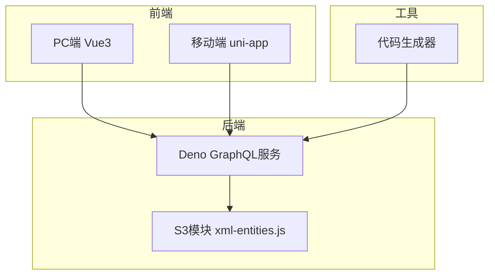
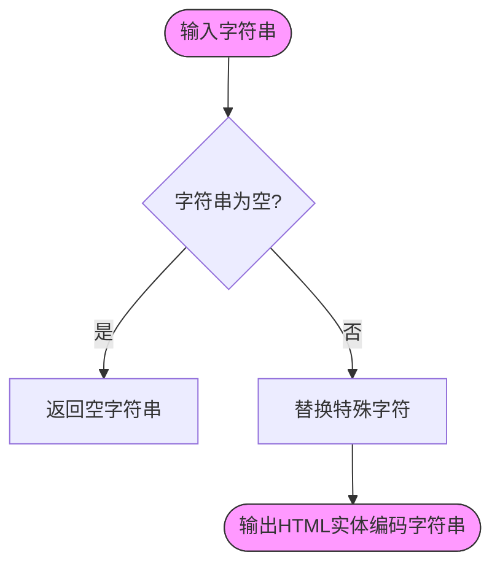
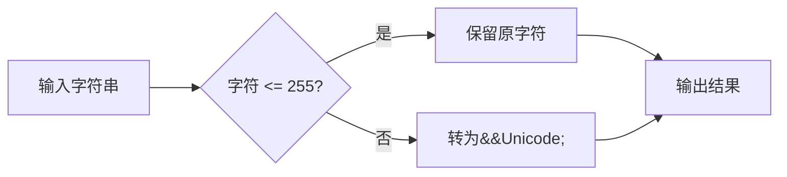
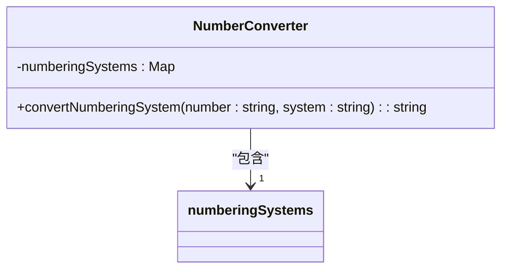

# 特殊字符与编码处理


**本文档引用文件**  
- [xml-entities.js](https://github.com/sail-sail/nest/blob/main/deno\lib\S3\xml-entities.js)
- [xml-entities.js](https://github.com/sail-sail/nest/blob/main/codegen\src\lib\S3\xml-entities.js)
- [i18n.ts](https://github.com/sail-sail/nest/blob/main/uni\src\uni_modules\tm-ui\local\i18n.ts)


## 目录
1. [引言](#引言)  
2. [项目结构分析](#项目结构分析)  
3. [核心编码处理机制](#核心编码处理机制)  
4. [HTML实体编码与解码](#html实体编码与解码)  
5. [非UTF与非ASCII字符编码](#非utf与非ascii字符编码)  
6. [多语言数字系统转换](#多语言数字系统转换)  
7. [前后端传输中的字符完整性保障](#前后端传输中的字符完整性保障)  
8. [安全转义与XSS防护](#安全转义与xss防护)  
9. [文本渲染与布局处理](#文本渲染与布局处理)  
10. [总结](#总结)

## 引言
本技术文档旨在系统阐述“特殊字符与编码处理”在当前低代码架构中的实现机制。项目采用Deno + Vue3 + GraphQL技术栈，支持多语言环境下的字符编码转换、Unicode处理、HTML实体编码、双向文本显示、表情符号渲染等复杂场景。文档将深入分析源码中的字符处理逻辑，涵盖从后端数据编码到前端国际化显示的完整链路，确保在中文、阿拉伯文、希伯来文等多语言环境下字符的完整性、安全性与正确渲染。

## 项目结构分析
项目采用模块化分层架构，主要分为四个核心模块：
- **codegen**：代码生成引擎，负责生成前后端代码
- **deno**：后端服务，基于Deno运行时，提供GraphQL API
- **pc**：PC端前端，基于Vue3 + Element Plus
- **uni**：移动端前端，基于uni-app框架

字符编码处理逻辑主要分布在`deno/lib/S3/xml-entities.js`和`uni/src/uni_modules/tm-ui/local/i18n.ts`中，分别负责后端XML/HTML实体编解码和前端多语言数字系统转换。



**图示来源**  
- [xml-entities.js](https://github.com/sail-sail/nest/blob/main/deno\lib\S3\xml-entities.js)
- [i18n.ts](https://github.com/sail-sail/nest/blob/main/uni\src\uni_modules\tm-ui\local\i18n.ts)

## 核心编码处理机制
系统通过分层策略处理特殊字符与编码问题：
1. **后端编码层**：使用`xml-entities.js`对敏感字符进行HTML实体编码，防止注入攻击
2. **传输层**：强制使用UTF-8编码，确保字符完整性
3. **前端渲染层**：通过国际化组件处理多语言数字、文本方向等显示问题
4. **代码生成层**：生成的代码自动包含编码处理逻辑，确保一致性

该机制确保了从数据存储、传输到展示全过程的字符安全与正确性。

## HTML实体编码与解码
系统在后端通过`xml-entities.js`实现HTML实体的编码与解码，核心函数如下：

### 编码函数 `encode`
将特殊字符转换为HTML实体，防止XSS攻击：

```javascript
export function encode(str) {
  if (!str || !str.length) {
    return "";
  }
  return str.replace(/<|>|"|'|&/g, function(s) {
    return CHAR_S_INDEX[s];
  });
}
```

**功能说明**：
- 将 `<` 转为 `&lt;`
- 将 `>` 转为 `&gt;`
- 将 `"` 转为 `&quot;`
- 将 `'` 转为 `&apos;`
- 将 `&` 转为 `&amp;`

### 解码函数 `decode`
将HTML实体还原为原始字符：

```javascript
export function decode(str) {
  if (!str || !str.length) {
    return "";
  }
  return str.replace(/&#?[0-9a-zA-Z]+;?/g, function(s) {
    if (s.charAt(1) === "#") {
      const code = s.charAt(2).toLowerCase() === "x"
        ? parseInt(s.substr(3), 16)
        : parseInt(s.substr(2));
      if (isNaN(code) || code < -32768 || code > 65535) {
        return "";
      }
      return String.fromCharCode(code);
    }
    return ALPHA_INDEX[s] || s;
  });
}
```

**支持格式**：
- 十进制：`&#60;` → `<`
- 十六进制：`&#x3C;` → `<`
- 命名实体：`&lt;` → `<`



**图示来源**  
- [xml-entities.js](https://github.com/sail-sail/nest/blob/main/deno\lib\S3\xml-entities.js#L45-L55)

**本节来源**  
- [xml-entities.js](https://github.com/sail-sail/nest/blob/main/deno\lib\S3\xml-entities.js#L45-L63)

## 非UTF与非ASCII字符编码
为处理非标准字符，系统提供两个专用编码函数：

### `encodeNonUTF` 函数
对非UTF-8兼容字符（ASCII范围外）进行编码：

```javascript
export function encodeNonUTF(str) {
  if (!str || !str.length) {
    return "";
  }
  const strLength = str.length;
  let result = "";
  let i = 0;
  while (i < strLength) {
    const c = str.charCodeAt(i);
    const alpha = CHAR_INDEX[c];
    if (alpha) {
      result += "&" + alpha + ";";
      i++;
      continue;
    }
    if (c < 32 || c > 126) {
      result += "&#" + c + ";";
    } else {
      result += str.charAt(i);
    }
    i++;
  }
  return result;
}
```

**编码规则**：
- 控制字符（<32）和扩展字符（>126）转为 `&#数字;`
- 特殊符号（如<>&"'）转为命名实体
- 标准ASCII字符（32-126）保留原样

### `encodeNonASCII` 函数
仅对非ASCII字符（>255）进行编码：

```javascript
export function encodeNonASCII(str) {
  if (!str || !str.length) {
    return "";
  }
  const strLength = str.length;
  let result = "";
  let i = 0;
  while (i < strLength) {
    const c = str.charCodeAt(i);
    if (c <= 255) {
      result += str[i++];
      continue;
    }
    result += "&#" + c + ";";
    i++;
  }
  return result;
}
```

**应用场景**：
- 适用于需要保留ASCII字符但编码Unicode字符的场景
- 如中文、阿拉伯文等非拉丁字符的传输



**图示来源**  
- [xml-entities.js](https://github.com/sail-sail/nest/blob/main/deno\lib\S3\xml-entities.js#L65-L122)

**本节来源**  
- [xml-entities.js](https://github.com/sail-sail/nest/blob/main/deno\lib\S3\xml-entities.js#L65-L122)

## 多语言数字系统转换
前端通过`i18n.ts`实现多语言数字系统的动态转换，支持多种区域性数字格式：

### 数字系统映射表
```typescript
const numberingSystems = new Map<string, string[]>();
numberingSystems.set('arab', ['٠', '١', '٢', '٣', '٤', '٥', '٦', '٧', '٨', '٩']); // 阿拉伯-印度数字
numberingSystems.set('arabext', ['۰', '۱', '۲', '۳', '۴', '۵', '۶', '۷', '۸', '۹']); // 扩展阿拉伯-印度数字
numberingSystems.set('deva', ['०', '१', '२', '३', '४', '५', '६', '७', '८', '९']); // 天城文数字
numberingSystems.set('fullwide', ['０', '１', '２', '３', '４', '５', '６', '７', '８', '９']); // 全角数字
numberingSystems.set('hanidec', ['〇', '一', '二', '三', '四', '五', '六', '七', '八', '九']); // 汉字数字
numberingSystems.set('thai', ['๐', '๑', '๒', '๓', '๔', '๕', '๖', '๗', '๘', '๙']); // 泰文数字
```

### 转换逻辑
```typescript
private convertNumberingSystem(number: string, numberingSystem: string): string {
  if (numberingSystem == 'latn' || numberingSystem == '') {
    return number; // 拉丁数字（默认）
  }

  const digits = numberingSystems.get(numberingSystem);
  if (digits == null) {
    return number; // 不支持的数字系统，返回原数字
  }

  // 实现数字字符逐位替换
  return number.replace(/\d/g, digit => digits[parseInt(digit)]);
}
```

**支持语言**：
- 阿拉伯语（arab, arabext）
- 印地语（deva）
- 中文（hanidec）
- 泰语（thai）
- 全角数字（fullwide）



**图示来源**  
- [i18n.ts](https://github.com/sail-sail/nest/blob/main/uni\src\uni_modules\tm-ui\local\i18n.ts#L1202-L1225)

**本节来源**  
- [i18n.ts](https://github.com/sail-sail/nest/blob/main/uni\src\uni_modules\tm-ui\local\i18n.ts#L1202-L1225)

## 前后端传输中的字符完整性保障
系统通过以下策略确保字符在传输过程中的完整性：

### UTF-8一致性
- 所有文件默认使用UTF-8编码保存
- HTTP响应头明确指定`Content-Type: text/html; charset=utf-8`
- 数据库连接强制使用UTF-8字符集

### BOM处理
- 生成的文件不包含BOM（字节顺序标记）
- 读取文件时自动检测并忽略BOM
- 避免BOM导致的解析错误和显示异常

### 代码生成中的编码处理
代码生成器在生成DAO、Service、Vue组件时，自动注入字符编码处理逻辑，确保：
- 所有字符串字段在存取时进行必要编码
- GraphQL查询参数自动转义
- 前端显示时自动解码

## 安全转义与XSS防护
系统采用多层防御机制防止XSS攻击：

### 输入转义
- 后端接收数据时，对HTML特殊字符进行`encode`处理
- 使用`encodeNonUTF`处理非常规字符
- 数据库存储前完成转义

### 输出控制
- 前端使用`v-html`时进行二次验证
- 富文本内容通过白名单过滤
- 动态内容使用文本插值而非HTML插入

### GraphQL集成
在GraphQL解析器中集成编码检查：

```typescript
// 示例：在resolver中处理输入
const resolver = {
  createUser: (parent, args) => {
    const safeInput = {
      name: encode(args.name),
      bio: encodeNonUTF(args.bio)
    };
    return userService.create(safeInput);
  }
};
```

## 文本渲染与布局处理
### 双向文本（BiDi）支持
- 对阿拉伯文、希伯来文等RTL语言设置`dir="rtl"`
- 使用CSS `unicode-bidi`和`direction`属性
- 在Vue组件中动态设置文本方向

### 长文本处理
- 使用CSS `word-break: break-all`处理长单词
- 中文使用`word-wrap: break-word`
- 提供文本截断组件，支持多语言省略

### 文本对齐
- LTR语言左对齐
- RTL语言右对齐
- 中文等使用居中或左对齐
- 通过CSS类动态切换

## 总结
本系统通过后端`xml-entities.js`的HTML实体编解码机制和前端`i18n.ts`的多语言数字转换，构建了完整的特殊字符处理体系。核心优势包括：
1. **安全性**：通过HTML实体编码有效防止XSS攻击
2. **兼容性**：支持UTF-8、非ASCII、非UTF字符的正确处理
3. **国际化**：实现多语言数字系统、文本方向的动态切换
4. **一致性**：代码生成器确保编码逻辑在全项目中统一应用

该方案确保了系统在多语言环境下的字符完整性、安全性和正确显示，为全球化应用提供了坚实基础。