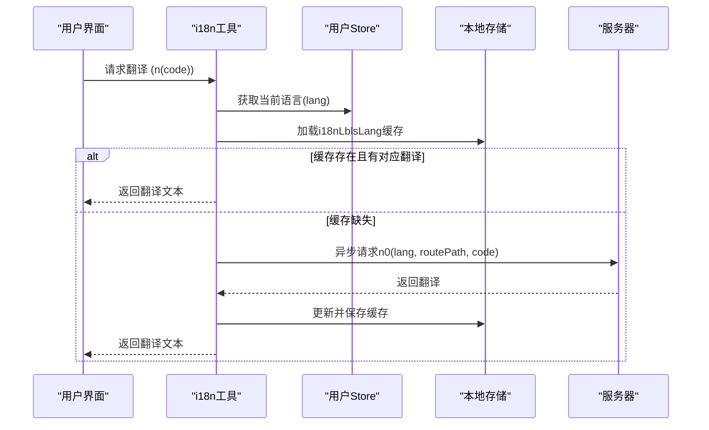
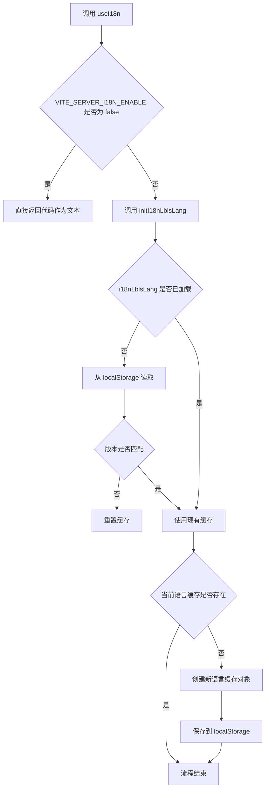
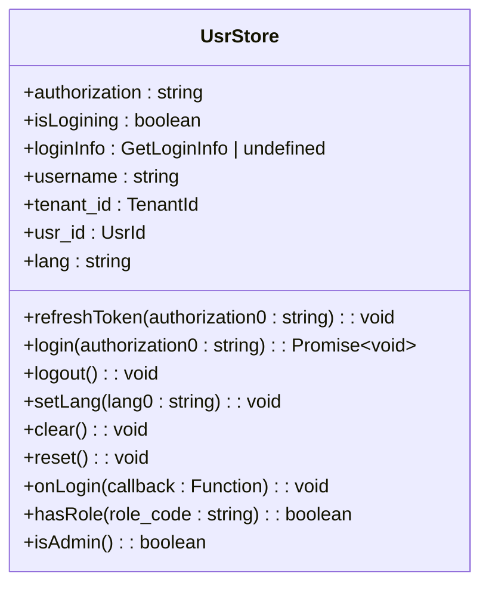
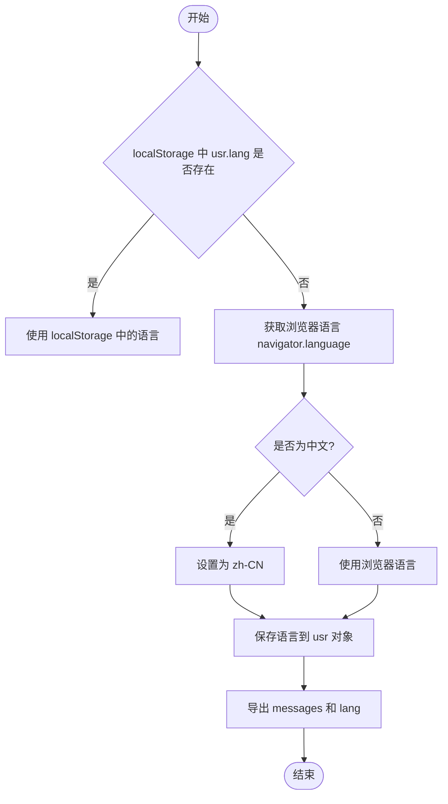

# 前端语言状态管理


**本文档引用的文件**  
- [i18n.ts](https://github.com/sail-sail/nest/blob/main/pc/src/locales/i18n.ts)
- [index.ts](https://github.com/sail-sail/nest/blob/main/pc/src/locales/index.ts)
- [usr.ts](https://github.com/sail-sail/nest/blob/main/pc/src/store/usr.ts)
- [en.ts](https://github.com/sail-sail/nest/blob/main/pc/src/locales/en.ts)
- [zh-cn.ts](https://github.com/sail-sail/nest/blob/main/pc/src/locales/zh-cn.ts)


## 目录
1. [简介](#简介)
2. [项目结构](#项目结构)
3. [核心组件](#核心组件)
4. [架构概览](#架构概览)
5. [详细组件分析](#详细组件分析)
6. [依赖分析](#依赖分析)
7. [性能考虑](#性能考虑)
8. [故障排除指南](#故障排除指南)
9. [结论](#结论)

## 简介
本文档详细阐述了前端语言状态管理机制，重点分析 Vue 国际化（i18n）的实现方式。系统通过 Vuex 存储用户语言偏好，结合本地存储实现持久化，并支持从服务器动态加载翻译文本。文档将深入解析语言初始化流程、切换机制、回退策略及与浏览器语言的自动匹配逻辑。

## 项目结构
项目采用模块化结构，语言管理相关代码集中于 `pc/src/locales` 和 `pc/src/store` 目录下。`locales` 文件夹包含多语言包定义和核心 i18n 工具函数，`store` 中的 `usr.ts` 模块负责管理用户相关的状态，包括当前语言设置。

```mermaid
graph TB
subgraph "语言资源"
en[en.ts]
zh[zh-cn.ts]
i18n[i18n.ts]
index[index.ts]
end
subgraph "状态管理"
usrStore[usr.ts]
end
i18n --> usrStore : "读取语言"
index --> i18n : "初始化"
usrStore --> index : "获取默认语言"
```

**图示来源**  
- [i18n.ts](https://github.com/sail-sail/nest/blob/main/pc/src/locales/i18n.ts)
- [index.ts](https://github.com/sail-sail/nest/blob/main/pc/src/locales/index.ts)
- [usr.ts](https://github.com/sail-sail/nest/blob/main/pc/src/store/usr.ts)

## 核心组件
系统的核心组件包括：
- **i18n.ts**：提供 `useI18n` 钩子，封装翻译逻辑和动态加载。
- **index.ts**：初始化语言环境，集成 Element Plus 多语言包。
- **usr.ts**：Vuex 模块，存储和管理用户语言偏好。

**组件来源**  
- [i18n.ts](https://github.com/sail-sail/nest/blob/main/pc/src/locales/i18n.ts)
- [index.ts](https://github.com/sail-sail/nest/blob/main/pc/src/locales/index.ts)
- [usr.ts](https://github.com/sail-sail/nest/blob/main/pc/src/store/usr.ts)

## 架构概览
整个语言管理系统采用客户端-服务器协同模式。前端优先使用本地缓存的翻译，若缺失则向服务器请求并缓存结果。用户语言状态由 Vuex 统一管理，并通过本地存储实现跨会话持久化。



**图示来源**  
- [i18n.ts](https://github.com/sail-sail/nest/blob/main/pc/src/locales/i18n.ts#L100-L150)
- [usr.ts](https://github.com/sail-sail/nest/blob/main/pc/src/store/usr.ts#L50-L60)

## 详细组件分析

### i18n.ts 模块分析
该模块是语言管理的核心，提供了 `useI18n` 函数，返回包含 `n`, `nAsync`, `initI18ns` 等方法的对象。

#### 初始化流程


**图示来源**  
- [i18n.ts](https://github.com/sail-sail/nest/blob/main/pc/src/locales/i18n.ts#L116-L150)

#### 翻译函数 (getLbl)
`getLbl` 函数是实际执行翻译的核心。它首先尝试从内存缓存 `i18nLblsLang` 中查找翻译。如果找不到，它会：
1. 立即返回传入的 `code` 参数作为占位符（避免阻塞渲染）。
2. 启动一个异步任务，调用 `n0` API 从服务器获取翻译。
3. 将获取到的翻译存入缓存并更新本地存储。
4. 更新响应式引用，触发 UI 重新渲染以显示正确翻译。

此设计保证了应用的响应性，即使网络延迟也不会卡住界面。

**组件来源**  
- [i18n.ts](https://github.com/sail-sail/nest/blob/main/pc/src/locales/i18n.ts#L152-L185)

### usr.ts 模块分析
该模块使用 `useStorage`（基于 `localStorage` 的响应式存储）来持久化用户状态。

#### 语言状态管理


**图示来源**  
- [usr.ts](https://github.com/sail-sail/nest/blob/main/pc/src/store/usr.ts#L10-L140)

`lang` 状态通过 `useStorage("store.usr.lang", "")` 实现，确保页面刷新后语言设置不丢失。`setLang` 方法是外部（如语言切换组件）修改语言的唯一入口，它会同步更新 Vuex 状态和 `localStorage`。

### index.ts 模块分析
该模块负责应用启动时的全局语言初始化。

#### 默认语言确定逻辑


此逻辑确保了用户体验的连贯性：优先使用用户上次选择的语言，其次匹配浏览器偏好。

**组件来源**  
- [index.ts](https://github.com/sail-sail/nest/blob/main/pc/src/locales/index.ts#L10-L40)

## 依赖分析
系统各组件间依赖关系清晰，耦合度低。

```mermaid
graph TD
i18nTs[i18n.ts] --> usrTs[usr.ts] : "useUsrStore()"
i18nTs --> ApiTs[Api.ts] : "n0()"
indexTs[index.ts] --> usrTs : "读取 localStorage"
indexTs --> elementPlus : "集成 Element Plus 语言包"
usrTs --> localStorage : "持久化存储"
i18nTs --> localStorage : "缓存翻译"
```

**图示来源**  
- [i18n.ts](https://github.com/sail-sail/nest/blob/main/pc/src/locales/i18n.ts)
- [index.ts](https://github.com/sail-sail/nest/blob/main/pc/src/locales/index.ts)
- [usr.ts](https://github.com/sail-sail/nest/blob/main/pc/src/store/usr.ts)

## 性能考虑
- **缓存机制**：通过 `localStorage` 缓存翻译结果，显著减少重复的网络请求。
- **懒加载**：翻译文本按需加载，仅在组件使用时才请求服务器，减少初始加载负担。
- **异步无阻塞**：`getLbl` 的设计确保了即使在等待服务器响应时，UI 也能立即渲染，提升了感知性能。

## 故障排除指南
- **问题：切换语言后文本未更新**
  - 检查 `usrStore.lang` 是否已正确更新。
  - 确认 `i18nLblsLang` 缓存是否因版本不匹配被重置（检查 `__i18n_version`）。
  - 查看网络请求，确认 `n0` API 是否成功返回新语言的翻译。

- **问题：中文显示为英文或代码**
  - 确认服务器端 `base_lang` 表中对应语言（lang）和代码（code）的翻译是否存在。
  - 检查 `VITE_SERVER_I18N_ENABLE` 环境变量是否为 `"true"`。

- **问题：首次加载慢**
  - 这是正常现象，因为需要从服务器获取翻译。后续访问将使用本地缓存，速度会显著提升。

**组件来源**  
- [i18n.ts](https://github.com/sail-sail/nest/blob/main/pc/src/locales/i18n.ts)
- [usr.ts](https://github.com/sail-sail/nest/blob/main/pc/src/store/usr.ts)

## 结论
本系统实现了一套高效、健壮的前端语言状态管理方案。它结合了 Vuex 的状态管理能力、`localStorage` 的持久化优势以及服务器端的动态翻译加载，为用户提供流畅的多语言体验。其模块化设计和清晰的依赖关系使得系统易于维护和扩展。