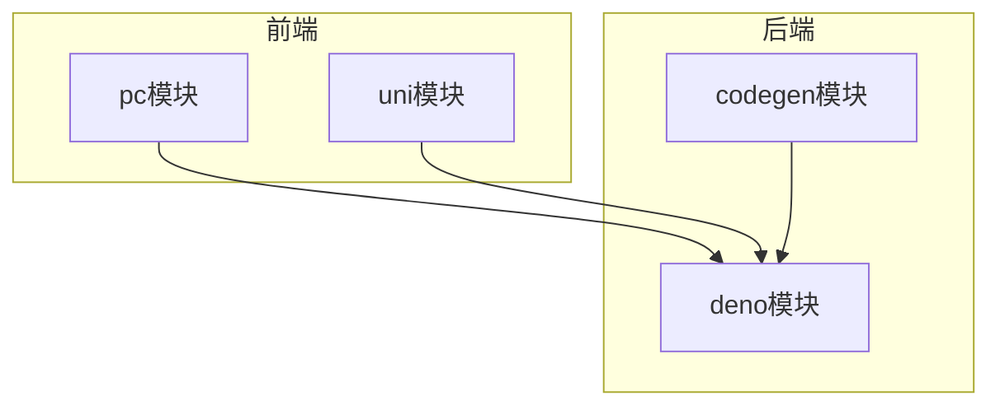
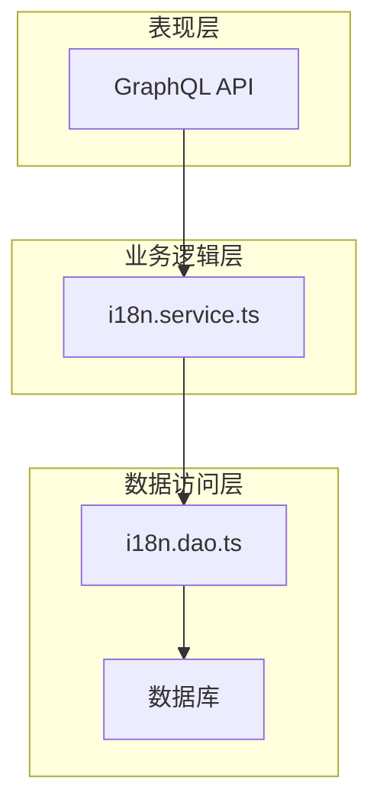
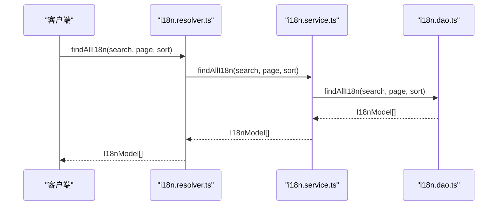
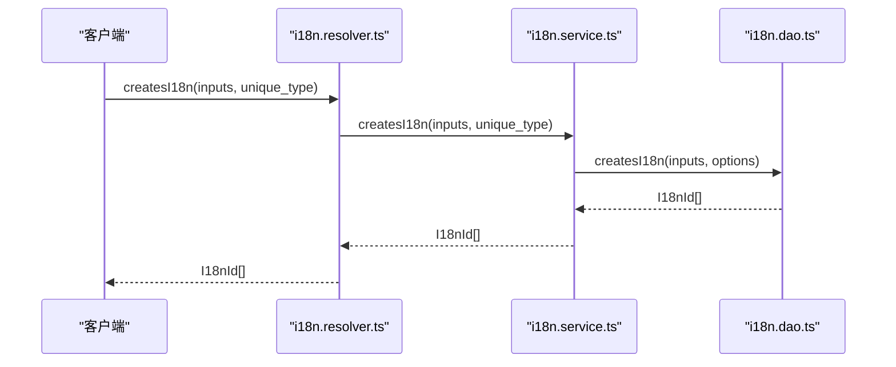
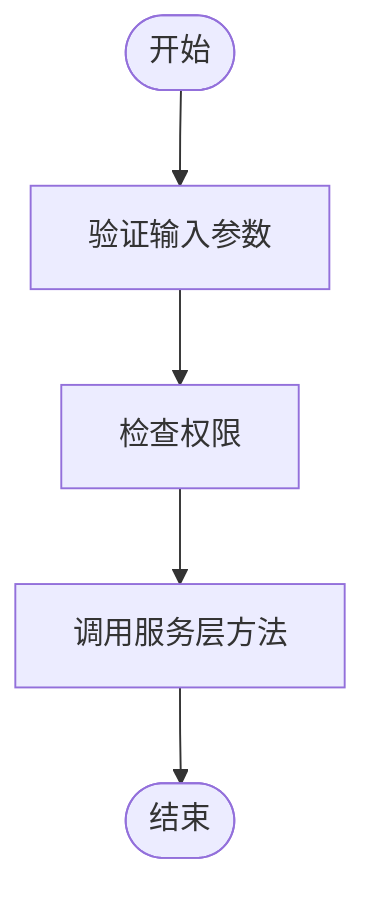
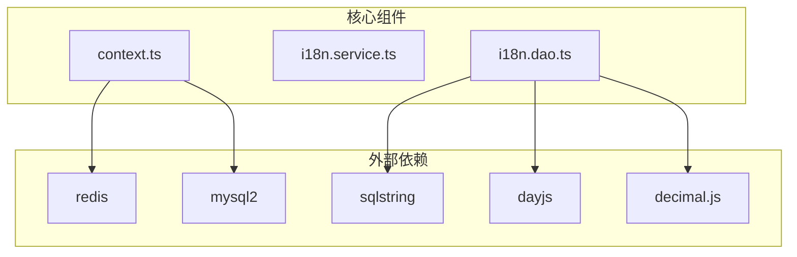

# 后端语言服务处理


**本文档引用的文件**   
- [i18n.service.ts](https://github.com/sail-sail/nest/blob/main/deno\gen\base\i18n\i18n.service.ts)
- [i18n.resolver.ts](https://github.com/sail-sail/nest/blob/main/deno\gen\base\i18n\i18n.resolver.ts)
- [i18n.dao.ts](https://github.com/sail-sail/nest/blob/main/deno\gen\base\i18n\i18n.dao.ts)
- [context.ts](https://github.com/sail-sail/nest/blob/main/deno\lib\context.ts)
- [i18n.model.ts](https://github.com/sail-sail/nest/blob/main/deno\gen\base\i18n\i18n.model.ts)
- [i18n.graphql.ts](https://github.com/sail-sail/nest/blob/main/deno\gen\base\i18n\i18n.graphql.ts)
- [i18n.ts](https://github.com/sail-sail/nest/blob/main/pc\src\locales\i18n.ts)
- [Api.ts](https://github.com/sail-sail/nest/blob/main/pc\src\locales\Api.ts)


## 目录
1. [简介](#简介)
2. [项目结构](#项目结构)
3. [核心组件](#核心组件)
4. [架构概述](#架构概述)
5. [详细组件分析](#详细组件分析)
6. [依赖分析](#依赖分析)
7. [性能考虑](#性能考虑)
8. [故障排除指南](#故障排除指南)
9. [结论](#结论)

## 简介
本文档详细解析了后端语言服务处理机制，重点分析了`i18n.service.ts`中语言切换请求的处理逻辑。文档涵盖了GraphQL API如何接收语言更新请求，包括参数验证、用户身份认证和数据库操作。同时，描述了语言偏好在后端的存储结构和数据访问模式，解释了`context.ts`中如何维护请求上下文中的语言信息。此外，文档还详细阐述了服务层的事务处理机制，确保语言更新操作的数据一致性，并提供了性能优化建议和安全考虑。

## 项目结构
项目结构清晰，分为多个模块，每个模块负责不同的功能。主要模块包括`codegen`、`deno`、`pc`和`uni`。`deno`模块包含后端服务的核心逻辑，`pc`模块包含前端逻辑，`uni`模块包含移动端逻辑。`codegen`模块包含代码生成工具。



**图表来源**
- [project_structure](https://github.com/sail-sail/nest/blob/main/project_structure)

## 核心组件
核心组件包括`i18n.service.ts`、`i18n.resolver.ts`、`i18n.dao.ts`和`context.ts`。这些组件共同实现了语言服务的处理逻辑。

**组件来源**
- [i18n.service.ts](https://github.com/sail-sail/nest/blob/main/deno\gen\base\i18n\i18n.service.ts)
- [i18n.resolver.ts](https://github.com/sail-sail/nest/blob/main/deno\gen\base\i18n\i18n.resolver.ts)
- [i18n.dao.ts](https://github.com/sail-sail/nest/blob/main/deno\gen\base\i18n\i18n.dao.ts)
- [context.ts](https://github.com/sail-sail/nest/blob/main/deno\lib\context.ts)

## 架构概述
系统架构采用分层设计，分为表现层、业务逻辑层和数据访问层。表现层通过GraphQL API接收请求，业务逻辑层处理请求，数据访问层与数据库交互。



**图表来源**
- [i18n.service.ts](https://github.com/sail-sail/nest/blob/main/deno\gen\base\i18n\i18n.service.ts)
- [i18n.dao.ts](https://github.com/sail-sail/nest/blob/main/deno\gen\base\i18n\i18n.dao.ts)

## 详细组件分析
### i18n.service.ts 分析
`i18n.service.ts`文件包含语言服务的核心逻辑，包括查找、创建、更新和删除国际化记录。

#### 查找国际化记录


**图表来源**
- [i18n.service.ts](https://github.com/sail-sail/nest/blob/main/deno\gen\base\i18n\i18n.service.ts)
- [i18n.dao.ts](https://github.com/sail-sail/nest/blob/main/deno\gen\base\i18n\i18n.dao.ts)

#### 创建国际化记录


**图表来源**
- [i18n.service.ts](https://github.com/sail-sail/nest/blob/main/deno\gen\base\i18n\i18n.service.ts)
- [i18n.dao.ts](https://github.com/sail-sail/nest/blob/main/deno\gen\base\i18n\i18n.dao.ts)

### i18n.resolver.ts 分析
`i18n.resolver.ts`文件负责将GraphQL请求映射到服务层方法。

#### 参数验证和权限检查


**图表来源**
- [i18n.resolver.ts](https://github.com/sail-sail/nest/blob/main/deno\gen\base\i18n\i18n.resolver.ts)

### context.ts 分析
`context.ts`文件负责维护请求上下文，包括语言信息、用户信息和事务状态。

#### 请求上下文管理
```mermaid
classDiagram
class Context {
+string lang
+LangId lang_id
+TenantId client_tenant_id
+string authorization
+boolean is_silent_mode
+boolean is_debug
+boolean is_creating
+boolean is_tran
+Date reqDate
+string req_id
+string ip
+Map cacheMap
+string[] cacheKey1s
+boolean cacheEnabled
+PoolConnection conn
+set_is_tran(is_tran : boolean)
+set_is_creating(is_creating : boolean)
+setNotVerifyToken(notVerifyToken : boolean)
+set_is_silent_mode(is_silent_mode : boolean)
+get_is_debug(is_debug : boolean)
+get_is_silent_mode(is_silent_mode : boolean)
+get_is_creating(is_creating : boolean)
+useContext()
+useMaybeContext()
+newContext(oakContext : OakContext)
+runInAsyncHooks(context : Context, fn : Function)
+log(...args : any[])
+error(...args : any[])
+setCache(cacheKey1 : string, cacheKey2 : string, data : any)
+delCache(cacheKey1 : string)
+clearCache()
+resSuc(data : any)
+resErr(msg : string)
+getAuthorization()
+getNow()
+getCache(cacheKey1 : string, cacheKey2 : string)
+beginTran(opt : { debug? : boolean })
+rollback(conn : PoolConnection, opt : { debug? : boolean })
+commit(conn : PoolConnection, opt : { debug? : boolean })
+close(context : Context)
}
```

**图表来源**
- [context.ts](https://github.com/sail-sail/nest/blob/main/deno\lib\context.ts)

## 依赖分析
系统依赖于多个外部库，包括`redis`、`mysql2`、`sqlstring`、`dayjs`和`decimal.js`。这些库提供了缓存、数据库连接、SQL字符串处理、日期处理和高精度计算功能。



**图表来源**
- [context.ts](https://github.com/sail-sail/nest/blob/main/deno\lib\context.ts)
- [i18n.dao.ts](https://github.com/sail-sail/nest/blob/main/deno\gen\base\i18n\i18n.dao.ts)

## 性能考虑
为了提高性能，系统采用了多种优化策略，包括缓存、批量操作和事务处理。

### 缓存策略
系统使用Redis缓存查询结果，减少数据库访问次数。缓存键由SQL查询和参数生成，确保缓存的准确性。

### 批量更新处理
系统支持批量创建和删除国际化记录，减少数据库交互次数，提高处理效率。

### 事务处理
系统在创建、更新和删除操作时开启事务，确保数据一致性。事务在操作完成后提交，如果发生错误则回滚。

## 故障排除指南
### 常见问题
1. **缓存未更新**：检查`update_i18n_version`函数是否被正确调用。
2. **权限不足**：检查`usePermit`函数的权限检查逻辑。
3. **数据库连接失败**：检查数据库配置和连接池状态。

### 日志记录
系统使用`log`和`error`函数记录日志，帮助排查问题。日志包含请求ID、时间戳和详细信息。

**组件来源**
- [context.ts](https://github.com/sail-sail/nest/blob/main/deno\lib\context.ts)
- [i18n.service.ts](https://github.com/sail-sail/nest/blob/main/deno\gen\base\i18n\i18n.service.ts)

## 结论
本文档详细解析了后端语言服务处理机制，涵盖了从请求接收、参数验证、权限检查到数据库操作的完整流程。通过分层设计和事务处理，系统确保了数据的一致性和可靠性。性能优化策略和安全考虑进一步提升了系统的稳定性和安全性。