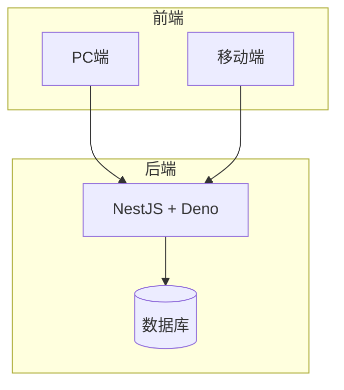
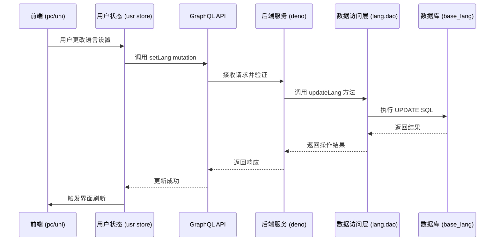
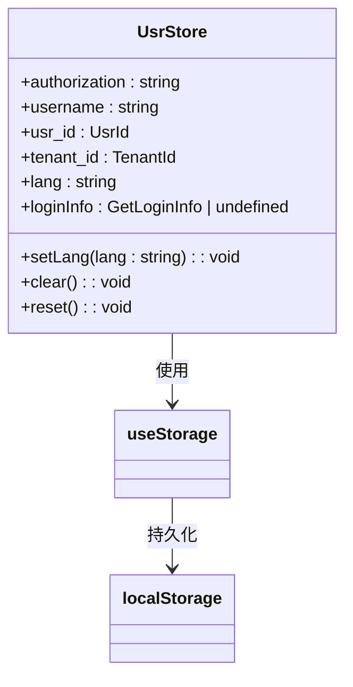
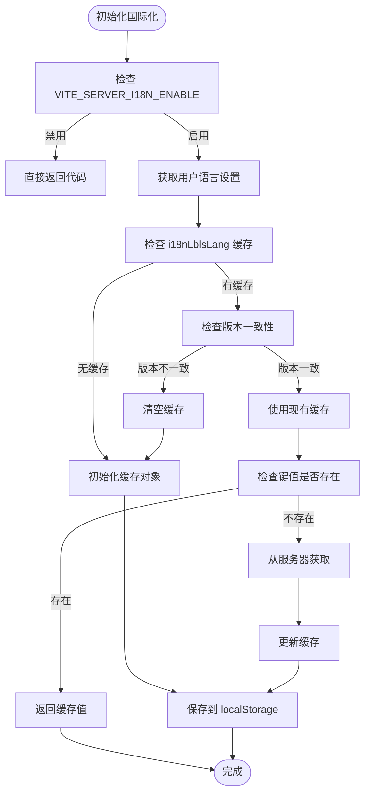
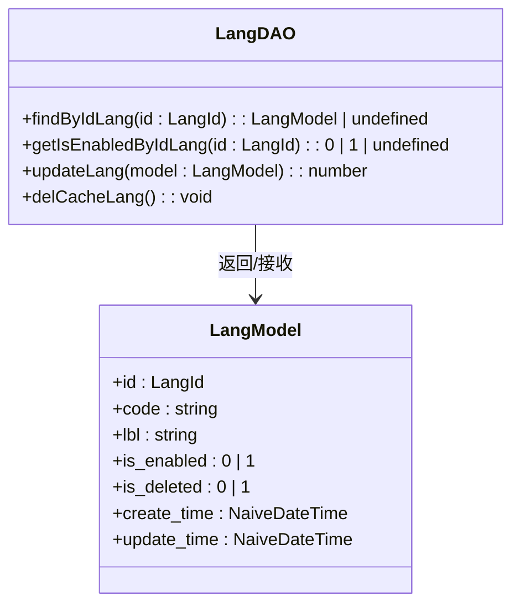
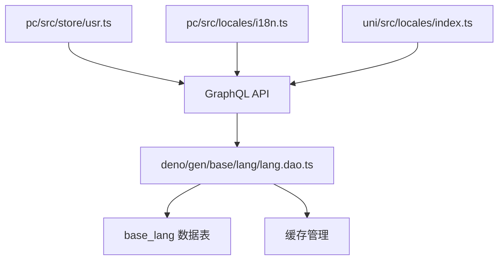

# 用户偏好持久化


**本文档引用文件**  
- [usr.ts](https://github.com/sail-sail/nest/blob/main/pc/src/store/usr.ts#L0-L147)
- [i18n.ts](https://github.com/sail-sail/nest/blob/main/pc/src/locales/i18n.ts#L0-L217)
- [lang.dao.ts](https://github.com/sail-sail/nest/blob/main/deno/gen/base/lang/lang.dao.ts#L1677-L1726)
- [types.ts](https://github.com/sail-sail/nest/blob/main/deno/gen/types.ts#L2190-L2226)
- [index.ts](https://github.com/sail-sail/nest/blob/main/uni/src/locales/index.ts#L0-L26)


## 目录
1. [简介](#简介)
2. [项目结构](#项目结构)
3. [核心组件](#核心组件)
4. [架构概览](#架构概览)
5. [详细组件分析](#详细组件分析)
6. [依赖分析](#依赖分析)
7. [性能考量](#性能考量)
8. [故障排除指南](#故障排除指南)
9. [结论](#结论)

## 简介
本文档详细说明了用户语言偏好持久化的实现机制。系统通过前端状态管理、GraphQL通信、后端数据访问层与数据库协同工作，确保用户语言设置在跨设备、跨会话中保持一致。文档涵盖从前端store变更到后端同步、数据一致性保障、跨设备同步及数据迁移的完整流程。

## 项目结构
项目采用分层架构，主要分为前端（pc、uni）、后端（deno）和代码生成（codegen）三大模块。前端负责用户交互与状态管理，后端提供GraphQL API与数据持久化服务，codegen模块自动生成数据访问对象（DAO）与模型代码。



**图示来源**  
- [usr.ts](https://github.com/sail-sail/nest/blob/main/pc/src/store/usr.ts#L0-L147)
- [i18n.ts](https://github.com/sail-sail/nest/blob/main/pc/src/locales/i18n.ts#L0-L217)
- [lang.dao.ts](https://github.com/sail-sail/nest/blob/main/deno/gen/base/lang/lang.dao.ts#L1677-L1726)

## 核心组件
系统核心组件包括用户状态存储（usr store）、国际化管理（i18n）、语言数据访问对象（lang.dao）及GraphQL类型定义。这些组件协同实现语言偏好的持久化与同步。

**本节来源**  
- [usr.ts](https://github.com/sail-sail/nest/blob/main/pc/src/store/usr.ts#L0-L147)
- [i18n.ts](https://github.com/sail-sail/nest/blob/main/pc/src/locales/i18n.ts#L0-L217)
- [types.ts](https://github.com/sail-sail/nest/blob/main/deno/gen/types.ts#L2190-L2226)

## 架构概览
系统采用前后端分离架构，前端通过Vuex管理用户状态，利用GraphQL mutation将语言偏好同步至后端。后端通过DAO层操作数据库，确保数据一致性，并通过缓存机制提升性能。



**图示来源**  
- [usr.ts](https://github.com/sail-sail/nest/blob/main/pc/src/store/usr.ts#L0-L147)
- [lang.dao.ts](https://github.com/sail-sail/nest/blob/main/deno/gen/base/lang/lang.dao.ts#L1677-L1726)
- [types.ts](https://github.com/sail-sail/nest/blob/main/deno/gen/types.ts#L2190-L2226)

## 详细组件分析

### 用户状态管理分析
前端使用Vue的响应式存储（useStorage）管理用户语言偏好，确保状态变更能自动触发界面更新。



**图示来源**  
- [usr.ts](https://github.com/sail-sail/nest/blob/main/pc/src/store/usr.ts#L0-L147)

#### 语言偏好变更流程
```mermaid
flowchart TD
A[用户在界面选择新语言] --> B[调用 usrStore.setLang()]
B --> C[更新 store.lang 值]
C --> D[触发 localStorage 更新]
D --> E[调用 GraphQL mutation 同步到后端]
E --> F{后端更新成功?}
F --> |是| G[保持新语言设置]
F --> |否| H[回滚到原语言设置]
G --> I[加载新语言资源]
H --> J[显示错误提示]
```

**本节来源**  
- [usr.ts](https://github.com/sail-sail/nest/blob/main/pc/src/store/usr.ts#L0-L147)
- [i18n.ts](https://github.com/sail-sail/nest/blob/main/pc/src/locales/i18n.ts#L0-L217)

### 国际化管理分析
系统通过本地缓存与服务器协同管理国际化资源，优先使用本地缓存，缺失时从服务器获取并缓存。



**本节来源**  
- [i18n.ts](https://github.com/sail-sail/nest/blob/main/pc/src/locales/i18n.ts#L0-L217)

### 数据访问层分析
DAO层封装了对语言表（base_lang）的所有数据库操作，提供类型安全的数据访问接口。



**图示来源**  
- [lang.dao.ts](https://github.com/sail-sail/nest/blob/main/deno/gen/base/lang/lang.dao.ts#L1677-L1726)
- [types.ts](https://github.com/sail-sail/nest/blob/main/deno/gen/types.ts#L2190-L2226)

## 依赖分析
系统各组件间存在明确的依赖关系，前端依赖后端API，后端依赖数据库，形成清晰的调用链。



**图示来源**  
- [usr.ts](https://github.com/sail-sail/nest/blob/main/pc/src/store/usr.ts#L0-L147)
- [i18n.ts](https://github.com/sail-sail/nest/blob/main/pc/src/locales/i18n.ts#L0-L217)
- [lang.dao.ts](https://github.com/sail-sail/nest/blob/main/deno/gen/base/lang/lang.dao.ts#L1677-L1726)
- [index.ts](https://github.com/sail-sail/nest/blob/main/uni/src/locales/index.ts#L0-L26)

## 性能考量
系统通过多级缓存机制优化性能：前端使用localStorage缓存语言资源，后端DAO层提供数据访问缓存，减少数据库查询次数。同时，GraphQL的精准查询避免了不必要的数据传输。

## 故障排除指南
常见问题包括语言设置不生效、国际化资源加载失败等。排查时应检查：1）localStorage中lang值是否正确；2）GraphQL mutation是否成功；3）后端日志是否有数据库错误；4）缓存版本是否一致。

**本节来源**  
- [usr.ts](https://github.com/sail-sail/nest/blob/main/pc/src/store/usr.ts#L0-L147)
- [i18n.ts](https://github.com/sail-sail/nest/blob/main/pc/src/locales/i18n.ts#L0-L217)
- [lang.dao.ts](https://github.com/sail-sail/nest/blob/main/deno/gen/base/lang/lang.dao.ts#L1677-L1726)

## 结论
本系统通过前后端协同实现了用户语言偏好的完整持久化方案。前端状态管理与后端数据访问层紧密结合，配合缓存机制，确保了用户体验的一致性与系统的高性能。未来可扩展支持更多语言动态加载与用户自定义翻译功能。