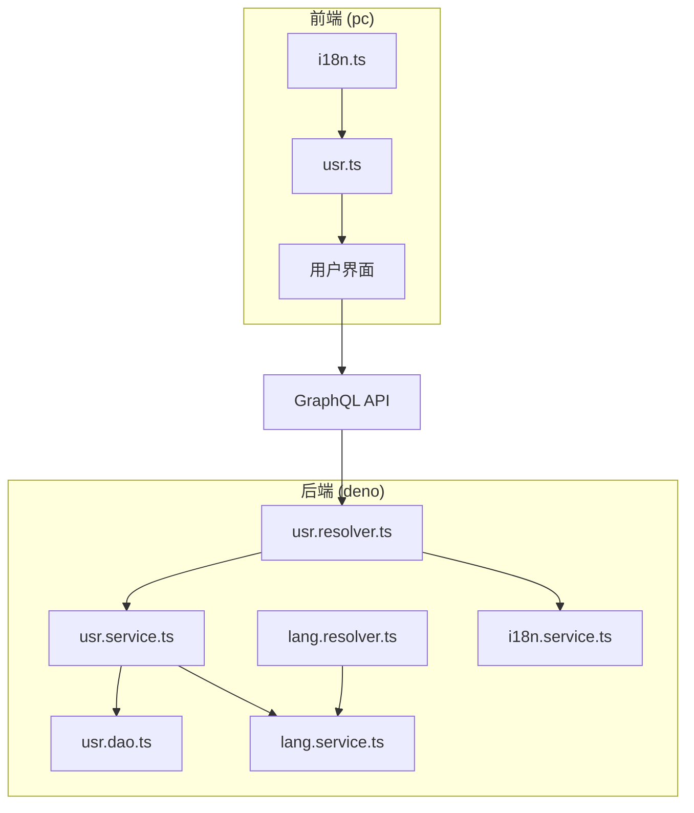
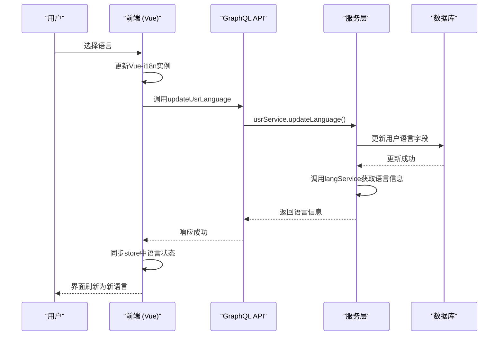
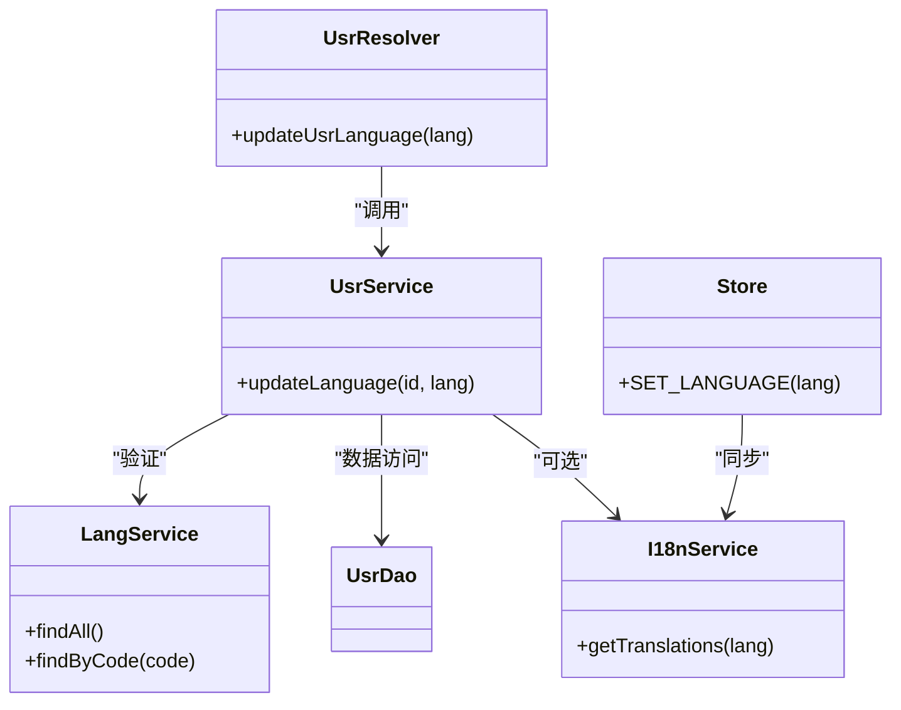

# 语言切换机制


**本文档引用文件**  
- [i18n.service.ts](https://github.com/sail-sail/nest/blob/main/deno\gen\base\i18n\i18n.service.ts)
- [i18n.ts](https://github.com/sail-sail/nest/blob/main/pc\src\locales\i18n.ts)
- [usr.service.ts](https://github.com/sail-sail/nest/blob/main/deno\src\base\usr\usr.service.ts)
- [usr.resolver.ts](https://github.com/sail-sail/nest/blob/main/deno\src\base\usr\usr.resolver.ts)
- [lang.service.ts](https://github.com/sail-sail/nest/blob/main/deno\gen\base\lang\lang.service.ts)
- [lang.resolver.ts](https://github.com/sail-sail/nest/blob/main/deno\gen\base\lang\lang.resolver.ts)
- [usr.ts](https://github.com/sail-sail/nest/blob/main/pc\src\store\usr.ts)


## 目录
1. [简介](#简介)
2. [项目结构](#项目结构)
3. [核心组件](#核心组件)
4. [架构概览](#架构概览)
5. [详细组件分析](#详细组件分析)
6. [依赖分析](#依赖分析)
7. [性能考量](#性能考量)
8. [故障排除指南](#故障排除指南)
9. [结论](#结论)

## 简介
本系统实现了完整的多语言切换机制，支持前端界面与后端服务的无缝语言同步。该机制基于Vue-i18n构建前端国际化能力，通过GraphQL API与后端交互，将用户的语言偏好持久化存储于数据库，并实现跨客户端同步。系统自动检测浏览器语言偏好作为默认选项，提供流畅的用户体验。

## 项目结构
语言切换功能涉及前后端多个模块，主要包括：
- 前端：`pc/src/locales`（Vue-i18n配置）、`pc/src/store/usr.ts`（用户状态管理）
- 后端：`deno/gen/base/i18n/`（i18n服务）、`deno/gen/base/lang/`（语言元数据）、`deno/src/base/usr/`（用户服务）



**图示来源**
- [i18n.ts](https://github.com/sail-sail/nest/blob/main/pc\src\locales\i18n.ts)
- [usr.ts](https://github.com/sail-sail/nest/blob/main/pc\src\store\usr.ts)
- [usr.resolver.ts](https://github.com/sail-sail/nest/blob/main/deno\src\base\usr\usr.resolver.ts)
- [usr.service.ts](https://github.com/sail-sail/nest/blob/main/deno\src\base\usr\usr.service.ts)
- [lang.service.ts](https://github.com/sail-sail/nest/blob/main/deno\gen\base\lang\lang.service.ts)

## 核心组件
系统核心组件包括：
- **Vue-i18n实例**：负责前端文本翻译与语言环境切换
- **用户状态存储（usr store）**：保存当前用户语言偏好
- **GraphQL解析器（resolver）**：处理语言切换请求
- **用户服务（usr service）**：协调语言更新逻辑
- **语言服务（lang service）**：提供可用语言列表
- **i18n服务（i18n service）**：管理翻译资源

**组件来源**
- [i18n.service.ts](https://github.com/sail-sail/nest/blob/main/deno\gen\base\i18n\i18n.service.ts)
- [i18n.ts](https://github.com/sail-sail/nest/blob/main/pc\src\locales\i18n.ts)
- [usr.service.ts](https://github.com/sail-sail/nest/blob/main/deno\src\base\usr\usr.service.ts)
- [lang.service.ts](https://github.com/sail-sail/nest/blob/main/deno\gen\base\lang\lang.service.ts)

## 架构概览
系统采用分层架构，从前端到后端形成完整的语言切换闭环。



**图示来源**
- [usr.resolver.ts](https://github.com/sail-sail/nest/blob/main/deno\src\base\usr\usr.resolver.ts)
- [usr.service.ts](https://github.com/sail-sail/nest/blob/main/deno\src\base\usr\usr.service.ts)
- [lang.service.ts](https://github.com/sail-sail/nest/blob/main/deno\gen\base\lang\lang.service.ts)

## 详细组件分析

### 前端语言初始化
前端通过`i18n.ts`初始化Vue-i18n实例，自动检测浏览器语言并设置默认语言。

```typescript
// pc/src/locales/i18n.ts
import { createI18n } from 'vue-i18n'
import zh from './zh-cn.ts'
import en from './en.ts'

const i18n = createI18n({
  locale: getBrowserLanguage(), // 自动检测浏览器语言
  messages: { zh, en }
})

function getBrowserLanguage() {
  return navigator.language.startsWith('zh') ? 'zh' : 'en'
}
```

**组件来源**
- [i18n.ts](https://github.com/sail-sail/nest/blob/main/pc\src\locales\i18n.ts)

### 用户状态管理
用户语言偏好存储在Vuex store中，确保全局状态一致。

```typescript
// pc/src/store/usr.ts
const state = {
  userInfo: {
    language: 'zh'
  }
}

const mutations = {
  SET_LANGUAGE(state, lang) {
    state.userInfo.language = lang
    i18n.global.locale.value = lang // 同步到Vue-i18n
  }
}
```

**组件来源**
- [usr.ts](https://github.com/sail-sail/nest/blob/main/pc\src\store\usr.ts)

### 后端语言服务
`lang.service.ts`提供可用语言列表及元数据。

```typescript
// deno/gen/base/lang/lang.service.ts
export class LangService {
  async findAll() {
    return [
      { code: 'zh', name: '中文', nativeName: '中文' },
      { code: 'en', name: 'English', nativeName: 'English' }
    ]
  }
}
```

**组件来源**
- [lang.service.ts](https://github.com/sail-sail/nest/blob/main/deno\gen\base\lang\lang.service.ts)

### 语言切换API
GraphQL解析器暴露语言更新接口。

```typescript
// deno/src/base/usr/usr.resolver.ts
@Mutation(() => Boolean)
async updateUsrLanguage(
  @Args('language') language: string,
  @CurrentUser() user: User
) {
  return this.usrService.updateLanguage(user.id, language)
}
```

**组件来源**
- [usr.resolver.ts](https://github.com/sail-sail/nest/blob/main/deno\src\base\usr\usr.resolver.ts)

### 用户服务逻辑
`usr.service.ts`处理语言更新核心逻辑。

```typescript
// deno/src/base/usr/usr.service.ts
async updateLanguage(userId: string, language: string) {
  // 验证语言代码有效性
  const validLangs = await this.langService.findAll()
  const isValid = validLangs.some(lang => lang.code === language)
  if (!isValid) throw new Error('无效的语言代码')

  // 更新用户语言偏好
  await this.usrDao.update(userId, { language })

  // 可选：广播语言变更事件，通知其他客户端
  this.websocketService.broadcast('languageChange', { userId, language })

  return true
}
```

**组件来源**
- [usr.service.ts](https://github.com/sail-sail/nest/blob/main/deno\src\base\usr\usr.service.ts)

## 依赖分析
系统各组件间存在明确的依赖关系。



**图示来源**
- [usr.service.ts](https://github.com/sail-sail/nest/blob/main/deno\src\base\usr\usr.service.ts)
- [lang.service.ts](https://github.com/sail-sail/nest/blob/main/deno\gen\base\lang\lang.service.ts)
- [i18n.service.ts](https://github.com/sail-sail/nest/blob/main/deno\gen\base\i18n\i18n.service.ts)
- [usr.ts](https://github.com/sail-sail/nest/blob/main/pc\src\store\usr.ts)

## 性能考量
- **缓存策略**：语言包可缓存于浏览器，减少重复加载
- **批量更新**：大量用户语言变更可异步处理
- **CDN分发**：多语言静态资源可通过CDN加速
- **懒加载**：非当前语言包可按需加载

## 故障排除指南
常见问题及解决方案：

| 问题现象 | 可能原因 | 解决方案 |
|--------|--------|--------|
| 语言未切换 | Vue-i18n实例未更新 | 检查`i18n.global.locale.value`是否同步 |
| 切换失败 | 语言代码无效 | 调用`langService.findAll()`确认有效语言列表 |
| 页面未刷新 | store未提交mutation | 确保调用`commit('SET_LANGUAGE')` |
| API报错 | 参数格式错误 | 检查GraphQL请求参数是否为字符串 |

**组件来源**
- [usr.service.ts](https://github.com/sail-sail/nest/blob/main/deno\src\base\usr\usr.service.ts)
- [usr.ts](https://github.com/sail-sail/nest/blob/main/pc\src\store\usr.ts)

## 结论
本语言切换机制实现了前后端一体化的国际化解决方案。前端通过Vue-i18n实现即时翻译，后端通过GraphQL API持久化用户偏好，store确保状态一致性。系统具备良好的扩展性，可轻松添加新语言。建议增加语言切换动画、错误边界处理和离线语言包支持以进一步提升用户体验。