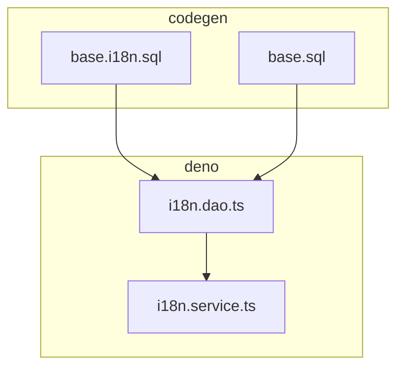
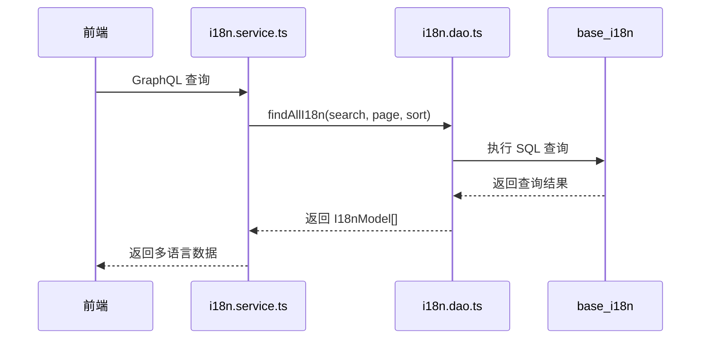
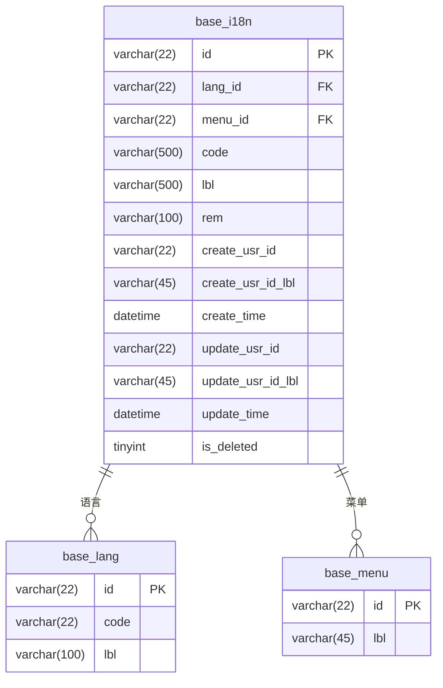
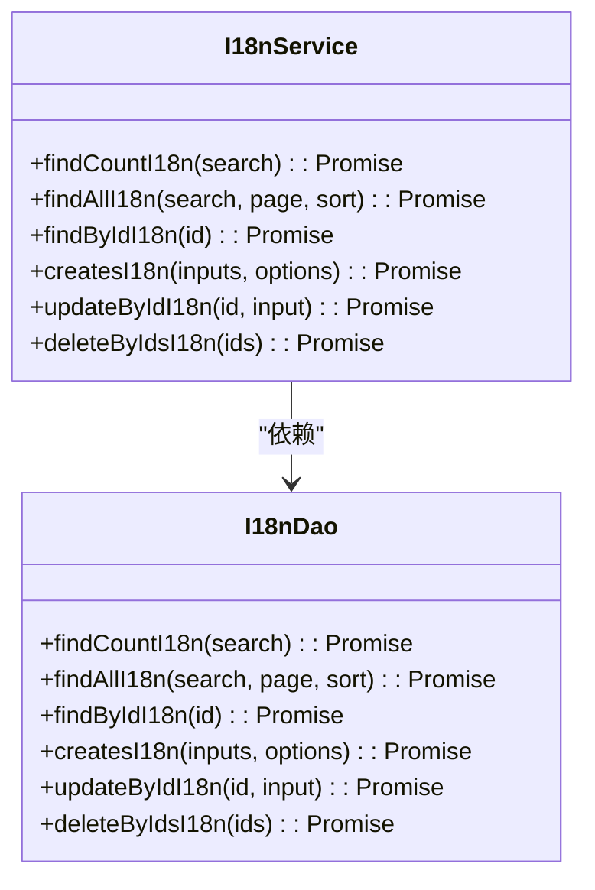
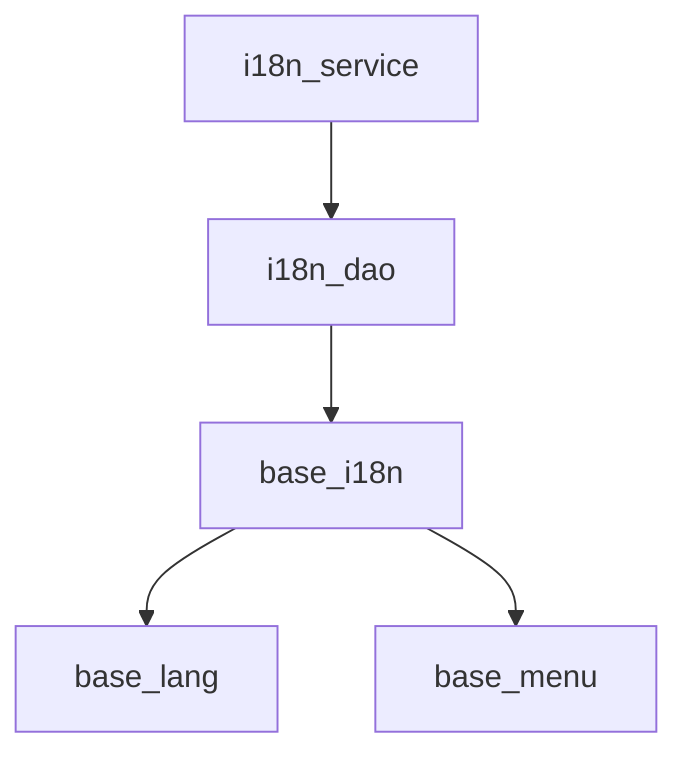

# 后端多语言存储

**本文档引用的文件**   
- [base.i18n.sql](https://github.com/sail-sail/nest/blob/main/codegen\src\tables\base\base.i18n.sql)
- [base.sql](https://github.com/sail-sail/nest/blob/main/codegen\src\tables\base\base.sql)
- [i18n.service.ts](https://github.com/sail-sail/nest/blob/main/deno\gen\base\i18n\i18n.service.ts)
- [i18n.dao.ts](https://github.com/sail-sail/nest/blob/main/deno\gen\base\i18n\i18n.dao.ts)

## 目录
1. [简介](#简介)
2. [项目结构](#项目结构)
3. [核心组件](#核心组件)
4. [架构概述](#架构概述)
5. [详细组件分析](#详细组件分析)
6. [依赖分析](#依赖分析)
7. [性能考虑](#性能考虑)
8. [故障排除指南](#故障排除指南)
9. [结论](#结论)

## 简介
本文档详细阐述了后端多语言存储机制的设计与实现，重点围绕 `i18n` 表在数据库中的结构设计、`i18n.service.ts` 中 GraphQL 查询服务的逻辑，以及语言资源的增删改查 API。文档还涵盖了大数据量下的查询性能优化、索引策略和数据一致性保障方案。

## 项目结构
项目采用模块化设计，主要分为 `codegen`、`deno`、`pc` 和 `uni` 四个部分。`codegen` 负责代码生成，`deno` 包含后端核心逻辑，`pc` 和 `uni` 分别为 PC 端和移动端的前端实现。多语言相关的数据库表定义位于 `codegen/src/tables/base/` 目录下，而服务层逻辑则位于 `deno/gen/base/i18n/` 目录中。

**图表来源**
- [base.i18n.sql](https://github.com/sail-sail/nest/blob/main/codegen\src\tables\base\base.i18n.sql)
- [base.sql](https://github.com/sail-sail/nest/blob/main/codegen\src\tables\base\base.sql)
- [i18n.dao.ts](https://github.com/sail-sail/nest/blob/main/deno\gen\base\i18n\i18n.dao.ts)
- [i18n.service.ts](https://github.com/sail-sail/nest/blob/main/deno\gen\base\i18n\i18n.service.ts)

**章节来源**
- [base.i18n.sql](https://github.com/sail-sail/nest/blob/main/codegen\src\tables\base\base.i18n.sql)
- [base.sql](https://github.com/sail-sail/nest/blob/main/codegen\src\tables\base\base.sql)

## 核心组件
核心组件包括数据库表 `base_i18n` 及其相关的 DAO（Data Access Object）和服务层。`base_i18n` 表存储了多语言的键值对，DAO 层负责与数据库交互，服务层则提供了业务逻辑的封装。

**章节来源**
- [i18n.dao.ts](https://github.com/sail-sail/nest/blob/main/deno\gen\base\i18n\i18n.dao.ts)
- [i18n.service.ts](https://github.com/sail-sail/nest/blob/main/deno\gen\base\i18n\i18n.service.ts)

## 架构概述
系统采用分层架构，前端通过 GraphQL 接口请求多语言数据，后端服务层调用 DAO 层进行数据库查询，DAO 层生成 SQL 语句并执行，最终将结果返回给前端。整个过程支持缓存机制以提高性能。

**图表来源**
- [i18n.service.ts](https://github.com/sail-sail/nest/blob/main/deno\gen\base\i18n\i18n.service.ts)
- [i18n.dao.ts](https://github.com/sail-sail/nest/blob/main/deno\gen\base\i18n\i18n.dao.ts)
- [base.i18n.sql](https://github.com/sail-sail/nest/blob/main/codegen\src\tables\base\base.i18n.sql)

## 详细组件分析

### 数据库表设计分析
`base_i18n` 表是多语言存储的核心，其设计考虑了语言代码、模块标识、键路径和翻译文本等核心字段。

**图表来源**
- [base.i18n.sql](https://github.com/sail-sail/nest/blob/main/codegen\src\tables\base\base.i18n.sql)
- [base.sql](https://github.com/sail-sail/nest/blob/main/codegen\src\tables\base\base.sql)

**章节来源**
- [base.i18n.sql](https://github.com/sail-sail/nest/blob/main/codegen\src\tables\base\base.i18n.sql)

### 服务层逻辑分析
`i18n.service.ts` 文件中的服务层逻辑主要通过调用 `i18n.dao.ts` 中的方法来实现多语言数据的增删改查。

**图表来源**
- [i18n.service.ts](https://github.com/sail-sail/nest/blob/main/deno\gen\base\i18n\i18n.service.ts)
- [i18n.dao.ts](https://github.com/sail-sail/nest/blob/main/deno\gen\base\i18n\i18n.dao.ts)

**章节来源**
- [i18n.service.ts](https://github.com/sail-sail/nest/blob/main/deno\gen\base\i18n\i18n.service.ts)

## 依赖分析
系统依赖于 `base_lang` 和 `base_menu` 表来提供语言和菜单的上下文信息。`i18n.dao.ts` 通过外键关联这些表，确保了数据的一致性和完整性。

**图表来源**
- [base.i18n.sql](https://github.com/sail-sail/nest/blob/main/codegen\src\tables\base\base.i18n.sql)
- [base.sql](https://github.com/sail-sail/nest/blob/main/codegen\src\tables\base\base.sql)
- [i18n.dao.ts](https://github.com/sail-sail/nest/blob/main/deno\gen\base\i18n\i18n.dao.ts)

**章节来源**
- [base.i18n.sql](https://github.com/sail-sail/nest/blob/main/codegen\src\tables\base\base.i18n.sql)
- [base.sql](https://github.com/sail-sail/nest/blob/main/codegen\src\tables\base\base.sql)

## 性能考虑
为了提高查询性能，`base_i18n` 表在 `lang_id`、`menu_id`、`code` 和 `is_deleted` 字段上建立了复合索引。此外，DAO 层实现了缓存机制，通过 `delCacheI18n` 方法在数据变更时清除缓存，确保数据一致性。

**章节来源**
- [base.i18n.sql](https://github.com/sail-sail/nest/blob/main/codegen\src\tables\base\base.i18n.sql)
- [i18n.dao.ts](https://github.com/sail-sail/nest/blob/main/deno\gen\base\i18n\i18n.dao.ts)

## 故障排除指南
常见问题包括缓存未及时更新和外键约束冲突。解决方案包括确保在数据变更后调用 `delCacheI18n` 方法清除缓存，以及在插入数据前检查外键是否存在。

**章节来源**
- [i18n.dao.ts](https://github.com/sail-sail/nest/blob/main/deno\gen\base\i18n\i18n.dao.ts)

## 结论
本文档详细介绍了后端多语言存储机制的设计与实现，涵盖了数据库表结构、服务层逻辑、性能优化和故障排除等方面。通过合理的索引策略和缓存机制，系统能够高效地处理多语言数据的存储和检索。