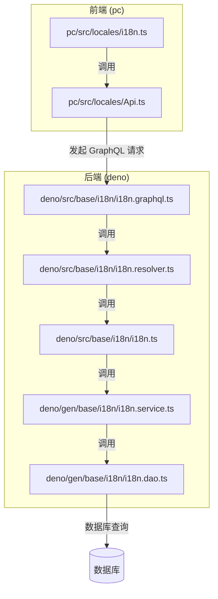
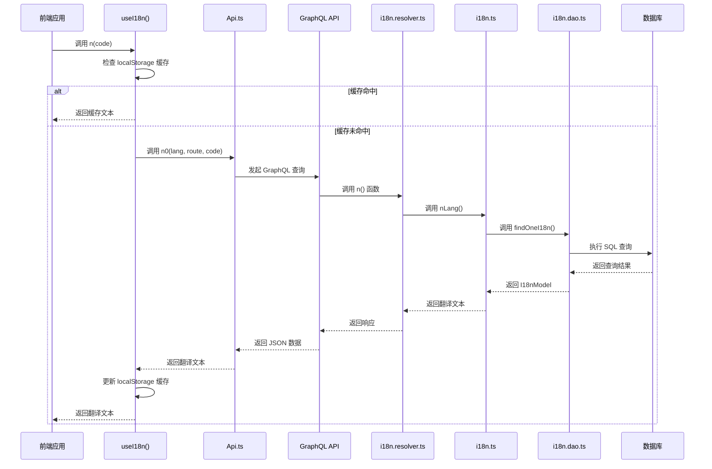

# 语言资源加载机制


**本文档引用的文件**
- [i18n.ts](https://github.com/sail-sail/nest/blob/main/pc\src\locales\i18n.ts)
- [i18n.service.ts](https://github.com/sail-sail/nest/blob/main/deno\gen\base\i18n\i18n.service.ts)
- [Api.ts](https://github.com/sail-sail/nest/blob/main/pc\src\locales\Api.ts)
- [i18n.graphql.ts](https://github.com/sail-sail/nest/blob/main/deno\src\base\i18n\i18n.graphql.ts)
- [i18n.resolver.ts](https://github.com/sail-sail/nest/blob/main/deno\src\base\i18n\i18n.resolver.ts)
- [i18n.ts](https://github.com/sail-sail/nest/blob/main/deno\src\base\i18n\i18n.ts)
- [i18n.dao.ts](https://github.com/sail-sail/nest/blob/main/deno\gen\base\i18n\i18n.dao.ts)


## 目录
1. [简介](#简介)
2. [项目结构](#项目结构)
3. [核心组件](#核心组件)
4. [架构概述](#架构概述)
5. [详细组件分析](#详细组件分析)
6. [依赖分析](#依赖分析)
7. [性能考虑](#性能考虑)
8. [故障排除指南](#故障排除指南)
9. [结论](#结论)

## 简介
本文档详细阐述了系统中语言资源加载机制的实现原理与工作流程。该机制采用前后端协同工作的模式，通过异步加载、按需查询、缓存管理等技术手段，实现了高效、灵活的多语言支持。文档重点分析了前端 `i18n.ts` 中的异步加载策略、GraphQL 查询的按需获取能力、服务端 `i18n.service.ts` 的缓存与压缩策略，以及完整的降级和开发配置方案。

## 项目结构
项目采用分层架构，将前端（`pc`）、后端（`deno`）和代码生成（`codegen`）逻辑分离。语言资源相关的代码主要分布在：
- **前端**：`pc/src/locales/` 目录下，包含 `i18n.ts` 和 `Api.ts`，负责语言包的请求、缓存和使用。
- **后端**：`deno/src/base/i18n/` 目录下，包含 `i18n.graphql.ts`、`i18n.resolver.ts` 和 `i18n.ts`，定义了 GraphQL 接口、解析器和核心业务逻辑。
- **数据访问层**：`deno/gen/base/i18n/` 目录下，由代码生成器生成的 `i18n.dao.ts` 和 `i18n.service.ts`，负责与数据库交互。



**图示来源**
- [i18n.ts](https://github.com/sail-sail/nest/blob/main/pc\src\locales\i18n.ts)
- [Api.ts](https://github.com/sail-sail/nest/blob/main/pc\src\locales\Api.ts)
- [i18n.graphql.ts](https://github.com/sail-sail/nest/blob/main/deno\src\base\i18n\i18n.graphql.ts)
- [i18n.resolver.ts](https://github.com/sail-sail/nest/blob/main/deno\src\base\i18n\i18n.resolver.ts)
- [i18n.ts](https://github.com/sail-sail/nest/blob/main/deno\src\base\i18n\i18n.ts)
- [i18n.service.ts](https://github.com/sail-sail/nest/blob/main/deno\gen\base\i18n\i18n.service.ts)
- [i18n.dao.ts](https://github.com/sail-sail/nest/blob/main/deno\gen\base\i18n\i18n.dao.ts)

**本节来源**
- [i18n.ts](https://github.com/sail-sail/nest/blob/main/pc\src\locales\i18n.ts)
- [i18n.service.ts](https://github.com/sail-sail/nest/blob/main/deno\gen\base\i18n\i18n.service.ts)

## 核心组件
系统的核心是 `i18n` 模块，它由多个组件协同工作。前端的 `useI18n` 函数提供了语言标签的获取接口，后端的 `n` 解析器函数处理 GraphQL 查询，`nLang` 函数执行具体的翻译逻辑，而 `i18n.dao.ts` 则负责从数据库中检索数据。整个流程通过 `localStorage` 和服务端缓存来优化性能。

**本节来源**
- [i18n.ts](https://github.com/sail-sail/nest/blob/main/pc\src\locales\i18n.ts)
- [i18n.ts](https://github.com/sail-sail/nest/blob/main/deno\src\base\i18n\i18n.ts)
- [i18n.dao.ts](https://github.com/sail-sail/nest/blob/main/deno\gen\base\i18n\i18n.dao.ts)

## 架构概述
系统采用典型的前后端分离架构。前端应用在运行时，通过 `useI18n` 钩子函数按需或预加载语言资源。请求通过 GraphQL API 发送到后端。后端接收到查询后，由 `i18n.resolver.ts` 中的 `n` 函数处理，该函数调用 `i18n.ts` 中的 `nLang` 函数。`nLang` 函数根据用户语言、路由路径和编码，构造查询条件，最终通过 `i18n.dao.ts` 访问数据库获取翻译文本。



**图示来源**
- [i18n.ts](https://github.com/sail-sail/nest/blob/main/pc\src\locales\i18n.ts)
- [Api.ts](https://github.com/sail-sail/nest/blob/main/pc\src\locales\Api.ts)
- [i18n.graphql.ts](https://github.com/sail-sail/nest/blob/main/deno\src\base\i18n\i18n.graphql.ts)
- [i18n.resolver.ts](https://github.com/sail-sail/nest/blob/main/deno\src\base\i18n\i18n.resolver.ts)
- [i18n.ts](https://github.com/sail-sail/nest/blob/main/deno\src\base\i18n\i18n.ts)
- [i18n.dao.ts](https://github.com/sail-sail/nest/blob/main/deno\gen\base\i18n\i18n.dao.ts)

## 详细组件分析

### 前端 i18n.ts 分析
前端 `i18n.ts` 文件是语言资源加载的核心，它实现了两种主要的加载模式。

#### 启动时预加载
`initI18ns` 函数允许在页面加载时，批量预加载一组语言标签。它接收一个编码数组 `codes`，检查 `localStorage` 中的缓存，对于未缓存的标签，会并行发起 GraphQL 请求（通过 `n0` 函数），并将结果批量写回缓存。这种方式适用于已知页面所需的所有语言资源，可以减少后续的网络请求。

```mermaid
flowchart TD
A[调用 initI18ns(codes)] --> B[检查 localStorage 缓存]
B --> C{缓存中存在?}
C --> |是| D[跳过]
C --> |否| E[发起 n0 GraphQL 请求]
E --> F[等待所有请求完成]
F --> G[将结果写入 localStorage]
G --> H[完成]
```

**图示来源**
- [i18n.ts](https://github.com/sail-sail/nest/blob/main/pc\src\locales\i18n.ts)

#### 路由懒加载
`getLbl` 和 `getLblAsync` 函数实现了懒加载。当调用 `n(code)` 时，首先检查本地缓存。如果缓存中没有，则立即返回传入的 `code` 作为占位符（避免阻塞渲染），然后在一个微任务中异步发起请求获取真实翻译，并更新一个响应式引用 `i18nLblRef`，从而触发视图更新。这种方式适用于未知或动态的语言资源，保证了应用的响应速度。

**本节来源**
- [i18n.ts](https://github.com/sail-sail/nest/blob/main/pc\src\locales\i18n.ts)

### GraphQL 查询分析
GraphQL 查询 `n(langCode: String!, routePath: String, code: String!)` 是前后端通信的契约。它按需获取特定模块的语言资源，其参数设计使得查询非常精确：
- `langCode`：指定目标语言，如 `zh-CN`。
- `routePath`：关联到特定页面或模块，实现模块化加载。
- `code`：具体的语言标签编码。

通过组合 `routePath` 和 `code`，后端可以精确地从数据库中检索出唯一的翻译文本，避免了加载整个语言包，从而显著减少了初始加载体积。

**本节来源**
- [i18n.graphql.ts](https://github.com/sail-sail/nest/blob/main/deno\src\base\i18n\i18n.graphql.ts)
- [i18n.resolver.ts](https://github.com/sail-sail/nest/blob/main/deno\src\base\i18n\i18n.resolver.ts)

### 服务端 i18n.service.ts 分析
服务端的 `i18n.service.ts` 并非直接的业务逻辑，而是由代码生成器生成的对 `i18n.dao.ts` 的封装。真正的核心逻辑在 `i18n.dao.ts` 中。

#### 缓存机制
`i18n.dao.ts` 实现了多层缓存：
1.  **SQL 查询缓存**：`findAllI18n` 和 `findCountI18n` 等函数在执行 SQL 查询前，会根据 SQL 语句和参数生成一个哈希值（`cacheKey2`），并利用 `query` 和 `queryOne` 函数的缓存功能。这避免了对相同查询的重复数据库访问。
2.  **缓存失效**：每当执行 `createsI18n`、`updateByIdI18n` 或 `deleteByIdsI18n` 等写操作时，`delCacheI18n` 函数会被调用，清除与 `base_i18n` 表相关的所有 SQL 缓存，确保数据一致性。

#### 响应压缩策略
虽然代码中未直接体现，但该机制天然支持响应压缩。由于 GraphQL 查询是按需获取单个或少量语言标签，其响应体本身非常小。结合 HTTP 服务器（如 Oak）的 Gzip/Brotli 压缩中间件，可以进一步减小传输体积，提升高并发下的响应性能。

**本节来源**
- [i18n.service.ts](https://github.com/sail-sail/nest/blob/main/deno\gen\base\i18n\i18n.service.ts)
- [i18n.dao.ts](https://github.com/sail-sail/nest/blob/main/deno\gen\base\i18n\i18n.dao.ts)

### 加载失败降级处理
系统具备完善的降级处理方案：
1.  **前端降级**：在 `getLbl` 函数中，如果服务端禁用或请求失败，会直接返回传入的 `code` 参数作为文本。这保证了即使在最坏情况下，应用也能正常显示，不会崩溃。
2.  **后端降级**：在 `nLang` 函数中，如果数据库查询未找到匹配的翻译，会直接返回原始的 `code`。
3.  **本地开发配置**：通过环境变量 `VITE_SERVER_I18N_ENABLE` 控制。在开发环境中，可以将其设置为 `"false"`，此时前端会直接返回 `code`，无需启动后端服务，极大地方便了本地开发和调试。

**本节来源**
- [i18n.ts](https://github.com/sail-sail/nest/blob/main/pc\src\locales\i18n.ts)
- [i18n.ts](https://github.com/sail-sail/nest/blob/main/deno\src\base\i18n\i18n.ts)

## 依赖分析
各组件之间的依赖关系清晰：
- 前端 `i18n.ts` 依赖 `Api.ts` 来发起网络请求。
- `Api.ts` 依赖 GraphQL 客户端库（如 `@urql/core`）来构建和发送查询。
- 后端 `i18n.resolver.ts` 依赖 `i18n.ts` 中的 `nLang` 函数。
- `i18n.ts` 依赖 `i18n.dao.ts` 进行数据访问。
- `i18n.dao.ts` 依赖底层的数据库连接和查询工具（如 `query`, `execute`）。

```mermaid
graph TD
A[i18n.ts (前端)] --> B[Api.ts]
B --> C[GraphQL Client]
D[i18n.resolver.ts] --> E[i18n.ts (后端)]
E --> F[i18n.dao.ts]
F --> G[Database Driver]
```

**图示来源**
- [i18n.ts](https://github.com/sail-sail/nest/blob/main/pc\src\locales\i18n.ts)
- [Api.ts](https://github.com/sail-sail/nest/blob/main/pc\src\locales\Api.ts)
- [i18n.resolver.ts](https://github.com/sail-sail/nest/blob/main/deno\src\base\i18n\i18n.resolver.ts)
- [i18n.ts](https://github.com/sail-sail/nest/blob/main/deno\src\base\i18n\i18n.ts)
- [i18n.dao.ts](https://github.com/sail-sail/nest/blob/main/deno\gen\base\i18n\i18n.dao.ts)

**本节来源**
- [i18n.ts](https://github.com/sail-sail/nest/blob/main/pc\src\locales\i18n.ts)
- [Api.ts](https://github.com/sail-sail/nest/blob/main/pc\src\locales\Api.ts)
- [i18n.resolver.ts](https://github.com/sail-sail/nest/blob/main/deno\src\base\i18n\i18n.resolver.ts)
- [i18n.dao.ts](https://github.com/sail-sail/nest/blob/main/deno\gen\base\i18n\i18n.dao.ts)

## 性能考虑
该机制在性能方面进行了多项优化：
- **按需加载**：通过 GraphQL 查询，只加载当前需要的语言资源，避免了加载整个语言包的开销。
- **本地缓存**：前端使用 `localStorage` 缓存已获取的语言标签，减少了重复的网络请求。
- **服务端缓存**：后端对 SQL 查询结果进行缓存，减轻了数据库压力。
- **异步非阻塞**：前端的懒加载策略确保了 UI 渲染不会被网络请求阻塞。
- **批量操作**：`initI18ns` 函数支持批量预加载，通过 `Promise.all` 并行处理，提高了效率。

## 故障排除指南
- **问题：语言标签显示为编码（如 `user.name`）而非中文。**
  - **检查**：确认 `VITE_SERVER_I18N_ENABLE` 环境变量是否为 `"true"`。
  - **检查**：确认后端服务是否正常运行，GraphQL API 是否可访问。
  - **检查**：确认数据库中 `base_i18n` 表是否存在对应 `lang_id`、`menu_id` 和 `code` 的记录。
- **问题：页面加载缓慢。**
  - **检查**：是否在 `initI18ns` 中预加载了过多不必要的语言标签。
  - **建议**：改用懒加载模式，或优化预加载的标签列表。
- **问题：修改语言后，部分文本未更新。**
  - **检查**：`localStorage` 中的 `i18nLblsLang` 缓存可能未及时更新。
  - **建议**：手动清除 `localStorage` 或实现更精细的缓存失效逻辑。

**本节来源**
- [i18n.ts](https://github.com/sail-sail/nest/blob/main/pc\src\locales\i18n.ts)
- [i18n.ts](https://github.com/sail-sail/nest/blob/main/deno\src\base\i18n\i18n.ts)

## 结论
本文档详细解析了系统的语言资源加载机制。该机制通过前后端的紧密协作，实现了高效、灵活且健壮的多语言支持。其核心优势在于按需加载和多级缓存，有效提升了应用性能和用户体验。同时，完善的降级策略和开发配置确保了系统的稳定性和开发效率。此设计模式可作为类似多语言应用的参考范例。